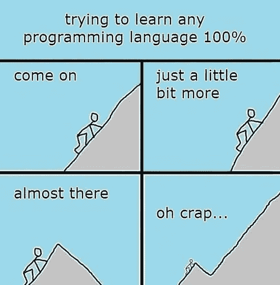

# 让你开怀大笑的 20 个最受欢迎的编程笑话

> 原文：<https://javascript.plainenglish.io/20-most-popular-programming-jokes-that-will-make-you-laugh-96f7bfbf0d97?source=collection_archive---------1----------------------->

## 你不需要成为一个程序员来笑

我觉得所有程序员都有一些让我们发笑的东西。编程之旅并不顺利，但也很有趣。

所以休息一下，看看一个程序员生活中的挑战，笑一笑。

Credit: [https://gfycat.com/oblongjaggedbluemorphobutterfly-programming-coding](https://gfycat.com/oblongjaggedbluemorphobutterfly-programming-coding)

Credit: [best programming jokes](https://www.facebook.com/BestProgrammingJoke/photos/a.1924728790913830/2803596506360383/)

# 2.服务器上第一个拥有全套盔甲的人

Credit: [best programming jokes](https://www.facebook.com/BestProgrammingJoke/photos/a.1924728790913830/2790820874304613/)

# 3.当程序员看到基于他痛苦的迷因时

credit: [best programming jokes](https://www.facebook.com/BestProgrammingJoke/photos/a.1924728790913830/2790817417638292/)

# 4.程序员没有时间休息

Credit: [best programming jokes](https://www.facebook.com/BestProgrammingJoke/photos/a.1924728790913830/2790816300971737/)

# 5.当程序员最终发现错误时

credit: [best programming jokes](https://www.facebook.com/BestProgrammingJoke/photos/a.1924728790913830/2790814150971952/)

# 6.前端与后端

credit: [best programming jokes](https://www.facebook.com/BestProgrammingJoke/photos/a.1924728790913830/2790813210972046/)

# 7.固定误差

credit: [programming jokes](https://www.facebook.com/BestProgrammingJoke/photos/a.1924728790913830/2495067630546607/)

# 8.阅读他人代码

Credit: [best programming](https://www.facebook.com/BestProgrammingJoke/photos/a.1924728790913830/2457784520941585/)

# 9.开发者与用户

Credit: [programming jokes](https://www.facebook.com/photo/?fbid=691076254389132&set=a.129569150539848)

# 10.不同的人对一个错误有不同的反应

Credit: [programmer jokes](https://www.facebook.com/photo/?fbid=685504434946314&set=a.129569150539848)

# 11.程序员对错误修复的态度

Credit: [https://www.pinterest.com/pin/702350504402688237/](https://www.pinterest.com/pin/702350504402688237/)

# 12.程序员的编码周期

Credit: [https://www.pinterest.com/pin/12807180180214625/](https://www.pinterest.com/pin/12807180180214625/)

# 13.测试人员和开发人员的关系

Credit: [https://www.pinterest.com/pin/41095415338460716/](https://www.pinterest.com/pin/41095415338460716/)

# 14.所有关于截止日期

Credit: [https://www.pinterest.com/pin/805018502155821898/](https://www.pinterest.com/pin/805018502155821898/)

# 15.设计师如何庆祝他们的特殊日子

Credit: [https://www.pinterest.com/pin/782078291553555221/](https://www.pinterest.com/pin/782078291553555221/)

# 16.甚至程序员都不知道他们实际写了什么

Credit: [https://www.pinterest.com/pin/131659989098636942/](https://www.pinterest.com/pin/131659989098636942/)

# 17.一个程序员的真实故事

Credit: [https://www.pinterest.com/pin/251990541644827675/](https://www.pinterest.com/pin/251990541644827675/)

# 18.调试的最佳场所

Credit: [https://www.pinterest.com/pin/665618019941790276/](https://www.pinterest.com/pin/665618019941790276/)

# 19.当程序员想 100%学习任何语言时

Credit: [https://www.pinterest.com/pin/AR59Ezfbr-XVv0-3lcYXoEL3ktBxSav0DNLzZPoSVBkTT7_eVXq4_qk/](https://www.pinterest.com/pin/AR59Ezfbr-XVv0-3lcYXoEL3ktBxSav0DNLzZPoSVBkTT7_eVXq4_qk/)

# 20.程序员的约会就像

## 参考资料:

*   [**https://www.pinterest.com/**](https://www.pinterest.com/)
*   **【https://gfycat.com/】T5[T6](https://gfycat.com/)**
*   **[**https://www.facebook.com/BestProgrammingJokes**](https://www.facebook.com/BestProgrammingJokes)**
*   **[**https://www.reddit.com/r/ProgrammerHumor/**](https://www.reddit.com/r/ProgrammerHumor/)**

***更多内容请看* [***说白了就是***](https://plainenglish.io/) *。报名参加我们的* [***免费每周简讯***](http://newsletter.plainenglish.io/) *。关注我们关于* [***推特***](https://twitter.com/inPlainEngHQ) ，[***LinkedIn***](https://www.linkedin.com/company/inplainenglish/)*，*[***YouTube***](https://www.youtube.com/channel/UCtipWUghju290NWcn8jhyAw)*[***不和***](https://discord.gg/GtDtUAvyhW) ***。******

******有兴趣规模化你的软件创业*** *？检查* [***电路***](https://circuit.ooo?utm=publication-post-cta) *。****