# JavaScript 中最常用的 20 种数组方法

> 原文：<https://javascript.plainenglish.io/20-most-used-array-methods-in-javascript-c57276982377?source=collection_archive---------2----------------------->

## JavaScript 中常用的 20 种数组方法，用例子和图表说明。


在 JavaScript 中，一个数组实例有 37 个内置方法，常用方法大概有 20 个。在本文中，我总结了这些方法，并附上一些图表，希望能帮助你更好地组织相关知识点。

# 推动、弹出、换档、取消换档

这四种方法很相似，我们一起来说说。

*   `push(element)`:将一个或多个元素添加到数组末尾，并返回数组的新长度。
*   `pop()`:从数组中移除最后一个元素并返回该元素。
*   `shift()`:从数组中移除第一个元素，并返回被移除的元素。
*   `unshift()`:将一个或多个元素添加到数组的开头，并返回数组的新长度。

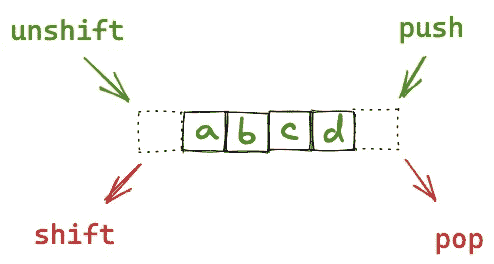

以下是一些操作:

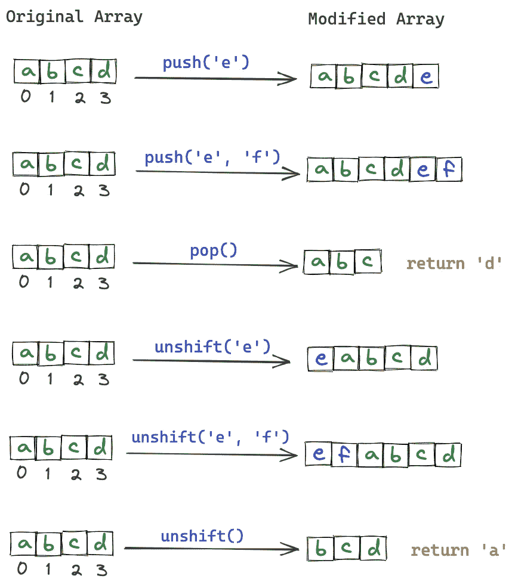

## 试试看:

推送:

移位:

未换档:

# 薄片

*   slice()方法返回数组一部分的浅表副本。
*   它返回一个新的数组，不会修改原来的数组。

语法:

> array.slice(startIndex，endIndex)

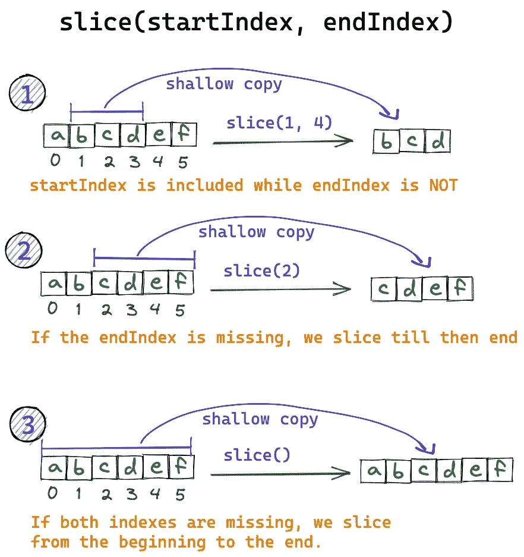

试试看:

# 接合

`splice()`方法通过移除或替换现有元素和/或添加新元素来改变数组的内容。

语法:

```
splice(start)
splice(start, deleteCount)
splice(start, deleteCount, item1)
splice(start, deleteCount, item1, item2, itemN)
```

*   `start`:开始改变数组的索引。
*   `deleteCount`:一个整数，表示数组中要从`start`中移除的元素个数。
*   `item1, item2, ...`:要添加到数组中的元素，从`start`开始。

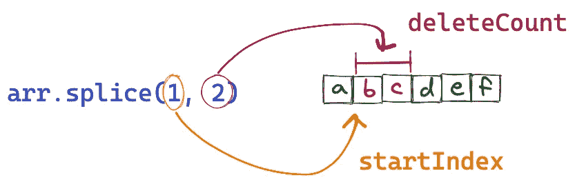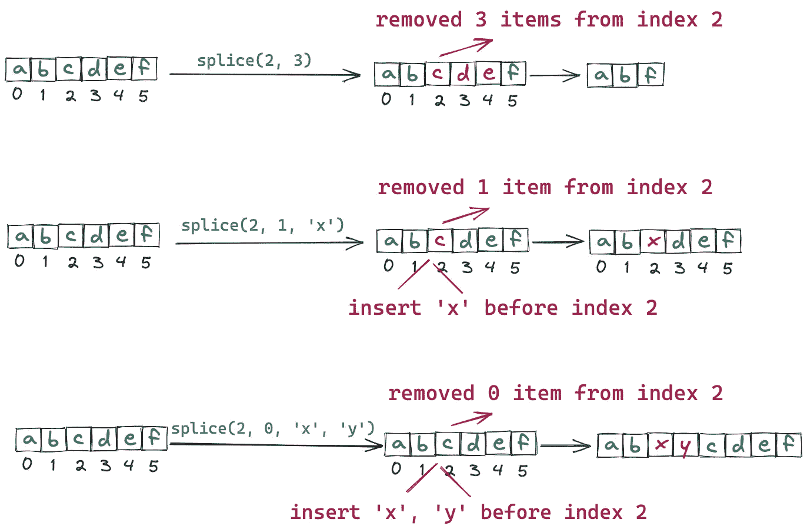

试试看:

# 串联

*   `concat()`方法用于合并两个或多个数组。
*   此方法不会更改现有数组，而是返回一个新数组。

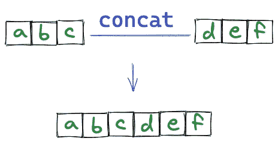

试试看:

# 加入

`join()`方法通过连接一个数组中的所有元素来创建并返回一个新的字符串，用逗号或指定的分隔符分隔。

语法:

> 连接(分隔符)

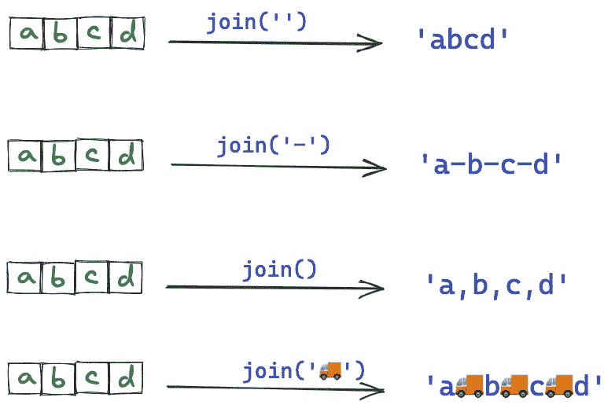

试试看:

# 每个

`every()`方法测试**数组中的所有元素**是否通过了由提供的函数实现的测试。它返回一个布尔值。

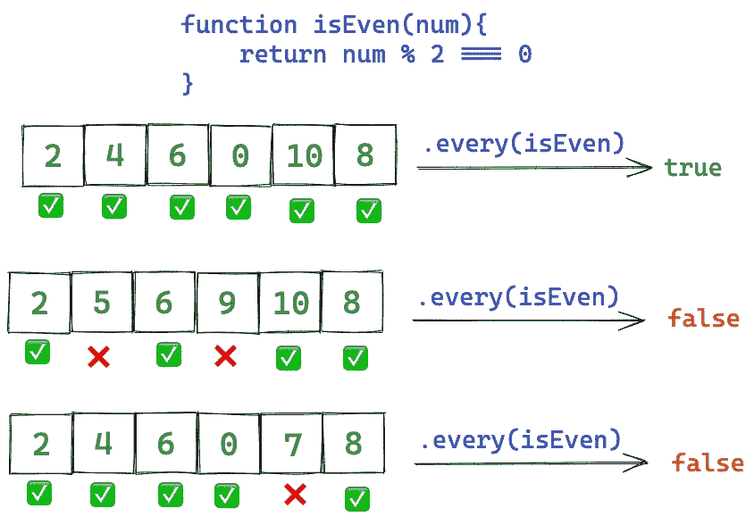

试试看:

# 一些

`some()`方法测试数组中是否至少有一个元素通过了由提供的函数实现的测试。

*   如果在数组中找到所提供的函数返回 true 的元素，则返回 true；
*   否则，它返回 false。
*   它不会修改数组。

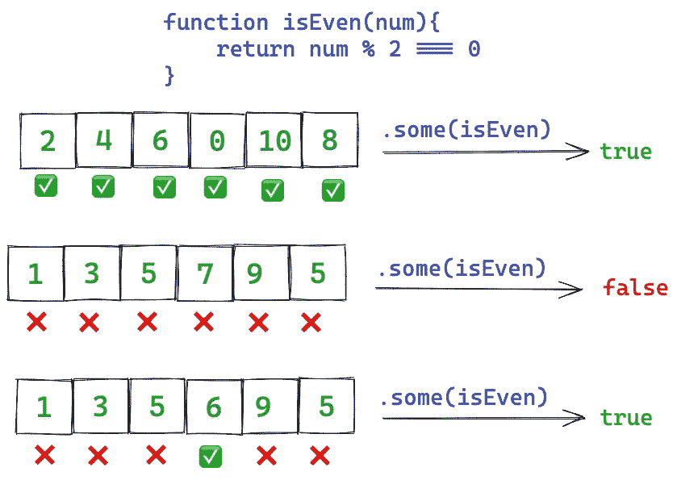

试试看:

# 地图

`map()`方法创建一个新的数组，其中填充了调用数组中每个元素的函数的结果。

语法:

```
// Arrow function
map((element) => { /* ... */ })
map((element, index) => { /* ... */ })
map((element, index, array) => { /* ... */ })

// Callback function
map(callbackFn)
map(callbackFn, thisArg)
```

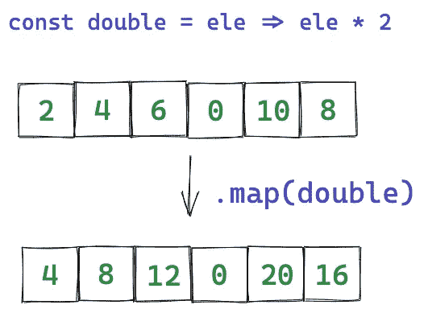

试试看:

# 减少

`reduce()`方法对数组的每个元素执行用户提供的“reducer”回调函数，依次传递前一个元素的计算返回值。对数组的所有元素运行缩减器的最终结果是一个值。

```
reduce((previousValue, currentValue) => { /* ... */ } )
```

我知道上面的抽象概念不好理解，我们来看一个例子。

这段代码是如何执行的？

在这个代码中，`reducer`就是`add`。

首先，因为我们第一次执行`add`，数组中的第一个元素`'a'`会被当作`add`的第一个参数，然后循环会从数组的第二个元素`'b'`开始。这次，`'b'`是`add`的第二个参数。

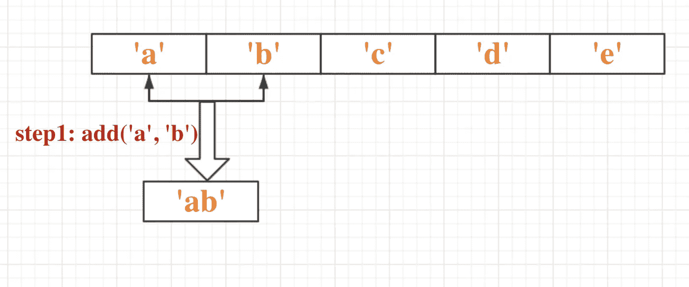

第一次计算后，我们得到结果`'ab'`。该结果将被缓存并在下一次`add`计算中用作 param1。同时，数组中的第三个参数`'c'`将作为`add`的 param2。

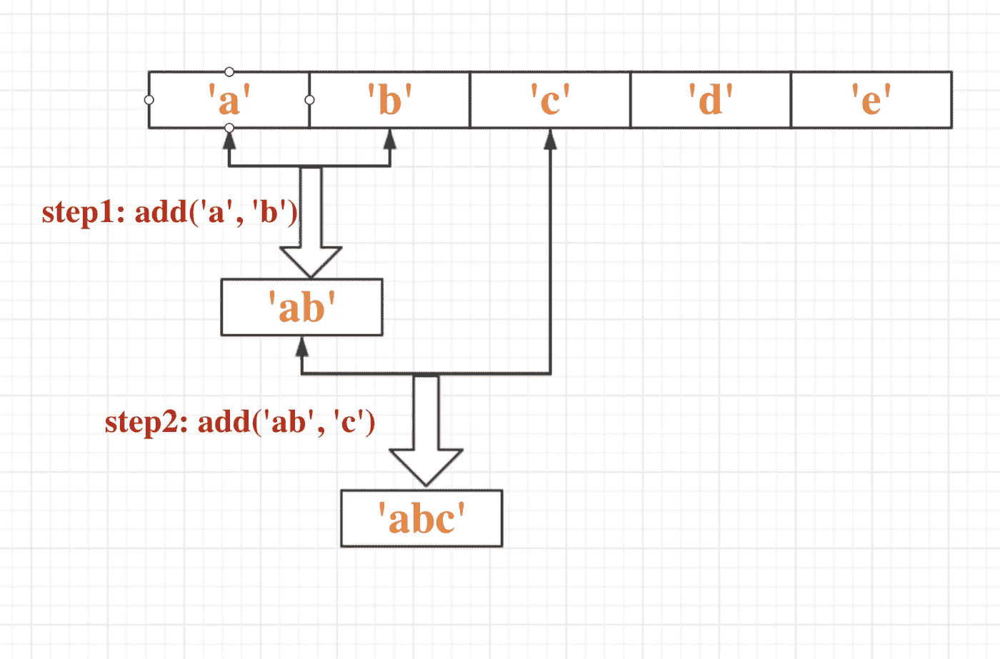

类似地，`reduce`将继续遍历数组中的元素，将`'abc'`和`'d'`作为`add`的参数运行。

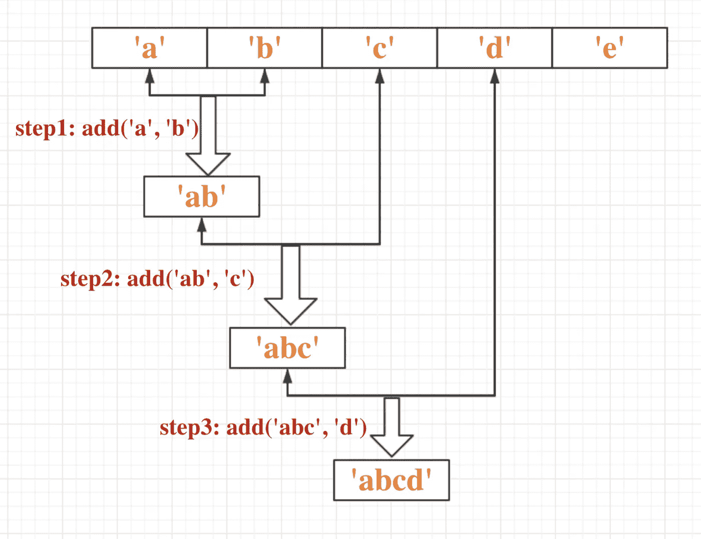

最后，遍历完数组中的最后一个元素后，将返回计算结果。

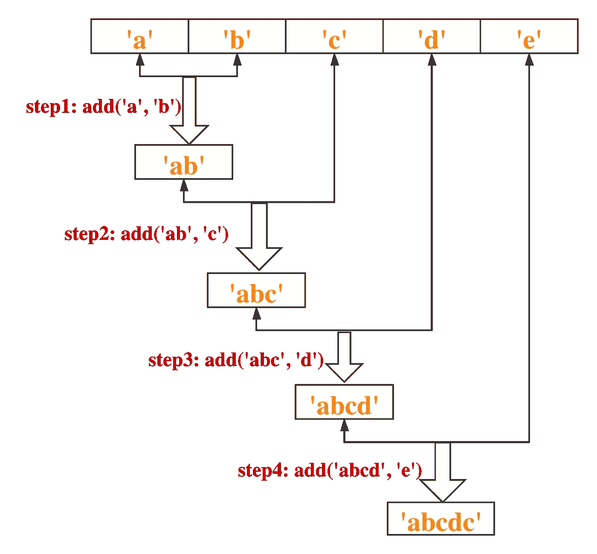

现在我们有了结果:`'abcde'`。

# 过滤器

`filter()`方法创建一个新数组，其中所有元素都通过了由所提供的函数实现的测试。

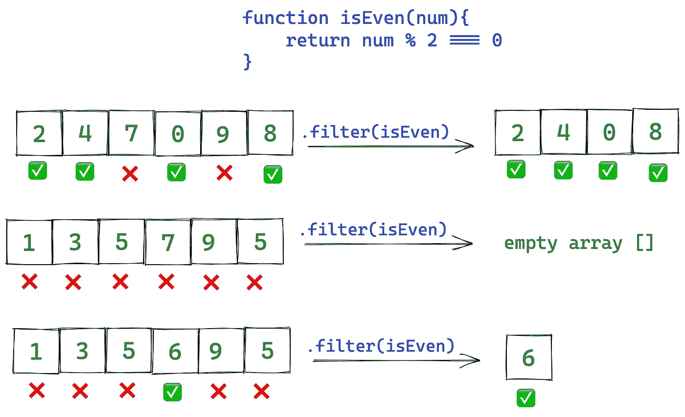

试试看:

# 充满

`fill()`方法将一个数组中的所有元素改为一个静态值，从起始索引(默认为`0`)到结束索引(默认为`array.length`)。它返回修改后的数组。

语法:

```
fill(value)
fill(value, start)
fill(value, start, end)
```

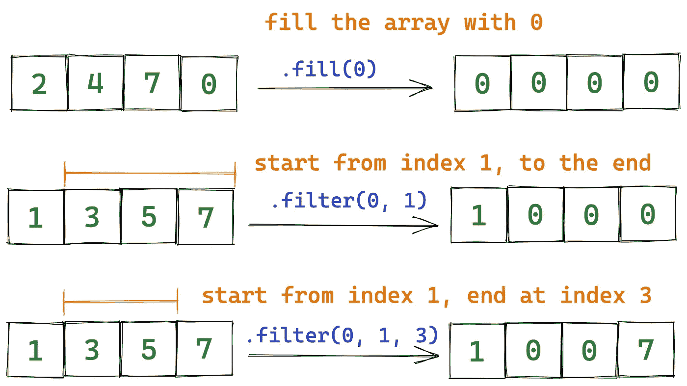

# 查找，查找最后一个，查找索引，查找最后一个索引

*   `find()`:返回满足所提供测试函数的数组中第一个元素的值，如果没有找到合适的元素，则返回`undefined`。
*   `findIndex()`:返回满足所提供测试函数的数组中第一个元素的索引，如果没有找到合适的元素，则返回`-1`。
*   `findLast()`:返回数组中满足所提供测试函数的最后一个元素的值，如果没有找到合适的元素，则返回`undefined`。
*   `findLastIndex()`:返回数组中满足测试函数的最后一个元素的索引，如果没有找到合适的元素，返回`-1`。

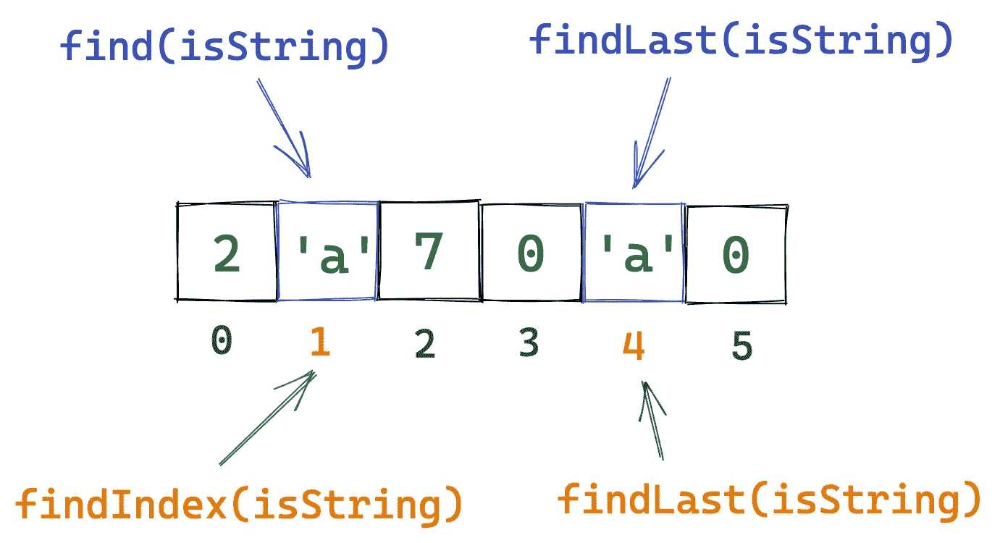

试试看:

这就是了。感谢您的阅读。