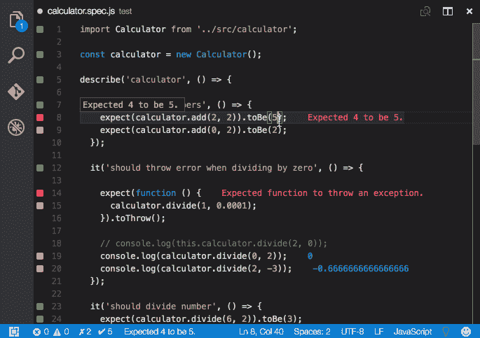
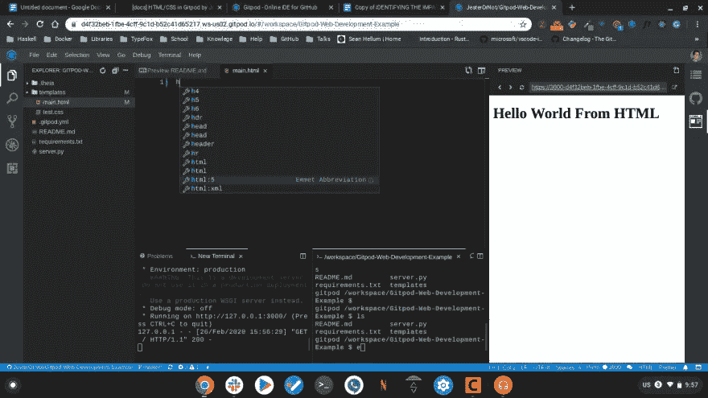
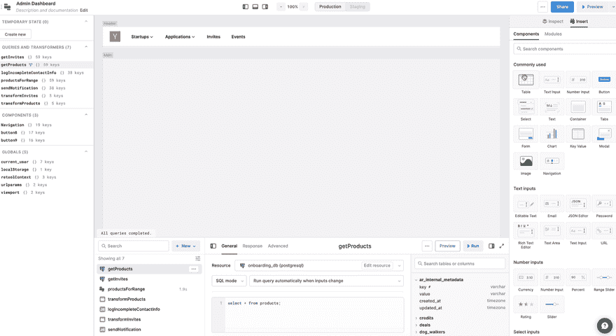
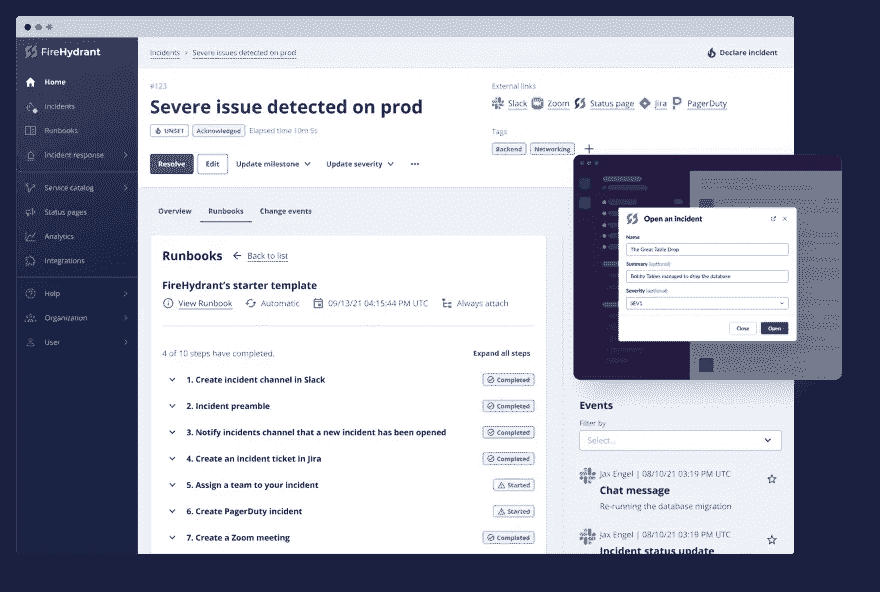

# 2021 年技术亮点:开发团队的最佳软件

> 原文：<https://javascript.plainenglish.io/2021-tech-highlights-best-software-for-dev-teams-c941325c2c0a?source=collection_archive---------4----------------------->

Image by the author

我会如何总结 2021 年？对我和我的团队来说，过去的 12 个月充满了不断的学习和适应新趋势，这些新趋势完全改变了我们过去的工作方式(还记得实际上去办公室和穿裤子上班的习惯……？！).这并不总是容易的，但我们面临的挑战促使我们寻找方便的软件来帮助我们应对新的常态。在这篇短文中，我想与你分享我今年在开发者工具领域的发现。

# [GitLive](https://marketplace.visualstudio.com/items?itemName=TeamHub.teamhub#review-details)

这个工具是为所有团队成员准备的，GitLive 让 Git 活了起来。它在您的 IDE 中添加了一个选项卡，您可以在其中看到您的同事，如果他们在线，他们正在处理什么问题和分支，甚至他们未提交的更改，所有这些都是实时更新的。主/主之前的任何非陈旧分支都被视为正在进行中的工作，您可以检查不同的已更改文件，并查看相关的问题或拉请求。

他们的旗舰特性是自动合并冲突检测。您的队友的更改显示在编辑器的空白处(添加、删除、修改或冲突)，在这里您可以检查它们以查看差异，它来自哪个分支，并且如果需要的话，可以将它们直接挑选到您的文件副本中。

GitLive 对于大型团队非常有用，对于开放项目尤其有用，因为这些特性甚至可以跨 fork 工作。更酷的是，数据直接来自 Git，不需要手动输入来保持最新。

# [Wallaby.js](https://marketplace.visualstudio.com/items?itemName=WallabyJs.wallaby-vscode)

Wallaby 是一个集成的 JavaScript 连续测试工具，由 Quokka 和 Dingo 背后的团队开发(有趣的事实:他们以澳大利亚本地动物🇦🇺).命名他们所有的产品这种不受干扰的 javascript 测试在您键入时运行测试，并直接在您的编辑器中提供结果，就在您的代码旁边(不像传统的测试运行程序在您的控制台中显示反馈)，甚至在未保存的文件上。

Wallaby 在更大的项目上工作得非常好，它可以通过允许您专注于一组特定的测试来帮助您最大化您的生产力，无论您的项目变得多么大。

这些工具提供了许多出色的功能，例如带有“编辑并继续”功能的时间旅行调试器，或者用于查看运行时值的值浏览器和输出检查器，等等。此外，他们的文档非常棒，为您提供了所有功能的全面概述，可以让您立即开始使用该产品！

# [GitPod](https://www.gitpod.io/)

开发人员经常面临的问题是在设置开发环境上浪费了大量的时间。Gitpod 旨在通过允许您在云中立即为每个任务建立全新的自动化开发环境来自动化这个繁琐的过程。通过提供随时可以编写代码的开发环境，GitPod 消除了我们都非常熟悉的一些棘手问题:项目启动、上下文切换、不再有效的依赖——只要你能想到的。

放弃您的本地开发环境对您和您的团队来说意味着生产力的巨大提升。它是开放的核心，所以如果你想自己托管它们，有一些功能是必须付费的，针对的是更大的团队，但是免费的计划对每个想尝试的人来说都是相当慷慨的。

# [重新装备](https://retool.com/)

Retool 是一个内部应用构建器。众所周知，设置内部工具和应用程序是耗时的、重复的，并且使开发人员无法解决他们试图解决的实际问题。Retool 提供了一组拖放组件，让您可以在几分钟内为您的应用程序构建一个优雅的 UI。再加上，Retool 里的一切都是你可以轻松操纵的 JS 对象；您还可以构建自己的自定义 React 组件。开箱即用，Retool 将连接到几乎任何带有 REST 或 GraphQL API 的东西。不断增长的原生集成库使得与数据源的连接变得更加容易。

# [消防栓](https://firehydrant.io/)

消防栓是一个扑灭工作中的“火”和处理您的系统可靠性的工具。它有助于记录系统、集成您已经使用的工具，以及收集数据和警报来处理事件。借助消防栓，您可以自动化事故处理工作流程，例如创建新的备用房间、状态页面更新或缩放桥。

消防栓为团队提供了维护服务目录、响应事件、通过状态页面进行交流以及通过回顾进行学习的工具。付费计划可能看起来相当昂贵(对于较小的团队，每个用户每月 20 美元，对于 5 人以上的团队，每个用户每月 44 美元)，但有一个免费计划可供您测试该平台是否符合您公司的需求。

感谢您的阅读，希望您会发现我上面介绍的工具有趣且有用。2022 新年快乐！

*更多内容看* [***说白了. io***](http://plainenglish.io/) ***。*****[***免费每周简讯***](http://newsletter.plainenglish.io/) ***。*** *在我们的* [***社区不和谐***](https://discord.gg/GtDtUAvyhW) ***中获得独家写作机会和建议。*****