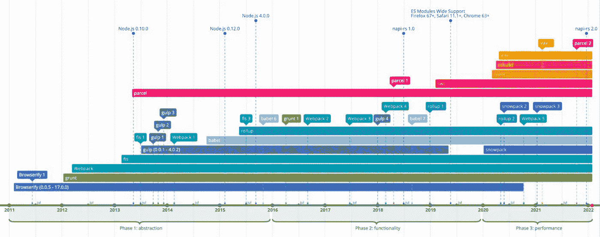

# 前端行业在过去 10 年中是如何发展的(2022 版)

> 原文：<https://javascript.plainenglish.io/2022-front-end-tool-chain-ten-year-inventory-427d891d0e3d?source=collection_archive---------10----------------------->

> 阿里妈妈前端爆炸始于 2017 年，一直更新到 2022 年。5 年来，我们一直致力于传递前端行业的变化，慢慢的分成了客观资讯的新闻板块，知识聚合的专题板块，碎片化分享的百宝箱板块。在 2021 年的年度盘点中，我们选择了一种特殊的格式，将时间框架拉长到 10 年，梳理出前端工具链中 12 个重要包的发布和版本更新时间，结合 npm 我们来看看前端工具链在过去十年是如何演变的。

[点击此处查看该图表的全部详情](https://time.graphics/line/598790)

# 过往经历:2009 年至 2010 年

2009 年以前，前端工具链不是用 JavaScript 写的，功能简单，比如 make、python、C#等。自 2009 年以来，前端工具链的先决条件已逐一得到满足。

*   模块定义:2009 年，[提出了 CommonJS 模块定义规范](https://www.blueskyonmars.com/2009/01/29/what-server-side-javascript-needs/)。
*   语言:2009 年， [ECMAScript 5 发布](https://www.ecma-international.org/news/ecma-international-approves-major-revision-of-ecmascript/)，使得 JavaScript 标准更加清晰，功能更加强大。
*   实现环境:2009 年，Node.js 初始版本发布。
*   包管理:2010 年，npm 版本。

# 第一章:寻找抽象，2011-2015

自 2011 年以来，前端工具链开始涌现的时机已经成熟。这个阶段的主流工具链都在尝试各种抽象，以使前端自动化过程合理化。

*   任务:Grunt 的第一个版本发布于 2012 年，将处理定义为许多不同的任务，每个任务执行一个功能或插件。
*   文件流:Gulp 的第一个版本发布于 2013 年，同年迅速发布到 3.0。基于 Grunt 抽象任务，Gulp 引入了流编程的概念，以避免在执行复杂任务时需要将编译的中间结果放在临时文件夹中的场景。
*   模块依赖:Webpack 的第一个版本发布于 2012 年，1.0 发布于 2014 年，通过分析模块间的依赖关系，将扩展点抽象为 loader 和 plugin 来决定编译过程。

对于不同的子场景，还可以使用其他工具。

*   Node.js 支持:2011 年发布了 Browserify 的第一个版本，允许在前端存储库中引入 Node.js API 的部分内容，并实现了与其他库类似的打包步骤。
*   国内前端开发:2013 年，百度开源 FIS，支持国内前端更常见的需求，包括 GBK 功能支持。
*   翻译:2014 年，Babel 发布了第一个版本，重点是翻译 JavaScript，使仍处于提案阶段的语言功能兼容。

> 注 1:部分包会在 npm 发布前直接通过官网分发，本文所有包均在 npm 发布时发布，其他渠道无统计，以下省略。注 2:“首次发布”指 npm 包的首次发布，版本号可能小于 1.0.0，下文略。注 3:巴别塔的第一个版本叫 6to5，后来改名为巴别塔。

# 第 2 章:打包，2016–2019

2016 年，Webpack 的年度 npm 下载量达到了与 Gulp 和 Grunt 相同的数量级，这意味着 Webpack 统治前端工具链的时代已经来临。

在工具链中，有如下三种类型的开发轴。

*   封装性高:配置内容简单，无需写太多配置即可完成前端流程配置。
*   低复杂性:该工具的内部实现很简单，文档友好性和编写插件的复杂性都受到这个特性的影响。
*   强大的功能:支持更多的功能集。

对比这些已经出现的工具库，很难同时具备这三个特性，比如 Webpack 更复杂，Grunt 功能更少，Gulp 封装更少。

Webpack 最终统治了这个社区，这要归功于它的三个王牌:一切都是可打包的、本机模块热加载(HMR)和按需加载。Webpack 的弱点在于其繁琐而复杂的配置，在这个阶段出现的大多数新包都是为了增强封装和简化复杂性而牺牲了其中的一些功能。

*   在 2013⁴，Parcel 发布了第一个版本，并在 2018 年发布了 1.0，当时它专注于启动没有配置的项目。
*   2015 年，Rollup 发布了第一个版本，2019 年发布了 1.0 版本，专注于工具库的打包，比 Webpack 配置更简单、更轻便。
*   面对其他工具库的挑战，Webpack 也在 2018 年发布了 4.0 版本，支持在没有配置的情况下启动项目。

> 注 npm 记录方面，2013 年发布了第一版《包裹》，但在 2017 年才大规模进入公众视野。

# 第 3 章:性能优化，2020 年至今

从 2020 年开始，我们观察到工具链开始关注性能优化。

*   2020 年，Webpack 5.0 发布，实现多进程编译，优化计算密集型任务和增强的缓存机制。
*   2020 年，Snowpack 发布了第一个正式版本，重点是不打包依赖项目的模块(Bundleless)，而是直接依赖 CDN 提供的模块文件，大大提高了运行本地环境的速度。
*   2020 年，Vite 发布了第一个版本，同样专注于无捆绑。

那么，这些性能优化是否达到了它们的理论极限？我们可以根据工具链中不同的任务类型对其进行分解。

CPU 密集型，比如压缩，转码等。可能的优化有

*   使用更高效的算法:优化空间更小。
*   按压 V8 性能:参见曲轴紧急制动或涡轮风扇紧急制动。
*   多核并行计算:受进程通信开销的制约。
*   在其他 languages⁵:的实施受到跨语言沟通的限制。

I/O 密集型，包括

*   文件读取和写入:使用 bundleless 减少本地文件读取量；此外，Node.js 默认的异步 API 允许这样的任务足够快，几乎没有优化的空间。
*   进程通信:较大的序列化/反序列化开销，共享内存 worker_threads 尚未 stable⁶，此外还有线程启动损失。
*   跨语言交流:2018 年发布了皮娜-rs 1.0，这是 Node.js 调用 rust⁷.的一种更高效、更简单的方式

GPU 密集型、前端 scenarios⁸较少，包括

*   机器学习:使用 NVIDIA RAPIDS API 的节点-rapids。
*   图像处理:GPU.js。

社区在 CPU 密集型任务中找到了突破口，使用 Go 或 Rust 编写任务的计算密集型部分。

*   2019 年，基于 Rust 实现的第一版 SWC 发布，以巴别塔为基准，性能大幅提升。
*   2020 年，第一个使用 go 实现的 esbuild 版本发布，比 SWC 更侧重于 TypeScript 和 JavaScript 翻译，性能更快。
*   2020 年，Vite 发布了 2.0，使用 esbuild 实现了第二次性能提升。
*   2020 年，Parcel 发布了 2.0 版本，基于皮娜-rs 和 Rust 重新实现。
*   2020 年，罗马发布了第一个版本，2021 年，它也转向基于 Rust 的开发。

最后，让我们看看 2021 年的年度 npm 包下载数字。

*   巴别塔 14 亿，稳坐头把交椅。
*   Webpack 8 亿，位居第二。
*   新兴的高性能包装按降序排列:es build 4800 万，Vite 8.6 万，Parcel 3.4 万，SWC 280 万，Snowpack 1.7 万。
*   较老的打包工具按降序排列是 Rollup 2 亿，Gulp 7.2 万，Grunt 3.5 万。

时代如何变化，我们拭目以待。

> 注 5: JavaScript 是 JIT、弱类型和动态类型的，其执行效率低于其他 AOT、强类型和静态类型语言。
> 
> 注 6:此后，节点 12 正式支持 worker_threads，但稳定性一直很差，例如触发访问冲突。
> 
> 注 7:对于 Rust，一开始有 neon 提供 js 绑定，但是性能不够快。
> 
> 注 8:因为 Node.js 标准包不包含 GPU 的包装器。此外，在 WebGPU 可用之前，浏览器缺乏直接利用 GPU 的 API。

写作一直是我的激情所在，帮助和激励他人给我带来了快乐。如果您有任何问题，请随时联系我们！

如果你想从我这里听到更多或阅读更多，可以考虑通过使用 [***此链接***](https://medium.com/@897083490/membership) 和 [***关注我***](https://medium.com/@897083490) 成为中等会员。

*更多内容看* [***说白了。报名参加我们的***](https://plainenglish.io/) **[***免费周报***](http://newsletter.plainenglish.io/) *。关注我们上* [***推特***](https://twitter.com/inPlainEngHQ)[***领英***](https://www.linkedin.com/company/inplainenglish/)**和* [***不和谐***](https://discord.gg/GtDtUAvyhW) ***。******