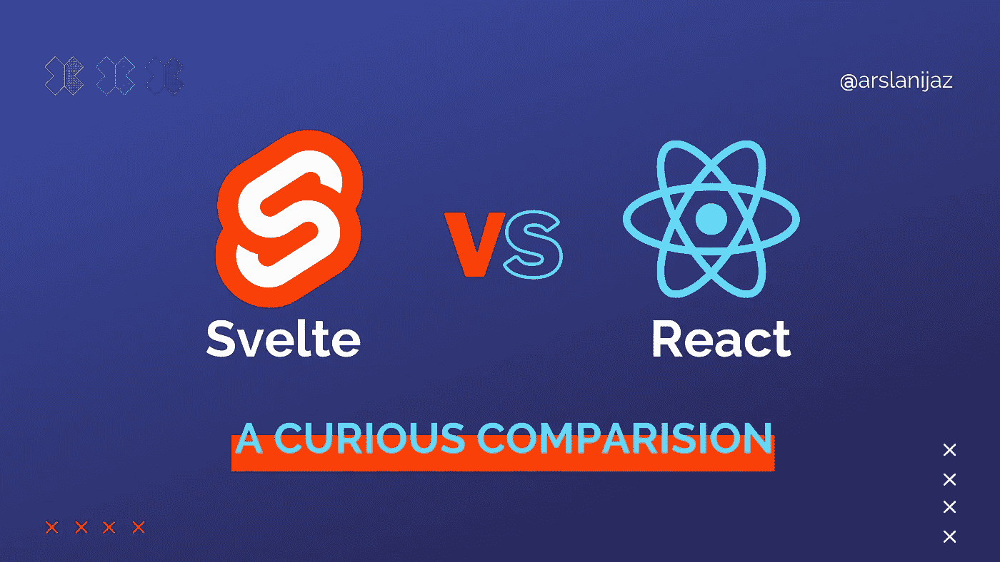

# 2023 Svelte vs React:学哪个框架比较好？

> 原文：<https://javascript.plainenglish.io/2023-svelte-vs-react-which-framework-is-better-to-learn-3c591e8598f8?source=collection_archive---------2----------------------->

## 发现苗条和反应之间的差异，并了解为什么其中一个可能是你的项目更好的选择。

众所周知，web 开发在不断发展。随着新的框架和库的不断涌现，跟踪它们可能需要时间。

但是，一个框架脱颖而出:苗条。自 2016 年发布以来，由于其卓越的性能和易用性，Svelte 一直受到开发者的青睐。与 React 或 Vue 等其他前端框架相比，是什么让 Svelte 与众不同？而 2023 年你的下一个项目应该选择哪个？

随着 web 开发行业的发展，知道学习哪种框架需要时间。最受欢迎的两个选择是 React 和 Svelte，这两种选择都有利弊。但是你应该选择哪一个呢？这篇文章将一劳永逸地回答这个问题。

# 什么是反应？

React 是一个渐进式 JavaScript 库，允许开发人员创建快速、动态和可伸缩的高效用户界面。它提供了虚拟 DOM(文档对象模型)和基于组件的体系结构等特性，以便开发人员可以快速地将复杂的 UI 元素实现到他们的项目中。React 还支持服务器端渲染，以提高移动设备的性能。

凭借其强大的社区支持、记录良好的 API 和众多可用的库，难怪 React 仍然是 2023 年前端开发的首选之一。

# 什么是苗条？

Svelte 是一个流行的开源 JavaScript 框架，最近获得了巨大的吸引力。它专注于构建用户界面(ui)和单页应用程序(spa ),并且已经成为 web 开发人员的热门词汇。

它与众不同的特点是它的速度，因为它将代码编译成小块高效的 JavaScript，在浏览器中快速运行。Svelte 为开发人员提供了一种简单的方法来创建交互式 ui，而无需编写复杂的代码，对于那些希望快速启动和运行项目的人来说，这是一个极好的选择。

> 自 2021 年 Svelte 作为 3.0 版本发布以来，Svelte 和 React 之间的竞争一直在升温。

# React 和 Svelte 的 4 个区别

## 4.较小的构建包大小

使用 React 构建的相同应用程序的部署包大小是 41.2 kB，而使用 Svelte 构建的相同应用程序是 2.1 kB——几乎相差 20 倍！

这意味着希望创建轻量级应用程序的开发人员应该只关注 Svelte，因为这个框架为用户和开发人员提供了出色的性能优势。此外，它允许高效的加载时间和更快的渲染速度，这在为智能手机或平板电脑构建应用程序时会产生很大影响。

## 3.简单语法

React 是一个基于组件的框架，允许开发人员用声明性组件来制作复杂的用户界面，而 Svelte 采用了一种更幕后的神奇方法。使用 Svelte，开发人员可以编写简单的样板文件或语法代码来完成复杂的绑定。

这可以让新开发人员更容易地快速学习技术，并比以往任何时候都更快地启动和运行。

此外，Svelte 从一开始就针对性能进行了优化；它的主要目的是确保代码库在编译成针对浏览器加载时间进行了优化的 JavaScript 文件后，保持轻便和快速。

## 2.Svelte 符合 HTML、CSS 和 JavaScript

Svelte 和 React 的关键区别在于，Svelte 将您编写的代码编译成基本的 HTML、CSS 和 JavaScript，而 React 需要与您的代码捆绑在一起。

使用 Svelte，开发人员可以快速创建轻量级应用程序，而不用担心处理复杂的构建过程。此外，由于代码是提前编译的(AOT)，与 React 相比，它允许更快的加载时间和更好的性能。

## 1.反应有反应原生

React Native 是当今最受支持的跨平台框架之一。它允许开发人员使用 React 通过单一代码库创建 iOS 和 Android 应用程序。React Native 提供了完善的 API，让用户更容易构建复杂的移动应用程序。由于其灵活性、可伸缩性和简单性，该框架最近在开发人员中广受欢迎。

自 2015 年推出以来，React Native 已经发展成为一个开源平台，允许开发人员在所有平台上创建强大的用户体验，同时在 iOS 和 Android 设备上提供原生性能。

这使得它非常适合构建在多个平台上运行的应用程序，而不会影响性能或速度。此外，因为 React Native 基于 JavaScript，所以它允许开发人员在开发他们的移动应用程序时轻松重用 web 项目中的现有代码。

# 选择的权威指南

## 性能:苗条与反应

两者都为开发人员提供了创建令人难以置信的用户体验所需的工具，但是它们在性能方面如何比较呢？为了回答这个问题，我们来仔细看看 Svelte vs. React 在性能方面的表现。

就速度和效率而言，苗条通常被认为比反应更好。它以最小的开销将你的代码编译成小的包，这意味着你的页面将为用户快速流畅地加载。此外，由于所有代码都是预先编译的，因此不需要虚拟 DOM 操作，这使得它特别适合游戏或流媒体服务等高性能应用程序。

## 易学性:苗条与反应

由于相对简单，苗条通常被认为比反应更容易学习。它也是市场上较新的框架之一，因此它的高级特性较少，需要更深入的知识。此外，它的编码风格模仿普通的 JavaScript，这意味着新手开发者从 HTML 和 CSS 过渡到基于 JS 的开发时，学习曲线会更低。

## 工具和资源:苗条与反应

Svelte 提供了一个易于使用的库，使反应性的工作变得简单。它的表现也很出色，在构建时将组件编译成普通的 JavaScript。有了一个苗条的加载器，开发人员可以快速地将他们的代码集成到现有的项目中，而不会有很大的麻烦。此外，它的小尺寸使其成为移动应用的绝佳选择。

React 提供了比以往更多的选项，如 create-react-app 和 react native，使其成为开发人员的热门选择。

## 社区:苗条与反应

Svelte 从其他框架中脱颖而出，它采用了极简的方法，并专注于性能增强。该框架设计简单，只需最少的设置，无需使用额外的工具或库即可快速加载页面。

另一方面，React 具有更全面的功能，使开发人员更容易快速创建复杂的应用程序，而不会影响质量或性能。此外，其基于组件的架构允许项目的代码可重用性和可伸缩性。

## 受欢迎程度和工作需求:苗条与反应

Svelte 是一个相对较新的框架，自 2018 年发布以来一直在获得关注。它对性能优化的关注使它成为希望用最少的代码创建快速加载应用程序的开发人员的一个有吸引力的选择。另一方面，React 自 2013 年以来一直存在，由于其强大的组件库，仍然被广泛使用。在定制项目架构方面，它也比 Svelte 提供了更多的灵活性。

Svelte 和 React 在开发人员社区中非常受欢迎，在过去几年中，他们的工作需求有了显著增长。

# 结论

对于 2023 年想学习 JavaScript 库或框架的开发者来说，React 和 Svelte 是可行的选择。React 是一个历史悠久、广为人知的选择，在未来几年仍将流行。与此同时，Svelte 已经成为一个令人兴奋的新工具，它提供了许多与 React 相同的好处，但性能更快。最终，开发人员的最佳选择取决于他们的项目需求和偏好。

*更多内容请看*[***plain English . io***](https://plainenglish.io/)*。报名参加我们的* [***免费周报***](http://newsletter.plainenglish.io/) *。关注我们关于*[***Twitter***](https://twitter.com/inPlainEngHQ)[***LinkedIn***](https://www.linkedin.com/company/inplainenglish/)*[***YouTube***](https://www.youtube.com/channel/UCtipWUghju290NWcn8jhyAw)*[***不和***](https://discord.gg/GtDtUAvyhW) ***。*****

*****对缩放您的软件启动感兴趣*** *？检查* [***电路***](https://circuit.ooo?utm=publication-post-cta) *。***