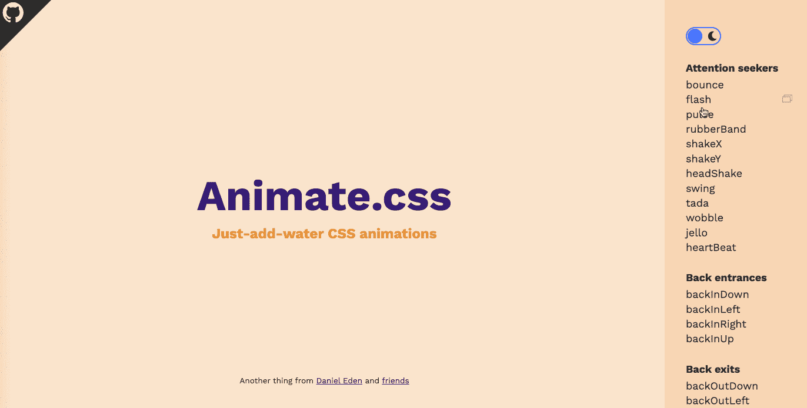
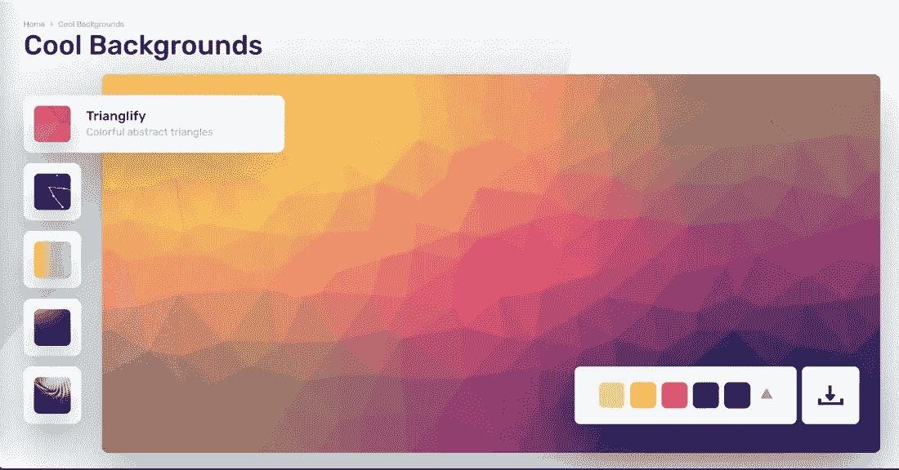

# 你应该知道的 25 个黑仔网站

> 原文：<https://javascript.plainenglish.io/25-killer-websites-for-web-developers-you-should-know-about-764f7d4d3e57?source=collection_archive---------2----------------------->

## 99.9%的开发者都不知道。

Photo by [KOBU Agency](https://unsplash.com/@kobuagency?utm_source=medium&utm_medium=referral) on [Unsplash](https://unsplash.com?utm_source=medium&utm_medium=referral)

# 前言

我想和你分享一些有用的可以提高你工作效率的网站:有些可以帮你写文章，有些可以帮你做设计。现在让我们来看看。

# 1.为您的源代码创建和共享美丽的图像

[链接](https://carbon.now.sh/)

使用 [Carbon](https://carbon.now.sh/) 来创建和分享你的源代码的美丽图像。它提供了多种代码风格和主题。

# 2.JavaScript 正则表达式可视化工具

[链接](https://jex.im/regulex/#!flags=&re=(((%3F%3D.*%5Cd)((%3F%3D.*%5Ba-z%5D)%7C(%3F%3D.*%5BA-Z%5D)))%7C(%3F%3D.*%5Ba-z%5D)(%3F%3D.*%5BA-Z%5D))%5E%5Ba-zA-Z%5Cd%5D%7B6%2C12%7D%24)

你是那种因为看起来复杂而不想学习正则表达式的人吗？别担心，我以前也是这样，但现在不是了。可视化工具让正则表达式更容易理解。

# 3.随机图像

[链接](https://unsplash.com/)

互联网上免费使用的图片来源。由各地的创造者提供动力。

# 4.智能 WebP、PNG 和 JPEG 压缩

[链接](https://tinypng.com/)

您可能经常需要压缩图像， [tinypng](https://tinypng.com/) 免费使用，压缩后的图像清晰度高。

# 5.密码笔

[链接](https://codepen.io/)

使用 CodePen 将使得在媒体上嵌入演示代码变得非常方便，就像这个例子一样。

# 6.开源图标

[链接](https://ionic.io/)

你可以从 Ionic 上找到你需要的任何图标，包括用于 web、iOS、Android 和桌面应用程序的高级设计图标。支持 SVG 和网络字体。完全开源，[离子](https://ionic.io/)。

# 7.超级实用的调色板

[链接](https://colorhunt.co/palettes/pastel)

设计时找不到合适的颜色？[色彩狩猎](https://colorhunt.co/palettes/pastel)可以帮助我们。

# 8.我能用吗？

[链接](https://caniuse.com/)

前端工程师经常需要检查浏览器兼容性，[我能用吗](https://caniuse.com/)是一个可以查询 CSS 和 JavaScript 在各种流行浏览器中的特性和兼容性的网站。

# 9.GitHub 桌面

[链接](https://desktop.github.com/)

如果你不熟悉 git，你会非常喜欢它。

(来自[桌面](https://desktop.github.com/))专注于重要的事情，而不是和 Git 较劲。无论您是 Git 新手还是经验丰富的用户，GitHub Desktop 都可以简化您的开发工作流程。

# 10.Animate.css

[链接](https://animate.style/)

作为前端开发工程师，需要经常写动画吗？哦！我在动画方面没有任何优势，但幸运的是`Animate.css`帮我解决了大部分问题。

我们可以在这里找到很多有趣又有用的动画片段。

# 11.boardmix.com

我真的很喜欢这个网站，因为我可以在上面画思维导图、流程图和所有其他与图形相关的东西。

# 12.Web 渐变

[链接](https://webgradients.com/)

一个为你的网站添加美丽渐变的地方。

# 13.3d 图标

[链接](https://3dicons.co/?ref=usniemvuilaptrinh)

(来自 [3Dicons](https://3dicons.co/?ref=usniemvuilaptrinh) )制作精美的开源 3D icons100%免费用于 CC0 下的商业和个人使用

# 14.标准简历

[链接](https://standardresume.co/?ref=usniemvuilaptrinh)

每当我想换工作时，我都会想到它，因为它为我创造了一份漂亮的、有求必应的简历。

# 15.`codetogo`

[链接](https://codetogo.io/how-to-sum-items-of-array-in-javascript/)

Codetogo 可以帮助我们快速找到网站开发中的一些常见问题，非常高效准确。比如:[“JavaScript 中数组的项如何求和？”](https://codetogo.io/how-to-sum-items-of-array-in-javascript/)

# 16.开发人员的最佳代码生成器

[链接](https://webcode.tools/?ref=usniemvuilaptrinh)

我们可以用它来生成 HTML，CSS 等。

# 17.未使用的 CSS

[链接](https://unused-css.com/?ref=usniemvuilaptrinh)

移除未使用的 CSS，轻松清理您未使用的 CSS 规则。

# 18.酷酷的背景

[链接](https://coolbackgrounds.io/?ref=usniemvuilaptrinh)

它可以帮助我们创建漂亮的背景图片。

# 19.DevDocs

[链接](https://devdocs.io/)

这个[网站](https://devdocs.io/)有各种项目的文档，也支持离线使用。

# 20.cdnjs

[链接](https://cdnjs.com/)

有时候我们需要在线资源进行编程练习。 [cdnjs](https://cdnjs.com/) 可以帮助我们找到几乎所有的开源库。

# 21.移除图像背景

[链接](https://www.remove.bg/)

这个网站可以免费帮我们 100%自动删除图片背景。

# 22.自述文件

[链接](https://readme.so/editor)

这是创建自述文件的最简单方法，这个简单的编辑器允许您快速添加和自定义项目自述文件所需的所有部分。

# 23.你的网站加载速度有多快？

[链接](https://gtmetrix.com/)

查看您的网站运行情况，揭示速度缓慢的原因，并找出优化机会。

# 24.在线编辑图片

[链接](https://www.photopea.com/)

写文章需要图片吗？图像可以通过这个网站在线设计。

# 25.免版税插图

[链接](https://www.manypixels.co/gallery)

2500 多幅免版税插图，让您的设计锦上添花。

# 最后

感谢阅读。我期待着您的关注和阅读更多高质量的文章。

 [## 采访者:“npm 跑 xxx”怎么了？

### 一个大多数人都不知道的秘密。

javascript.plainenglish.io](/interviewer-what-happened-to-npm-run-xxx-cdcb37dbaf44)  [## 每个开发人员都应该知道的 20 种 JavaScript 数组方法

### 你知道这 20 个数组方法是怎么实现的吗？

javascript.plainenglish.io](/20-javascript-array-methods-every-developer-should-know-6c04cc7a557d)  [## 让你看起来像高级开发人员的 8 个很酷的 GitHub 技巧

### 使用 GitHub 可以做的 8 件很酷的事情

javascript.plainenglish.io](/8-cool-github-tricks-to-make-you-look-like-a-senior-developer-ab8fe9ae9b14)  [## 面试官:可以“x！== x "在 JavaScript 中返回 True？

### 你可能不知道的五个神奇的 JavaScript 知识点！

javascript.plainenglish.io](/interviewer-can-x-x-return-true-in-javascript-7e1d1fa7b5cd)  [## 123['toString']。length + 123)用 JavaScript 打印出来？

### 95%的前端开发者回答错误的问题。

javascript.plainenglish.io](/what-does-123-tostring-length-123-print-out-in-javascript-2c804a414325) 

*更多内容请看*[***plain English . io***](https://plainenglish.io/)*。报名参加我们的* [***免费周报***](http://newsletter.plainenglish.io/) *。关注我们关于*[***Twitter***](https://twitter.com/inPlainEngHQ)[***LinkedIn***](https://www.linkedin.com/company/inplainenglish/)*[***YouTube***](https://www.youtube.com/channel/UCtipWUghju290NWcn8jhyAw)***，以及****[***不和***](https://discord.gg/GtDtUAvyhW) *对成长黑客感兴趣？检查* [***电路***](https://circuit.ooo/) ***。*****