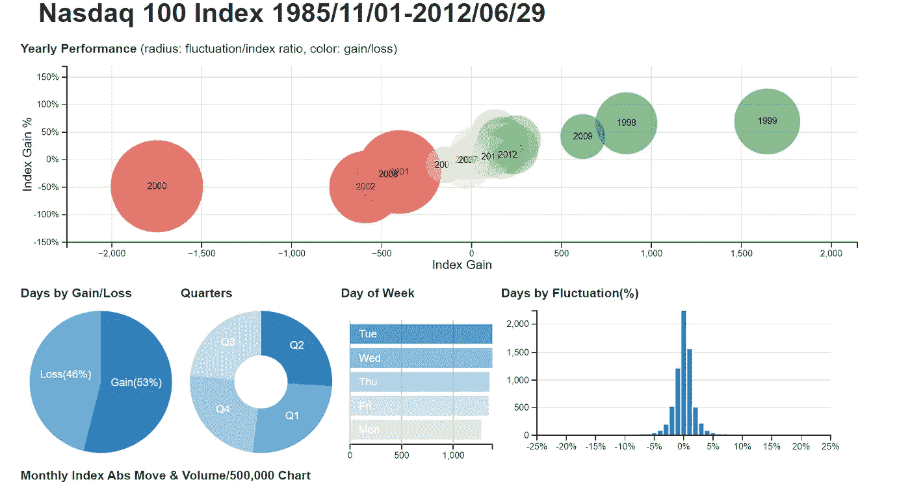

# 2022 年的 27 个 JavaScript 数据可视化库

> 原文：<https://javascript.plainenglish.io/27-javascript-data-visualization-libraries-for-2022-48400795d224?source=collection_archive---------3----------------------->

## 为 JS 应用程序提供漂亮的图表、图形和数据可视化的库。


数据可视化是使用图表、绘图和信息图形对数据的可视化表示。它帮助我们更好地理解和交流数据背后的含义。JavaScript 中有许多库可以帮助我们实现这一点。

排名不分先后，以下是 2022 年可用的一些最好的 JavaScript 数据可视化库，帮助您入门，轻松地将漂亮的数据可视化添加到您的应用程序中。请留下评论，分享你的想法和想法！

# 1.D3.js


Scatterplot, Connected

D3 或 D3.js 是最流行的数据可视化库之一。这个库使用 web 标准来可视化数据。它帮助您使用 SVG、Canvas 和 HTML 将数据变为现实。举几个例子，D3 gallery 包含了一个名副其实的表格动物园:树形图、分层边捆绑、桑基图、密度等高线和力定向图。

D3 的低层次方法关注可组合的原语，如形状和比例，而不是可配置的图表，这给了你灵活性和创作自由。D3 还以其动画功能而闻名，可以帮助你轻松地制作条形图比赛或树形图。作为使用最广泛的图书馆之一也有它的好处，比如一个巨大的社区，可以开发资源和教程、视频文章和书籍。

```
**Installation:** $ npm install d3
```

这里有完整的[文档](https://github.com/d3/d3/wiki)供您开始使用。

# 2.Two.js


Two.js 是一个现代的在线浏览器友好的二维绘图 API。它是渲染器不可知的，允许相同的 API 在 SVG、canvas 和 WebGL 上下文中绘制。Two.js 深受平面运动图形的启发。因此，two.js 旨在使平面形状的创建和动画更容易、更简洁。

它还有一个内置的动画循环和一个 SVG 解释器。Two.js 提供了许多易于使用的功能来处理和渲染位图图像。只需几次方法调用，您就可以轻松加载单个图像、子画面和图像序列。

```
**Installation:** $npm install --save two.js
```

Two.js [文档](https://two.js.org/docs/two/)。

# 3.三. js


Three.js 是一个跨浏览器的 JavaScript 库和应用程序编程接口(API)。通过 three.js，您可以使用 WebGL 在 web 浏览器中创建和显示动画 3D 计算机图形。不依赖于浏览器插件，你将能够创建 GPU 加速的 3D 动画。

Three.js 的特性包括:

*   效果:浮雕，对眼，视差栅栏。
*   场景:在运行时添加和删除对象；雾
*   照相机:透视和正投影；控制器:轨迹球、FPS、路径等等
*   动画:骨架、正向运动学、反向运动学、变形和关键帧
*   灯光:环境光、方向光、点光和聚光灯。阴影:投射和接收
*   材质:Lambert，Phong，平滑着色，纹理等等
*   着色器:访问完整的 OpenGL 着色语言(GLSL)功能:镜头眩光、深度处理和丰富的后处理库。
*   其他功能，如对象、几何、数据加载器和具有全套时间和 3D 数学功能的实用程序。

```
**Installation:** $ npm install three
```

这里有完整的[文档](https://threejs.org/docs/index.html#manual/en/introduction/Creating-a-scene)供您开始使用。

# 4.MetricGraphics.js


MetricsGraphics.js 是一个基于 D3 的库，针对可视化和布局时序数据进行了优化。在不到 80KB(缩小)的情况下，它能够以有原则的、一致的和响应迅速的方式制作常见类型的图形。它目前支持折线图、散点图、直方图、条形图和数据表，以及地毯图和基本线性回归等功能。

该图书馆的目标是通过强调效率和实用性来消除简单数据中的神秘和复杂。

```
**Development setup:***Make sure you have yarn installed*# *clone and setup*
$ git clone [https://github.com/metricsgraphics/metrics-graphics](https://github.com/metricsgraphics/metrics-graphics)
$ cd metrics-graphics
$ yarn install
```

# 5.Charts.js


Chart.js 是一个开源的、由社区维护的 JavaScript 库，用于制作基于 HTML 的图表。在你的网站上加入动画和互动图表是一个简单的方法。这是 JavaScript 最简单的可视化库之一。您可以用 8 种不同的方式可视化您的数据:

*   散点图
*   折线图
*   条形图
*   圆形分格统计图表
*   圆环图
*   泡泡图
*   对比图
*   雷达图
*   混合图表

```
**Installation:** $ npm i chart.js
```

这里有详细的[文档](https://www.chartjs.org/docs/latest/)供你开始使用。

# 6.纸张. js


Paper.js 是一个运行在 HTML5 Canvas 之上的矢量图形脚本框架。它提供了一个清晰的场景图形/文档对象模型，以及许多用于创建和操作矢量图形和贝塞尔曲线的强大功能，所有这些都整齐地包装在一个设计良好、一致和清晰的编程接口中。

Paper.js 对于初学者来说很容易学习，对于中级和高级用户来说有很多东西需要掌握。

```
**Installation**: $ npm install paper
```

你可以在这里了解更多关于 Paper.js [的信息。](http://paperjs.org/tutorials/)

# 7.织物. js


Fabric.js 是一个框架，它使得使用 HTML5 canvas 元素变得简单而容易。它是一个画布元素，上面有一个交互式对象模型。它还充当 SVG 到画布的解析器。

您可以使用 Fabric.js 创建和填充画布对象，如简单的几何形状(矩形、圆形、椭圆形、多边形)或由数百或数千条简单路径组成的更复杂的形状。然后，您可以使用鼠标来缩放、移动和旋转这些对象，以及更改它们的属性(颜色、透明度、z 索引等)。您也可以通过用鼠标选择这些对象，将它们作为一个组进行操作。

```
**Installation**: $ npm install fabric — save
```

这里是 Fabric.js 的详细的[文档](http://fabricjs.com/docs/)。

# 8.拉斐尔


Raphaë是一个小型的 JavaScript 库，应该可以使在 web 上处理矢量图形变得更加容易。如果您想制作自己的自定义图表或图像裁剪和旋转小部件，您可以使用此库快速轻松地完成。

Raphaë目前支持 Firefox 3.0+，Safari 3.0+，Chrome 5.0+，Opera 9.5+和 Internet Explorer 6.0+。它使用 SVG W3C 推荐标准和 VML 作为创建图形的基础。这意味着您创建的每个图形对象也是一个 DOM 对象，因此您可以附加 JavaScript 事件处理程序或在以后修改它们。

```
**Installation:** $ git clone [https://github.com/DmitryBaranovskiy/raphael.git](https://github.com/DmitryBaranovskiy/raphael.git)
$ yarn install --frozen-lockfile
$ yarn build-all
```

要运行测试，你需要在浏览器中运行`npx bower install` open `dev/test/index.html`，目前还没有自动化的方法。

这是拉斐尔[的详细文档](https://dmitrybaranovskiy.github.io/raphael/reference.html)。

# 9.阿帕奇·埃查尔兹


Apache ECharts 是一个开源的 JavaScript 数据可视化库。这是一个免费的，强大的图表和可视化库，提供了一个简单的方法来添加直观的，交互式的，高度可定制的图表到您的商业产品。它提供了 20 多种现成的图表类型，以及十几个组件，每一种都可以任意组合使用。

您可以通过数据集来管理数据，数据集支持过滤、聚类和回归等数据转换，有助于对同一数据进行多维分析。

```
**Installation**: npm install echarts --save
```

这里是 Apache ECharts 的详细的[文档](https://echarts.apache.org/handbook/en/get-started/)。

# 10.vis . j


Vis.js 是一个基于浏览器的动态可视化库。它被设计成尽可能易于使用，同时能够处理大量的动态数据，以便能够操纵数据并与之交互。该库由组件数据集、时间轴、网络、Graph2d 和 Graph3d 组成。

安装:

```
#vis-network
$ npm install vis-network#vis-timeline
$ npm install vis-timeline#vis-graph3d
$ npm install vis-graph3d
```

点击了解更多关于 vis.js [的信息。](https://visjs.org/)

# 11.Sigma.js


Sigma.js 是一个现代 JavaScript 库，用于在浏览器中呈现网络图并与之交互。它与一个多用途的图形操作库 [graphology](https://graphology.github.io/) 协同工作。Sigma.js 使用 WebGL 渲染图形。与基于 Canvas 或 SVG 的解决方案相比，它可以更快地绘制更大的图形。

```
**Installation:** $ npm install graphology sigma
```

点击了解更多关于 Sigma.js [的信息。](https://github.com/jacomyal/sigma.js)

# 12.Arbor.js

Arbor 是一个用 web workers 和
jQuery 构建的图形可视化库。arbor
没有试图成为一个无所不包的框架，而是为图形组织和屏幕刷新处理提供了一个高效的、力导向的布局算法和
抽象。

将实际的屏幕绘图留给您。这意味着您可以将它用于 canvas、SVG 甚至定位的 HTML 元素；无论何种显示
方法都适合您的项目和您的性能需求。

```
**Installation:**To use the particle system:

  <script src="path/to/jquery.min.js"></script>
  <script src="path/to/arbor.js"></script>  

If you want to let arbor handle realtime color and value tweens for
you, include the arbor-tween.js file as well:

  <script src="path/to/jquery.min.js"></script>
  <script src="path/to/arbor.js"></script>
  <script src="path/to/arbor-tween.js"></script>
```

点击了解更多关于 arbor.js [的信息。](http://arborjs.org/)

# 13.低湿平原


Vega 是一种可视化语法，一种用于创建、保存和共享交互式可视化设计的声明性语言。使用 Vega，您可以用 JSON 格式描述可视化的视觉外观和交互行为，并使用 Canvas 或 SVG 生成基于 web 的视图。

Vega 为各种各样的可视化设计提供了基本的构建模块:数据加载和转换、比例、地图投影、轴、图例和图形标记，如矩形、直线、绘图符号等。

```
**Installation:** $ npm install vega
```

这是 Vega 的详细的[文档](https://vega.github.io/vega/docs/)。

# 14.Envision.js


Envision.js 是一个用于创建快速、动态和交互式 HTML5 可视化的库。

## 特点:

*   现代浏览器，IE 6+
*   触摸/移动支持
*   HTML5 财务图表
*   HTML5 时间序列图表
*   用于自定义可视化的 API
*   框架不可知
*   适用于 Flotr2
*   适应他人

要使用 Envision.js，请在页面中包含`envision.min.js`和`envision.min.css`。要显示可视化，可以使用[模板](https://humblesoftware.com/envision/documentation#templates)或使用 Envision.js API 创建自定义可视化。

Envision.js [文档](https://humblesoftware.com/envision/documentation)。

# 15.人力车


人力车是一个免费的开源 JavaScript 工具包，用于创建交互式时序图。人力车提供了创建交互式图形所需的元素:渲染器、图例、悬停、范围选择器等。它的底层都是基于 d3 的，所以图形是用标准 SVG 绘制的，样式是用 CSS。你可以用你已经知道的技术来定制你喜欢的一切。

```
**Installation:** npm install --save rickshaw
```

你可以从官方教程[这里](https://tech.shutterstock.com/rickshaw/tutorial/introduction.html)学习人力车。

# 16.直流 js



dc.js 是一个简单而强大的 javascript 库，用于在浏览器和移动设备上进行数据可视化和分析。dc.js 允许高效地探索大型多维数据集，它利用 d3 以 CSS 友好的 SVG 格式呈现图表。使用 dc.js 呈现的图表是数据驱动的和反应式的，因此为用户交互提供即时反馈。

在 dc.js 中，每个图表通过其元素的位置、大小和颜色显示一些属性的集合，还显示一个可以过滤的维度。当滤镜或笔刷更改时，所有其他图表都会使用动画转场进行动态更新。

```
**Installation:** $ npm install dc
```

# 17.SVG . j


js 是一个用于操纵 SVG 和制作动画的快速轻量级库。SVG.js 没有依赖性，目标是尽可能小，同时提供接近完整的 SVG 规范覆盖范围。它提供了一种简洁易读的语法。

```
**Installation:** npm install @svgdotjs/svg.js
```

SVG.js [文档](https://svgjs.dev/docs/3.0/)。

# 18.Heatmap.js


Heatmap.js 是一个轻量级、易于使用的 JavaScript 库，可以帮助您可视化三维数据。它占地面积小(~3kB gzip)，使用新的 2.0 版本 heatmap.js。通过其渲染模块，您可以处理更多的数据点。

Heatmap 还让我们可以独立使用不同的地图库，比如传单和谷歌地图。只需几行代码，您就可以创建自己的交互式 web 热图。

```
**Installation:** $ npm install heatmap.js
```

这是 heatmap.js [文档](https://www.patrick-wied.at/static/heatmapjs/docs.html)。

# 19.三角化


Trianglify 是一个开源的 JavaScript 库，用于创建独特的、美观的三角形 SVG 背景图像模式。它通过结合 Delaunay 三角剖分和一些漂亮的颜色生成低多边形样式的图案，如上图所示。

您可以在 [Trianglify.io](https://trianglify.io/) 中生成三角化模式，而无需编写一行代码。

```
**Installation:** $ npm install --save trianglify
```

你可以在这里了解更多关于三角化[的知识。](https://github.com/qrohlf/trianglify)

# 20.酒窝. js


Dimple 是一个面向对象的 API，允许您使用 d3.js 创建灵活的基于轴的图表。

这个项目的目标是让不一定是 JavaScript 编程专家的分析师能够创建标准的(和一些不太标准的)业务分析。

该 API 还将在可能的情况下公开核心 d3 对象，允许用户在获得信心后以他们认为合适的任何方式扩展基本功能。

```
**Installation:** $ npm i dimple-js
```

这里是完整的酒窝[文档](https://github.com/PMSI-AlignAlytics/dimple/wiki)。

# 21.Chartist.js


js 是一个用 SVG 构建的简单的响应图表库。它的目标是提供一个简单、轻量级、非侵入性的库，以便在你的网站上有针对性地制作图表。

因为 Chartist 使用 inline-SVG，所以它利用 DOM 来提供它的一些特性。这也意味着 Chartist 不包括事件处理、标签、行为或任何其他可以使用简单的 HTML、JavaScript 和 CSS 完成的东西。

```
**Installation:** $ npm i chartist
```

下面是 Chartist.js [文档](http://gionkunz.github.io/chartist-js/api-documentation.html)的链接。

# 22.世


Epoch 是一个通用的实时图表 JavaScript 库，用于构建漂亮、流畅和高性能的可视化效果。它有五个漂亮的高性能实时图表，使用 d3 和 Canvas 构建。

它主要关注两种类型的可视化编程:用于构建历史报告的基本图表和用于显示不断变化的数据的实时图表。

```
**Installation:** $ npm i epoch-charting
```

这里有一个链接，链接到 Epoch 的[入门](http://epochjs.github.io/epoch/getting-started/)指南。

# 23.巴比伦. js


Babylon.js 是一个免费的开源库。它是一个强大的、漂亮的，也是一个简单的 JavaScript 框架。它是一个实时 3D 引擎，使用 JavaScript 库在使用 HTML5 的 web 浏览器中呈现 3D 视觉效果。

你可以使用[游乐场](https://playground.babylonjs.com/)直接玩 Babylon.js API。它还包含了很多学习如何使用它的示例。

```
**Installation:** $ npm install babylonjs --save
```

这里是完整的[文档](https://doc.babylonjs.com/)的链接。

# 24.雷查尔兹


Recharts 是一个用 React 和 D3 构建的重新定义的图表库。您可以使用解耦的、可重用的 React 组件快速构建图表。它构建在 SVG 元素之上，对 D3 子模块有轻量级的依赖。您可以通过调整组件属性和传递自定义组件来自定义您的图表。

```
**Installation:** $ npm install recharts
```

# 25.图形


GraphicsJS 是一个轻量级的 JavaScript 图形库，它允许你绘制任何东西，包括任何类型的具有任何视觉效果的交互式和动画图形。你可以用它来进行数据可视化、制图、游戏设计或其他任何事情。

GraphicsJS 允许非常方便和容易地可视化复杂的数学算法。在基于 SVG/VML 的图形库中，它有一个最强大的线条绘制特性，只提供现成的贝塞尔曲线。

你可以从[这里](https://github.com/AnyChart/graphicsjs/tree/master/dist)下载图片。

这是完整的[文档](https://docs.anychart.com/latest/Graphics)的链接。

# 26.G2 Esports 电子竞技俱乐部


G2 是一种数据驱动的可视化语法，具有高度的可用性和可扩展性。它包括一组语法，允许用户超越有限的图表范围，进入几乎无限的图形表示领域。使用 G2，您可以使用 Canvas 或 SVG 构建基于 web 的视图，并且只用一句话来描述可视化的视觉外观和交互行为。

# 27.G2 图

G2Plot 是一个交互式和响应性的图表库。通过几行代码和图形语法，您可以简单地创建优秀的统计图表。

```
**Installation:** # for G2
$ $ npm install @antv/g2# for G2 Plot
$ $ npm install @antv/g2plot
```

*更多内容请看*[***plain English . io***](https://plainenglish.io/)*。报名参加我们的* [***免费周报***](http://newsletter.plainenglish.io/) *。关注我们关于*[***Twitter***](https://twitter.com/inPlainEngHQ)*和*[***LinkedIn***](https://www.linkedin.com/company/inplainenglish/)*。查看我们的* [***社区不和谐***](https://discord.gg/GtDtUAvyhW) *加入我们的* [***人才集体***](https://inplainenglish.pallet.com/talent/welcome) *。*