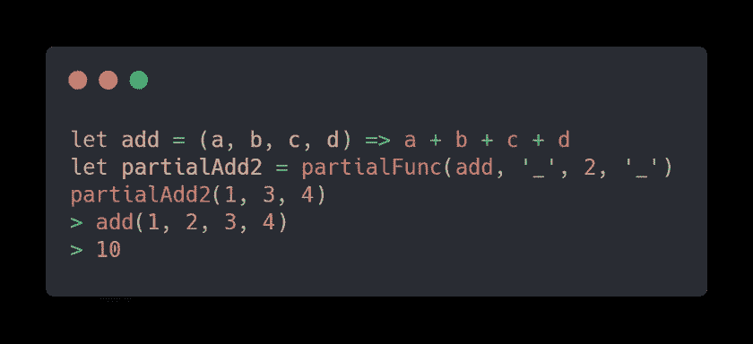
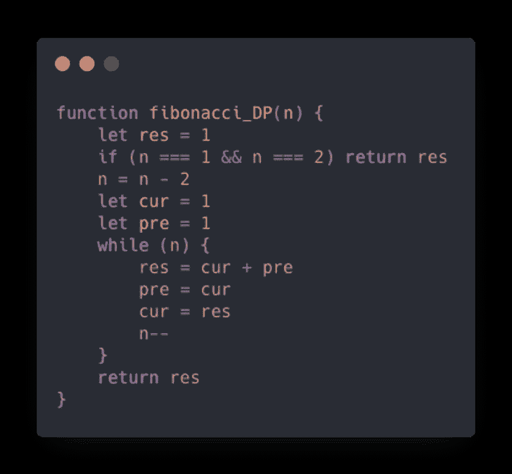

# 一名合格的中级前端工程师需要掌握的 28 项 JavaScript 技能

> 原文：<https://javascript.plainenglish.io/28-javascript-skills-a-qualified-intermediate-front-end-engineer-needs-to-master-ffed93de3f38?source=collection_archive---------0----------------------->

希望这对你的工作和面试有所帮助。

# 序

文中代码对应的详细注释和具体使用方法都放在我的 GitHub 上，源代码在底部可以找到。

# 1.确定对象的数据类型

使用 Object.prototype.toString.call()配合闭包，通过传入不同的判断类型返回不同的判断函数。一行代码简洁、优雅、灵活(注意传入 type 参数时首字母大写)。

**不建议使用该函数检测可能生成封装类型的基本数据类型，因为调用总是会对第一个参数进行装箱操作，导致基本类型和封装类型无法区分。**

# 2.循环来实现数组映射方法

使用方法:将 selfMap 注入 Array.prototype(下面数组的迭代方法也是如此)。

值得一提的是，map 的第二个参数就是第一个参数回调中的这个点。如果第一个参数是一个箭头函数，那么设置第二个这将是无效的，因为箭头函数的词法绑定。

另一个是稀疏阵列的处理。HasOwnProperty 用于判断数组中是否存在当前下标的元素(感谢评论区的朋友)。

# 3.使用 reduce 实现数组映射方法

# 4.循环来实现数组筛选方法

# 5.使用 reduce 实现数组筛选方法

# 6.循环来实现数组的一些方法

如果执行某个方法的数组是空数组，那么它总是返回 false，如果另一个数组的每个方法中的数组都是空数组，那么它总是返回 true。

# 7.循环来实现数组的 reduce 方法

因为可能存在稀疏数组关系，所以 reduce 需要确保跳过稀疏元素，并遍历正确的元素和下标。

# 8.使用 reduce 实现数组的 flat 方法

因为 selfFlat 依赖于这个指向，所以在减少遍历的时候需要指定这个指向 selfFlat，否则默认指向一个窗口，就会出错。

原理是通过归约来遍历数组。当数组的一个元素还是数组时，通过 ES6 spread 运算符进行降维(ES5 可以使用 concat 方法)，这个数组元素内部也可能有嵌套数组，所以需要递归调用 selfFlat。

同时，原生 flat 方法支持一个深度参数来表示降维的深度。默认值为 1，将数组的维度减少一层。

传入 Infinity 将把传入的数组变成一维数组。

原则是每次递归深度参数减 1。如果深度参数为 0，则直接返回原始数组。

# 9.实现 ES6 类语法

ES6 类基于寄生成分继承，是目前最理想的继承方式。通过 Object.create()方法创建一个空对象，从 Object.create()方法的参数中继承空对象，然后让子类(子类型)如果原型对象等于这个空对象，则可以实现子类实例的原型等于这个空对象，这个空对象的原型等于超类型原型对象(superType.prototype)的继承关系。

Object.create()支持第二个参数，该参数用于为生成的空对象定义属性和属性描述符/访问器描述符。我们可以为这个空对象定义一个构造函数属性，更符合默认的继承行为，不可枚举。可枚举的内部属性(enumerable: false)。

ES6 类允许子类继承父类的静态方法和静态属性，而普通的寄生组合继承只能实现实例间的继承。对于类之间的继承，需要定义额外的方法。这里使用 Object.setPrototypeOf()将超类型设置为子类型的原型，以便能够从父类继承静态方法和静态属性。

# 10.函数 currying

说明:

Currying 是函数式编程中的一项重要技术，这项技术将一个接受多个参数的函数转换成一系列接受一个参数的函数。

函数式编程的另一个重要函数 compose 可以组合函数，组合后的函数只接受一个参数，所以如果需要接受多个函数，需要使用 compose 进行函数组合，就需要使用 currying 对待组合的函数进行部分求值，使其始终只接受一个参数。

让我们看另一个例子:

# 11.函数 currying(支持占位符)

说明:

使用占位符可以使奉承更加灵活。这个想法是用每一轮的传入参数填充前一轮的占位符。如果当前轮次的参数包含占位符，它们将被放入内部存储的数组中。最终，当前回合的元素不会填充当前回合参数的占位符，只会填充之前传入的占位符。

# 12.部分功能

说明:

部分函数和 currying 的概念是相似的。我个人认为两者的区别在于，partial function 会固定你传入的几个参数，然后一次性接受剩下的参数，而 function currying 会根据你传入函数的参数不断返回，直到参数个数满足函数的参数个数才被 curry。

Function.prototype.bind 函数是部分函数的典型代表。它接受的第二个参数以预先添加到绑定函数的参数列表中的参数开始。与 bind 不同，上述函数还支持记账位字符。

# 13.斐波那契数列及其优化

使用函数内存保存以前操作的结果可以为经常依赖以前结果的计算节省大量时间，例如斐波那契数列。缺点是闭包中的 obj 对象会占用额外的内存。

此外，使用动态规划比前者具有更低的空间复杂度，也是更值得推荐的解决方案。

# 14.实现函数绑定方法

实现该函数的 bind 方法的核心是使用调用来绑定该指针，同时考虑到其他一些情况，例如:

当 bind 返回的函数被 new 调用为构造函数时，绑定值将失效，改为 new 指定的对象。

定义绑定函数的长度属性和名称属性(不可枚举属性)。

绑定函数的原型需要指向原函数的原型(*真实情况下，绑定函数没有原型。而是在绑定函数中有一个内部属性[[TargetFunction]]，用来保存原函数。当 final 函数作为构造函数时，创建的实例的 __proto__ 指向[[TargetFunction]]的原型，这里无法模拟内部属性，所以直接声明一个原型属性*。

# 15.实现函数调用方法

原理是将函数作为传入的上下文参数(context)的属性来执行。这里，ES6 符号类型用于防止属性冲突。

# 16.简单公司

说明:

run 函数接受一个生成器函数，并在 run 函数包装的生成器函数遇到 yield 关键字时停止

当后续 yield 的承诺解析成功后，会自动调用 next 方法执行到下一个 yield 关键字，最终，每当一个承诺解析成功，就会解析下一个承诺。

当所有解析成功时，打印所有解析的结果，并演变成现在最常用的 async/await 语法

# 17.去抖

主导是进入时是否执行一次。原理就是用定时器。如果事件在指定时间内再次被触发，则最后一个定时器将被清除，也就是说，该功能将不被执行，一个新的定时器将被重置，直到它超过指定时间。时间会自动触发计时器中的功能。

同时，通过闭包暴露了一个 cancel 函数，这样外部可以直接清除内部计数器。

# 18.节流

与防抖功能类似，不同的是额外使用内部时间戳作为判断，如果一段时间内没有触发事件，则允许触发下一个事件。同时增加了一个尾随选项，表示最后是否触发额外时间。

# 19.图像延迟加载

getBoundClientRect 的实现方法是监听 scroll 事件(建议在 monitor 事件中加入节流)，加载后图片会从 img 标签组成的 DOM 列表中删除，最后在 monitor 事件加载后所有图片都需要解除绑定。

实现一个 intersectionObserver，实例化 IntersectionObserver，让它观察所有 img 标签。

当 img 标签进入可见区时，执行实例化回调，向回调传递一个 entries 参数，该参数保存实例观察到的所有元素的一些状态，比如每个元素的边界信息，当前元素对应的 DOM 节点。，当前元素进入可见区域的速率。

每当一个元素进入可视区域时，将真实图像分配给当前的 img 标签并释放其观察

# 20.实施新的

# 21.实现 Object.assign

# 22.实现实例 of

原理是递归遍历右边参数的原型链，每次都与左边参数进行比较，当遍历到原型链末端时返回 false，找到时返回 true

# 23.私有变量的实现

使用 Proxy 代理所有以 _ 开头的变量，这样就不能从外部访问它们

以闭包的形式保存私有变量，缺点是类的所有实例都访问同一个私有变量

闭包的另一个实现解决了上述闭包的缺点。每个实例都有自己的私有变量。缺点是放弃了类语法的简单性，放弃了所有特权方法(访问私有变量的方法)。存储在构造函数中

通过 WeakMap 和闭包，在每次实例化时保存由当前实例和所有私有变量组成的对象，闭包中的 WeakMap 无法从外部访问。使用 WeakMap 的好处是，当没有变量引用实例时，会自动释放。实例保存的私有变量，以减少内存溢出问题

# 24.洗牌算法

早期的 chrome 对少于 10 个元素的数组使用插入排序，这将导致数组乱序，而不是真正的乱序，即使最新版本的 chrome 使用就地算法使排序成为稳定的算法，乱序问题仍然没有解决

真正的无序可以通过洗牌算法实现。洗牌算法分为原地和非原地。图 1 是原位洗牌算法。不需要声明额外的数组来节省内存使用。原则是按顺序遍历。数组的元素，随机选择当前元素和所有后续元素中的一个，并交换它们

# 25.单一模式

ES6 的代理拦截构造函数的执行方法实现的单例模式

# 26.许诺

说明:

promisify 函数是一个辅助函数，它将回调函数转换为承诺，适用于错误优先风格(nodejs)回调函数

原理是不管错误优先风格回调成功还是失败，最后一个回调函数都会在执行后执行。我们需要做的就是让这个回调函数控制承诺的状态。

这里还使用 Proxy 来代理整个 fs 模块，截取 get 方法，这样就不需要手动用 promisify 函数包装 fs 模块的所有方法，更加灵活

# 27.优雅地处理异步/等待

说明:

不需要每次使用 async/await 都包装一层 try/catch，这样更优雅。这是另一个想法。如果使用 webpack，可以编写一个加载器，分析 AST 语法树，遇到 await 语法时自动注入 try/catch。这样你甚至不需要使用帮助函数

# 28.事件发射器

on 方法用于注册事件，trigger 方法触发事件以实现事件间的松散解耦，并增加了额外的 once 和 off 辅助函数来注册只触发一次的事件和注销事件。

# 29.实现 JSON.stringify(附加)

当使用 JSON.stringify 将对象转换为 JSON 字符串时，一些非法的数据类型会被扭曲，主要如下

如果对象包含 toJSON 方法，将调用 toJSON

阵列

*   1.当存在未定义的/符号/函数数据类型时，将变为 null
*   2.无穷大/NaN 的存在也将变成零

对象

*   1.当属性值为未定义/符号/函数数据类型时，属性和值都不会转换为字符串
*   2.如果属性值为 Infinity/NaN，属性值将变为 null

日期数据类型值调用 ISOString

不是数组/对象/函数/日期的复杂数据类型成为空对象

循环引用抛出错误

此外，JSON.stringify 还可以传入第二个和第三个可选参数。感兴趣的朋友可以详细了解一下。

实现代码比较长，这里我直接粘贴对应的源代码地址 [JSON.stringify](https://github.com/yeyan1996/JavaScript/blob/master/json.js)

# 源代码

[源码](https://github.com/yeyan1996/JavaScript)，请不要吝啬你手中的明星，你的赞是对我最大的鼓励，谢谢

*更多内容看* [***说白了就是***](https://plainenglish.io/) *。报名参加我们的* [***免费周报***](http://newsletter.plainenglish.io/) *。关注我们关于*[***Twitter***](https://twitter.com/inPlainEngHQ)*和*[***LinkedIn***](https://www.linkedin.com/company/inplainenglish/)*。加入我们的* [***社区***](https://discord.gg/GtDtUAvyhW) *。*