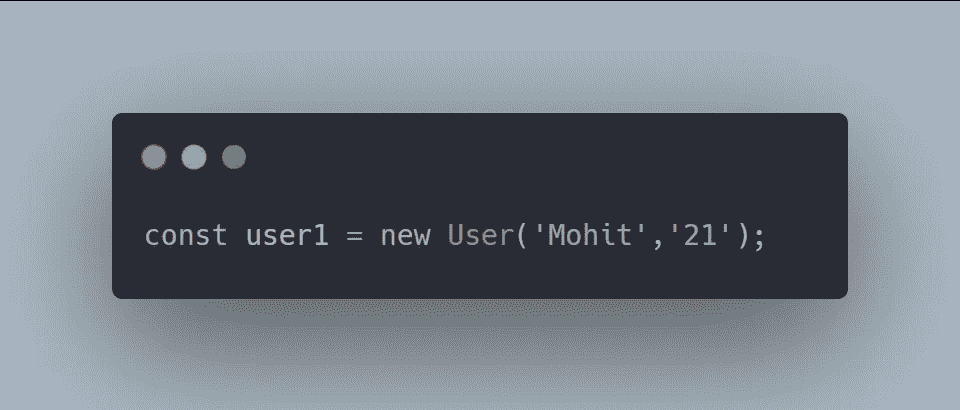

# 作为高级开发人员，你必须知道的 3 个高级 JavaScript 概念

> 原文：<https://javascript.plainenglish.io/3-advanced-javascript-concepts-you-must-know-as-a-senior-developer-b1f4e8379305?source=collection_archive---------5----------------------->

## 引用类型、上下文和实例化

# 参考类型

在 JavaScript 中，我们提供了*原语类型，如**字符串、布尔、空、未定义、**等，这意味着它们是由编程语言定义的。而引用类型或 ***非原语类型*** 不是由编程语言定义的，这意味着它们是由程序员创建的。*

****例如:****

*   *比方说，我们定义了三个变量为**年龄 1，年龄 2** & **年龄 3** 其中*年龄 2* 等于*年龄 1* 。但是，我们也将*年龄 3* 定义为与*年龄 1* 相同。*
*   *这时，你一定在想这三个变量包含相同的年龄值。但是这是一个棘手的部分，变量 **age3** 可能看起来和定义的年龄一样，但是 JavaScript 处理引用类型的方式有点混乱。*
*   *正如你在控制台中看到的，当我们记录**年龄 1 ===年龄 2** 时，结果是**真**，这是不言而喻的，但是当我们记录**年龄 2 ===年龄 3** 时，它向我们显示**假**。*

**

> *为了更好地理解，让我们更深入地看看引擎盖下发生了什么。*

*   *当我们定义变量 age1 时，JavaScript 创建了一个新对象并将值存储在其中，当我们定义*age 2 = = = age1***JavaScript**引用 **age1** 时，这意味着我们的变量 **age2** 将包含变量 age 1 中的所有内容。*
*   *然而，当 age3 被定义时，它被存储在一个不同的地方，JavaScript 放入我们用它定义的任何值。*

**

*   *此时 **Box1** 和 **Box3** 包含不同的对象，这就是为什么我们在 **age2 === age3** 的控制台中得到 false。*

# *语境*

*请注意，开发人员通常会混淆 ***范围*** 和上下文，范围可以说是一个*函数的边界，*在这些边界之上，JavaScript 不会识别任何东西。*

*然而，**上下文**是一个完全不同的概念，简单来说上下文就是*环境*当我们使用 *JavaScript* 中的函数时，它们是在那个环境中执行的。如果你长期使用 JavaScript，你一定听说过**这个**关键词，它让很多开发者感到困惑。*

> ****注意:*** ***这个*** *总是指向当前* ***上下文*** *你的函数正在执行的地方。在浏览器中，我们有一个* ***窗口*** *对象，在这个对象中，我们所有的函数都会被执行，除非你用其他上下文定义了这个函数。**

****例如:****

**

*   *在上面的例子中，当我们将 console.log 中的 ***这个*** 输出时，窗口中的对象被返回。*
*   *更简单地说，上下文告诉我们我们在哪个对象里面。为了仔细检查，您可以运行**console . log(this = = = window)**，结果将是 ***true*** ，因为这两个对象是相同的。*

**

*然而，为了创建一个新的**上下文**或者为*创建一个新的值，你必须另辟蹊径。从下面的例子中，你会更好地理解 ***this*** 和 Context 在 JavaScript 中是如何工作的。**

*****例如:*****

*   **您可以看到，由于**配置文件**的上下文，我们如何能够访问 ***名称*** 属性。然而，由于其自身的局限性，这在**全球背景下**是不可能的。**
*   **当你和一个开发团队一起工作时，上下文的概念非常有用，因为你最有可能看到这一点，你也需要理解上下文，以便进行**实例化**。**

****

# **实例化**

**如果你和 **React** 一起工作了很长时间，你一定见过这种模式。当您处理多个类时，实例化非常方便，因为您希望从该类中访问某个特性或函数，而不需要复制代码库。**

*****例如*** ，假设你正在构建一个多人游戏，游戏中的多个角色需要一些相似的特性，在这种情况下，使用实例化等方法，你可以构建多个具有相似特性的角色，而不会污染代码库。**

> **让我们通过一个例子更深入地了解 JavaScript 中实例化的工作方式**

*****例如:*****

*   **假设我们正在构建一个*电子商务*应用程序，其中我们有两个类**用户**和**个人资料**，这两个类都包含不同的*函数*作为**简介()**和**就绪()**。**

****

*   **如果我们想为不同的用户访问这两个功能，我们可以通过选择我们的 **User** 类并在几秒钟内构建一个新用户来轻松实现。**

****

*   **使用这个方法，我们可以很容易地从我们的类中访问这两个函数。**

****** [## Ultra 4 分钟指南:一个新的 React Web 框架

### 解开网络捆绑

javascript.plainenglish.io](/4-minute-guide-to-ultra-a-new-react-web-framework-7f12a853f58)  [## CSS 中的 z 索引

### 3 分钟解释 z 指数和堆叠指数

javascript.plainenglish.io](/z-index-in-css-6576cfdaa3ad)  [## 4 对你不知道存在的成分作出反应

### 构建一个脱颖而出的 React 应用程序。

javascript.plainenglish.io](/4-react-components-you-didnt-know-existed-bbdfecd62178) 

*更多内容看* [***说白了就是***](https://plainenglish.io/) *。报名参加我们的* [***免费周报***](http://newsletter.plainenglish.io/) *。关注我们关于* [***推特***](https://twitter.com/inPlainEngHQ) ，[***LinkedIn***](https://www.linkedin.com/company/inplainenglish/)***，***[***YouTube***](https://www.youtube.com/channel/UCtipWUghju290NWcn8jhyAw)***，****[***不和***](https://discord.gg/GtDtUAvyhW)***