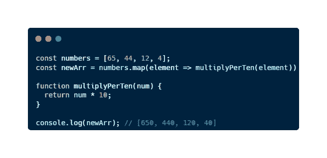
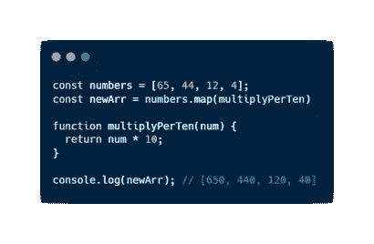
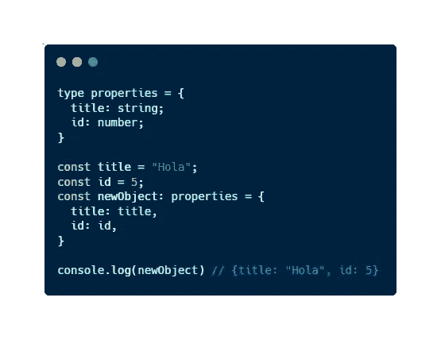
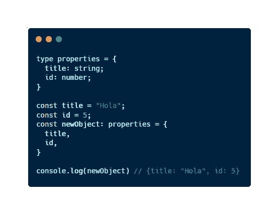
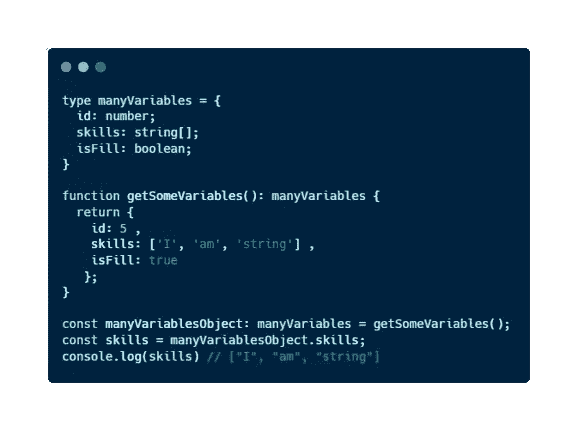
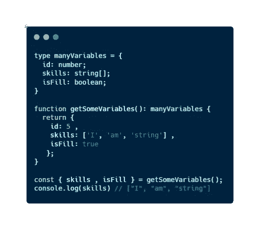

# 使用 JavaScript 更快编码的 3 个惊人技巧

> 原文：<https://javascript.plainenglish.io/3-amazing-tips-for-coding-faster-using-typescript-adffcbe10f32?source=collection_archive---------0----------------------->

## ⚡:自从把它应用到我的代码中，我已经成为一个更高效的软件开发人员

Photo by [Claudio Schwarz](https://unsplash.com/@purzlbaum?utm_source=medium&utm_medium=referral) on [Unsplash](https://unsplash.com?utm_source=medium&utm_medium=referral)

目前，我是一名**后端软件工程师**，负责 **JavaScript** 及其衍生软件(TypeScript、NodeJS、React……)。我每天都在使用这种编程语言，而且**我完全爱上了**。

只有懂得这门语言，你才能开发出如此多的东西，这太神奇了。此外，它为你提供了大量节省时间的**资源**和作为开发人员提高生产力的**。**

有些东西你可以在网上搜索一下就能找到。然而，他们的许多其他的你只有通过**深入阅读 de 文档**(并且花费太多时间)或者通过经验才能知道。

**我的同事认为我有很多这样的建议**，我测试了它们，并检查了它们如何提高你的日常工作效率，今天我将与你分享它们。

 [## 这个工具让我成为一名更好的软件开发人员

### 如果你想写更高质量代码，🖱️现在就开始使用它

javascript.plainenglish.io](/this-tool-is-making-me-a-better-software-developer-243ea598f5ec) 

## 1.吹毛求疵。地图功能

如果您正在使用 JavaScript 或其任何衍生工具开发东西，您将使用**数组方法**。在它们之间，我敢打赌地图将是你用得最多的。

当我开始使用它们时，我用一个箭头函数声明了我在 Google 示例和文档中看到的:

Picture [self-made by author](https://medium.com/@jesuslagares)

然而，当我开始作为一名专业开发人员工作时，我的同事向我展示了我可以保存箭头、箭头函数的参数，并且我可以直接应用地图中的函数:

Picture [self-made by author](https://medium.com/@jesuslagares)

 [## 关于 JavaScript 你不知道的 10 个有趣事实

### 发现这些你从来不知道的关于 JavaScript 的惊人事实，并改进你的代码

javascript.plainenglish.io](/10-interesting-facts-about-javascript-you-didnt-know-7af83db4affa) 

## 2.直接分配属性

你有没有一个对象，它有一些属性和变量，用来给这些属性赋值，你还是用这种方式赋值？

Picture [self-made by author](https://medium.com/@jesuslagares)

那么让我**帮你省点力气**发现这种方法，或者当你把属性命名为变量时声明它们:

Picture [self-made by author](https://medium.com/@jesuslagares)

 [## 5 个对初学者有用的 JavaScript 一行程序

### 在短短几分钟内，您将能够减少您必须编写的代码行数，并提高您的…

javascript.plainenglish.io](/5-useful-javascript-one-liners-for-totally-beginners-56e678d9a314) 

## 3.析构一组变量

如果你有一个函数或一组函数，**返回一堆不同的值**，你想**一次把它们赋给变量**，或者另一方面，你只想要其中的一些属性，你可以停止这样做:

Picture [self-made by author](https://medium.com/@jesuslagares)

开始做这样的事情:

Picture [self-made by author](https://medium.com/@jesuslagares)

> *你是不是想买个* [*中等会员*](https://medium.com/@jesuslagares/membership) *？如果你想访问媒体上最好的内容，可以考虑使用我的推荐链接**[*。同样的价格，你会支持我的工作。*](https://medium.com/@jesuslagares/membership)*

## *结论👋*

*谢谢大家！非常感谢您阅读这篇文章。如果你想了解更多关于技术和发展的知识，别忘了**跟我来**。我很想知道你对此的看法，所以不要花花公子**写在评论里**，我会读给你听。*

*如果这篇文章已经帮助你记住了，你可以**为它鼓掌**并分享给你的同志们。*

## *关于作者🤓*

*嗨！很高兴见到你！我是赫苏斯·拉加雷斯。目前，我是一名后端软件工程师，正在加的斯大学完成我的计算机科学学位。*

*我的两大爱好是**技术**和**交流**，所以我会抓住一切机会谈论或撰写关于技术的文章。我喜欢把复杂的概念转换成每个人都能理解的简单概念。*

## *想要连接吗？📲*

*📸[**Instagram**](https://instagram.com/jesuslagares_)**|**💼[**LinkedIn**](https://www.linkedin.com/in/jesus-lagares/)**|**📹[**Youtube**](https://www.youtube.com/c/Jes%C3%BAsLagares)**|**🐦 [**推特**](https://twitter.com/jesuslagares_)*

*📩**jesuslagaresgalan@gmail.com***

*谢谢！❣️*

**更多内容请看*[***plain English . io***](https://plainenglish.io/)*。报名参加我们的* [***免费周报***](http://newsletter.plainenglish.io/) *。关注我们关于*[***Twitter***](https://twitter.com/inPlainEngHQ)[***LinkedIn***](https://www.linkedin.com/company/inplainenglish/)*[***YouTube***](https://www.youtube.com/channel/UCtipWUghju290NWcn8jhyAw)*[***不和***](https://discord.gg/GtDtUAvyhW) ***。******

******对缩放您的软件启动感兴趣*** *？检查* [***电路***](https://circuit.ooo?utm=publication-post-cta) *。****