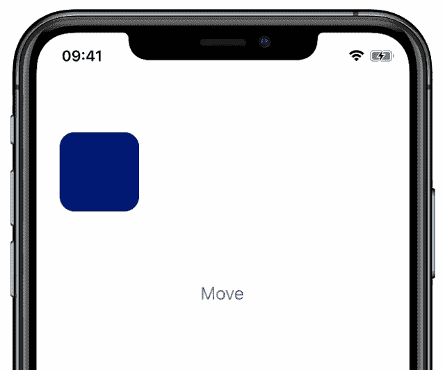
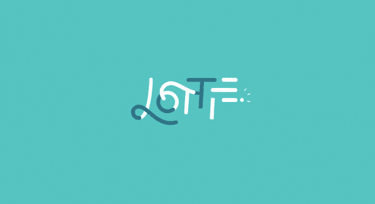

# 在 React Native 中构建精彩动画的 3 种方法

> 原文：<https://javascript.plainenglish.io/3-approaches-to-building-awesome-animations-in-react-native-dd86b6ad7aa6?source=collection_archive---------8----------------------->

## 了解在 React Native 中制作动画的不同方法，以及何时使用每种方法。

Photo by [Jakob Owens](https://unsplash.com/@jakobowens1?utm_source=medium&utm_medium=referral) on [Unsplash](https://unsplash.com?utm_source=medium&utm_medium=referral)

动画是构建吸引人的 UX 的好方法，它将 React 原生应用程序带入生活。正确使用的话，动画可以帮助你的应用程序感觉更加灵敏和完美。它们也可以用来帮助你的应用程序具有强烈的风格和个性。

但是“动画”在 React Native 中是一个令人惊讶的广泛话题——你可能想在你的应用程序中构建许多不同种类的动画，每种动画都有自己的一套要求。这意味着适合一种动画的工具可能不适合另一种。为你想要达到的效果选择合适的工具是制作高质量动画的第一步。

许多 React 原生应用程序实际上会使用多种类型的动画，因此会使用许多不同类型的动画工具。例如，您可以使用一种类型的动画工具在启动画面上制作徽标动画，并使用不同的动画工具将启动画面转换到初始 UI 中。在本文中，我们将探索一些您可能想要构建的不同种类的动画，并查看您可以用来实现它们的工具。

# 方法 1:视图和其他 UI 组件的转换

您可能想要构建的第一种动画是最基本的:制作组成应用程序的核心视图的动画。这些动画通常用于响应用户交互的用户界面元素的转换。一些常见的例子是滚动时发生的过渡，用户点击时视图的扩展或折叠，或者内容加载到应用程序时发生的动画。

## 工具:内置动画 API 或 React Native reactived

这种类型的动画是 React 本机应用程序中比较常见的一种，因为它涉及制作应用程序的核心 UI 元素的动画。正因为如此，React Native 通过[动画 API](https://reactnative.dev/docs/animated)*内置了对这些动画的支持。*

这些内置的 API 让您可以通过动画化视图样式属性上的大多数值来实现动画，包括`transform`、`opacity`、`height`、`width`等等。`[transform](https://reactnative.dev/docs/transforms)`[属性](https://reactnative.dev/docs/transforms)是动画中比较常见的属性之一，因为它可以用来控制平移、旋转和缩放。通过设置`transform`属性的动画，您可以使元素放大和缩小、滑动到位、旋转、摇摆等。

虽然您可以使用内置的动画 API 实现这些类型的动画，但我推荐第三方库 [React Native Reanimated](https://docs.swmansion.com/react-native-reanimated/) ，它提供了增强的功能、性能和响应能力。巨大的性能提升来自库 *Worklets* API，它支持小 JavaScript 函数在应用的高优先级 UI 线程上运行。这意味着更高的帧速率和与用户输入事件更好的交互性。

# 方法 2:动画标志或其他预建的 2D 动画

您可能想要合并的下一种动画是由艺术家或设计师在外部工具中构建的 2D 动画。这些动画包括在 UI 元素中使用的动画徽标、插图或非交互式图形。

## 工具:动画 gif 或洛蒂

有几个不同的工具可以用来制作这些类型的动画。首先是简单直白的动画 GIF。动画 gif 是一种熟悉的格式，即时可用的 React 原生 iOS 支持这种格式，尽管对于 Android，你需要对你的构建过程进行一些修改。正确配置后，可以使用 React Native 中用于其他图像的相同的`Image`标签来呈现动画 gif，这是一种简单明了的方法。如果您的动画需求非常简单，动画 gif 可能还不错，但它们确实有一些挑战，如文件大小大，无法很好地缩放和缺乏交互性。

动画 gif 的另一种解决这些问题的方法是一种叫做 [Lottie](https://github.com/lottie-react-native/lottie-react-native) 的工具和动画格式。Lottie 是一种基于 JSON 的文件格式，用于渲染矢量图形，通常具有更小的动画文件、更好的缩放(因为它使用矢量图形)以及对动画播放的更好控制。在一定程度上，它还允许你在运行时定制动画，一般来说，*比动画 gif 表现得更好(尽管对于复杂的动画来说，这并不总是正确的)。*

洛蒂动画可以通过[洛蒂导出器插件](https://lottiefiles.com/plugins/after-effects)从 Adobe After Effects 中导出，使得与艺术家合作为应用程序创建优秀内容变得简单。此外，在 [Lottie 文件](https://lottiefiles.com/featured)上有数千个高质量的免费 Lottie 动画。与简单的动画 gif 相比，加入 Lottie 需要更多的工作，但如果你在应用程序中使用了大量的动画内容，这通常是值得的。

# 方法 3:复杂的交互式或程序化的 2D 和 3D 动画

我们将讨论的最后一种动画是交互式的和/或程序化的动画。这些动画可能是 2D 或 3D 的，并且运动通常不是完全预定义的——动画可能在运行时响应于用户输入或其他变量而改变。这类动画可能涉及加载图像或 3D 模型，并在生成的资产上执行动画。与我们的第一类动画相比，这里被动画化的对象不是本地 UI 元素。这种动画的例子是游戏，包括 2D 和 3D，或者其他复杂的交互式动画。

## 工具:Three.js 或 Skia

在这种情况下，决定使用哪种工具的最大因素将是您想要使用 2D 还是 3D 图形。

如果你正在处理 3D 图形，你可能想看看 [Three.js](https://threejs.org) 。Three.js 是一个用 JavaScript 编写的强大、高性能的 OpenGL 驱动的 3D 引擎，带有 React Native 的[绑定。使用 Three.js，您可以构建或加载复杂的 3D 场景，并实时操纵它们以实现令人惊叹的动画效果-three . js 包括对加载许多常见 3D 文件格式的支持。因为场景是动态生成的，所以您当然可以构建响应用户输入的丰富场景来构建游戏或其他类似游戏的体验。](https://github.com/expo/expo-three)

虽然 Three.js *也可以用于 2D 场景，但是你可能希望使用一个更简单的工具来制作 2D 动画。在这种情况下，看看谷歌赞助的 2D 图形库 [Skia](https://skia.org) ，它也为 React Native 提供了[绑定。Skia 提供了简单的 API 来显示和制作矢量形状、图像、粒子等等。像 Three.js 一样，您可以合并用户输入来构建响应用户输入的复杂、动态的动画。](https://github.com/Shopify/react-native-skia)*

关于 React Native 中这种类似游戏的 2D/3D 渲染的最后一点:如果你的应用程序严重依赖或者主要是*这种类型的动画，你可能要重新考虑 React Native 是否真的是首先要使用的正确工具！例如，如果你真的想开发一个游戏，有更好的工具，比如[真实游戏引擎](https://unity.com)，你可以考虑根本不要使用 React Native。*

# 结论:使用哪些工具？

那么应该使用哪种工具呢？和往常一样，*视情况而定*——希望这篇文章已经展示了你可能想要构建的不同种类的动画，以及哪些工具可以帮助你构建它们。事实上，一个应用程序使用多个不同的动画策略并不罕见，因此，多个不同的动画工具也不罕见。

此外，请注意，这个列表并不详尽，还有其他工具可以在 React Native 中执行动画。但是它们往往属于相同的类别，所以即使你使用另一个工具，第一步仍然是决定你想要构建哪一类动画。

无论你最终使用哪种工具，动画都是 React 原生应用开发中最有趣的部分之一，有助于将你的应用提升到更高的水平。

编码快乐！

[*Jonathan*](https://blog.devgenius.io/@jonnystartup)*在大型创业公司&小型企业中拥有超过 20 年的工程领导经验。如果你喜欢这篇文章，* [*请考虑给乔纳森留个提示*](https://www.buymeacoffee.com/jonnystartup) *！*

*更多内容请看*[***plain English . io***](https://plainenglish.io/)*。报名参加我们的* [***免费周报***](http://newsletter.plainenglish.io/) *。关注我们关于* [***推特***](https://twitter.com/inPlainEngHQ)[***领英***](https://www.linkedin.com/company/inplainenglish/)**和* [***不和***](https://discord.gg/GtDtUAvyhW) ***。****