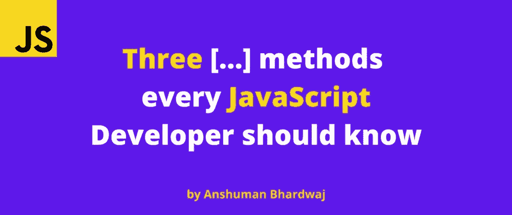

# 每个 JavaScript 开发人员都应该知道的 3 个数组方法

> 原文：<https://javascript.plainenglish.io/3-array-methods-every-javascript-developer-should-know-2afe645a96f7?source=collection_archive---------19----------------------->

## 你应该知道的 JavaScript 中鲜为人知的数组方法。



数组是我们每天都会遇到的东西。今天我将分享我挑选的 3 个最不常用的数组方法。

# 伊萨雷

在 JavaScript 中，我们不得不经常推断变量的数据类型，在嵌套对象中更是如此。大多数 JavaScript 开发人员做这件事的方法之一*(包括我自己)*是检查 length 属性

```
const data = { … }// true, if arrayKey exists and the arrayKey has a length property
(data?.arrayKey && data.arrayKey.length)
```

虽然这很有效，但是如果我告诉你有一个更好的方法呢？

`Array.isArray(param: any)`调用检查传递的值是否确实是一个数组，并返回一个布尔值。

```
Array.isArray([]); // true
Array.isArray(new Array(22)); // trueArray.isArray(0) // false
Array.isArray({}); // false
Array.isArray(null); // false
Array.isArray(undefined); // false
```

对于接下来的两个，让我们考虑一种情况

你必须根据如下测试对一些学生进行评级

*   失败:如果**所有**答案都*错*
*   通过:如果**部分**答案*正确*
*   优秀:如果**所有**答案都*正确*

# 一些

`Array.some()`方法对数组中的每一项运行所提供的函数，如果所提供的函数对其中任何的**返回 true，则返回 **true** ，否则返回 **false** 。**

所以在我们的场景中，我们可以将`Array.some()`应用于第二个用例。

```
function isCorrectAnswer(answer) { 
 // return true if the answer was correct, otherwise false 
}const answers = [{ ... }]// didStudentPass will be true, if any of the answers were    
// correct
const didStudentPass = answers.some(isCorrectAnswer)
```

# 每个

`Array.every()`方法对数组中的每一项运行所提供的函数，如果所提供的函数对它们中的所有返回 true，则返回 **true** ，否则返回 **false** 。

`Array.every()`似乎非常适合另外两种情况。

```
function isCorrectAnswer(answer) { 
 // returns true if the answer was correct, otherwise false 
}function isInCorrectAnswer(answer) { 
 // returns true if the answer was wrong, otherwise false 
}const answers = [{ ... }]// didStudentFail will be true, if all of the answers were incorrectconst didStudentFail = answers.every(isInCorrectAnswer)// didStudentExcel will be true, if all of the answers were correctconst didStudentExcel = answers.every(isCorrectAnswer)
```

暂时就这样了。希望这篇文章对你有帮助！如果您有任何反馈或问题，请随时在下面的评论中提出，我很乐意听到并解决它们。

更多此类内容，请关注我。

> *直到下一次*


*原载于 2022 年 2 月 14 日*[*https://theanshuman . dev*](https://theanshuman.dev/articles/3-array-methods-every-javascript-developer-should-know-868)*。*

*更多内容请看*[***plain English . io***](http://plainenglish.io/)*。报名参加我们的* [***免费周报***](http://newsletter.plainenglish.io/) *。在我们的* [***社区***](https://discord.gg/GtDtUAvyhW) *获得独家获得写作机会和建议。*