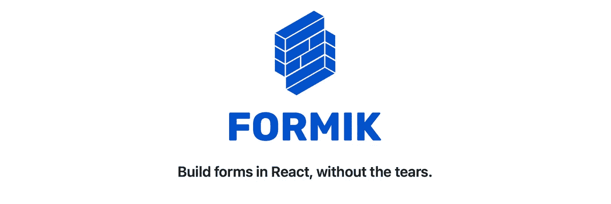

# 每个 React 开发人员都应该知道的 3 个最佳 React 表单库

> 原文：<https://javascript.plainenglish.io/3-best-react-form-libraries-every-react-developer-should-know-43888f8a969d?source=collection_archive---------0----------------------->

## 反应-钩形、仿形和反应-最终-形


Photo by [Olav Ahrens Røtne](https://unsplash.com/@olav_ahrens?utm_source=unsplash&utm_medium=referral&utm_content=creditCopyText) on [Unsplash](https://unsplash.com/s/photos/smart?utm_source=unsplash&utm_medium=referral&utm_content=creditCopyText)

随着 React 项目中的表单变得越来越复杂，问题就来了，我们如何让我们的生活变得更简单。这就是第三方图书馆的用武之地。下一个主要问题是哪个表单库更好。

在本文中，我们将看看三个最好的 React 表单库。

# 反应挂钩形式


React hook form

[React Hook Form](https://react-hook-form.com) —具有易用验证的高性能、灵活且可扩展的表单。这是最受欢迎的反应形式库之一，在 [GitHub](https://github.com/react-hook-form/react-hook-form) 上有近 31.4k 的星星。它在 [npm](https://www.npmjs.com/package/react-hook-form) 上也有 260 万用户下载。

我们为什么要使用 React 钩子形式:

*   超轻——它是一个没有任何依赖性的微型库
*   性能—最大限度地减少重新渲染的次数，最大限度地减少验证计算并加快安装速度
*   HTML 标准——通过我们的 API 使用现有的 HTML 标记和验证您的表单
*   可采纳——它很容易被接受，没有其他依赖性
*   社区——有一个很棒的社区，让每个 React 开发人员的生活更轻松

**安装**

```
npm install react-hook-form
```

**用法**

# 福米克



[Formik](https://formik.org) 是 React 和 React Native 最流行的开源表单库之一。它在 [GitHub](https://github.com/jaredpalmer/formik) 上有 31.4k 颗星，在 [npm](https://www.npmjs.com/package/formik) 上有 210 万用户下载量。

为什么我们应该成型:

*   声明性——它处理重复和烦人的事情——跟踪值/错误/访问过的字段、验证和处理提交
*   直观——Formik 使调试、测试和分析表单变得容易，您只需使用简单的反应状态和道具即可
*   可采用—它不使用外部状态管理库，如 Redux 或 MobX。

**安装**

```
npm install formik --save
```

**用法**

# 反应最终形式


[React 最终表单](https://final-form.org/react)—React 基于订阅的高性能表单状态管理。它在 [GitHub](https://github.com/final-form/react-final-form) 上有 7.1k 颗星，在 [npm](https://www.npmjs.com/package/react-final-form) 上有 35 万用户下载量。

为什么我们应该使用 React 最终形式:

*   零依赖关系 **—** 它只有两个对等依赖关系，最终形式仅重 3.4KB(加上最终形式的 5.6KB 压缩)
*   高性能—这允许您微调通知哪些表单元素表单状态的更改

**安装**

```
npm install --save final-form react-final-form
```

**用法**

# 结论

感谢阅读，希望这篇文章对你有用。编码快乐！

# 资源

[](https://frontend-digest.com/the-best-react-form-library-to-use-in-2020-11e93c267e4) [## 最好使用的反应形式库

### 我们比较了 Formik、React-Final-Form 和 React-Hook-Form

frontend-digest.com](https://frontend-digest.com/the-best-react-form-library-to-use-in-2020-11e93c267e4) [](https://blog.logrocket.com/react-hook-form-vs-formik-comparison/) [## React Hook Form 与 Formik:技术和性能比较

### 编者按:这篇文章于 2021 年 7 月更新，以反映当前两种反应的技术统计比较…

blog.logrocket.com](https://blog.logrocket.com/react-hook-form-vs-formik-comparison/) [](https://dev.to/sm0ke/react-forms-formik-vs-hook-form-vs-final-form-c1e/comments) [## [讨论]React Forms-Formik vs . Hook-Form vs . Final-Form-DEV 社区👩‍💻👨‍💻

### React 的三个顶级表单库的公平比较:Formik、React-Hook-Form 和 React-Final-Form - With…

开发到](https://dev.to/sm0ke/react-forms-formik-vs-hook-form-vs-final-form-c1e/comments) 

*更多内容看* [***说白了就是 io***](https://plainenglish.io/) *。报名参加我们的* [***免费周报***](http://newsletter.plainenglish.io/) *。关注我们关于* [***推特***](https://twitter.com/inPlainEngHQ) ， [***领英***](https://www.linkedin.com/company/inplainenglish/) *，*[***YouTube***](https://www.youtube.com/channel/UCtipWUghju290NWcn8jhyAw)*[***不和***](https://discord.gg/GtDtUAvyhW) *。对增长黑客感兴趣？检查* [***电路***](https://circuit.ooo/) *。**