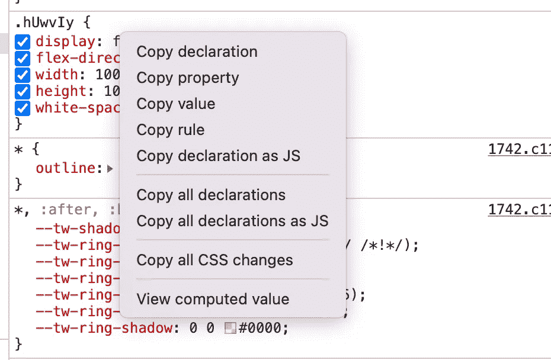
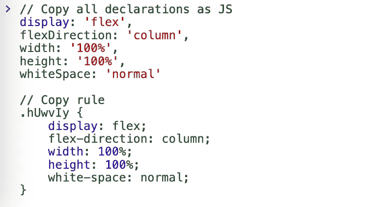
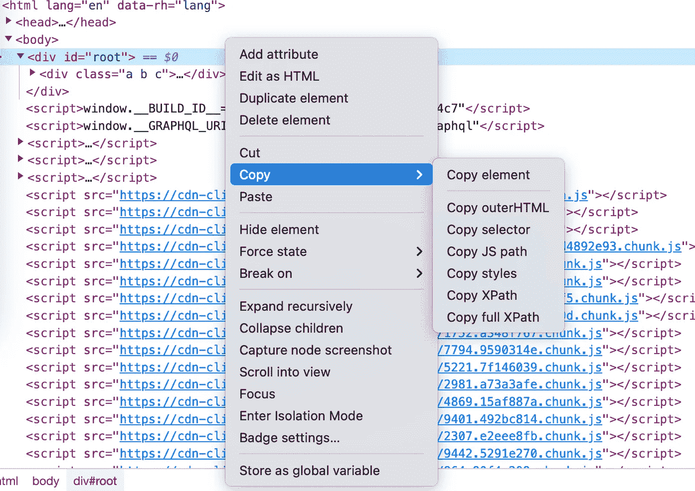
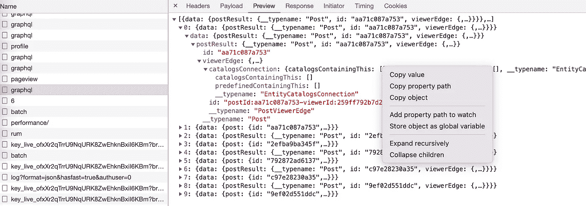
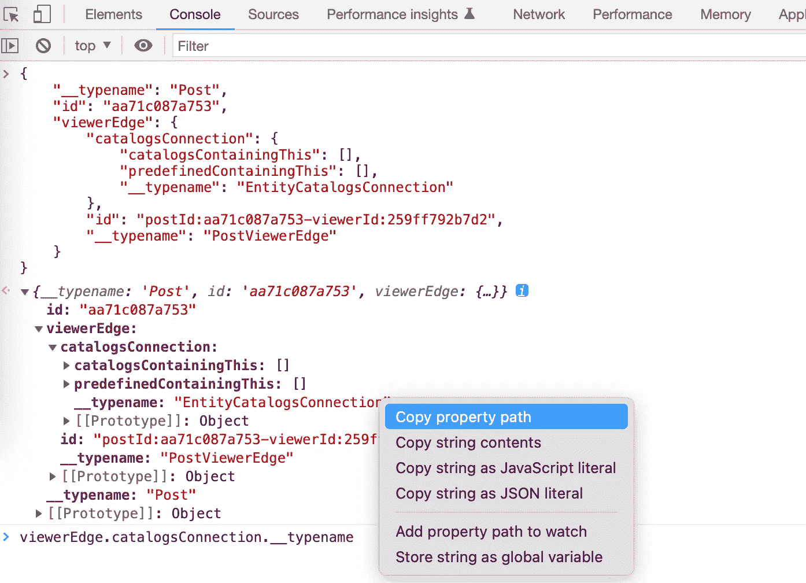
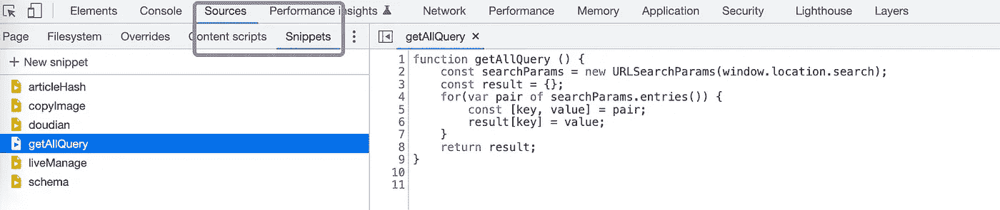
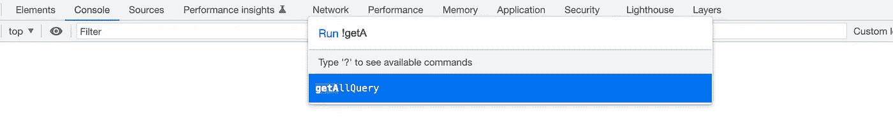
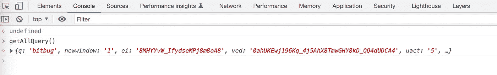
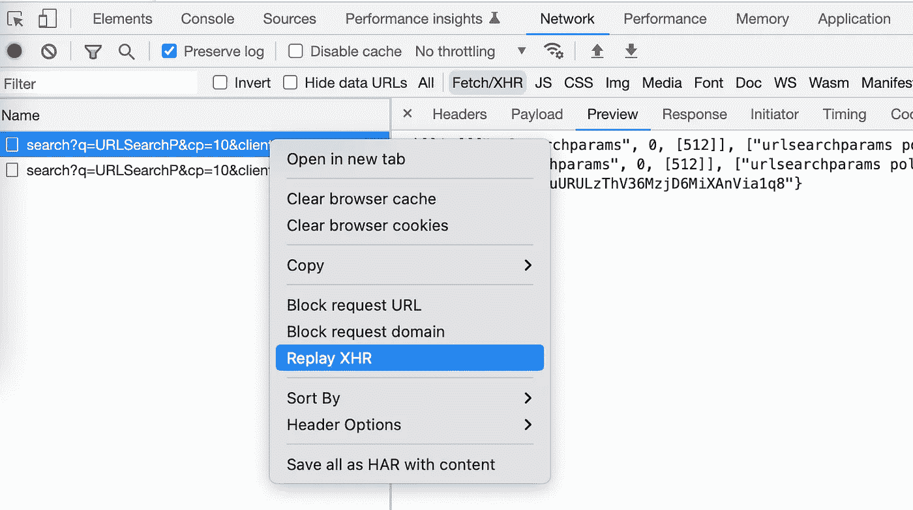

# 3 个 Chrome DevTools 提示帮助你提高效率

> 原文：<https://javascript.plainenglish.io/3-chrome-devtools-tips-to-help-you-be-more-efficient-d1843dbc1205?source=collection_archive---------6----------------------->

## 3 Chrome DevTools 提示:复制数据、代码片段和重复请求。

# 技巧 1:复制数据

我开发网页的时候，习惯用 VS 代码完成核心功能，然后用 Chrome DevTools 调试页面，比如修改页面的样式，节点属性等。然后需要将修改后的内容复制到源代码中。

如果您正在复制 CSS 内容，请右键单击样式表。

您可以复制 CSS 规则或声明，甚至可以将内容复制为 JavaScript 键/值对:

如果您正在复制 HTML 内容，请检查目标元素并右键单击该节点。

当你需要操纵 dom 或者获取 dom 节点信息的时候，比如写 UI 测试用例的时候，这是非常有用的。

如果你想从请求或控制台复制数据，右击 object/JSON 数据，你甚至可以复制目标的属性。

Copy data from request

Copy data from console

当我们需要一个 mock 时，这个操作可以很方便的获取数据。

# 技巧 2:代码片段

我们写代码的时候，经常会使用 util 函数来提高效率。在使用 chrome 时，我们可以将一些常用的操作保存为代码片段，比如解析 URL 的查询参数(如果不知道如何解析查询字符串，参考 [4 种从查询字符串获取值的方法| by bitbug](https://levelup.gitconnected.com/4-ways-to-get-value-from-query-string-f11034f06148) )。

通过“源”面板创建代码片段:

然后，我们可以通过使用快捷键`Command + P`打开命令菜单来运行代码，然后键入`!`字符，后跟代码片段的名称:

`press Command + P(Mac) and type !snippet`

然后我们可以执行我们定义的 getAllQuery 方法:

这是我用得最多的方式，你可以从[运行的 JavaScript 片段中了解更多——Chrome 开发者](https://developer.chrome.com/docs/devtools/javascript/snippets/)。

# 技巧 3:重复请求

你测试网页的时候填了很多表格信息，提交的时候后台服务报错，然后页面进入异常页面。如果你想再次提交，你必须重新填写表格数据。我经常遇到这种情况，我以前也是这样，这让我很不耐烦。我很幸运地知道，有一天我得知 Chrome DevTools 支持重复请求。

Repeat the request use Replay XHR

如果要使用此功能，建议您选择保留日志，以避免因页面更改而丢失请求日志。

# 结论

在这篇文章中，我给了你 3 个我经常使用的 Chrome DevTools 技巧:

1.  从 CSS 规则，HTML 元素，请求，控制台复制数据。
2.  您在控制台中重复运行的相同代码的代码段。
3.  需要多次提交时重复请求。

最后，希望对你有帮助。可以跟着我学习更多实用技能。

*更多内容请看*[***plain English . io***](https://plainenglish.io/)*。报名参加我们的* [***免费周报***](http://newsletter.plainenglish.io/) *。关注我们关于*[***Twitter***](https://twitter.com/inPlainEngHQ)*和*[***LinkedIn***](https://www.linkedin.com/company/inplainenglish/)*。查看我们的* [***社区不和谐***](https://discord.gg/GtDtUAvyhW) *加入我们的* [***人才集体***](https://inplainenglish.pallet.com/talent/welcome) *。*