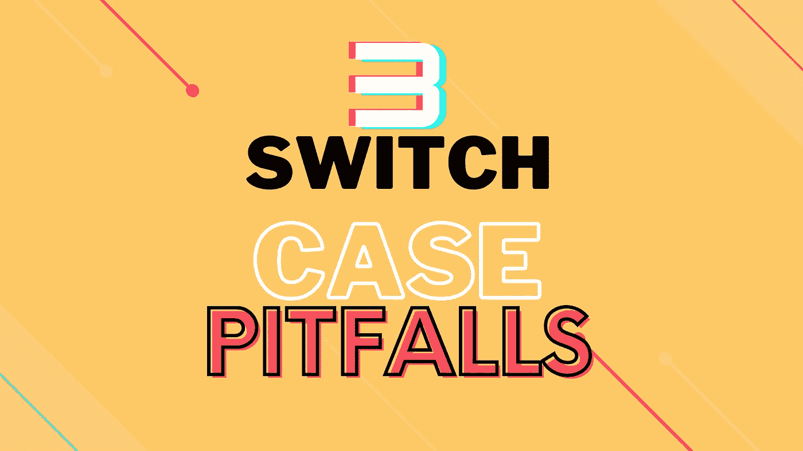

# JavaScript 的 Switch Case 的 3 个致命陷阱真的让初学者很烦

> 原文：<https://javascript.plainenglish.io/3-devastating-pitfalls-of-javascripts-switch-case-that-really-annoys-beginners-eed4f8fe11cb?source=collection_archive---------17----------------------->

## 掩盖导致逻辑错误的怪癖，但不要抛出错误

Art made by the [Author](http://www.arnoldcode.com) by [Canva](http://www.canva.com)

开关语句 ***看起来*** 很容易理解。

“似乎”是关键词。您需要了解一些关于 switch 语句的事情，以消除无声错误。没有数据类型转换。一旦有匹配，所有表达式将被执行，直到下一个`break`或`return`语句。最后，您可以为单个代码块包含多个案例。

只有当你知道这些怪癖时，你才能真正写出正确的、主要起作用的代码。

# 1.JavaScript 在比较大小写时不做松散的输入

Javascript 通常是一种[松散类型的语言](https://medium.com/front-end-weekly/the-essential-cheatsheet-javascript-vs-typescript-7a27ef187bdb)。

通常不需要数据类型声明。您可以轻松地更改数据类型并比较不同类型的值。数据类型无关紧要。在常规的`if`语句中，比较数据类型无关紧要(`==`)，除非您使用严格的比较(`===`)来专门检查数据类型:

然而，switch 语句中的`case`值存在例外。要使事例匹配，数据类型必须匹配。可以把它想象成包含`===`(严格相等)的`switch`语句，而不是用于`case`比较的`==`(相等)。

在上面的例子中，没有匹配，因为`555`和`'555'`不是相同的数据类型。

# 2.Break 或 Return 语句非常重要

switch 语句的行为发生了巨大的变化。

虽然不是必需的，但是如果您在 case 代码块中省略了`return`或`break`语句，一旦有匹配，所有的语句都将被执行。该程序持续到`switch`语句结束或下一个`break`或`return`语句。无论什么先来。

发生了什么事？

在第一种情况下有一个匹配，所以第一个控制台语句被正确显示。代码继续执行语句，直到它面对 switch 语句的结尾，一个`break`或一个`return`。由于`case555`中没有`break`，显示第二条控制台语句。

在`case444`中，整个语句由于`break`关键字而停止。

> 提示: [Switch Case 实际上是一个初学者练习，它会因为没有应用干净代码原则而使你的代码写得很糟糕。](https://towardsdatascience.com/dont-be-a-basic-coder-and-use-5-possibilities-to-avoid-the-bad-switch-case-c92402f4061?source=your_stories_page----------------------------------------)

# 3.单个区块的多个案例

我们可以扩展我们在陷阱 2 中学到的知识。

一旦有匹配，就执行每个语句，直到找到一个`break`或`return`。如果任何一种情况匹配，将执行以下示例中的控制台语句是有意义的。

这可能导致期望的或不期望的行为。在下面的示例中，您将只打印出一个匹配的案例。

获取 26 份备忘单，只研究你真正需要的东西，以获得你的第一份网络开发工作！

[Arnold Code Academy 26 Web Developer Cheatsheets](https://arnoldcodeacademy.ck.page/26-web-dev-cheat-sheets)

*更多内容请看*[*plain English . io*](http://plainenglish.io/)*。报名参加我们的* [*免费每周简讯*](http://newsletter.plainenglish.io/) *。在我们的* [*社区不和谐*](https://discord.gg/GtDtUAvyhW) *获得独家获得写作机会和建议。*