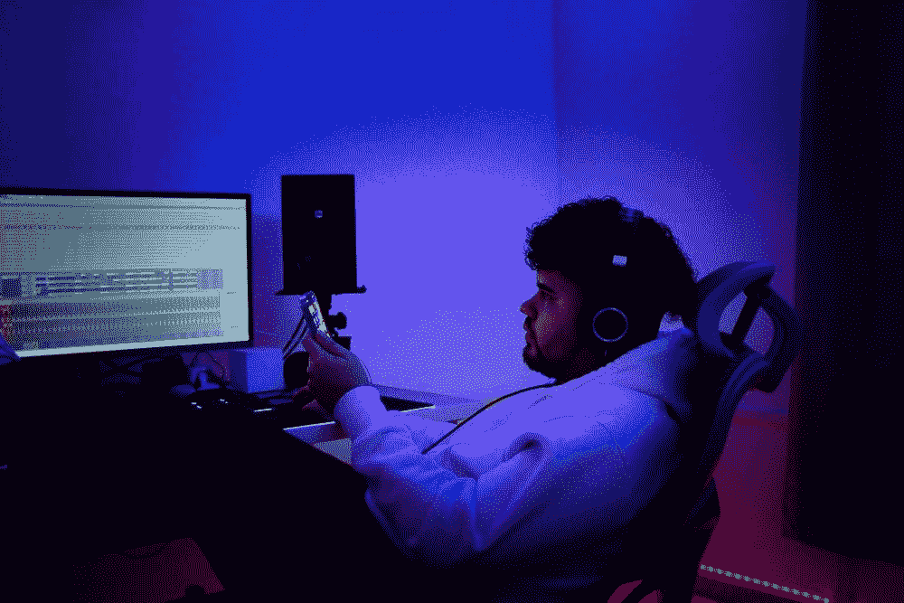

# 作为一名开发人员，你可以用 3 种奇妙的方法来保持工作积极性

> 原文：<https://javascript.plainenglish.io/3-fantastic-ways-you-can-use-to-stay-motivated-at-work-as-a-developer-43c40466cf1b?source=collection_archive---------14----------------------->

## 我经常用这个来保持更长时间的动力

Photo by [Siednji Leon](https://unsplash.com/@siednji?utm_source=unsplash&utm_medium=referral&utm_content=creditCopyText) on [Unsplash](https://unsplash.com/?utm_source=unsplash&utm_medium=referral&utm_content=creditCopyText)

在 IT 行业工作是一项令人兴奋的任务，但有时你的工作量会让你昏昏欲睡，没有动力。这是完全自然的，接受这个事实并不丢人。

有时我的老板给我额外的任务去完成，这扼杀了我的动力，让我感到懒惰。我的能量水平降到零。但是，你不能对工作说“不”,因为你的工作是定义你的东西，而你正以此谋生。

作为一名开发人员，以下是我在工作中经常用来保持积极性的三种方法

## 下一步是什么

我个人总是在想，完成这个任务之后，接下来会发生什么。这对我们的项目会有多么大的贡献，我的队友会多么感激。

这听起来有点奇怪，但实际上对我很有效。早些时候，我接到一个在客户网站上添加透明按钮的任务，花了我几个小时才完成。结果是惊人的。客户很高兴，和我一起工作的队友也很高兴，我的老板也对我的工作很满意。它激励了我。

想想当你完成它的时候会发生什么，会稍微激励你，会帮助你重新激励自己去做这件事。

## 给自己一个期限

让我们承认一个没有截止日期的任务会让你感到无聊。我见过很多朋友跳过没有提前截止日期的任务，这很大程度上取决于个人。

如果某个特定的任务需要完成，我个人会给自己设定一个假的提前截止日期。在我的脑海中有一个最后期限会给我动力去完成那个任务。

每当你觉得完成一项没有临近截止日期的任务很无聊时，你一定要试试这个方法。给自己一个更早的截止日期，看看你的思维如何变得专注，并在不失去任何动力的情况下完成任务。

## 尽情享受吧

我知道这是没办法的事，但是享受你的工作，对你的工作充满热情。这将确保你会保持动力，你会倾向于积极思考你所做的事情。

不要把它想成是很辛苦很无聊的事情。把你的工作想象成能让你兴奋的事情。如果你开始热爱你所做的事情，你将变得不可阻挡。

我最近开始享受我的工作，这极大地改变了我的工作方式。当我想到我的工作将会取得的成果时，我变得非常有动力。保持动力可以被认为是一种你可以实现的精神状态。

就是这样。我希望这是信息和激励。祝你的编程之旅好运！

关于我——我是*科技*和*自我提升的顶级作家；* [*点击这里*](https://aniketz.medium.com/) *阅读更多我的文章。*

如果你想购买 5 美元的中等会员， [*点击这里*](https://aniketz.medium.com/membership) (当你使用 [*这个链接*](https://aniketz.medium.com/membership) 购买中等会员，我会从你的会员费中抽取一小部分作为佣金，不需要你额外付费)。如果您想订阅我的电子邮件列表，请点击这里**。**

* [## 通过我的推荐链接加入 Medium-Aniket

### 作为一个媒体会员，你的会员费的一部分会给你阅读的作家，你可以完全接触到每一个故事…

aniketz.medium.com](https://aniketz.medium.com/membership)* 

*[**通过电子邮件获取我的文章点击这里**](https://aniketz.medium.com/subscribe) **|** [**购买 5 美元中等会员**](https://aniketz.medium.com/membership)*

**更多内容请看**[***说白了。报名参加我们的***](https://plainenglish.io/) **[***免费周报***](http://newsletter.plainenglish.io/) *。关注我们*[***Twitter***](https://twitter.com/inPlainEngHQ)*和*[***LinkedIn***](https://www.linkedin.com/company/inplainenglish/)*。加入我们的* [***社区不和谐***](https://discord.gg/GtDtUAvyhW) *。*****