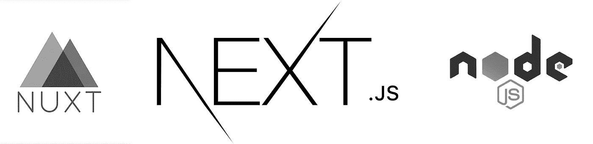
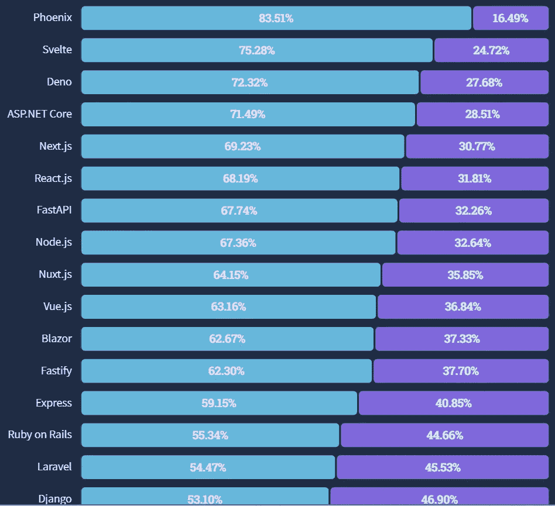
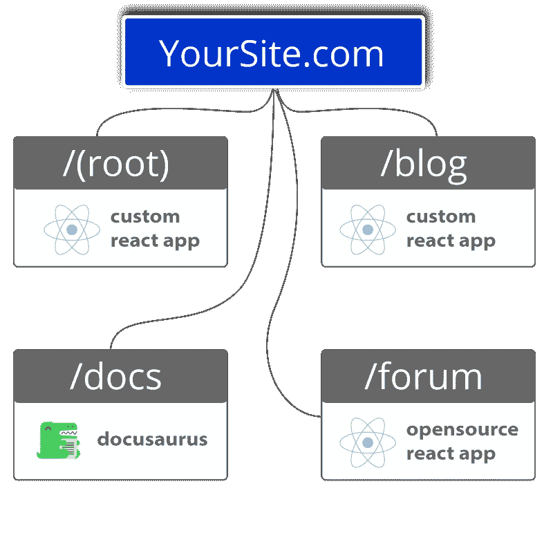

# 2022 年运行时开发者应该知道的 3 个 JavaScript 框架和 1 个

> 原文：<https://javascript.plainenglish.io/3-frameworks-and-1-runtime-developers-should-know-in-2022-4753be468bfa?source=collection_archive---------8----------------------->

## web 开发的世界是不断变化的。2022 年，有一堆新的、令人兴奋的工具供 web 开发人员了解和使用。

web 开发的世界是不断变化的。

对我们中的一些人来说，这正是吸引人的地方。我们喜欢走在前沿，了解接下来会发生什么，并告诉我们的朋友。

当具体谈到 JavaScript 框架时，它也是一个不断发展的世界，新开发的框架似乎每天都在出现。

正如 Fathym 首席执行官马特·史密斯在最近的一次会议上调侃的那样，“我忘记的框架比我知道的还要多。”

让我们一起来看看 2022 年你应该知道的四个新人。

# 你应该知道的 3 个较新的框架和 1 个运行时

首先，大多数开发人员都知道 React、Angular、Svelte、Vue.js，可能还有很多其他的。在创建新的网站、应用程序等时，他们可能会有一个最喜欢的。

回顾 2021 年，开发者命名的[最受欢迎的框架是 Svelte、](https://www.fathym.com/blog/articles/2022/april/2022-04-13-micro-frontend-popularity)，而 React 仍然非常受欢迎，其次是 Vue、Angular 和许多其他框架。

但是，当我们检查 StackOverflow 发布的 2022 年调查时，最受欢迎的名单中有很多新人。[领先的是 Phoenix Framework，刚刚挤掉了 Svelte，](https://www.fathym.com/blog/articles/2022/july/2022-07-13-ranking-javascript-frameworks-by-popularity-2022)紧随其后的是 Next.js 挤掉了 React，Node.js 和 Nuxt.js 的得分高于 Vue。

所以，让我们快速看一下这些新来者，他们是什么时候开始的，他们以什么而闻名。

# Next.js

## Next.js 是什么？

Next.js 是由 Vercel 的首席执行官 Guillermo Rauch 在 2016 年开发的，目前版本为 12.2，于 2022 年 6 月底发布。而 Next.js 实际上是在 Node.js 之上编写的，所以它要求你有 Node.js 才能和 Node Package Manager (npm)一起使用。

Next.js 的一个特性是它在服务器端和客户端的呈现方式，也称为“通用应用程序”这对它构建的单页面应用程序(SPAs)至关重要，它如何帮助这些 SPAs 在 SEO(搜索引擎优化)方面取得更大的成功。

正如 SEO 专家巴瑞·亚当斯在一篇媒体文章中对[的解释:](https://medium.com/@badams/another-very-late-response-youre-confusing-googlebot-the-crawler-with-caffeine-google-s-b9ef24d81524)

> 当您使用 React 而不使用服务器端呈现时，会发生的情况是，crawler 在第一个页面上就停止了，因为它看不到任何要跟随的超链接。它将页面发送到索引器，索引器随后必须呈现页面并提取超链接，这些超链接随后将被添加到爬虫的队列中。然后，爬行器将最终爬行下一组页面，并再次在那里停止，因为所有链接都是不可见的，直到 JavaScript 被呈现。所以它必须等待索引器返回一组新的要抓取的 URL。

用最简单的话来说:SEO 对于任何一个想通过谷歌搜索发现自己网站的人来说都是至关重要的，Next.js 在这方面提供了巨大的帮助。水疗很棒，因为它们快速、灵活、适应性强。但是 SPA 的一个主要缺点是，因为它们大部分是在客户端呈现的，所以当 Google 的爬虫寻找数据时，它们找不到任何数据，直到它们也被呈现在服务器端。

Next.js 呈现在客户端和服务器端:网站的部分或全部呈现在服务器端，因此 Google 的爬虫可以找到信息(URL、元标签和内容等)，并将其放入搜索结果中。

*“服务器端渲染(SSR)是一种流行的技术，用于在服务器上渲染通常只有客户端的单页应用程序(SPA)，然后将完整渲染的页面发送给客户端，”*geeksforgeeks.org[解释道。](https://www.geeksforgeeks.org/node-js-server-side-rendering-ssr-using-ejs/#:~:text=js%20Server%20Side%20Rendering%20(SSR)%20using%20EJS,-View%20Discussion&text=Server%2Dside%20rendering%20(SSR),SPA%20can%20operate%20as%20normal.)

请记住，Nuxt.js 和 Node.js 也在客户端和服务器端呈现。

为了帮助缩短加载时间并将代码分解成更小的块，Next.js 确实为开发人员执行了自动代码分割。

对于营销人来说，SEO 方面的提升是美妙的。对于企业主来说，由于 Next.js 中的许多预制组件，网站和应用程序的更快上市时间成为可能。此外，因为 Next.js 有助于制作静态网站，所以安全性得到了提高；也没有与数据库或用户数据的连接。

**next . js 的优势:**

*   在加载时间方面表现出色
*   加载时间有助于“延迟加载”和自动代码分割
*   对开发者的大量支持
*   奇妙的用户体验
*   更快上市

**next . js 的缺点有:**

*   一些开发者认为它太固执己见了
*   许多开发者抱怨 Next.js 的路由方式，其他人则支持它

# node . js

## Node.js 是什么？

Node.js 不是一个框架，但它是一个运行时。因此，开发人员在其上使用 React 和其他 JavaScript 框架。

React.js 仍然被认为是 JavaScript 框架方面的标准(有些人可能认为这是不切实际的),有很多开发人员知道如何使用它。Node.js 有助于使 React 更好。

就像 Next.js 一样(很可能是因为它构建在 Node.js 之上)，它的特殊之处在于服务器端的呈现。事实上，在 2009 年 Node.js 出现之前，没有 JavaScript 服务器端渲染，所以他们彻底改变了游戏。

除了极大地提高了单页面应用程序(SPAs)的性能，Node.js 还因为其他一些原因而受到欢迎。

最大的区别之一是它被认为是一个全栈框架。开发人员能够在 Node.js 中用 JavaScript 编写服务器端代码；这意味着一个开发人员可以很容易地编写前端(用 React)和后端。

[LinkedIn 在 10 年前对 Node.js 做了这样的事情，](https://www.infoq.com/news/2012/10/Ruby-on-Rails-Node-js-LinkedIn/)这帮助他们将服务器从 30 台减少到仅仅 3 台。最重要的是，前端工程师能够在后端编写代码，允许两个团队合并为一个。在这种情况下，从 Ruby on Rails 迁移到 Node.js 帮助 LinkedIn 获得了更好的性能，节省了开发时间和人力资源。

另一个巨大的好处是 Node.js 能够提供令人难以置信的高性能和即时可伸缩性。许多人参考了 [GoDaddy 对 Node.js](https://thenewstack.io/enterprises-embracing-microservices-node-js/) 的使用，这帮助他们每秒处理 10，000 个请求，而只使用了 10%的硬件。不仅如此，网飞还使用 Node.js 将启动时间从 40 分钟缩短到仅仅几秒钟。

Node.js 因其在后台与微服务协同工作的方式而备受推崇。微服务是小型的、独立的，通过 API 进行良好的通信。在前端，有微(或模块化)前端；这就是我们在 [Fathym 雇佣的人！](https://www.fathym.com/dashboard)

这意味着能够将你的网站分成更小的“路线”——通常是不同的页面——可以由个人或独立团队创建、管理和运营。模块化前端对开发者来说意味着更大的灵活性，更快地建立网站和简单的可扩展性。Node.js 在后端的微服务能力和 Fathym 的带 React 的微前端可能是天作之合。

**Node.js 优点:**

*   简单易学
*   简单可扩展
*   高性能
*   伟大的社区和支持
*   全栈开发
*   加载时间有助于“快速缓存”

**Node.js 缺点:**

*   仍然需要使用 React，因为它不是一个框架
*   不是一个很好的支持库
*   运行繁重的计算任务时，性能会受到影响
*   不稳定的 API

# Nuxt.js

## Nuxt 是什么？

Nuxt 是一个 JavaScript 框架，它在某种程度上类似于 Node.js，Nuxt.js 构建在 Vue.js 之上。它提供了一种更简单的方法来创建通用或单页 Vue 应用程序。

Nuxt 也类似于 Node 和 Next，因为这三者都承诺通过客户端和服务器端呈现的组合来提高 SPAs 的 SEO 分数。Nuxt 还因其在移动水疗中的出色表现以及给用户带来的体验而受到好评。

不过，让 Nuxt 与众不同的是，它能够生成开箱即用的静态网站。这对于那些希望尽快找到一个网站的人来说是一件大事。静态网站更简单，并不适合所有类型的网站，但它们可以用于只有几页的博客或只在一定时间内开放的推广网站。再说一遍，静态网站对安全性也很重要，因为它们不连接到服务器或任何信息。

Nuxt 做的另一件事是通过自动代码分割来缩小应用程序的大小。它们以 57kb 的轻量级大小出现。

那么，你为什么要使用 Nuxt.js 而不是 Vue.js 呢，它是建立在之上的？由于我们上面提到的原因，Nuxt.js 有助于构建更快、更高效的 Vue 应用。

**Nuxt.js 优点:**

*   spa 的 SEO 改进
*   移动应用性能
*   能够创建开箱即用的静态网站
*   静态站点同样具有很高的安全性
*   与 Vue.js 相比，企业就绪型
*   自动代码分割

**Nuxt.js 缺点:**

*   缺少通用插件
*   网站的高流量会导致服务器压力
*   调试很困难
*   背后的小社区

# 凤凰框架

## 什么是凤凰框架？

这里应该注意的是，虽然上面提到的其他三个都是用 JavaScript 编写的，但是 Phoenix 不是 JavaScript 框架，它是用另一种叫做 Elixir 的语言构建的。

Elixir 的 Phoenix 于 2014 年首次出现，但其当前的稳定版本(1.6.6)于 2022 年 1 月 5 日发布。Phoenix 被认为是高容量应用程序的最佳选择，因为它构建在 BEAM 之上，而 BEAM 是 Erlang 的 VM。这就是为什么 Adobe(协作工作流)、Discord(数百万用户和消息)、Moz (SEO analytics)等公司使用 Elixir 的 Phoenix。

Elixir 的语言被认为是一种“函数式编程语言”,这意味着更容易测试、调试和维护代码库。

然而，缺点是有一个非常大的学习曲线，因为它完全是一门新语言，而不是另一个 JavaScript 框架。继续说，与其他人相比，这里的社区要小得多，图书馆的生态系统也更小。

**凤凰框架优势:**

*   由于是“功能性”代码，易于使用，或者也易于阅读
*   可伸缩性很简单

**凤凰框架缺点:**

*   使用起来更加昂贵，因为你可能需要雇佣一个拥有长生不老药特殊技能的开发者
*   继续这个思路，开发人员也需要了解 Erlang
*   较小的社区，因为它比较新

# 结论，肥胖的宿主

事实证明，制作这些最新框架的人真的很关心 SEO，特别是帮助人们构建擅长 SEO 的单页应用程序。如前所述，Next.js、Node.js 和 Nuxt 都围绕着能够执行客户端和服务器端的渲染。这有助于谷歌更容易找到网站，这意味着可能会有更多的人访问。

除此之外，上面提到的多个框架还关注自动代码分割，以帮助构建轻量级、加载速度更快的网站和应用程序。

有没有最喜欢的 JavaScript 框架，您想专门用它来构建？您可以在 Fathym 开发您的网站，我们将利用我们的 Microsoft Azure 云进行托管。

或者，也许你想尝试一个新的框架？多个新框架？多个框架和一个无代码的站点生成器并存？多亏了 Fathym 的可组合架构，你可以在 **one** 网站上完成所有这些。

很惊讶，对吧？

[立即试用我们的模块化前端，免费注册！](https://www.fathym.com/dashboard)

Fathym 在一个域中部署、托管和集成您最喜欢的技术栈、框架、无代码构建器和数据。现在就在 Fathym 上部署和托管您的可组合前端项目。

*最初发表于*[*https://www.fathym.com*](https://www.fathym.com/blog/articles/2022/august/2022-08-29-three-frameworks-and-one-runtime)*。*

*更多内容请看*[***plain English . io***](https://plainenglish.io/)*。报名参加我们的* [***免费周报***](http://newsletter.plainenglish.io/) *。关注我们关于*[***Twitter***](https://twitter.com/inPlainEngHQ)[***LinkedIn***](https://www.linkedin.com/company/inplainenglish/)*[***YouTube***](https://www.youtube.com/channel/UCtipWUghju290NWcn8jhyAw)*[***不和***](https://discord.gg/GtDtUAvyhW) *。***