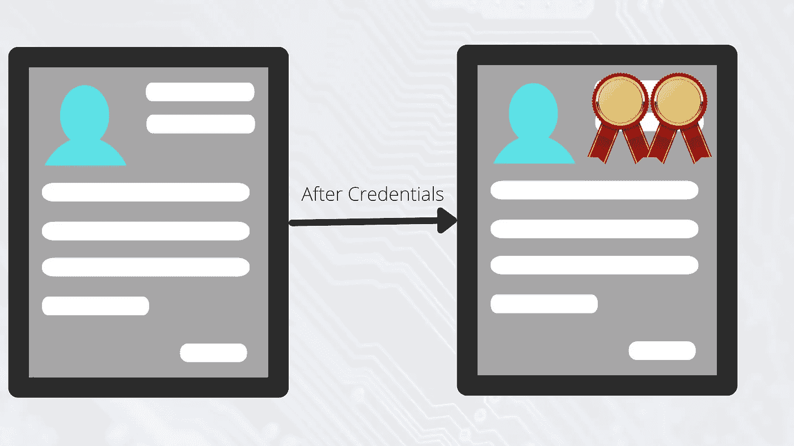
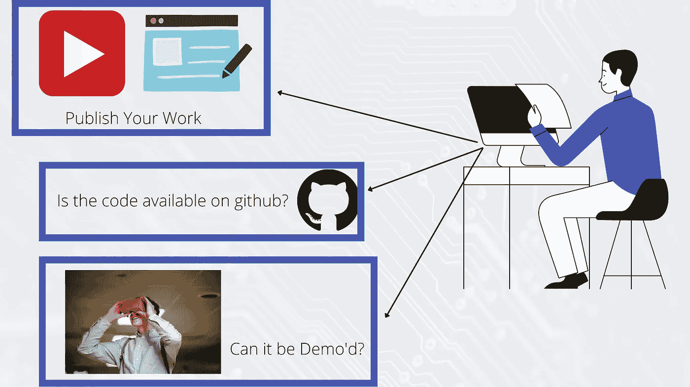

# 获得任何技术经验的 3 种劳动密集型方法

> 原文：<https://javascript.plainenglish.io/3-labour-intensive-ways-to-gain-experience-in-any-technology-91835068bcbe?source=collection_archive---------18----------------------->

## 不，证书不在其中。

Photo by [Bonnie Kittle](https://unsplash.com/@bonniekdesign?utm_source=unsplash&utm_medium=referral&utm_content=creditCopyText) on [Unsplash](https://unsplash.com/s/photos/hard-work?utm_source=unsplash&utm_medium=referral&utm_content=creditCopyText)

我并不反对认证，但除非它们能提供像 AWS 认证那样的真正价值，否则就是浪费时间和金钱。我在 Udemy 上在线购买了一些课程，但内容非常糟糕，即使在课程结束时获得了证书，我也必须观看一些 YouTube 视频才能真正理解基本概念。犯了几次错误后，我决定不再进行随机认证，而是想出一些替代方法来学习新技术，有两个主要目标，

1.  很好地理解概念，并有实际工作经验。
2.  自信地用新技能更新简历(如果需要)。

基于以上条件，这是我遵循的三个实践，我也推荐给你。

## 以正确的方式使用平台

使用 HackerRank 等平台获取经验，评估自己的理解。除了获取知识，还要关注这些平台提供的你的等级和徽章。计算出与你在这些平台上的经历相对应的平均分，并努力获得能帮助你脱颖而出的证书。展示一些徽章和良好的等级会让你的简历引人注目。

**优点** 1。免费使用
2。全行业认可

## 准备证实

另一种方法也是我个人最喜欢的方法——做一个有趣的项目。选择任何一种语言、框架或平台，用它来构建一个最小的产品。这种方法的最大好处是，它也为企业级项目做好了准备。

这里的主要挑战是向他人展示你的作品。你如何让招聘人员相信你在某某技术工具方面有实践经验？您可以做一些事情来为您的工作提供证据——在您的博客或 vlogs 中记录学习和过程，通过将其部署到某个地方或添加 Github 资源库的链接来添加对您工作的引用。

请记住，简历是招聘过程的第一步，如果你能证明你的工作经历，你的努力将被聪明的招聘者视为有效的经历。

**优点** :
1。伟大的学习曲线
2。开始自己创业的机会

## 用文字获得报酬

Photo by [Raffaele Vitale](https://unsplash.com/@raffaelevitale?utm_source=unsplash&utm_medium=referral&utm_content=creditCopyText) on [Unsplash](https://unsplash.com/s/photos/feedback?utm_source=unsplash&utm_medium=referral&utm_content=creditCopyText)

这三种方法中最困难的(就找到正确的作业而言)是这一种，我只做过一次。

做工作，并要求一份证明。

这种方法最适合网页设计，但我曾经为一家教育科技初创公司创建过微服务内容，所以我相信它在许多其他领域也是可行的，在那里你可以以他人为代价进行实践和实验，并获得真正的反馈。将推荐信添加到您的简历或 LinkedIn 个人资料中。

**优点:**
1。良好的学习曲线，
2。自由职业经历

## 结论

认证是获得经验和吸引招聘人员的另一种方式，但当涉及到学习或理解一项技术时，没有什么能胜过实践经验和解决问题。

请在评论中告诉我你的想法，以及你还有什么要补充的。

*更多内容请看*[***plain English . io***](http://plainenglish.io/)*。报名参加我们的* [***免费周报***](http://newsletter.plainenglish.io/) *。在我们的* [***社区***](https://discord.gg/GtDtUAvyhW) *获得独家获得写作机会和建议。*