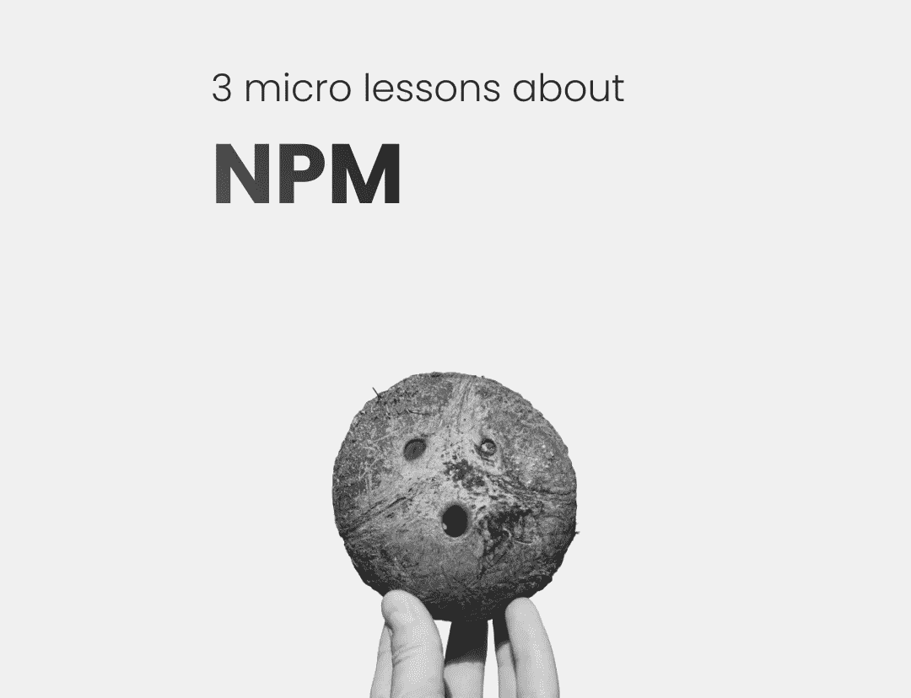

# 关于国家预防机制的 3 节微课

> 原文：<https://javascript.plainenglish.io/3-micro-lessons-about-npm-47759d85f18c?source=collection_archive---------16----------------------->

## 你会喜欢第三条。

Image made by author

> *你好，如果你想体验中等的自己，请考虑***我和其他所有的作家都通过注册成为* [***会员***](https://medium.com/@anton.franzen/membership) *每月 5 美元来保持独立写作的活力，* [***在这里注册；)***](https://medium.com/@anton.franzen/membership)*
> 
> *除了支持他人，Medium 还可以通过写作和在这里找到家的强大、积极参与的社区来支持你。*

*NPM 是一个出色的概念，它在 Node.js 的起飞和流行中发挥了重要作用，主要是因为它消除了重新创建轮子的需要。*

*如果有人已经构建了你需要的东西，你可以简单地免费安装这个软件，而不会有当时存在的 pr 现有包管理器的所有问题！*

*这极大地消除了进入壁垒，允许企业更快地生产产品，开发者更快地创建项目和工具。更多的将来自 npm。*

*不管怎样，让我们进入微课吧！*

# *1.新公共管理的诞生*

*在 2009 年，许多人在 Node.js 上工作，并构建了令人惊叹的附加组件、节点模块等等，但是没有简单的方法来将模块共享和下载到 Node.js 应用程序中。*

*你能相信吗？！现在，您可以从 npm 获得日期转换器，但当时并非如此。很可能你得自己写。*

*直到一个名叫 Isaac Schlueter 的人提出了让安装别人正在做的东西变得简单的想法，他决定这样做，并改变了我们所知道的世界——至少是我们作为 JavaScript 开发者所知道的世界🔥*

*因此，他着手建立我们今天所知的 npm。*

# *2.package.json 到底是做什么的？*

*可以说,`package.json`文件是 Node.js 应用程序中最重要的部分。*

*所以`package.json`是一个中心位置，用来配置你的应用程序如何交互以及如何运行。它是`package.json`文件，使你能够用 npm 运行脚本，下载包，发布到 npm 注册表等等。*

*当你安装软件包时，那些软件包和它们的版本将会列在`package.json`文件中，如果你将项目 t 移动到另一个服务器上，并运行`npm install`，那么将会安装列在`package.json`文件中的软件包*

*`name`字段定义了您的包的名称，因此当您发布到 npm registry 时，您在 name 字段中的任何内容都将是您的包的名称。*

*`scripts`字段接受一个带有属性的对象，当您想要运行该属性的值时，您可以引用该对象。*

# *3.您可以创建自己的 npm 包！*

*是的，而且超级简单！*

*我甚至可以在这里解释:*

1.  *创建 GitHub repo。*
2.  *克隆它，并在终端输入`npm init`，这个名字将成为你的包的名字。*
3.  *将您的 repo URL 添加到 package.json 中的 repo 字段。*
4.  *创建一个 index.js 文件，在其中编写一些代码并导出。*
5.  *在终端中登录您的 npm 帐户。*
6.  *现在我们准备出版它了！键入`npm publish`就可以了！*

*很明显，还有比这更多的内容，所以我会考虑在以后制作一个完整的教程来介绍如何构建和发布一个 npm 包！*

**你好，如果你想体验灵媒，请考虑注册成为* [***会员***](https://medium.com/@anton.franzen/membership) *【每月 5 美元】来支持我和所有其他作家，在这里注册；**

*除了支持他人，Medium 还可以通过写作和在这里找到家的强大、积极参与的社区来支持你。*

# *你可能也会喜欢:*

* [## 停止从糟糕的 React 教程中学习

### 不受欢迎的观点

javascript.plainenglish.io](/stop-learning-from-react-tutorials-that-suck-5e2031d9bdc7)  [## 回调 vs .承诺 vs .异步 Await:逐步指南

### 引擎盖下也有点。

better 编程. pub](https://betterprogramming.pub/callbacks-vs-promises-vs-async-await-a-step-by-step-guide-f93d13447604) 

*更多内容看* [***说白了就是***](https://plainenglish.io/) *。报名参加我们的* [***免费每周简讯***](http://newsletter.plainenglish.io/) *。关注我们* [***推特***](https://twitter.com/inPlainEngHQ) *和*[***LinkedIn***](https://www.linkedin.com/company/inplainenglish/)*。加入我们的* [***社区不和谐***](https://discord.gg/GtDtUAvyhW) *。**