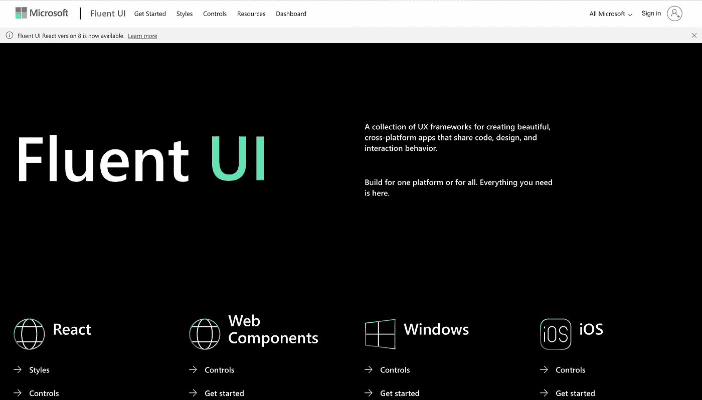
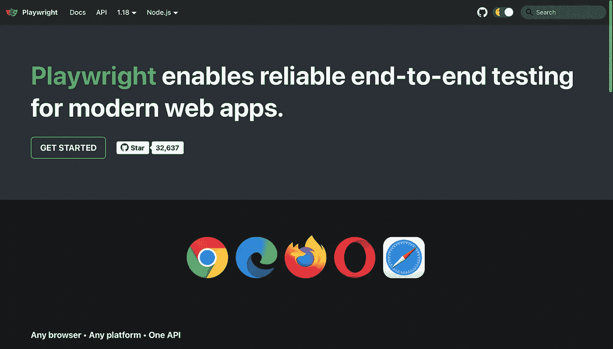
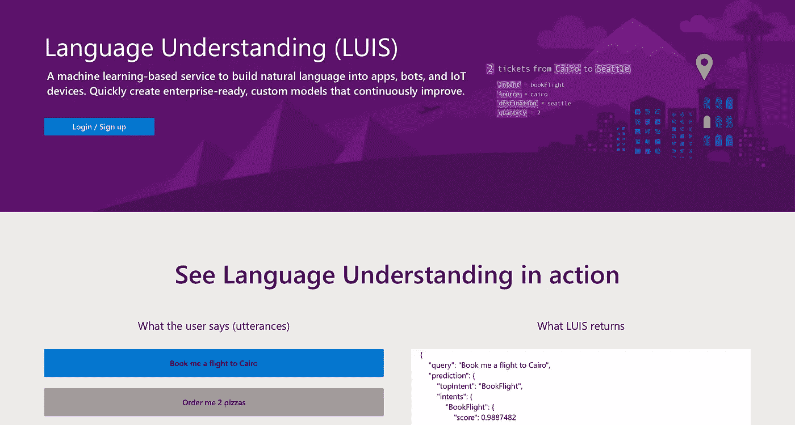

# 帮助开发人员节省大量时间的 3 个微软项目

> 原文：<https://javascript.plainenglish.io/3-microsoft-projects-that-have-helped-developers-save-tons-of-time-fce9432a852f?source=collection_archive---------24----------------------->

## 微软如何帮助开发人员创建令人惊叹的应用程序。

Photo by [Windows](https://unsplash.com/@windows?utm_source=unsplash&utm_medium=referral&utm_content=creditCopyText) on [Unsplash](https://unsplash.com/s/photos/microsoft?utm_source=unsplash&utm_medium=referral&utm_content=creditCopyText)

社区中的大多数开发人员都知道 VS 代码和 TypeScript。然而，这篇文章包含了一个由微软开发的鲜为人知的工具列表，你可以用它来构建你的下一个应用程序。它们快速、可靠，并被微软开发人员用于他们的工作流程中。

我知道开发人员讨厌在 Windows 上编写应用程序，但现在不会了。如果你知道如何使用 Windows 终端，你就会知道在微软 Azure Services 上创建和部署应用程序是多么容易。

但如果你喜欢在 Mackbook 和 Linux 上开发应用，我也不怪你。它们各有利弊。我也有一台 Mackbook，甚至不能考虑回到 Linux 或 Windows。

微软从多个渠道获得收入。众所周知，我可能不会去那里。它有大量的产品。但该组织不仅仅是创造和销售像 Office 365 这样的操作系统和数字产品，这些产品使人们的生活更加轻松。它为开发人员做了很多事情，帮助他们轻松地构建他们想要的应用程序。

就个人而言，如果你问我，我会说微软是帮助开发者用正确的工具开发应用程序的王者。我甚至觉得写下这些很愚蠢。他们有世界上最好的开发人员。是的，VScode 和 TypeScript 就是唯一的例子。问任何一个开发者他最喜欢的代码编辑器？他会马上说 VSCode。问问 web 开发人员更喜欢编码 JavaScript 还是 TypeScript？他们会说打字稿。

但是说到网络，他们在 Github 上有大量开源的好项目。开发人员可以使用这些框架和库来构建他们的应用程序。

尽管该行业的大多数开发人员都非常了解这些技术，但许多人仍然不知道，因为社交媒体上没有关于这些项目的宣传。至少在我写这篇文章的时候没有。因此，我决定写这个帖子。我希望它能在开发者社区引起轰动。

# 1.FluentUI

screenshot

Fluent UI 是微软开发的一个开源的跨平台设计系统。当涉及到构建多个应用程序时，设计师和开发人员需要学习并提出一个标准和固定的设计来定义组件。流畅的 UI 是微软处理 UI 的方式。可能替代材料设计。

如果你发现微软应用的用户界面很吸引人，你一定要看看这个项目。对于 web，它作为一个流畅的 UI React 包提供给使用 React 和 Fabric core 的开发人员。

安装所有的 API，开始像微软一样构建 UI。

[链接到流畅的用户界面](https://www.microsoft.com/design/fluent/#/)

# 2.剧作家

screenshot

如果你认为微软不关心测试，那么你可能错了。剧作家是现代网络的端到端测试库。它有 Python、JavaScript 等版本。这是一个你不能错过的轻量级库。如果你问我，我会说它比网上的测试框架好十倍。

[链接到剧作家](https://playwright.dev/)

# 3.路易斯。人工智能(认知服务的一部分)

screenshot

LUIS 是微软认知机器学习工具包的一部分。把它想象成在你的应用中创建一个聊天机器人或类似 Siri 的功能(文本)。

这是一种基于机器学习的服务，可以在您的 web 和移动应用程序中构建和集成自然语言。自然语言理解，实体提取，它做所有的事情。如果您想在不了解“自然语言处理”的情况下集成 NLP，那么您必须查看这个项目。

[链接到路易斯](https://www.luis.ai/)

# 结论

尽管微软包含了大量不同的项目来帮助开发者完成他们的日常工作，但以上是我最喜欢的三个。

所以，作为一个 DIY，我请你做一些挖掘，让我知道你最喜欢的微软项目。你知道他们有很多。但是你试过吗？或者你还在等待一家创业公司用他们的工具建立一家公司，然后你会尝试做同样的事情？

**感谢你花时间阅读这篇文章。我希望你喜欢它。**

请在评论区告诉我。我很乐意和你谈谈。

如果你喜欢这篇文章，我相信你也会喜欢我的其他类似文章。点击链接查看相同内容。

[卡兰·贾戈塔](https://karanjagota.medium.com/?source=post_page-----fce9432a852f--------------------------------)

## 编程和开源

[View list](https://karanjagota.medium.com/list/programming-and-open-source-483d80defa76?source=post_page-----fce9432a852f--------------------------------)7 stories

*更多内容看* [***说白了。报名参加我们的***](http://plainenglish.io/) **[***免费周报***](http://newsletter.plainenglish.io/) *。在我们的* [***社区不和谐***](https://discord.gg/GtDtUAvyhW) *获得独家获取写作机会和建议。***