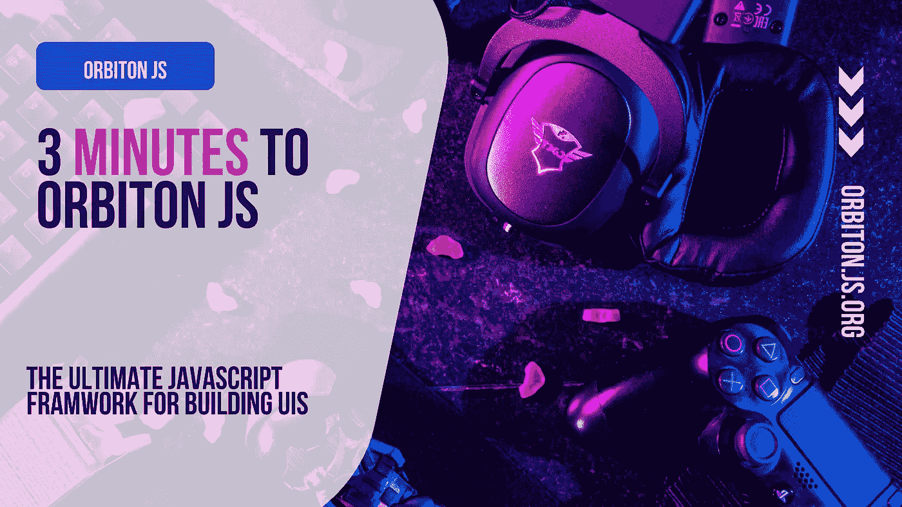

# 3 分钟到达 Orbiton JS——终极 JavaScript UI 库

> 原文：<https://javascript.plainenglish.io/3-minutes-to-orbiton-js-the-ultimate-javascript-ui-library-7edda3fdb167?source=collection_archive---------21----------------------->

## Orbiton JS 简介，构建用户界面的终极 JavaScript 框架。



众所周知，web 框架的兴起改变了 web 开发。它使得将网络概念移植到其他平台成为可能，比如像桌面一样的移动平台。由于专注于 JavaScript 的前端开发，React、Vue.js 和 Angular 等库在 UI 开发中发挥了巨大作用，并占据了开发人员基础的最大部分。但是这正在改变，像 Svelte JS 这样的新库正在引入编译框架这样的新概念。

说到新的，Orbiton JS 的出现了。这是一个用于构建 UI 的新 JavaScript 库，被称为“构建用户界面的终极 JavaScript 库”。

Orbiton JS 最初是一个来自 Media JS NPM 包的渲染引擎，该包用于在网站中使用内置的 HTML 媒体元素。它最初被称为 Pearl JS，但由于 NPM 的命名冲突，它被重新命名。Orbiton JS 是新的，伴随着 web 开发世界的最新趋势。它是根据概念构建的，这些概念包括性能、大小、可移植性和易于被社区采用。我来详细解释一下。

Orbiton 主要关注性能，为了实现这一点，核心团队根据不同的 JavaScript 引擎(如 V8 和 Gecko)编译和运行 JavaScript 的方式编写代码，试图利用尽可能少的内存。Orbiton 的单向数据绑定也确保了一切都是模块化和快速的。尽管 Orbiton JS 利用了虚拟 DOM，但它使用了一种保持快速操作的架构来防止应用程序中的长循环。为了将性能保持在最高水平，该团队正在开发一种新的渲染器，该渲染器内置于 Rust 中，并编译为 web 程序集，这将成为游戏规则的改变者，并将使性能更加出色。

Orbiton 团队还试图将 Orbiton 保持在一个非常小的大小，核心包加上 DOM 渲染器只有 11KB，这几乎等于没有 ReactDOM 的 React 核心包的 120KB 以上。Orbiton 通过使用干净的代码和防止不必要的操作来实现这一点。说到可移植性，Orbiton 的核心包是用通用 JavaScript 编写的，可以在所有 JavaScript 环境中运行，无论是 Node.js、Deno 还是浏览器。

这使得你可以在任何平台上运行 Orbiton，Orbiton 的概念是注册一个定制的渲染器，使得在任何其他平台上运行 Orbiton 成为可能，比如移动平台。Orbiton 的构建也是为了轻松适应 JavaScript 生态系统，让 Orbiton 开发人员可以轻松利用 webpack、babel 和其他工具等常见的 JavaScript 工具。为了存档，这个 Orbiton 有一套实用程序，像官方的巴别塔插件和 SWC 插件(即将推出),将 JSX 转换成 Orbiton 函数。

让我们也来探索一下 Orbiton JS 的一些令人惊叹的特性。Orbiton JS 使用了一个基于组件的系统，使得代码可以重用，构建 ui 也很容易。它也是用 TypeScript 编写的，因此与 TypeScript 的集成看起来很少，很容易发现错误。Orbiton JS 在本质上也与 state 等特性和 Proxy-binders 等其他提议的特性具有反应性。Orbiton 还创建了 Orbiton-server 包来支持 Orbiton 中的服务器端渲染。该团队还在主要版本中实现了其他令人惊叹的功能，如片段、错误边界、上下文、悬念、并流渲染、指令、惰性组件和门户。一些特殊的特性，比如代理绑定器也将被引入

说够了，让我们开始用 Orbiton 开发一些东西。正如我所说，Orbiton 使用 JSX，所以如果你熟悉 HTML 或 JSX 本身，你就可以去。为了快速上手 Orbiton，团队提供了一个[快速入门模板](https://github.com/Orbitonjs/template)。通过在终端中运行以下命令来安装模板:

```
npx degit[**Orbitionjs/template**](https://github.com/Orbitonjs/template)my-app
```

然后跑，

```
cd my-app
npm install
npm start
```

现在，您可以转到 index.js 文件并创建一个元素。在 Orbiton 中创建一个简单的元素很容易。

```
import Orbiton, {append} from “orbiton”;const Button = <button> Click Me</button>append(Button, document.getElementById(“root”)
```

因为这篇文章只是为了介绍 Orbiton，所以我不会详细介绍如何开发 Orbiton 应用程序。你可以访问[官方文档](https://orbiton.js.org/)了解更多关于 Orbiton JS 的信息。或者你甚至可以在 GitHub 上查看它的[源代码。让我们通过在 GitHub](https://github.com/Orbitonjs/orbiton) 上给它一颗[星，或者甚至可能在](https://github.com/Orbitonjs/orbiton) [Patreon](https://www.patreon.com/jimjunior) 上支持它的创建者，来展示这一令人惊叹的项目支持。好了，今天就到这里。

**注意:**Orbiton 背后的团队明确表示，Orbiton 只有在 2.0.0 版本发布后才能投入生产，否则它只是用于开发目的，但也可以用于生产，尽管不鼓励这样做。

在下一篇文章中，我将通过编写一些代码向您详细介绍 Orbiton。

*更多内容请看*[***plain English . io***](https://plainenglish.io/)*。报名参加我们的* [***免费周报***](http://newsletter.plainenglish.io/) *。关注我们关于*[***Twitter***](https://twitter.com/inPlainEngHQ)*和*[***LinkedIn***](https://www.linkedin.com/company/inplainenglish/)*。加入我们的* [***社区不和谐***](https://discord.gg/GtDtUAvyhW) *。*