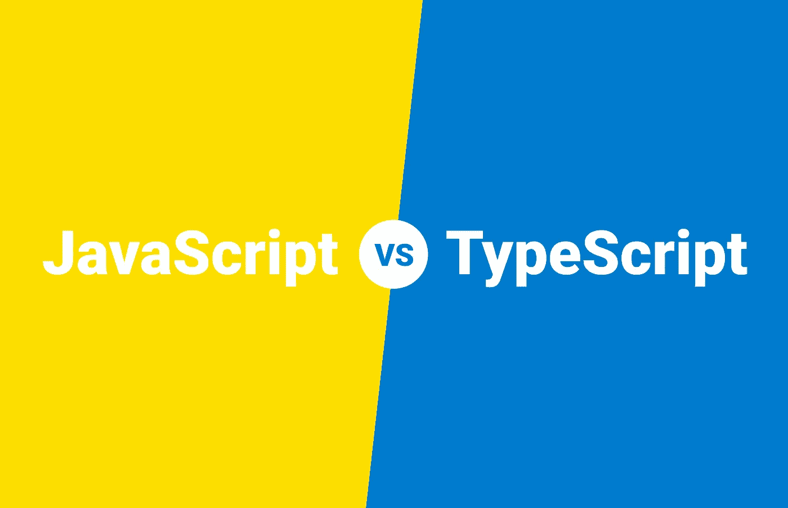
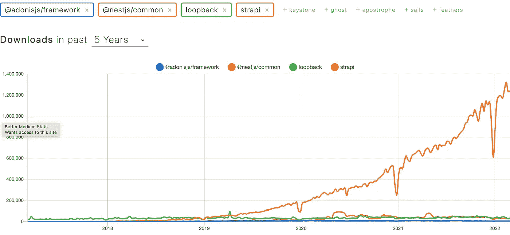

# TypeScript 优于 JavaScript 的 3 个原因

> 原文：<https://javascript.plainenglish.io/3-reasons-why-typescript-is-better-than-javascript-76443330f248?source=collection_archive---------5----------------------->

## 是时候停止在 TypeScript 上使用 JavaScript 了

在本文中，我想谈谈 JavaScript 和 TypeScript，以及如果您想使用 Node.js 或 Deno 应用程序，为什么应该选择 TypeScript 而不是 JavaScript。

# 什么是 TypeScript？

TypeScript 是一种建立在 JavaScript 基础上的强类型编程语言，为您提供了更好的工具。你可以说， **TypeScript 是 JavaScript** 的未来，因为它提供了接口、枚举、抽象类等特性。，这是其他面向对象编程语言的标准，但还不是 JavaScript 的标准。然而，TypeScript 已经包含了这样的特性，我们可以肯定 JavaScript 迟早会跟上。

TypeScript 是 JavaScript 的所谓的**超集**。你可以说 TypeScript 是 JavaScript，但 JavaScript 不是 TypeScript。因为 TypeScript 被编译成 JavaScript，而 JavaScript 被编译成机器码。

为了展示它与 JavaScript 的视觉差异，让我们创建一个名为 Car 的类。一次用 JavaScript 编写，一次用 TypeScript 编写。

## JavaScript 中的汽车类

JavaScript class

## TypeScript 中的汽车类

TypeScript class

所以基本上，你在这里看到的是类型和关键字如 public 和 private 的添加。现在你对 TypeScript 有了一些印象，让我们来谈谈 TypeScript 的一些关键特性。

# 选择 TypeScript 而不是 JavaScript 的三个原因

## **1。你有 Java，C#，C++背景**

如果你来自 Java、C#、C++等编程语言。，相比 JavaScript，您可能更熟悉 TypeScript。与这些高级编程语言相比，JavaScript 非常不同。您的代码的语法中没有类型。在运行时，JavaScript 是动态类型的，这增加了运行时出错的机会。不要误解我的意思。最终，TypeScript 仍然只是 JavaScript，这意味着 TypeScript 是动态类型的，但 TypeScript 也是预编译器。编译器会提醒开发人员与类型相关的错误。这导致早期的 bug 捕获和结构化代码。

您也可能熟悉类而不是原型，因为 JavaScript 是基于原型的。是的，从 2015 年开始 JavaScript 中就有了类，但是非常有限。相反，TypeScript 是基于类的，如 Java 或 C#。例如，如果您遵循所谓的可靠原则，那么在 JavaScript 领域中，TypeScript 就是您的选择。如果你想了解更多这方面的内容，请阅读我的文章，关于使用 TypeScript 的[坚实原则。](https://blog.bitsrc.io/solid-principles-in-typescript-153e6923ffdb)

## **2。静态和结构化类型**

如果您与多个开发人员一起开发大型应用程序，使用类型化编程语言可能会有好处。这意味着您会遇到更少的运行时错误，并且您必须编写更少的文档，因为类型本身就是某种代码内文档。其他贡献者通过简单地读取变量的类型、函数参数和函数返回来更好地理解您的代码。

当我们在 2019 年在我的公司从 JavaScript 迁移到 TypeScript 时，我们摆脱了许多测试用例，以防止 JavaScript 的动态类型系统导致的运行时错误。此外，由于从 JavaScript 到 TypeScript 的过渡，我们在实际的经过良好测试的代码中发现了一些错误，这在第一秒钟就留下了对 TypeScript 的一些确信和信任。

## **3。JavaScript 的超集**

正如我在他的文章中提到的，TypeScript 是 JavaScript 的未来，这不是因为类型，而是因为 TypeScript 提供的其他特性。TypeScript 支持面向对象的编程概念，如类、接口、继承、关键字，如 public、private、protected、types、enums 等。普通 JavaScript 中没有的东西。

Photo by [NEXT Academy](https://unsplash.com/@next_academy?utm_source=medium&utm_medium=referral) on [Unsplash](https://unsplash.com?utm_source=medium&utm_medium=referral)

# TypeScript 的缺点是什么？

当然，与 JavaScript 相比，你需要考虑一些缺点。首先，您需要意识到您需要了解所有这些差异，比如类型、关键字和预编译。但是如果你对普通的 JavaScript 和 Node.js 有经验，你会有一个很好的学习曲线。

# 什么时候不应该使用 TypeScript？

好吧，说到底，TypeScript 还是 JavaScript。如果你不依赖 JavaScript，那就值得为你的应用考虑一种完全不同的编程语言。说到 web 开发，还有很多其他不错的选择，比如 Java、Go、Rust、C#、Python 等等。不要误解我的意思，TypeScript 和 JavaScript 是很好的编程语言，即使对于后端来说也是如此，但也有缺点。

## 速度和可扩展性

JavaScript 是我到目前为止提到的其他编程语言中最慢的。大多数情况下，这对于 99%的 web 应用程序来说无关紧要，但是当涉及到可伸缩性时，更快的编程语言可能是更好的选择，比如 Go 或 Rust。

## 愚蠢的位函数

JavaScript 将数字存储为 64 位浮点数，运算符对 32 位按位操作数进行运算。因此，JavaScript 将数字转换为 32 位有符号整数，对其进行处理，然后再转换回 64 位 JavaScript 数字。这种连续的转换比将一个数字转换成一个整数花费更多的时间。这增加了运行脚本所需的时间并降低了它的速度。

## 运行时错误

我说过，JavaScript 是在运行时动态类型化的，TypeScript 也是。即使在 TypeScript 中更难产生这样的 bug，也不是不可能。这种机会越来越少。知道这个事实让我想，为什么不使用一种不同的语言，在类型和范式上更严格，比如 Go、C++或 Rust？通过选择更严格的语言来预防错误比发现错误更容易。

# TypeScript 最好的 Web 框架是什么？

现在有几个基于 TypeScript 的 web 框架，比如 [NestJS](https://nestjs.com/) 、 [AdonisJS](https://adonisjs.com/) 、 [Loop Back](https://loopback.io/) 等。但是只有一条路可走，在我个人看来，那就是 **NestJS** 。

自 2018 年年中以来，我一直与 NestJS 合作。Spring 框架极大地启发了它，所以如果你有 Java 或 C#背景，那就是你要使用的框架。Google 的 Angular 也启发了它，因为 NestJS 遵循基于依赖注入的模块化方法。

## 一些 TypeScript Web 框架的 NPM 趋势

如你所见，NestJS 自发布以来一直呈爆炸式增长。当我在 2018 年发现 NestJS 时，当时它在 Github 上有大约 6k 颗星，我起初很困惑，因为它是一个游戏规则改变者，但仍然不为人知。

Source: [NPM Trends](https://www.npmtrends.com/@adonisjs/framework-vs-@nestjs/common-vs-loopback-vs-strapi)

## 与 Java 的 Spring 框架的语法比较

我在这里保持它非常简单，但是这些简短的例子应该让你对 NestJS 和 Java 的 Spring 框架有一点印象。

**Spring 中的一个控制器(Java)**

Spring Controller (Java)

**同一控制器在 NestJS (TypeScript)**

NestJS Controller (TypeScript)

很相似，对吧？如果您想了解更多关于 nestj 的知识，我写了大量关于使用 nestj 的指南。这里只是其中之一:

 [## 用 NestJS (2022)在 TypeScript 中构建一个简单的 API

### 关于如何在 TypeScript 中构建 NestJS API 的简要指南

blog.bitsrc.io](https://blog.bitsrc.io/how-to-build-a-simple-api-in-typescript-with-nest-js-876386b29753) 

感谢您阅读我关于 TypeScript 和 JavaScript 的文章。我希望我可以更新你的知识，或者更好的是，你可以学到一些新的东西。查看我关于 TypeScript 和 Node.js 的其他文章。

干杯！

我希望你喜欢读这篇文章。如果你愿意支持我成为一名作家，考虑成为[一名灵媒](https://medium.com/@hellokevinvogel/membership)。每月只要 5 美元，你就可以无限制地使用 Medium。

想支持我？请给我买杯咖啡。

# 阅读关于 TypeScript 的更多信息

 [## 带打字稿的固体原理(2022)

### TypeScript 对用 JavaScript 编写干净的代码产生了巨大的影响。但是总有办法…

blog.bitsrc.io](https://blog.bitsrc.io/solid-principles-in-typescript-153e6923ffdb)  [## NodeJS &事件循环:不是单线程的

### Node.js、事件循环和多线程

blog.bitsrc.io](https://blog.bitsrc.io/node-js-event-loop-and-multi-threading-e42e5fd16a77) 

*更多内容请看*[***plain English . io***](https://plainenglish.io/)*。报名参加我们的* [***免费周报***](http://newsletter.plainenglish.io/) *。关注我们关于*[***Twitter***](https://twitter.com/inPlainEngHQ)*和*[***LinkedIn***](https://www.linkedin.com/company/inplainenglish/)*。加入我们的* [***社区不和谐***](https://discord.gg/GtDtUAvyhW) *。*