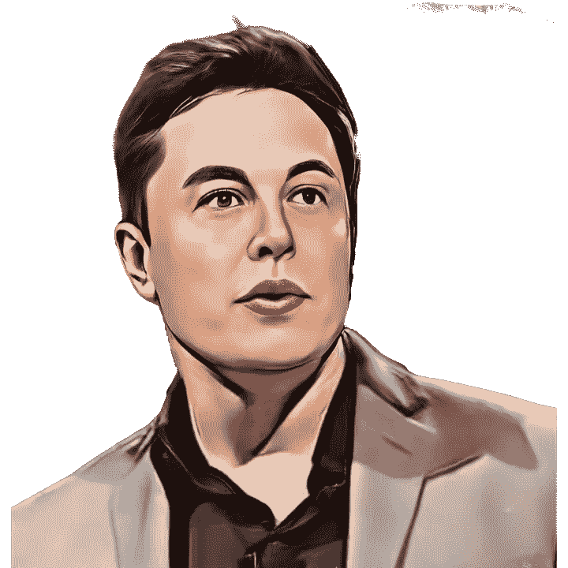

# 埃隆·马斯克关于成功生活的 3 条秘密规则

> 原文：<https://javascript.plainenglish.io/3-secret-rules-from-elon-musk-for-a-successful-life-a766f252e399?source=collection_archive---------6----------------------->

## 规则 3:永远不要试图成为领导者

[Pixabay](https://pixabay.com/illustrations/elon-musk-entrepreneur-businessman-6949267/)

埃隆·马斯克是目前地球上最富有的人，实时净资产约为 2200 亿美元。有成百上千的人视埃隆为偶像，并总是试图跟随他的脚步在各自的领域取得成功。

毫无疑问，埃隆·马斯克对许多人，尤其是新生代企业家来说是一种激励。

我最近看了大量对埃隆·马斯克的采访，记下了他分享的一些成功人生的规则。最令人震惊的是，这些规则非常容易，你不需要练习任何困难的练习来遵循这些规则。

## 规则 1:找到你的激情

我们都有一些共同点，但如何利用我们的共同点完全取决于我们自己。我们大多数人在开始职业生涯时，对自己的生活有一个完全空白的描述，就像一块白色的画布。

是的，像我们大多数人一样，你的生活完全像一张白色的画布，你完全可以随心所欲地涂上任何颜色。

因此，要在你的白色图纸上画出像样的部分，你需要找到你的激情。寻找激情是一件棘手的事情，我们大多数人都不知道自己真正的激情是什么。

我给你的建议是尝试不同的东西，这些东西会帮助你爱上一些东西，这种新的爱最终会加入你的激情清单。你可以先试着列出你所有的爱好，然后决定哪一个是你的爱好。

埃隆·马斯克一直对编程充满热情 ，这帮助他创办了价值数十亿美元的公司。

## 规则 2:停止追逐金钱

当你开始追逐金钱时，你就变成了一只仓鼠。为什么是仓鼠？因为仓鼠喜欢在仓鼠轮子里跑，同时看着他最喜欢的食物被捆起来。

由于我们的高智商，我们可以很容易地猜测，无论仓鼠多么努力地跑，他永远不会抓住那块食物，但仓鼠会继续跑，追逐它。

我们是人，不是仓鼠，所以离开你的仓鼠轮子。看世界，做你一直想做的事。 [*不要以为自己挣得少了*](/i-always-wanted-to-get-instantly-rich-from-my-programming-job-9044ada48156) 生活就惨了。

埃隆·马斯克(Elon Musk)在 2014 年的一次采访中表示，“这从来都不是钱的问题”。他想做的是实现他的目标，而不管他会从这些目标中得到多少钱。

你应该做的是把你的工作生活和个人生活分开。千万不要试图混淆它们。你想努力工作，然后你有一个具体的工作时间，在这个时间里你可以显示你的决心。

即使你试图在工作时间之外建立一个副业，你也不应该把 100%的个人生活投入其中。奉献时间和工作来实现你的目标。

## 规则 3:永远不要试图成为领导者

埃隆·马斯克(Elon Musk)曾在一次采访中表示，成为领导者的最佳人选是那些从未专注于成为领导者的人。

当你在职业生涯的早期努力成为一名领导者时，会发生什么？你会在意别人对你的看法。你会停止冒险。你将不再是你自己。

最终，你会知道你应该表明立场并成为领导者的正确时间。在那之前保持一致。

1999 年，Zip2 被一家名为康柏(Compaq)的公司以 2.07 亿美元收购，这使得埃隆马斯克在 21 世纪初成为百万富翁。电子港湾以大约 10 亿美元收购了 PayPal，埃隆马斯克是主要股东。

毫无疑问，大多数人会把这笔钱存在银行里，享受余生。但埃隆为特斯拉(它制造了大量问题，并在早期阶段面临严重损失)和 SpaceX(前三次发射都惨败)承担了风险。

曾经有一段时间，埃隆·马斯克(Elon Musk)面临巨大的财务危机，他向朋友借钱支付生活费。但是，他只是让他的公司在关键阶段存活下来。现在他是这个星球上最富有的人。

如果他只是关心人们会如何看待他的失败，那么他就不会取得现在的成就。

就是这样，希望你会发现它的价值和信息。此外，我相信有些要点会帮助你重新获得动力。

关于我——我是*科技*和*自我提升的顶级作家；* [*点击这里*](https://aniketz.medium.com/) *阅读更多我的文章。*

如果你想购买 5 美元的中等会员资格， [*点击这里*](https://aniketz.medium.com/membership) (当你使用 [*这个链接*](https://aniketz.medium.com/membership) 购买中等会员资格时，我会从你的会员费中抽取一小部分作为佣金，不需要你额外付费)。如果你想订阅我的电子邮件列表然后 [*点击这里*](https://aniketz.medium.com/subscribe) *。*

 [## 通过我的推荐链接加入 Medium-Aniket

### 作为一个媒体会员，你的会员费的一部分会给你阅读的作家，你可以完全接触到每一个故事…

aniketz.medium.com](https://aniketz.medium.com/membership) 

[**通过电子邮件获取我的文章点击这里**](https://aniketz.medium.com/subscribe) **|** [**购买 5 美元的中等会员资格**](https://aniketz.medium.com/membership)

*更多内容请看*[***plain English . io***](https://plainenglish.io/)*。报名参加我们的* [***免费周报***](http://newsletter.plainenglish.io/) *。关注我们关于*[***Twitter***](https://twitter.com/inPlainEngHQ)*和**[***LinkedIn***](https://www.linkedin.com/company/inplainenglish/)*。加入我们的* [***社区***](https://discord.gg/GtDtUAvyhW) *。**