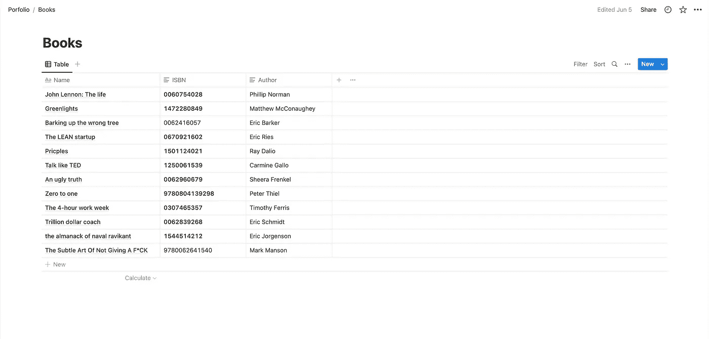
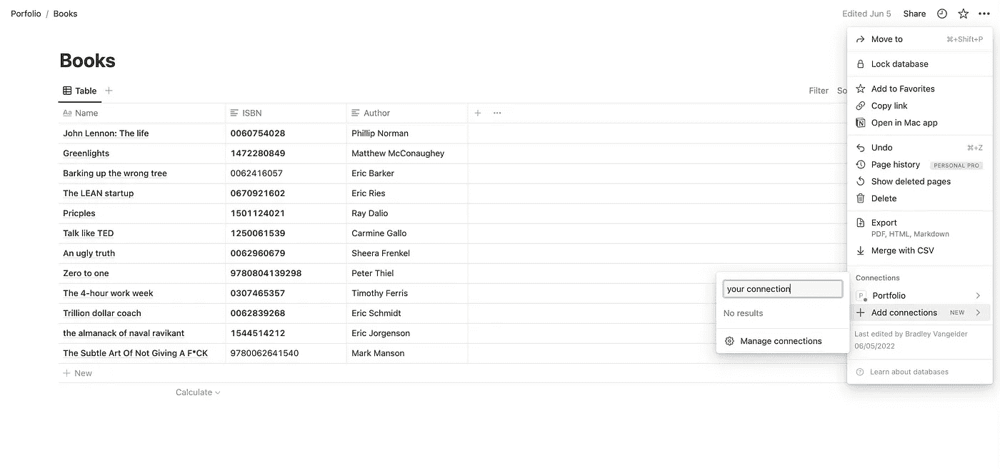

# 如何在应用程序中使用概念作为数据库的 3 个简单步骤

> 原文：<https://javascript.plainenglish.io/3-simple-steps-on-how-to-use-notion-as-a-database-in-your-application-e9c2ffb6d92d?source=collection_archive---------7----------------------->

## 使用概念作为应用程序数据库的 3 步指南。


# 你为什么要用概念作为数据库？

曾经建立过一个个人网站来展示你最珍贵的项目吗？那么你可能知道在你的 HTML 页面中添加新项目的痛苦。在把文章放到网上两天后，终于发现了一个拼写错误…

现在想象一下，把你所有的文本、图片等等都储存在 idea 上。使用移动应用程序，随时随地更改您想要的任何内容。更重要的是，无需更改任何代码或在项目文件中存储任何内容。

这就是观念的力量…

# 下面是你如何用三个简单的步骤来实现它

## 用概念中的内容创建表格

如果你还没有，在[notion.com](http://notion.com)上创建一个概念账户。

现在让我们创建一个集成，这样我们就可以利用概念 API。首先，去 notion.com/my-integrations 的。并创建一个新的集成。单击提交，然后确保复制“内部集成令牌”并将其保存在安全的地方。

之后，我们将为自己创建一个新页面，并向其中添加一个新表。选择“新建数据库”选项。然后设置您的表格标题并放入您需要的数据。在这个例子中，我正在用我在[我的网站](https://bradleyvangelder.com/)上推荐的所有书籍创建一个数据库。



现在，确保在切换下拉菜单时，通过“add connection”选项卡将带有新表的页面添加到您的新集成中。这将使您能够从我们将在稍后阶段设置的客户端访问该表。



## 安装 NPM 软件包

```
npm install @notionhq/client
```

这个 SDK 是将客户端用于概念 API 的最佳和最简单的方式。

## 在您的代码中实现它

在安装了包并配置了数据库之后，您现在应该能够添加从表中检索所有内容的代码了。

你还记得刚才我们必须保存的“集成令牌”吗？我们现在就需要！因此，请确保创建一个环境文件，您可以在其中存储保存令牌的变量。然后用这段代码初始化我们的客户端。

我们联系上了，现在让我们夺取所有的金子！我是说我们的数据。

转到新表所在的页面，复制数据库 id。再次将这个 id 存储到环境变量中。

```
https://www.notion.so/{our-database-id}
```

最后，我们可以查询我们的数据库。

您的返回类型将是一个列表，因此映射它将是必要的。在下面的例子中，我将鼠标悬停在图书信息上，并将其映射到一个比以前更容易阅读的新数组。

瞧，你马上就可以访问你的概念数据库数据了！下面是我用概念的 API 的力量所做的。


# 结论

剧透警报概念不是 PostgreSQL 服务器。修卡！

concept 非常适合于设置数据库过于繁琐的情况。例如，我用它在我的[个人网站](https://bradleyvangelder.com/)上创建了我的“书籍推荐”版块。

最重要的部分是，它是免费的，快速的，轻量级的！

*如果你在实现这一点上有任何问题，请务必在* [*Twitter*](https://twitter.com/bradvangelder) *或*[*Linkedin*](https://www.linkedin.com/in/bradley-vangelder-26a3aa1b0/)*上联系我。*

*更多内容请看* [***说白了就是***](https://plainenglish.io/) *。报名参加我们的* [***免费每周简讯***](http://newsletter.plainenglish.io/) *。关注我们关于* [***推特***](https://twitter.com/inPlainEngHQ) ，[***LinkedIn***](https://www.linkedin.com/company/inplainenglish/)*，*[***YouTube***](https://www.youtube.com/channel/UCtipWUghju290NWcn8jhyAw)*[***不和***](https://discord.gg/GtDtUAvyhW) *。对增长黑客感兴趣？检查出* [***电路***](https://circuit.ooo/) *。**