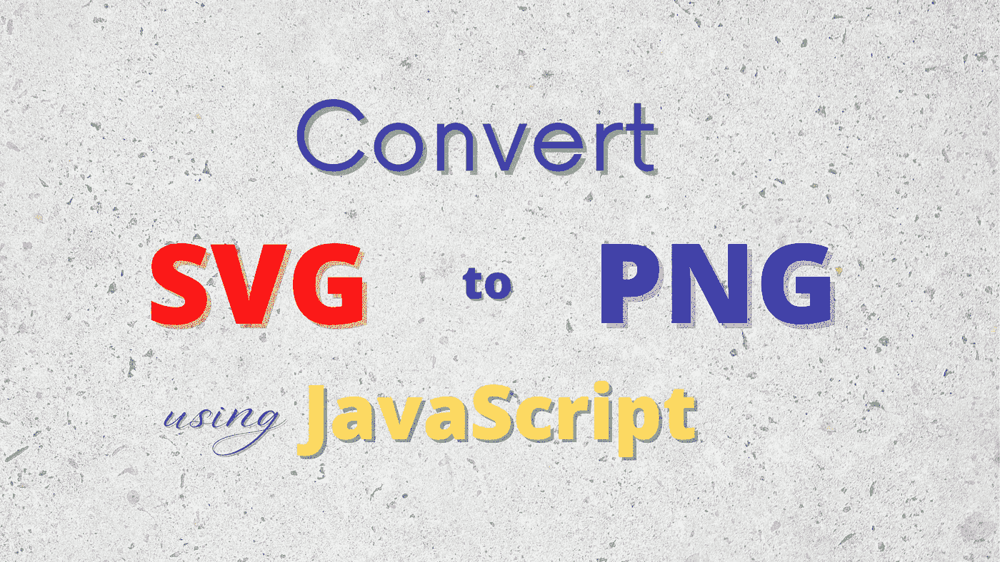
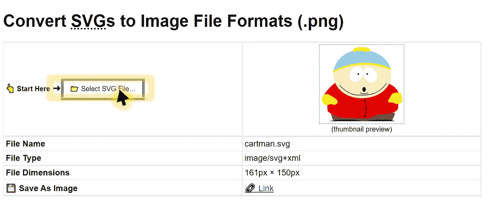
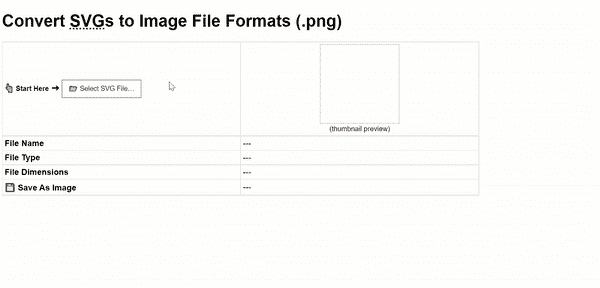

# 将 SVG 转换为图像文件格式的 3 个步骤。PNG)

> 原文：<https://javascript.plainenglish.io/3-steps-to-convert-svgs-to-image-file-formats-png-in-javascript-5394bf837185?source=collection_archive---------1----------------------->

## 包括完整的源代码和用例演示。



在大多数情况下，任何工作场所的任务都需要在日常工作中使用数字技术。因此，基于网络的免安装工具的出现，从[在线编辑 PDF 文件](https://smallpdf.com/edit-pdf)到[思维导图工具](https://www.mindmup.com/)，无疑为许多行业和领域的工作者提供了许多便利。

# 基本原理

然而，重要的是要认识到，由于以下(经常被忽视的)原因，属于我们社会关键部分的少数设置不能使用第三方在线资源:

*   实施严格的网络安全协议(禁止在线内容上传)
*   互联网连接差或不可用

> 因此，一个实用的解决方法是利用客户端 JavaScript 来实现所需的功能。

为了构建一个将 SVG(可缩放矢量图形)文件转换为 PNG(可移植网络图形)文件的工具，所需的 **3 个步骤**将如下所示。

# 实施细节

## 第一步。检索 SVG 数据内容

```
function readFileAsText(file) {
   return new Promise((resolve,reject) => {
      let fileredr = new FileReader();
      fileredr.onload = () => resolve(fileredr.result);
      fileredr.onerror = () => reject(fileredr);
      fileredr.readAsText(file);
   });
}
// Upload SVG file (.svg) file input
var uploadFile = document.getElementById('uploadFile');
uploadFile.addEventListener('change', async (evt) => {
   var file = evt.currentTarget.files[0];
   var svgStr = await readFileAsText(file); // XML String
   var svgData = new Blob([svgStr], {type: 'image/svg+xml'});
   var DOMURL = window.URL || window.webkitURL || window;
   var b64str = DOMURL.createObjectURL(svgData);
}, false);
```

**注意要点**

*   SVG 文件上传最初被读取为**明文**
*   然后，创建的 [Blob 对象](https://developer.mozilla.org/en-US/docs/Web/API/Blob)被编码为一个 [Base64 字符串](https://developer.mozilla.org/en-US/docs/Glossary/Base64)

## **第二步。在 HTML5 画布上渲染图像—第一部分&第二部分**

**部分 I.** 嵌入 HTML < img >元素

```
const loadImage = (url) => new Promise((resolve, reject) => {
    const img = new Image(); // alt: document.createElement('img')
    img.addEventListener('load', () => resolve(img));
    img.addEventListener('error', (err) => reject(err));
    img.src = url;
});
var _img = await loadImage(b64str);
var imgH=_img.naturalHeight; // original file height
var imgW=_img.naturalWidth; // original file width
```

第二部分。在 HTML5 画布上绘制图像

首先，当处理画布元素时，确保使用正确的缩放比例，以免渲染低分辨率图像(**重要！**)。

```
const scale = window.devicePixelRatio*2;
```

在声明了所需的像素密度之后，继续实例化 Canvas:

```
var _canvas = document.createElement('canvas');
_canvas.width=imgW;
_canvas.height=imgH;
var _ctx = _canvas.getContext('2d');
_canvas['style']['width'] = `${Math.round(imgW/scale)}px`;
_canvas['style']['height'] = `${Math.round(imgH/scale)}px`;
_canvas['style']['margin'] = '0';
_canvas['style']['padding'] = '0';
_ctx.scale(scale, scale);
_ctx.drawImage(_img, 0, 0, Math.round(imgW/scale), Math.round(imgH/scale));
```

**注意:** `_canvas['style']['height']`不等同于`_canvas.height`

## 第三步。生成下载链接

```
var dwnLink=document.createElement('a');     
// Note: fileName = original .svg filename     dwnLink.download=fileName.substr(0,fileName.lastIndexOf('.'))+'.png';
dwnLink.href=_canvas.toDataURL();
dwnLink.innerText='🔗 Link';
document.getElementById('downloadLink').innerHTML=dwnLink.outerHTML;
```

**测试应用程序**

*   样本 SVG 文件上传

*   HTML 界面



Image by Author | Minimalistic interface with file input and download link generated for selection

**完整演示**



Screencapture by Author | SVG file is uploaded and download link to .png image is generated


Image by Author | Output from the above demo (.png)

## 请随意在我的 GitHub 上检索上面的:[svg2png.html](https://gist.githubusercontent.com/incubated-geek-cc/f4de0fbdb1e8488f1ea7adc18ce66ebd/raw/0192b1076ffd73025115db6f615489d8024fbfbd/svg2png.html)或者亲自尝试[这里](https://incubated-geek-cc.github.io/svg2png/)！

## 个人评论

虽然 SVG 图像有其明显的优势，如调整大小和渲染时的响应速度和无损分辨率，但它通常更适合 web 图标设计*(参见下文)*。

[](https://medium.com/weekly-webtips/transforming-svg-files-into-symbols-for-svg-inline-use-no-internet-required-4cd7c9c84bae) [## 将 svg 文件转换为 svg 内嵌使用的符号(不需要互联网)

### 我这辈子都找不到一个 python 包来完成这项简单的工作——将 svg 图像转换成……

medium.com](https://medium.com/weekly-webtips/transforming-svg-files-into-symbols-for-svg-inline-use-no-internet-required-4cd7c9c84bae) 

然而，当处理高度详细的图形(如摄影)或常见平台(如在社交媒体上上传头像)时，更适合将数据嵌入到 PNG 光栅图像文件中，因为内容编辑相对**容易*** 且可用的支持平台范围更广。

***虽然 PNG 光栅图形是基于像素的，但是 SVG 文件通过复杂的数学算法呈现为 XML 输出**

现在你知道了！非常感谢你坚持到这篇文章的结尾！❤希望你觉得这个指南很有用，如果你想了解更多 GIS、数据分析& Web 应用相关的内容，请随时[关注我的 Medium](https://medium.com/@geek-cc) 。会非常感激—😀

— 🌮请给我买一份玉米卷🎀˶❛◡❛)

[](https://geek-cc.medium.com/membership) [## 通过我的推荐链接加入灵媒——李思欣·崔

### 获得李思欣·崔和其他作家在媒体上的所有帖子！😃您的会员费直接…

geek-cc.medium.com](https://geek-cc.medium.com/membership) 

# 创建 JavaScript 数字工具的更多教程:

## **视频编码**

[](/video-to-gif-conversion-with-client-side-javascript-decoding-fps-for-gif-bf96b8bc4d7c) [## 使用客户端 JavaScript 将视频转换为 GIF—解码 GIF 的 FPS

### 帧速率= FPS。检索视频的 FPS 和指定 GIF 的 FPS。包括完整的源代码实现。

javascript.plainenglish.io](/video-to-gif-conversion-with-client-side-javascript-decoding-fps-for-gif-bf96b8bc4d7c) 

## **图像相关内容**

[](https://medium.com/weekly-webtips/how-to-resize-an-image-using-client-side-javascript-and-html5-canvas-2fff73d15d0) [## 如何使用客户端 JavaScript 和 HTML5 Canvas 调整图像大小

### 输出图像保留其纵横比和分辨率。启用图像导出。包括完整的代码实现。

medium.com](https://medium.com/weekly-webtips/how-to-resize-an-image-using-client-side-javascript-and-html5-canvas-2fff73d15d0) [](https://towardsdatascience.com/build-an-image-pdf-text-extraction-tool-with-tesseract-ocr-using-client-side-javascript-6126031001) [## 使用客户端 JavaScript 通过 Tesseract OCR 构建图像和 PDF 文本提取工具

### pdf . js+tessera CT . js—OCR 和 Web 技术的融合。包括完整的代码实现。

towardsdatascience.com](https://towardsdatascience.com/build-an-image-pdf-text-extraction-tool-with-tesseract-ocr-using-client-side-javascript-6126031001) [](/how-to-encode-image-files-in-base64-with-plain-javascript-4927fa08e063) [## 如何用普通 JavaScript 在 Base64 中编码图像文件

### 代码实现&链接到离线工具包括在内。

javascript.plainenglish.io](/how-to-encode-image-files-in-base64-with-plain-javascript-4927fa08e063) 

## **本地 SQLite 数据库**

[](https://medium.com/weekly-webtips/read-export-sqlite-data-in-a-javascript-enabled-browser-locally-b655deda879d) [## 在本地支持 JavaScript 的浏览器中读取和导出 SQLite 数据

### 不需要设置服务器。独立于平台。只是🖱️双击 HTML 文件。包含完整源代码的链接。

medium.com](https://medium.com/weekly-webtips/read-export-sqlite-data-in-a-javascript-enabled-browser-locally-b655deda879d) 

*更多内容请看*[***plain English . io***](https://plainenglish.io/)*。报名参加我们的* [***免费周报***](http://newsletter.plainenglish.io/) *。关注我们关于*[***Twitter***](https://twitter.com/inPlainEngHQ)*和*[***LinkedIn***](https://www.linkedin.com/company/inplainenglish/)*。查看我们的* [***社区不和谐***](https://discord.gg/GtDtUAvyhW) *加入我们的* [***人才集体***](https://inplainenglish.pallet.com/talent/welcome) *。*