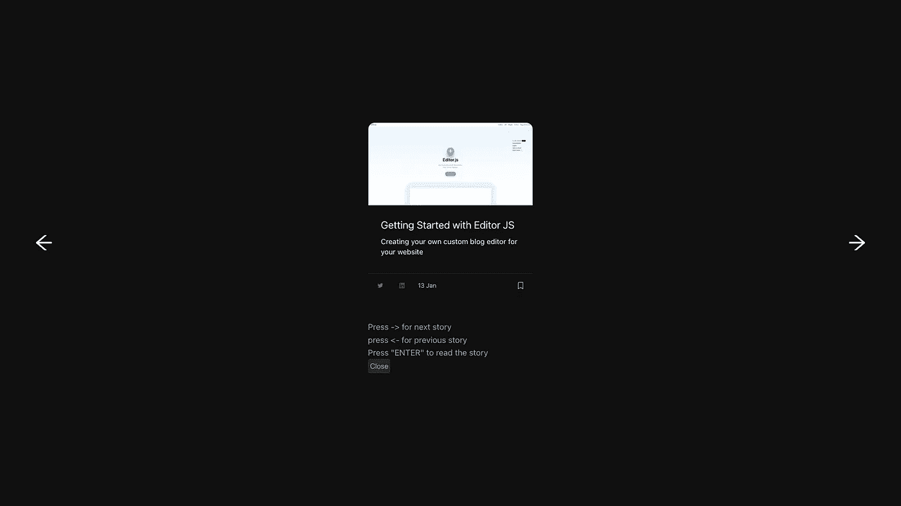

# 使用 react-spring 开发 Carousel 的 3 个步骤

> 原文：<https://javascript.plainenglish.io/3-steps-to-developing-a-carousel-dfd0bfe100da?source=collection_archive---------3----------------------->

## 使用 react-spring 开发一个 carousel 的指南，只需 3 个步骤



[iHateReading website carousel](http://ihatereading.in)

只需 3 个步骤，我们就可以为 react 应用程序开发定制的 carousel。我们将使用的库是 react spring，但您也可以使用帧运动或 react 过渡组。

## 第一步

安装反作用弹簧。最简单的步骤，使用纱线或 npm，我们可以安装反作用弹簧。

```
yarn add react-spring
```

## 第二步

在对象数组中添加轮播数据。制作包含转盘幻灯片的对象样本数组。你可以选择图像、文本和任何东西，只要把它们添加到一个对象数组中。

创建一个状态来跟踪活动项目，一次只显示活动项目，就像通用转盘或幻灯片一样。

```
const data = [{id: 1, title: ""}, {id:2, title:""}, {id, 3, title: ""}]
```

## 第三步

添加动画属性。react-spring 提供了`useTransition`钩子和`animated`包装器来帮助你添加动画。

定义`from`、`to`、`enter`等`useTransitions`属性添加动画。它们中的每一个都是不言自明的，这意味着连接到 useTransition hook 的每个元素都将经历以`from`开始、以`enter`结束的 3 种状态，并且当元素被卸载时将出现`leave`状态。

如果仍然很难理解，您可以查看代码库以获得更好的理解。

## 最终产品

这是最终的代码库和最终产品概述。

## 结论

下次见，祝你愉快。

继续发展！

我们的网站[iHateReading](https://www.ihatereading.in/)| |[Youtube](https://www.youtube.com/channel/UC6I-Tz6QwYbJpoIK7l0NtXA)| |[Twitter](https://twitter.com/treyvijay)。

*更多内容请看*[***plain English . io***](https://plainenglish.io/)*。报名参加我们的* [***免费周报***](http://newsletter.plainenglish.io/) *。关注我们关于*[***Twitter***](https://twitter.com/inPlainEngHQ)**和*[***LinkedIn***](https://www.linkedin.com/company/inplainenglish/)*。查看我们的* [***社区不和谐***](https://discord.gg/GtDtUAvyhW) *加入我们的* [***人才集体***](https://inplainenglish.pallet.com/talent/welcome) *。**