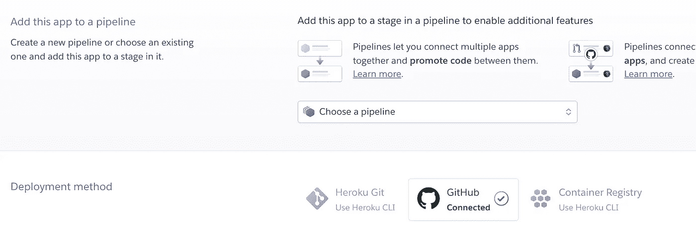
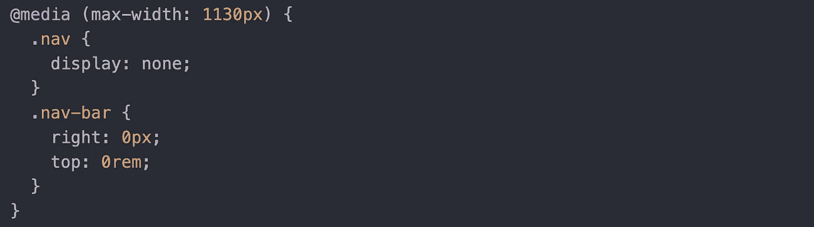

# 在编码训练营中他们可能不会教你的 3 件事

> 原文：<https://javascript.plainenglish.io/3-things-they-might-not-teach-you-in-coding-bootcamp-156c346df48b?source=collection_archive---------17----------------------->

## 训练营对开发者来说是无价的，但是他们不会教你所有的东西。

Photo by [James Harrison](https://unsplash.com/@jstrippa?utm_source=medium&utm_medium=referral) on [Unsplash](https://unsplash.com?utm_source=medium&utm_medium=referral)

你在考虑去编码训练营吗？有兴趣成为一名 web 开发人员吗？这是一条很好的职业道路，我可以强烈推荐训练营路线，我也是这么做的。如果你把工作投入进去，你在那里学到的东西是无价的，并且会为你的新事业做好充分的准备。

也就是说，他们不会教给你所有的东西。最有可能的是，你将学习一个前端框架、一个后端框架、一些基本的 Git、Bash 和 HTML，它们将使你了解如何定位一个 DOM 元素。

那么现实世界呢？你缺少什么来补充你的技能？

## **部署某物**

也许你喜欢做学校项目。也许你喜欢编码。但你知道什么比这些更好吗？炫耀有用的东西。如果你很聪明，在 bootcamp 中，你可能会设法在 Heroku 或 Netlify 上部署一个项目，但如果你还没有这样做，请把它作为首要任务。更好的是，买一个域名，即使它很便宜，并设置 DNS。在你的作品集网站和简历上看起来更好的是，一些带有链接的人物混搭是一个自豪地显示的. com。这将看起来像你为一个专业客户建立了一些东西，如果你因为缺乏专业经验而找不到工作，现在你有一些了。

## **不要忽视 CSS/让它对移动设备友好**

训练营通常关注你的编码能力。所有能让你的项目看起来不错的风格和东西都被掩盖了。如果你正在这里寻找一些快速升级，试试 SCSS。使用 react 项目很容易实现，并且您现有的 CSS 仍然有效，因此您可以随意使用。另外，学习媒体查询的基本知识。这对于让你的网站在多种设备上工作是至关重要的。如果你正在寻找一个这样的起点，我有一篇关于它的文章:[一个让你的网站移动友好的快速方法](https://medium.com/p/1b0b4926ec93)。在某种程度上，可以轻松地制作表格并在表格上操作数据。你很可能会在某个时候这样做。

Media queries can make your website look great on any device!

**日期和时间**

作为一名开发人员，在 Javascript 和任何语言中处理日期和时间通常是必须要做的事情。能自如地用吉他弹奏琴弦。切片并将它们重新组合成不同格式。试试像 Day.js 这样擅长处理日期和时间的库。如果您需要一个日期选择器，可以使用 React 的各种工具。如果你想要更灵活的东西，Datepicker.js 可以做很多。

## **不断学习**

这些只是你会发现在大多数大规模项目中和在你去开发工作的路上会派上用场的一些东西。因此，如果你是一名应届毕业生，或者正在考虑下一步该学什么，或者只是想学点新东西，这些都是一些想法。重要的部分是不断挑战自己，不断编码！