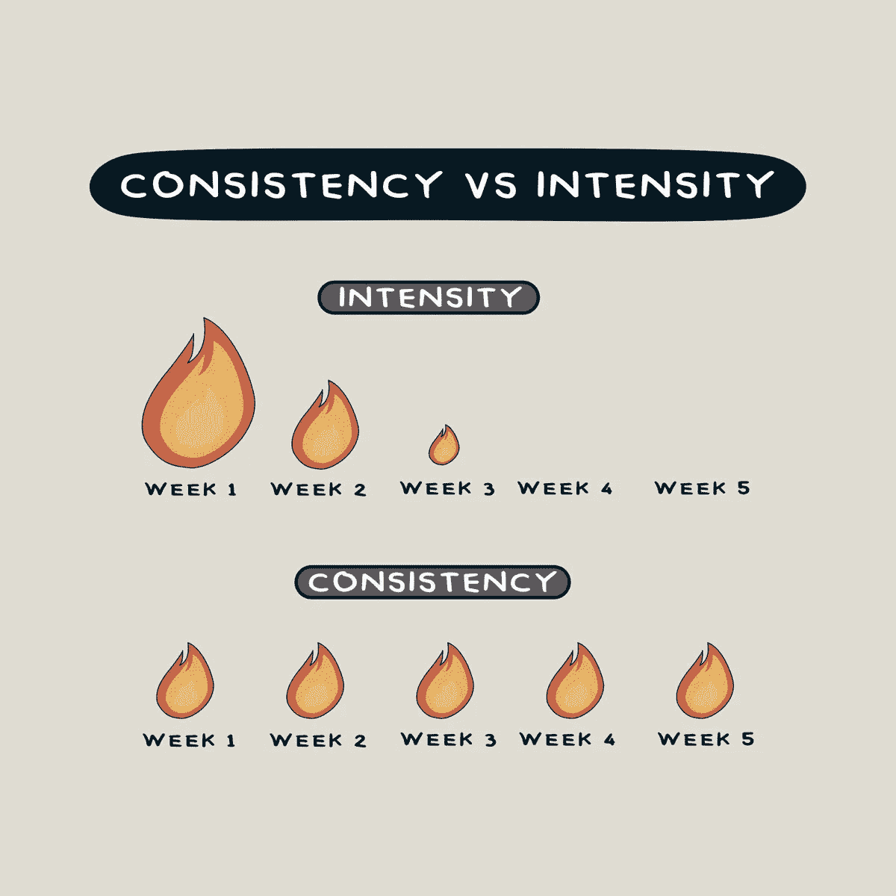

# 为了更好地掌握 JavaScript(和其他编程语言)，你应该做的 3 件事

> 原文：<https://javascript.plainenglish.io/3-things-you-should-do-to-be-better-at-javascript-and-other-programming-languages-aad0aa0e3a8a?source=collection_archive---------4----------------------->

## 要成为一名职业程序员，你应该:1。退出教程，请按 2。阅读他人的代码，& 3。保持一致性。

Photo by [Fili Santillán](https://unsplash.com/@filisantillan?utm_source=unsplash&utm_medium=referral&utm_content=creditCopyText) on [Unsplash](https://unsplash.com/s/photos/javascript?utm_source=unsplash&utm_medium=referral&utm_content=creditCopyText)

在 JavaScript 和每一种编程语言中，有许多技巧和事情需要注意，并且必须遵守。也就是说，如果你想成为一名专业的程序员，在每个项目中都取得成功，这三件事是必须的。

# 1.退出教程

教程是学习任何编程语言的好方法，甚至专业程序员也会看很多教程，但是如果你被困在“教程地狱”里，这个过程会变得更糟。那么什么是**“教程地狱”。**它是:-

> 永远不要脱离教程到不看教程就不能做任何项目的程度

不要看教程，你应该首先开始项目和编码，直到你不能再编码了，然后你应该看你卡住的那部分代码的教程，然后你将能够做更多的项目，而不用担心不能使它尽善尽美，最终你需要看的教程会减少一点。

# 2.阅读他人的代码

阅读他人的代码是理解该项目的概念和本质的一个很好的方式，如果不是最好的方式的话。然而，所有的程序员都不是完美的。一个专业的程序员可能做不出什么东西。一个人即使在他的职业中也不能理解所有的事情。

有时候，一个程序员的代码可能会教你如何编写那个项目的代码，即使是一个专业人员或一个教程也可能无法教你。因此，阅读他人的代码是一个很好的习惯，而且与普遍的看法相反，这并不是一件可耻的事情。这也有助于你在团队合作中培养耐心。

# 3.保持一致性

一致性是成功的最大要素，甚至不是在编程方面，而是在所有其他方面。那么什么是**【一致性】**？嗯，**【一致性】**就是每次都用同样的努力做一件事。这幅图总结了一致性的含义:

Consistency vs. Intensity

无论是编程、写书、学习，还是你想在生活中实现的任何事情，一致性都是必须的。它在生活的其他方面也比学习一些东西更有益，比如:如果你从工作中得到一份艰难或令人烦恼的工作，因某事感到沮丧，当你不应该辞职时感到有必要辞职，那么一致性将帮助你度过生活中的这些阶段。

我希望这三件事能帮助你实现编程和人生的目标。尽管如此，我希望你能通过这三个技巧获得成功，并且非常欢迎你为我以后的文章提出建议。

保重

再见。

*更多内容请看*[***plain English . io***](https://plainenglish.io/)*。报名参加我们的* [***免费周报***](http://newsletter.plainenglish.io/) *。关注我们关于*[***Twitter***](https://twitter.com/inPlainEngHQ)[***LinkedIn***](https://www.linkedin.com/company/inplainenglish/)*[***YouTube***](https://www.youtube.com/channel/UCtipWUghju290NWcn8jhyAw)*[***不和***](https://discord.gg/GtDtUAvyhW) *。对增长黑客感兴趣？检查* [***电路***](https://circuit.ooo/) *。***