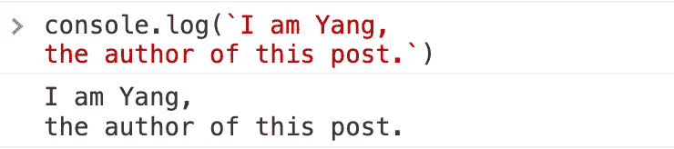
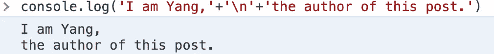
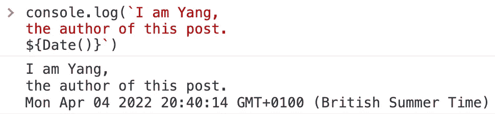
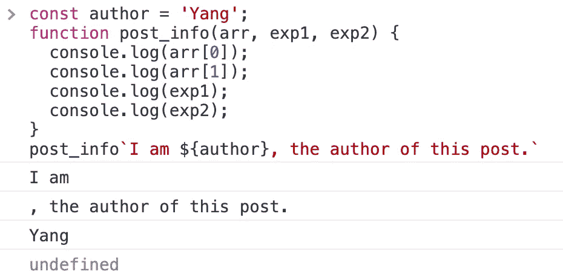
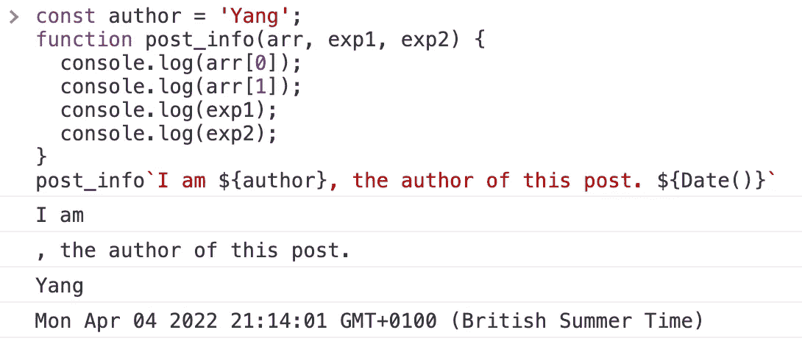

# JavaScript 中模板字符串的 3 种用法

> 原文：<https://javascript.plainenglish.io/3-uses-of-template-strings-in-javascript-c938b77ce811?source=collection_archive---------12----------------------->

## 让你的代码更短但更好。


Image from [destex](https://wallhaven.cc/user/destex) on Wallhaven

处理字符串是软件开发中最基本的工作之一。在 JavaScript 中，有一种特殊的语法——模板字符串(也称为模板文字)。

如果您从未使用过模板字符串语法，那也没关系，因为还有其他方法可以完成同样的操作。但是如果你对 JavaScript 很认真，掌握这种语法糖可以让你的代码更短更好。

# 1.直接编写多行字符串

模板文字的最简单用法是直接编写多行字符串:



如上所示，我们打印由两个**反勾**包含的两行字符串。只要字符串有新的一行，`console.log`函数也会打印新的一行。

如果我们不使用模板文字语法，代码将如下所示:



当然，它像预期的那样工作。但是手动写`\n`很烦吧？

# 2.带表达式的字符串插值

写多行字符串只是冰山一角。模板字符串文字的强大之处在于它的字符串插值能力。

我们可以用非常简单的语法在两个反勾号中添加我们需要的表达式`${expression}`:



正如上面的例子所示，我们可以编写一个“灵活的”字符串，在您使用它的任何时候显示确切的日期。除了模板文字，你能提到一个更简单的方法来组合 JavaScript 中的字符串和表达式吗？

# 3.为复杂场景使用标记模板

标记模板是模板字符串的一种更高级的用法。它的基本结构如下:

```
tag_name(arrStrings, exp1, exp2, exp3, ...)
```

基本上，定义一个带标签的模板类似于定义一个函数。但是它的参数比较特殊:第一个参数是一个字符串数组，后面的都是表达式。

但是字符串数组在哪里呢？让我们看一个简单的示例程序来解决这个问题:

```
const author = 'Yang';
function post_info(arr, exp1, exp2) {
  console.log(arr[0]);
  console.log(arr[1]);
  console.log(exp1);
  console.log(exp2);
}
post_info`I am ${author}, the author of this post.`
```

现在，让我们在浏览器的控制台上运行上面的代码:



现在一切都清楚了。每当我们执行带标签的模板`post_info`时，表达式都类似于`${exp}`。第一个参数是字符串数组，包含由表达式分隔的字符串。

为了证明这一点，让我们添加另一个表达式`exp2`，看看会发生什么:



# 关键要点

模板字符串，或称为模板文字，是 JavaScript 中一种实用而有用的语法。当涉及到字符串处理时，它使我们的程序更整洁和更好。

***感谢各位阅读。如果你喜欢，别忘了跟着*** [***我***](https://yangzhou1993.medium.com/follow) ***去获取更多关于编程和技术的好文章！***

有关 JavaScript 的详细信息:

[](https://medium.com/techtofreedom/3-uses-of-the-three-dots-in-javascript-8d6b83f179ce) [## 3“三点”在 JavaScript 中的用途

### 让你的 JavaScript 代码更加优雅

medium.com](https://medium.com/techtofreedom/3-uses-of-the-three-dots-in-javascript-8d6b83f179ce) [](https://medium.com/techtofreedom/4-ways-to-write-for-loops-in-javascript-d0db6aa8f7b6) [## 用 JavaScript 编写循环的 4 种方法

### 重点是展示 JavaScript 的演变

medium.com](https://medium.com/techtofreedom/4-ways-to-write-for-loops-in-javascript-d0db6aa8f7b6) 

*多内容于* [***普普通通***](https://plainenglish.io/) *。报名参加我们的* [***免费周报***](http://newsletter.plainenglish.io/) *。*[***Twitter***](https://twitter.com/inPlainEngHQ)和*[**T42【领英】**](https://www.linkedin.com/company/inplainenglish/) *追随我们。加入我们* [***社区不和***](https://discord.gg/GtDtUAvyhW) *。**