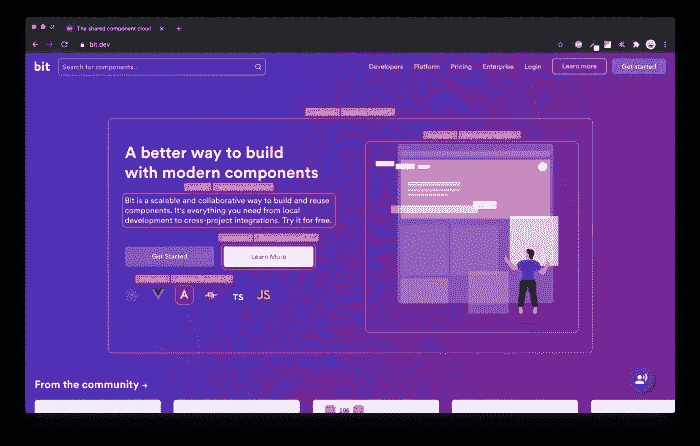
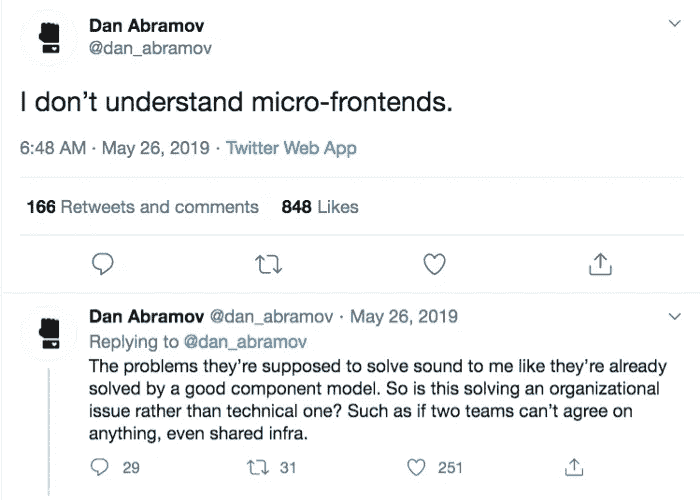
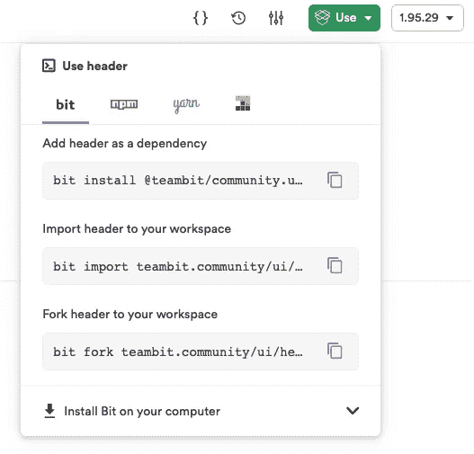
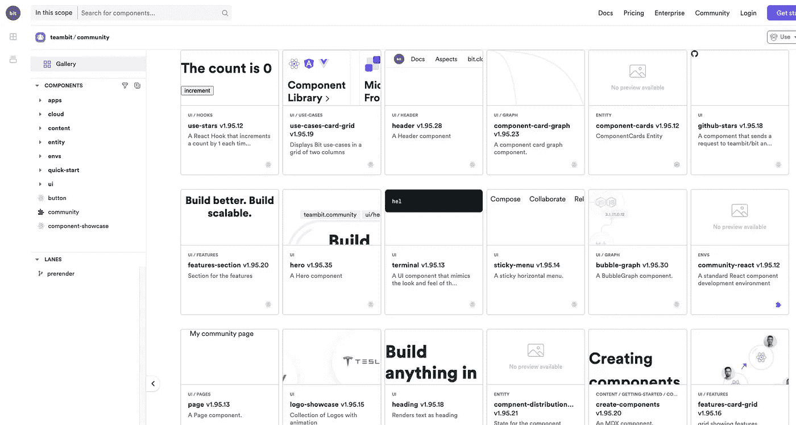
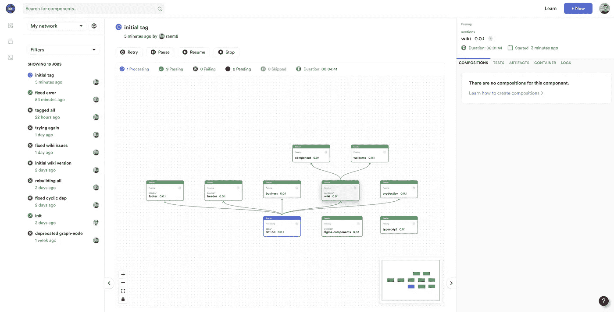
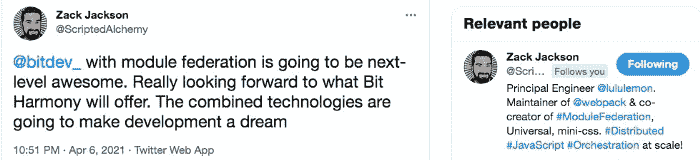
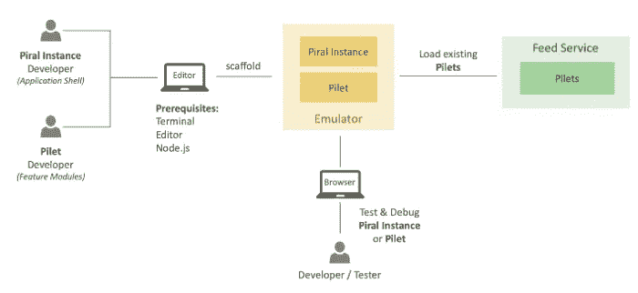

# 构建微前端的 3 种方法

> 原文：<https://javascript.plainenglish.io/3-ways-to-develop-micro-frontends-in-2022-e29984158b6d?source=collection_archive---------0----------------------->

## 如何开发可与 React、TypeScript 和任何现代 web 一起伸缩的微前端。

在过去的几年里，微前端一直是前端社区最热门的话题。这并不意外。

然而，微前端不是一个新的“框架”，甚至不是一个“东西”。它是软件分发思想在前端世界的体现。

因此，构建“微前端”意味着将您的应用程序开发拆分成更小的组件，这些组件可以单独开发和交付，并且能够以同样的方式拆分您的组织。

“微前端”这个名称在某种程度上是有限制的；我们真的应该从自顶向下的分布式应用程序开发的角度开始思考。乐高意味着你可以建造不止一个整体，而是你想要多少个“整体”。一切都可以是“乐高积木”——前端、体验、流程、后端，甚至全栈或无服务器功能。

新技术可以帮助我们实现这一点，并解决技术、架构和组织问题——这可以让我们以前所未有的方式扩展和改进我们的开发。

想象一下，在一个组织中，人们构建产品，产品经理获得新产品需求，并将其转化为组件，然后 R&D 的专家团队可以构建并为每个人提供服务。

组织可以更快地构建，每天发布一百万次小的升级，每个组件都可以被任何人用来构建任何东西。当然，所有的东西都在系统中被管理和更新。

# 1.组件驱动的应用程序:用比特去乐高

当人们想到组件时，他们通常会想到“按钮”或“加载器”。但是组件可以是你的应用程序的任何部分；前端甚至后端或全栈特性。

Visit bit.dev or bit.cloud and see for yourself

[**Bit**](https://bit.dev) 使得用组件构建一个完整的系统成为可能，也许是第一次。每个应用程序、体验、流程、功能，甚至主题和设计都是构建模块化软件的组成部分。

Dan is right

这意味着微前端的所有好处都被授予了:

1.  **简单、解耦的代码库**
2.  **快速发布的可扩展组织和自治团队**
3.  **跨应用发布、升级或更新任何组件**
4.  **组件内置代码共享和重用**
5.  **制作版本、依赖和代码建议之类的东西——非常简单**

例如，看看 Bit 自己的开源网站:

 [## 位组件驱动开发

### Bit 是组件驱动开发的领先工具链。忘记单一的应用程序，并分发到…

bit.dev](https://bit.dev) 

当您将鼠标悬停在这些组件上时，您可以点击它们以导航到托管在 [bit.cloud](https://bit.cloud) 上的组件页面——您可以使用任何软件包管理器安装它，派生和编辑它，并使用版本历史、文档、模拟、测试等高级功能来探索它。

组件被组织成范围，这些范围可以归团队所有或分配给产品(例如“header”“search”或甚至“billing”)。这些范围可以由服务于组件并一起构建的团队所拥有。

Bit 的 workspace 消除了 repo 架构的障碍，让你可以自由地从 workspace 中取出和移除组件，以开发它们并将其组合成彼此——以构建应用程序。

开源工具链中的其他功能完全分离了每个组件的开发，使开发、组合、管理和更新许多组件和依赖项变得容易。

Develop and update components across projects

Bit 是用 Bit 构建的，使其高度可扩展，所以你可以添加任何东西或者改变任何东西。例如，您可以创建可重用的组件模板、开发环境、构建管道，甚至添加核心功能。

Bit 并不局限于前端，但它是一种非常强大和可伸缩的方式，可以为任何数量的产品和开发人员构建微前端。

了解更多信息:

 [## 我们如何构建微前端

### 构建微前端来加速和扩展我们的 web 开发过程。

blog.bitsrc.io](https://blog.bitsrc.io/how-we-build-micro-front-ends-d3eeeac0acfc)  [## 比特博客

### 组件驱动软件的官方博客。围绕现代组件驱动的 web 开发的文章…

比特云](https://bit.cloud/blog/)  [## 一种共享构建模块的方法，以获得更好的用户体验

### 这是关于戴尔 IT 如何为世界级开发人员破解代码的系列博客的续篇…

www.dell.com](https://www.dell.com/en-us/blog/a-shared-building-block-approach-to-better-user-experience/) 

# 2.模块联盟和朋友

模块联合允许在运行时拆分加载模块。

Module Federation 是 Zack Jackson 开发的 JavaScript 架构，他后来提议为它创建一个 Webpack 插件。Webpack 团队帮助将该插件引入 Webpack 5，该插件目前处于测试阶段。

 [## 模块联盟|网络包

### 多个独立的构建应该形成一个应用程序。这些独立的版本之间不应该有依赖关系…

webpack.js.org](https://webpack.js.org/concepts/module-federation/) 

简而言之，模块联合允许 JavaScript 应用程序在运行时从另一个应用程序动态导入代码。该模块将构建一个独特的 JavaScript 条目文件，通过设置 Webpack 配置，其他应用程序可以下载该文件。

它还通过支持依赖共享来解决代码依赖和增加包大小的问题。例如，如果您正在下载一个 React 组件，您的应用程序不会导入 React 代码两次。该模块将智能地使用您已经拥有的 React 源代码，并且只导入组件代码。最后，如果导入的代码由于某种原因失败，您可以使用 React.lazy 和 react . junction 来提供后备，确保用户体验不会因为构建失败而中断。

这释放了构建微前端的巨大潜力。你可以在这里阅读更多相关内容，并查看本文中的示例:

 [## 利用 Webpack 5、模块联合和 Bit 革新微前端

### 了解即将到来的模块联合插件将如何改变微前端的工作方式

blog.bitsrc.io](https://blog.bitsrc.io/revolutionizing-micro-frontends-with-webpack-5-module-federation-and-bit-99ff81ceb0) 

# 3.微型前端台式压力机

有各种各样的开源工具可以帮助解决微机器人工作流程中的不同问题。我把它们归纳成一个简短的列表:

 [## 你应该知道的 11 个微前端框架

### 发现构建微前端的最佳库和工具。

itnext.io](https://itnext.io/11-micro-frontends-frameworks-you-should-know-b66913b9cd20) 

有几点值得注意:

## 单人水疗

[Single SPA](https://single-spa.js.org/) 将自己定义为“前端微服务的 Javascript 框架”。简而言之，它将生命周期应用于每个应用程序。每个应用程序都可以响应 url 路由事件，并且必须知道如何从 DOM 中引导、安装和卸载自己。传统 spa 和单 SPA 应用程序之间的主要区别在于，它们必须能够与其他应用程序共存，并且不是每个应用程序都有自己的 HTML 页面。

因此，如果您希望将不同的前端或框架整合到一个 DOM 中，并希望在运行时进行集成，请查看这个有趣的实验。你可以在这里找到一些[的例子。](https://github.com/react-microfrontends)

## 路易吉

Luigi 是一个微前端 JavaScript 框架，使你能够创建一个由本地和分布式视图驱动的管理用户界面。Luigi 允许 web 应用程序与应用程序包含的微前端进行通信。为了确保通信顺利进行，您可以配置路由、导航、授权和 UX 元素等设置。

Luigi 由 Luigi 核心应用程序和 Luigi 客户端库组成。它们使用 postMessage API 在核心应用程序和微前端之间建立安全的通信。你自己看看吧。

这里有一个 [**测试操场**](https://fiddle.luigi-project.io/#/home/overview) ，让你有一种亲身体验的感觉。

## 皮拉尔

Piral 的目标是让你使用微前端轻松构建门户应用。Piral 使您能够创建一个模块化前端应用程序，该应用程序在运行时使用称为 pilets 的解耦模块进行扩展，利用微前端架构。pilet 可以独立开发，附带必要的代码，以及所有其他相关资产。这里有一个现场演示:

先决条件相当不错，作为开发人员，你只需要安装你最喜欢的编辑器、终端、互联网浏览器和 Node.js。 **Piral 实例**(应用外壳)和 **pilets** (特性模块)可以在本地开发机器上的仿真器中执行和调试。

# 请记住

现代应用程序的规模越来越大，变得越来越复杂，代码、技术、开发人员、用户和功能越来越丰富。它们变得难以开发。

将每个应用程序构建为一个项目，只有一个代码库、版本和发布/部署周期，这肯定会使工作变得缓慢而痛苦。就像微服务之前的后端一样，需要分发才能规模化。

微前端的想法很简单:分发一个整体。它从微服务中汲取灵感，并试图让这个概念为前端服务。

我个人喜欢 [Cam Jackson 对微前端的](/"An architectural style where independently deliverable frontend applications are composed into a greater whole")定义:

> “一种架构风格，其中可独立交付的前端应用程序被组合成一个更大的整体”

我只想补充一个小小的更正:

> "一种架构风格，其中可独立交付的前端应用程序被组合成<infinite products="">"</infinite>

我希望这有所帮助。请随意评论和分享您自己的旅程。

干杯🍺

*更多内容请看*[***plain English . io***](https://plainenglish.io/)*。报名参加我们的* [***免费周报***](http://newsletter.plainenglish.io/) *。关注我们关于*[***Twitter***](https://twitter.com/inPlainEngHQ)*和*[***LinkedIn***](https://www.linkedin.com/company/inplainenglish/)*。查看我们的* [***社区不和谐***](https://discord.gg/GtDtUAvyhW) *加入我们的* [***人才集体***](https://inplainenglish.pallet.com/talent/welcome) *。*