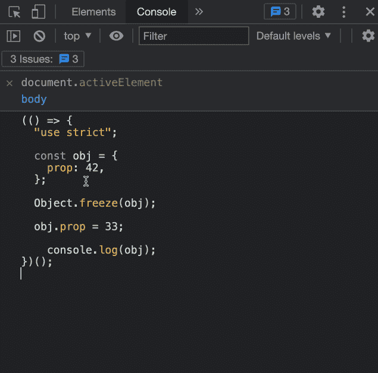
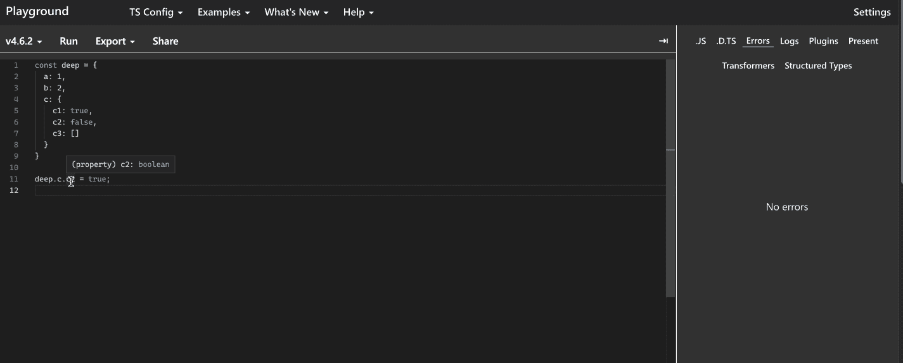

# JavaScript 中的不变性:深入指南

> 原文：<https://javascript.plainenglish.io/3-ways-to-make-your-properties-immutable-in-javascript-681712b95bc9?source=collection_archive---------3----------------------->

## 深入分析 JavaScript 不变性原则。

Photo by [Richard Horvath](https://unsplash.com/@orwhat?utm_source=medium&utm_medium=referral) on [Unsplash](https://unsplash.com?utm_source=medium&utm_medium=referral)

# 概观

在工作中，我们会写很多常量来表示这个属性的值是不能修改的。这是第一原则，这也是软件工程被推崇的地方，也有利于重构。

本文将深入讨论如何维护真正不可变的数据，并提供在不同场景中维护不可变数据结构的强大方法

# 对象.冻结

你首先想到的是使用`[Object.freeze](https://developer.mozilla.org/en-US/docs/Web/JavaScript/Reference/Global_Objects/Object/freeze)`方法，因为它看起来足够简单，很大程度上满足了我们的要求。这是它的使用说明

> 方法冻结一个对象。冻结的对象不能再被改变；冻结对象可防止向其添加新属性、删除现有属性、更改现有属性的可枚举性、可配置性或可写性，以及更改现有属性的值。
> 
> 此外，冻结对象还可以防止其原型被更改。`freeze()`返回传入的同一个对象。

这里有一个演示:

从例子中我们可以看到，`prop`的值没有被更改为 33，这很好，但是我们希望系统抛出一个错误，这很简单，就像在例子中，声明‘你的文件中的严格代码’来将其更改为`strict mode`:

use strict

虽然这种模式可以实现数据的不变性，但是结果只在编译时产生，有没有更好的方法？请看下文。

# 对象.定义属性

> 静态方法`Object.defineProperty()`直接在对象上定义一个新的属性，或者修改对象上已有的属性，返回对象。

上面的代码显示的效果和`Object.freeze`一样。通过设置可写属性使`obj`对象成为不可变数据，我们在一定程度上达到了我们的目的。

不幸的是，错误只在编译时抛出(尽管可以设置严格模式在运行时抛出错误)，当然，对于这种情况，我封装了一个非常简单的方法

这个方法将在`window`上全局挂载一个公共的惟一值。如果您试图修改它，将会抛出一个错误。

如果你的数据结构是一个对象或者一个数组，尝试定义`observer`来深度截取对象或者重写数组原型使其成为一个破坏性的方法(`push, pop, unshift, splice` ) delete

# 类型脚本—只读

以上两种方法都很棒，也解决了我们的需求，但是为了追求完美，建议你使用 TypeScript 提供的`readonly`或者 `generic Readonly`或者速记`as const`

`readonly`或者`(as const)`有什么好处？

*   只读标识符将数据类型附加为只读
*   readonly 限制修改深层对象和多维数组的值
*   readonly 发生在运行时，这意味着它为我们提供了更完美的开发体验
*   可用于 ES6 级

TypeScript — readonly

值得一提的是`readonly`对数组类型数据有一些优化，你不能使用对数组有破坏性的方法，这真的很棒！

# 总结

*   当不使用 TypeScript 时，可以使用`Object.defineProperty`拦截`setter`并抛出错误，达到数据不变性和警告的效果
*   如果您正在使用 TypeScript，强烈建议您使用 as const 或 readonly，`Readonly (generic)`内置类型来修饰数据结构，以在运行时和编译时获得最佳结果

# 了解更多信息

 [## 如何编写干净的类型脚本代码

### 掌握如何编写优雅的 TypeScript 代码的 8 个知识点

better 编程. pub](https://betterprogramming.pub/how-to-write-clean-typescript-code-eda1716eead1)  [## 改善你的不良反应和打字习惯

### 改掉你不良的编程习惯，做一个自律的人

medium.com](https://medium.com/weekly-webtips/improve-your-bad-react-and-typescript-programming-habits-f4a4bf7a9105) 

*更多内容请看*[***plain English . io***](https://plainenglish.io/)*。报名参加我们的* [***免费周报***](http://newsletter.plainenglish.io/) *。关注我们关于*[***Twitter***](https://twitter.com/inPlainEngHQ)*和*[***LinkedIn***](https://www.linkedin.com/company/inplainenglish/)*。加入我们的* [***社区不和谐***](https://discord.gg/GtDtUAvyhW) *。*