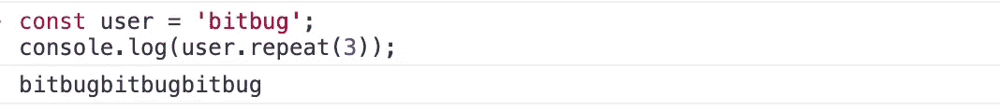
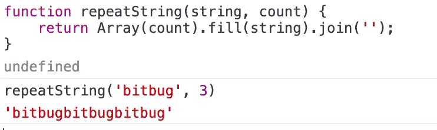

# JavaScript 中重复字符串的 3 种方法

> 原文：<https://javascript.plainenglish.io/3-ways-to-repeat-a-string-in-javascript-766984ef96f9?source=collection_archive---------13----------------------->

## 重复一个字符串可以提高开发效率


Photo by [Kelly Sikkema](https://unsplash.com/@kellysikkema?utm_source=medium&utm_medium=referral) on [Unsplash](https://unsplash.com?utm_source=medium&utm_medium=referral)

# 前言

我们在开发页面的时候，需要测试在文字特别长的情况下，页面的显示是否正常。例如，在列表页面上，如果文本太长，就需要截断文本。

所以我们需要不同长度的文本数据，本文将介绍 3 种重复文本字符串的方法。

# String 的 repeat()方法

在 ES6 中，String 增加了一个`[repeat()](https://developer.mozilla.org/en-US/docs/Web/JavaScript/Reference/Global_Objects/String/repeat)`方法，通过指定 count 返回一个新的字符串。

```
const user = 'bitbug';
console.log(user.repeat(3));
```

它会输出`bitbugbitbugbitbug`。



使用 repeat 方法可以很容易地创建重复字符串，但是 IE11 不支持这种方法。

# 使用数组的 API

Array 有很多 API，所以会有很多实现。但步骤都差不多，先构造一个指定长度的空数组，然后填充字符串，最后转换成字符串。

## 使用数组的 fill()方法

如果我们想重复一个字符串，我们可以用`fill()`方法将字符串填充到数组实例中，然后将其转换为字符串

```
function repeatString(string, count) {
    return Array(count).fill(string).join('');
}
```

我们可以通过重复`bitbug` 3 次来测试它:



## 使用数组的 join()方法

将数组转换成字符串时，可以使用`join()`方法。`join()`方法将通过分隔符连接数组中的所有元素。我们可以使用需要重复的字符串自定义分隔符。

```
function repeatString(string, count) {
    return Array(count + 1).join(string);
}
```

请注意，构造的数组的长度需要大于重复字符串的数量。

## 使用数组的 reduce()方法

我们可以使用 Array 的 iterator 方法通过迭代数组的所有元素来构造一个新的字符串。

```
function repeatString(string, count) {
    return Array(count).toString().split(',').reduce(pre => pre + string, '');
}
```

需要注意的是，如果数组为空，则不会执行`reduce()`方法，所以需要用空字符串填充。

# 用 while 循环重复一个字符串

只要指定的条件评估为 true，while 语句就会执行其语句。

```
function repeatString(string, count) {
    let result = '';
    while (count) {
        result+= string;
        count--;
    }
    return result;
}
```

当数据量相对较大时，可以使用二分法优化 while 循环。详细请参考 [loadsh 的重复](https://github.com/lodash/lodash/blob/master/repeat.js)的实现或者参考[这个实现](https://github.com/mathiasbynens/String.prototype.repeat/blob/master/implementation.js)。

```
// Code from  [https://github.com/mathiasbynens/String.prototype.repeat/blob/master/implementation.js](https://github.com/mathiasbynens/String.prototype.repeat/blob/master/implementation.js)function repeatString(string, count) {
  let result = '';
  while (count) {
    if (count % 2 === 1) {
      result += string;
    }
    if (count > 1) {
      string += string;
    }
    count >>= 1;
  }
  return result;
}
```

# 结论

虽然介绍了三种重复字符串的方法，但是推荐使用原生的`repeat()`方法。如果需要在生产环境中使用，需要注意是否需要兼容 IE11，选择相应的解决方案。

*更多内容尽在* [***说白了. io***](https://plainenglish.io/) *。报名参加我们的* [***免费周报***](http://newsletter.plainenglish.io/) *。关注我们关于* [***推特***](https://twitter.com/inPlainEngHQ)**和*[***LinkedIn***](https://www.linkedin.com/company/inplainenglish/)*。查看我们的**[***社区不和谐***](https://discord.gg/GtDtUAvyhW) *加入我们的* [***人才集体***](https://inplainenglish.pallet.com/talent/welcome) *。***