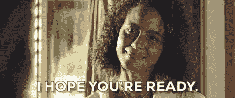
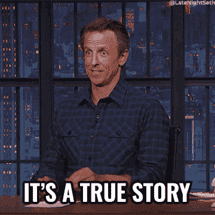
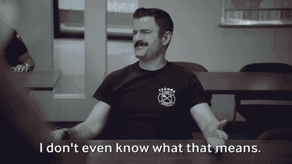

# 面试中最糟糕的三件事

> 原文：<https://javascript.plainenglish.io/3-worst-things-you-can-do-in-an-interview-25bf1ae5b9c0?source=collection_archive---------16----------------------->

Photo by [Mimi Thian](https://unsplash.com/@mimithian?utm_source=medium&utm_medium=referral) on [Unsplash](https://unsplash.com?utm_source=medium&utm_medium=referral)

当我在 Canoo 的时候，我接到了大约 100 个面试电话，从技术筛选到行为文化适应测试。我遇到了一些很棒的候选人，也有一些让我很失望。在这篇文章中，我们将看看**我见过的面试中你应该避免做的三件最糟糕的事情。**

# 毫无头绪

让我补充一下，对以下情况一无所知:

*   这个公司
*   角色
*   所需的技能

去年夏天我面试的一位先生出现在面试现场，甚至不知道卡诺到底在做什么。

这让我很震惊，因为你坐在一个可能已经花了几个月准备面试，但对公司一无所知的人面前。

有多少次你看了一下职位名称就直接申请了？

别撒谎，这种事时有发生，我知道。当我开始我的职业生涯时，这种事经常发生在我身上。以前拼命求职，连职位描述都不查，更别说公司详情了。

这些年来，我意识到对你来说重要的是:

*   了解角色，大多数公司会在他们的招聘启事中放一个“前 90 天目标”或类似的路线图，这将有助于你更多地了解团队的角色和日常工作。
*   理解公司的使命和价值观你应该经常阅读你申请的公司的资料。我查看了公司网站，大多数网站都有一个*关于*的部分或者*职业*的部分，里面有很多关于公司价值观和优先事项的内容。一些好的公司甚至有自己的博客，这会让你对公司有一个很好的了解。

# 不专业

不言而喻，一个人在面试时应该表现得专业一些，如果你像我一样，在面试中看到人们打呵欠，你会感到震惊。

去年，我和一个人聊天，他把相机放在脸下面，给了一个奇怪的角度，还不停地挠他的背。他看起来好像不在乎面试。无论他在编码方面有多好，我都没有见过我的团队与如此懒惰或不专业的人一起工作。

我们直说吧，开心点！==不专业。

当我谈到职业精神时，我并不是说你应该穿西装，但至少你不应该打着哈欠出现在面试中。

不管你有多讨厌这样，但是面试官只有 30-40 分钟的时间让你留下印象。我知道这听起来很疯狂，但你和他们的 30 分钟通话是你展示自己有多棒的机会，你可以很好地交流和表达你的观点，你如何展示自己和你的论点。

永远记住，你只有这一次打电话给别人留下好印象的机会，因为除了这一次，他们不认识你(除非你已经为自己建立了一个社交品牌)。

# 无知

今年 1 月，我和一名候选人进行了一次技术筛选电话会议。在谈话开始时，她很聪明，也很自信，但很快就被她对自己回答的反馈的无知和防御性所掩盖。这让我有点担心她是否是一名团队成员，我又问了几个问题，看看她如何处理更多这样的问题。感觉她是在无视我的投入，不断试图证明她是正确的。

不只是她，上一节我说的那个人也有点像她。他没有采纳关于如何做得更好的建议和反馈。相反，他开始防御性地说话，无视并做出一副恼火的表情。

生气是正常的，但我认为在一个团队中，你会在某个时候生气。我们都需要学会如何处理这种情况，并在不让自我占据主导的情况下进行良好的沟通。

回想起来，我肯定我过去也犯过类似的错误，但我很幸运，有更多有耐心的面试官。我已经吸取了教训，最大的教训是，诚实地接受错误，并努力从中吸取教训。对自己的错误保持谦逊会让你得到尊重和建设性的反馈。

暂时就这样了。希望这篇文章对你有帮助！如果您有任何反馈或问题，请随时在下面的评论中提出。更多此类文章，请在[推特](https://twitter.com/sun_anshuman)上关注我。

下次见。

*原载于 2022 年 3 月 15 日*[*https://the anshu*man . dev](https://theanshuman.dev/articles/3-worst-things-to-do-in-an-interview-j01)*。*

*更多内容请看*[***plain English . io***](https://plainenglish.io/)*。报名参加我们的* [***免费周报***](http://newsletter.plainenglish.io/) *。关注我们关于*[***Twitter***](https://twitter.com/inPlainEngHQ)*和*[***LinkedIn***](https://www.linkedin.com/company/inplainenglish/)*。加入我们的* [***社区不和谐***](https://discord.gg/GtDtUAvyhW) *。*