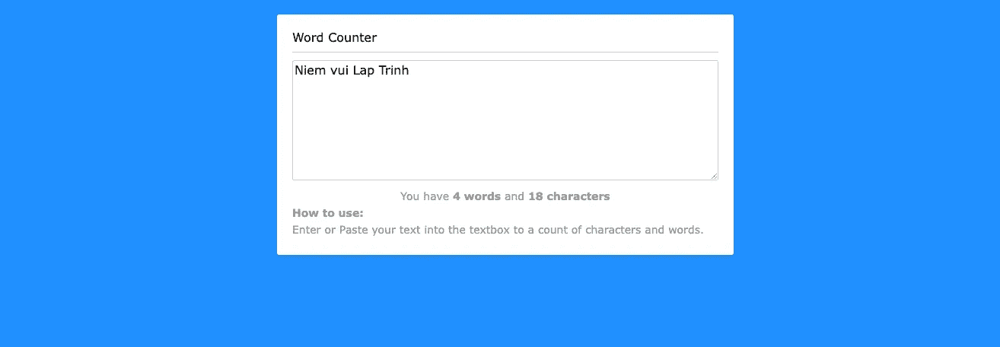

# 33 个面向初学者的 JavaScript 项目

> 原文：<https://javascript.plainenglish.io/33-javascript-projects-for-beginners-a68553e9f56d?source=collection_archive---------1----------------------->

## 初学者友好的 JavaScript 项目来处理 web 开发中的一些常见问题。

Photo by [Nubelson Fernandes](https://unsplash.com/@nublson?utm_source=medium&utm_medium=referral) on [Unsplash](https://unsplash.com?utm_source=medium&utm_medium=referral)

在学习了 JavaScript 编程语言之后，我认为接下来我们应该花时间练习编写代码来处理基本问题。这个过程将帮助你学习如何在实践中应用知识。

在今天的文章中，我将总结 JavaScript 项目来处理 web 开发中的一些常见问题。如果可能的话，您应该在查看项目源代码之前考虑如何处理这些问题。

# JavaScript 项目列表

# 使用 JavaScript 的简单计算器

看下面的结果！

[链接](https://codepen.io/lalwanivikas/pen/eZxjqo)

# JavaScript 创建一个计时器时钟

看下面的结果！

[链接](https://codepen.io/afarrar/pen/JRaEjP)

# 简单的任务列表 JavaScript

看下面的结果！

[链接](https://codepen.io/cassie-codes/pen/pYwXwb)

# 游戏卡罗 JavaScript

看下面的结果！

[链接](https://codepen.io/daajust/pen/obVROB)

# 动态 JS 测验

看下面的结果！

[链接](https://codepen.io/gcarino/pen/LDgtn)

# JavaScript 刽子手游戏

看下面的结果！

[链接](https://codepen.io/cathydutton/pen/ldazc)

# Flexbox 图像滑块 JS

看下面的结果！

[链接](https://codepen.io/kathykato/pen/prEmKe)

# 拖放 JavaScript

看下面的结果！

[链接](https://codepen.io/bradtraversy/pen/odmVgN)

# 普通 JavaScript 时间选择器

看下面的结果！

[链接](https://codepen.io/Lance-Jernigan/pen/jARLLO)

# JavaScript 提示计算器

看下面的结果！

[链接](https://codepen.io/cphemm/pen/reNwWd)

# JavaScript 字符计数文本区域

看下面的结果！

[链接](https://codepen.io/ChynoDeluxe/pen/obpOog)

# 复制到剪贴板 JavaScript

看下面的结果！

[链接](https://codepen.io/kindfloat/pen/bGbwJaz)

# 随机报价生成器

看下面的结果！

[链接](https://codepen.io/adam-gora/pen/ggJqvp)

# 英语词典 App JS

看下面的结果！

[链接](https://codepen.io/SuspectCollector/pen/JjypGKJ)

# 货币转换器

看下面的结果！

[链接](https://codepen.io/brandon_wallace/pen/ReLovX)

# 图片上传预览图片纯 JavaScript

看下面的结果！

[链接](https://codepen.io/TayabRaza/pen/VgOMMj)

# 使用 JavaScript 自动调整文本区域的大小

看下面的结果！

【https://codepen.io/impressivewebs/pen/jONdzdK 

[链接](https://codepen.io/impressivewebs/pen/jONdzdK)

# 使用 JavaScript 进行浏览器检测

看下面的结果！

[链接](https://codepen.io/brandonkennedy/pen/XbQdbW/)

# 平滑滚动 js

看下面的结果！

[链接](https://codepen.io/rleve/pen/iCbgy)

# Modal — CSS 和 Vanilla JS

看下面的结果！

[链接](https://codepen.io/bradtraversy/pen/zEOrPp)

# 动画计数器 JS

看下面的结果！

[链接](https://codepen.io/bradtraversy/pen/poJwqOK)

# 打字机效应

看下面的结果！

[链接](https://codepen.io/bradtraversy/pen/jeNjwP)

# 限制输入字符 JavaScript

看下面的结果！

[链接](https://codepen.io/darcyvoutt/pen/ogXvEr)

# 带自动完成功能的搜索表单

看下面的结果！

[链接](https://codepen.io/ZhenyaShhh/pen/ZRLJLJ)

# 密码强度检查器

看下面的结果！

[链接](https://codepen.io/coding_beast/pen/LYGrXde)

# 自动完成纯 JavaScript

看下面的结果！

[链接](https://codepen.io/ronaldaug/pen/PyYmgx)

# 香草 JS 蛇

看下面的结果！

[链接](https://codepen.io/fariati/pen/mdRpEYP)

# 简单的普通 JavaScript 标签

看下面的结果！

[链接](https://codepen.io/carolyngreenough/pen/MawmVb)

# 字数统计的 JavaScript 代码

[演示](https://romeojeremiah.github.io/word-length-calculator)

[链接](https://github.com/romeojeremiah/word-length-calculator)

# JavaScript 中的灯泡开关程序

[演示](https://romeojeremiah.github.io/javascript-light-switch-project/)

[链接](https://github.com/romeojeremiah/javascript-light-switch-project)

# 适合初学者的简单 JavaScript 游戏

[演示](https://romeojeremiah.github.io/whack-a-mole/)

[链接](https://github.com/romeojeremiah/whack-a-mole)

# 随机报价生成器 JavaScript

[演示](https://romeojeremiah.github.io/random-joke-ajax-project/)

[链接](https://github.com/romeojeremiah/random-joke-ajax-project)

# 使用 JavaScript 函数改变背景颜色

[演示](https://romeojeremiah.github.io/javascript-color-change-app/)

[链接](https://github.com/romeojeremiah/javascript-color-change-app)

相关文章:

*   29 个适合初学者的 HTML 项目
*   [面向初学者的 Vue JS 项目](https://us.niemvuilaptrinh.com/article/17-vuejs-projects-for-beginners)
*   [HTML 初学者练习项目](https://us.niemvuilaptrinh.com/article/21-html-css-projects-for-beginners)

# 摘要

我希望文章能为您提供对 web 开发有用的 web 项目，如果您有任何问题，请发邮件给我，我会尽快回复。希望大家继续支持网站，让我能写出更多好文章。祝您愉快！

*更多内容请看* [***说白了就是***](http://plainenglish.io/) *。报名参加我们的* [***免费每周简讯***](http://newsletter.plainenglish.io/) *。在我们的* [***社区***](https://discord.gg/GtDtUAvyhW) *获得独家获得写作机会和建议。*