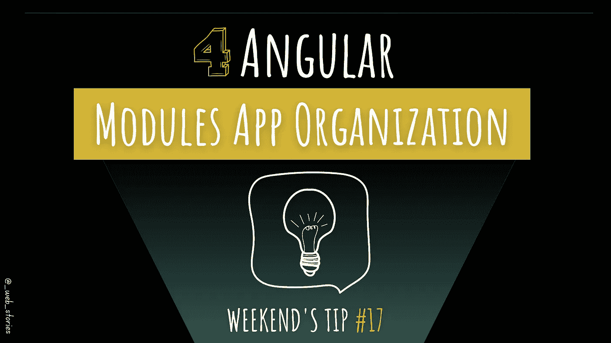

# 4 个角度应用架构最佳实践

> 原文：<https://javascript.plainenglish.io/4-angular-modules-best-practices-2a4710494828?source=collection_archive---------6----------------------->

## 架构和应用程序结构最佳实践！

By FAM

## 你好👋

模块允许高级封装。有了模块，你可以把你的应用分成几个大盒子，在需要的时候轻松地加载它们以获得更好的性能。让我们开始吧！

# 1.应用模块

应用程序模块是您的主要模块，它引导应用程序并加载应用程序成功启动的基本代码。

当我谈论它需要正确渲染和发动的基本东西时，我指的是`***BrowserModule***`、`***AppRoutingModule***`、**、*、*、**(如果你的应用程序有路线的话)、以及`***BrowserAnimationsModule***`等。

# 2.核心模块

核心模块是一个包含任何共享单体服务的模块，这些服务应该是*应用级*服务。

您可以考虑的核心模块的良好候选示例可以是应用程序 ***【导航栏】******用户认证*** 等。

# 3.共享模块

共享模块有时也被称为公共模块。这个模块是任何角度项目的必备。

如今前端框架带来的最大好处是创建可重用组件的能力。例如，如果您在 web 应用程序的多个页面上显示了一张卡片，那么创建一个卡片组件是一个明智的选择。但是在每个使用它的模块中导入组件是很难看的。在这种情况下，在共享模块中导入和导出组件是一种很好的做法。

可以添加到共享模块中的示例可以是组件，如微调器，指令，如荧光笔，管道，在不同的模块和页面中使用和重用。

# 4.特征模块

特征模块有时也被命名为模块，尽管我更喜欢*特征*的名称。这个模块收集了所有的特性组件、特性服务、指令和管道。在共享模块和特性模块之间进行选择可能会令人困惑。

不同的是，功能模块代表你的应用功能和业务功能。例如，如果你的应用程序是一个电子商务网络应用程序。那么 ProductsModule 可以作为一个特性添加到特性模块中。在该模块中，您使用导入的共享模块组件，如产品卡组件、微调组件等。

每个人都有不同的偏好，我曾与开发人员合作，他们会将身份验证模块放在功能模块中，等等。因此，我在这里提出的结构和架构不是你必须应用的规则，它是我认为更适合 Angular 应用程序的规则！

所以，请随意接受或忽略它，更好的是，与我们分享您的观点。😉我很乐意听到不同的反馈和观点。

*   **其他良好做法:**

 [## 6 角形组件的最佳实践

### 创建角度组件时要考虑的最佳实践

levelup.gitconnected.com](https://levelup.gitconnected.com/6-angular-components-best-practice-40f83bf975b2) 

今天就到这里，看阿雅🙋

如果你有任何问题或反馈，请点击评论或通过 LinkedIn 联系我— **我洗耳恭听！**

[**想请我喝杯咖啡吗？☕️**](https://www.buymeacoffee.com/fatimaamzil)

> 让我们为 2022 年打造一个更好的‘我们’！

*如果你喜欢我的文章，* [***订阅***](https://famzil.medium.com/subscribe) *获取我的最新。如果你自己喜欢体验媒介，可以考虑通过**[***报名会员来支持我和其他成千上万的作家。它每月只需花费***5 美元，它支持我们，作家，你也有机会用你的写作**** **赚钱。当然，你可以随时取消会员资格。通过注册**](https://famzil.medium.com/membership) *[*这个链接*](https://famzil.medium.com/membership) *，你就直接用你的一部分费用来支持我，不会多花你多少钱。如果你这样做了，万分感谢！***

**下面我们就**联系一下** [**中**](https://medium.com/@famzil/)**[**Linkedin**](https://www.linkedin.com/in/fatima-amzil-9031ba95/)**[**脸书**](https://www.facebook.com/The-Front-End-World)**[**insta gram**](https://www.instagram.com/the_frontend_world/)************

******** [## 通过我的推荐链接——FAM 加入 Medium

### 作为一个媒体会员，你的会员费的一部分会给你阅读的作家，你可以完全接触到每一个故事…

famzil.medium.com](https://famzil.medium.com/membership)******** 

*********更多内容请看*[***plain English . io***](https://plainenglish.io/)*。报名参加我们的* [***免费周报***](http://newsletter.plainenglish.io/) *。关注我们关于* [***推特***](https://twitter.com/inPlainEngHQ)[***领英***](https://www.linkedin.com/company/inplainenglish/)**和* [***不和***](https://discord.gg/GtDtUAvyhW) *。**********