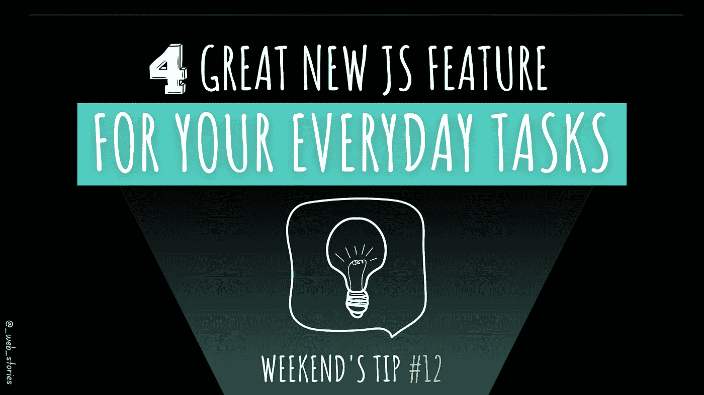

# JavaScript ES2022 的 4 个最佳新特性

> 原文：<https://javascript.plainenglish.io/4-best-new-es2022-features-6e73db339b21?source=collection_archive---------0----------------------->

## 为您的日常 JavaScript 任务提供强大的功能。



By FAM

## 你好👋

上个月，发布了新的 JavaScript 特性。本周末的技巧是关于我将在代码中使用的最喜欢的技巧。

让我们来学习这些新功能。

# 1.Await 可以在异步块之外使用

*`***await***`*关键字以前不能在`***async***`框(或函数)之外使用。有了 ES2022，我们可以使用`***await***` 而不用异步，比如有条件地或者动态地加载其他代码。**

```
**if(user.preferences.mode === dark) {  
   await require("path to additional code to be imported")
}**
```

# ****2。。数组的“at()”方法****

**这是一个很棒的特性，而不是对数组进行切片并得到它的长度，直到我们得到我们想要的。这个特性将帮助你在一行代码中得到你想要的东西。可读性好，代码少。**

**使用正索引从数组末尾开始索引，使用负索引从数组末尾开始索引。**

```
**const arr = [1,2,3,4]**console.log(arr.at(2));** // **3** because positive indexining starts from **0** for first element of the array/string**console.log(arr.at(-2));** // **3** because negative indextion starts with **-1** for the last element of the array/string**
```

# **3.错误的“原因”**

**现在可以指定异常的原因，以便更好地进行错误管理和调试:**

```
**try {
  //something
} catch (error) {
  throw new Error('Something went wrong', **{ cause: error }**);
}**
```

# **4.正则表达式匹配表达式**

**`**Regexp.exec**`:用于匹配字符串的多个部分。一个接一个地返回结果，所以你必须循环每个结果，直到它返回`**null**`为止。**

*   **来自 Mozilla 的例子:**

```
**const regex1 = RegExp('foo*', 'g');
const str1 = 'table football, foosball';
let array1;**while ((array1 = regex1.exec(str1)) !== null) {**
  console.log(`Found **${array1[0]}**. Next starts at ${**regex1.lastIndex**}.`);
  // expected output: "Found foo. Next starts at 9."
  // expected output: "Found foo. Next starts at 19."
**}****
```

**`**String.matchAll**` :返回一个迭代器，用于遍历所有匹配项。**

*   **[Mozilla 的例子](https://developer.mozilla.org/en-US/docs/Web/JavaScript/Reference/Global_Objects/String/matchAll)**

```
**const regexp = /t(e)(st(\d?))/g;
const str = 'test1test2';**const array = [...str.matchAll(regexp)];**console.log(**array[0]**);
// expected output: Array ["test1", "e", "st1", "1"]console.log(**array[1]**);
// expected output: Array ["test2", "e", "st2", "2"]**
```

**今天到此为止，再见！🙋**

**如果您有任何问题或反馈，请点击评论或通过 LinkedIn 联系我— **我洗耳恭听！****

**[**想给我买杯咖啡吗？☕️**](https://www.buymeacoffee.com/fatimaamzil)**

> **让我们为 2022 年打造一个更好的‘我们’！**

> **如果你喜欢我的文章， [**订阅**](https://famzil.medium.com/subscribe) 获取我的最新。如果你自己喜欢体验媒介，可以考虑通过[**注册会员**](https://famzil.medium.com/membership) 来支持我和其他成千上万的作家。它只需要每月 5 美元，它支持我们，作家，你也有机会用你的作品赚钱。当然，你可以随时取消会员资格。通过注册[这个链接](https://famzil.medium.com/membership)，你将直接用你的一部分费用来支持我，不会花你更多的钱。如果你这样做了，万分感谢！**

**让我们**联系上** [**中**](https://medium.com/@famzil/)**[**Linkedin**](https://www.linkedin.com/in/fatima-amzil-9031ba95/)**[**脸书**](https://www.facebook.com/The-Front-End-World)**[**insta gram**](https://www.instagram.com/the_frontend_world/)**[**YouTube**](https://www.youtube.com/channel/UCaxr-f9r6P1u7Y7SKFHi12g)**或************

******[](https://famzil.medium.com/membership) [## 通过我的推荐链接——FAM 加入 Medium

### 作为一个媒体会员，你的会员费的一部分会给你阅读的作家，你可以完全接触到每一个故事…

famzil.medium.com](https://famzil.medium.com/membership) 

*更多内容请看*[***plain English . io***](https://plainenglish.io/)*。报名参加我们的* [***免费周报***](http://newsletter.plainenglish.io/) *。关注我们关于*[***Twitter***](https://twitter.com/inPlainEngHQ)*和*[***LinkedIn***](https://www.linkedin.com/company/inplainenglish/)*。查看我们的* [***社区不和谐***](https://discord.gg/GtDtUAvyhW) *加入我们的* [***人才集体***](https://inplainenglish.pallet.com/talent/welcome) *。*******