# 你从来不知道的 4 个很酷的 JavaScript 控制台功能

> 原文：<https://javascript.plainenglish.io/4-cool-javascript-console-functions-you-never-knew-about-c769d24d7c18?source=collection_archive---------10----------------------->

## 这些 JavaScript 控制台函数在 web 开发课上很少谈到。

JavaScript 控制台比你想象的要酷得多。了解 JavaScript 控制台的 4 个隐藏特性，这些特性在您的 web 开发课程中可能学不到。

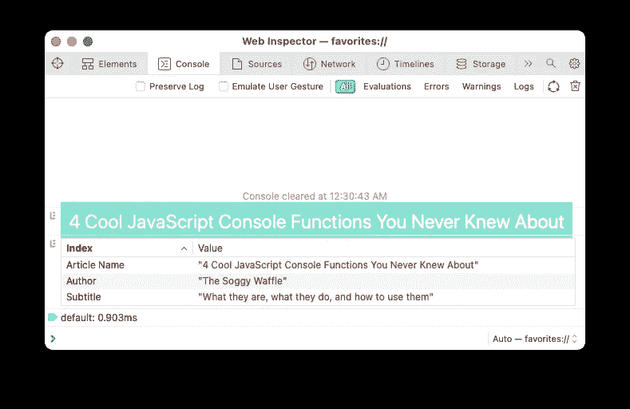

每个 JavaScript 开发人员都熟悉登录控制台。通常，`console.log(“Hello World!”)`是大多数开发人员编写的 JavaScript 代码的第一行。每个人都知道**`log``warn`和`error` 方法，但是 JavaScript 控制台还有很多你可能从来不知道的更酷的特性。**

**本文将涵盖四个特性，首先是最显著的特性。**

# **1)设计你的日志**

**登录到控制台可能相当乏味；这是有充分理由的。您希望您的日志消息对开发人员友好并且易于阅读。这并不意味着你必须避免天赋。**

**使用基本的 CSS 样式，以及一个特殊的字符组合，`**%c**`，您可以像处理 HTML 元素一样处理日志消息:**

**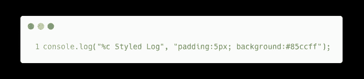**

**The %c character combination defines the start of a new style**

**上面的代码将日志消息呈现在一个浅蓝色的白色文本框中。**

**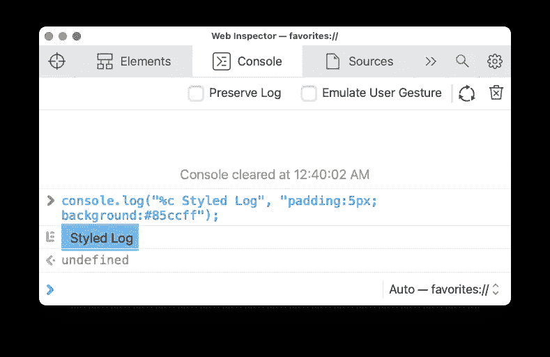**

**A single styled log**

**你甚至可以使用多种风格。JavaScript 将从第一个`**%c**`开始应用你的第一个样式，直到下一个`**%c**`。一旦控制台遇到下一个`**%c**`，它将使用以下参数进行造型。**

**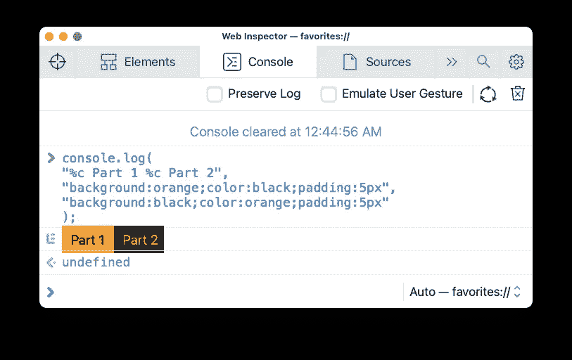**

**A log with two different sets of styles**

# **2)显示表格数据**

**有多种方法可以记录 JavaScript 对象的值。**

**最直接的方法是记录对象。记录对象将显示树状结构，用于检查对象属性。**

**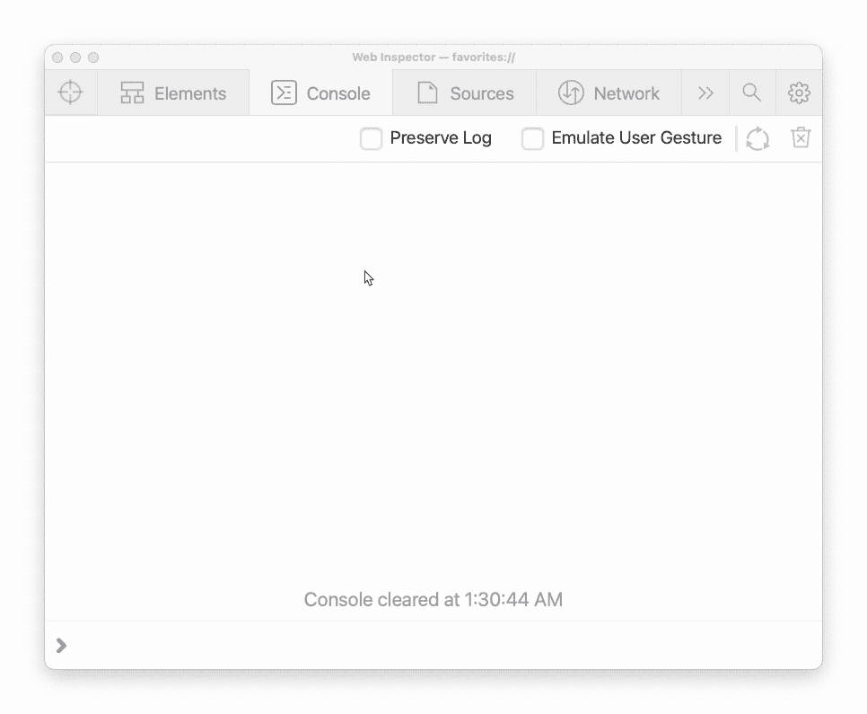**

**Object Inspector in Safari’s console window**

**另一种方法是使用`JSON.stringify`，它会将对象转换成 JSON 字符串:**

**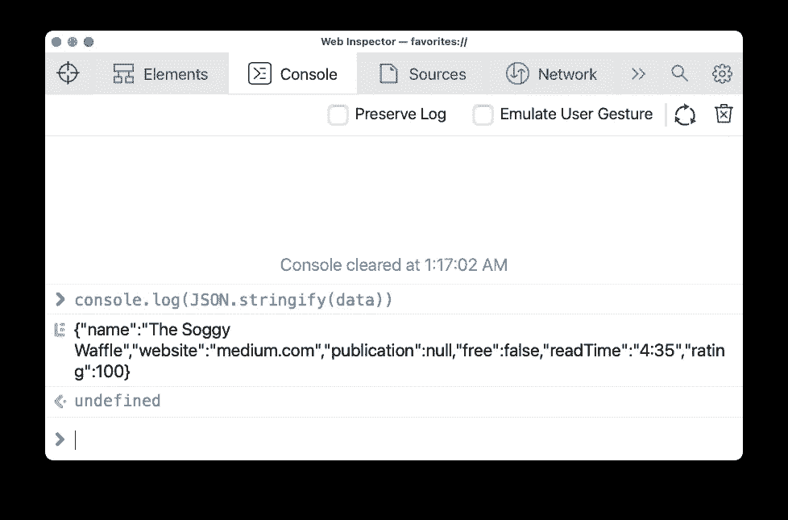**

**Logging an object as a JSON string**

**对于小对象来说，这很好。但是对于一个较大的实体，您可能希望通过再传递两个参数来启用空白(漂亮打印):**

**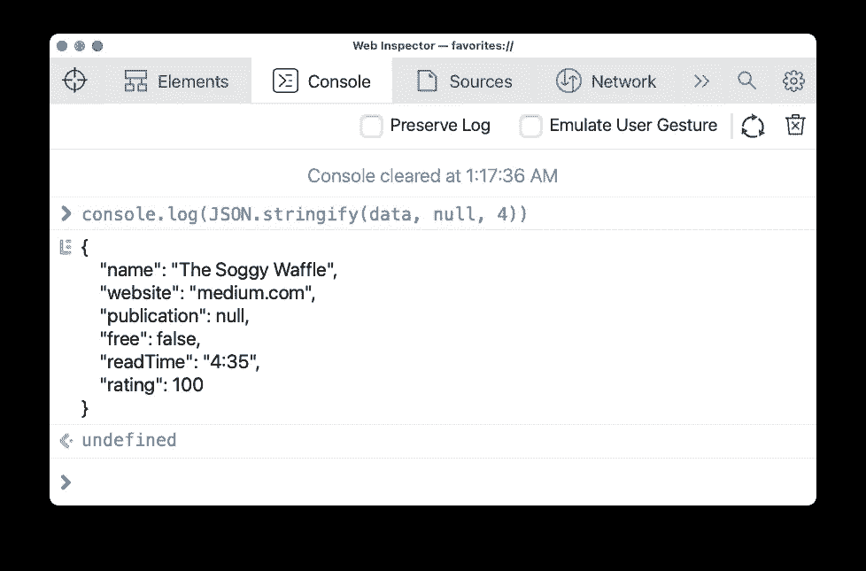**

**Logging a JSON string with pretty print**

**此外，在记录时，打印一组对象可能会让人难以阅读。**有更好的办法。**使用`console.table`在表格中显示您的数据:**

**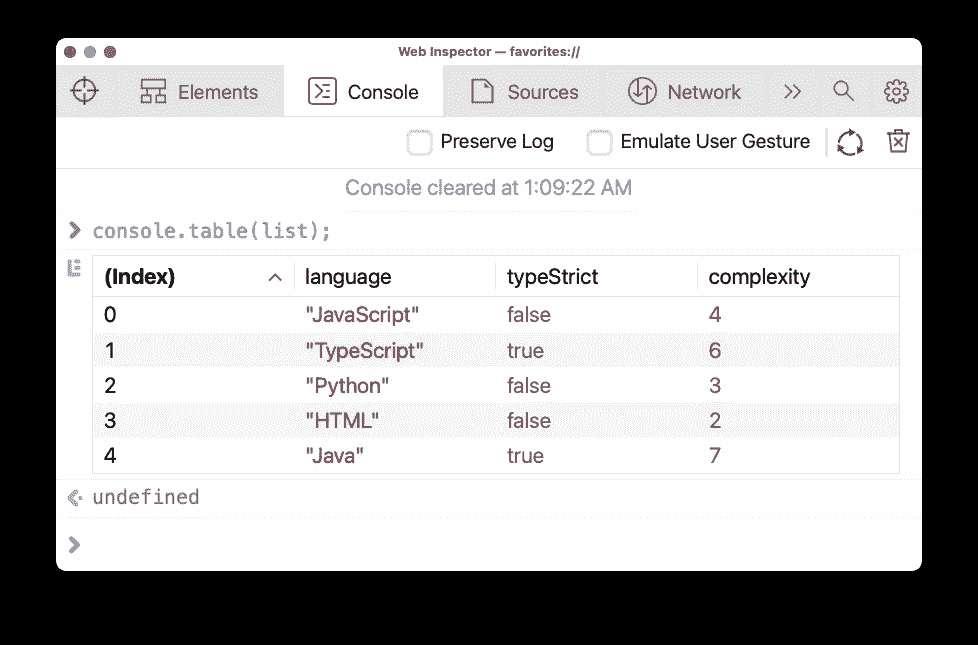**

**Logging an array of objects as a table**

**您可以使用`console.table`方法，而不仅仅是一个对象数组；你可以用它干净地打印任何对象或数组。**

**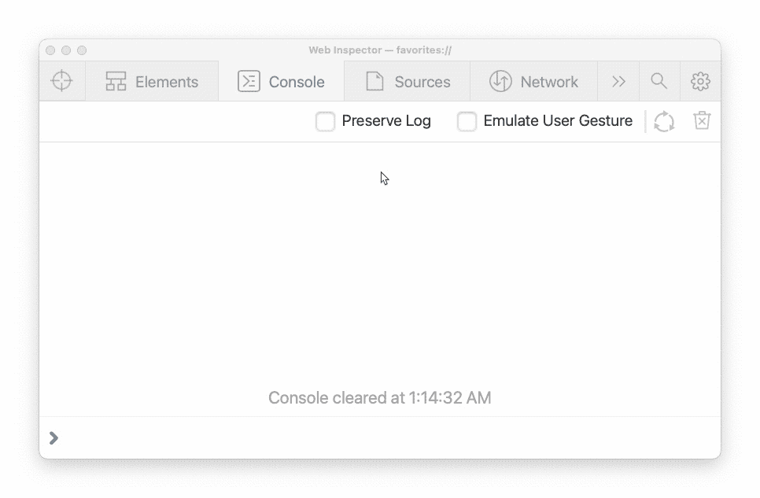**

**Logging different object types as a table**

# **3)计时功能**

**剖析您的代码非常重要。有时，您可能想知道执行一个函数或代码块需要多长时间。大多数人通过为当前纪元时间创建一个`start`变量来实现这一点。然后后来用`console.log(Date.now() — start)` **:****

**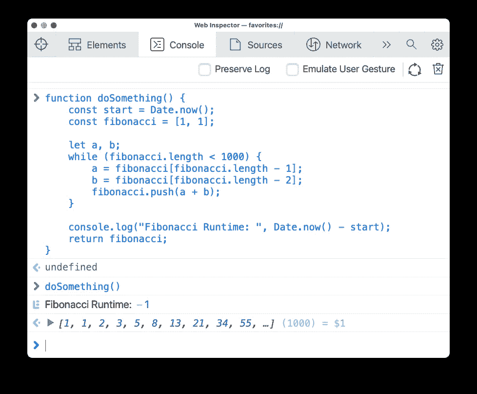**

**The 💩 way to log function runtimes**

****还有更好的办法！**`console`对象包括两个函数，`time`和`endTime`。这两个函数都接受一个参数，称为标签。当`console.time`被调用时，计时器开始计时。然后当您调用`console.endTime`方法时，计时器停止，控制台将记录运行时。两个函数中使用的标签必须匹配:**

**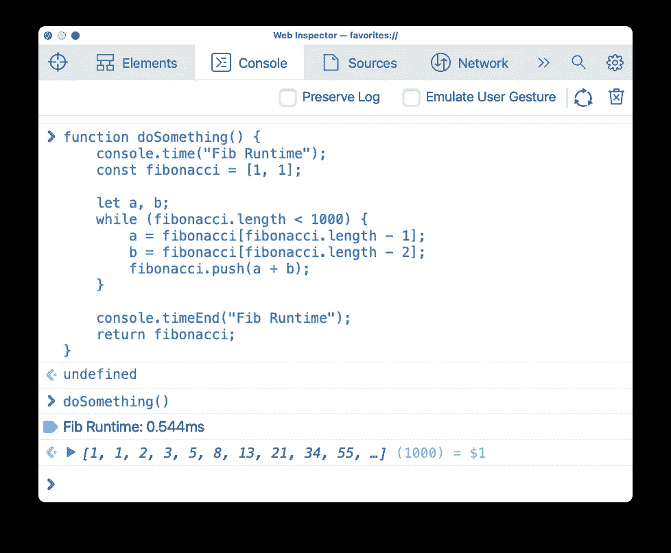**

**The better way to log function runtimes**

**使用`console.time`和`console.endTime`比使用`Date`功能和常规`console.log`更准确。此外，跟踪你的计时器要容易得多。**

# **4) Dir 函数**

**当您将 HTML 元素记录到控制台时，您会看到字符串形式的 HTML 元素。您可以像在 DOM 检查器中一样检查字符串。**

**读取 HTML 元素可能会有所帮助，但有时您可能希望查看所有对象属性；`console.dir`对此有所帮助:**

**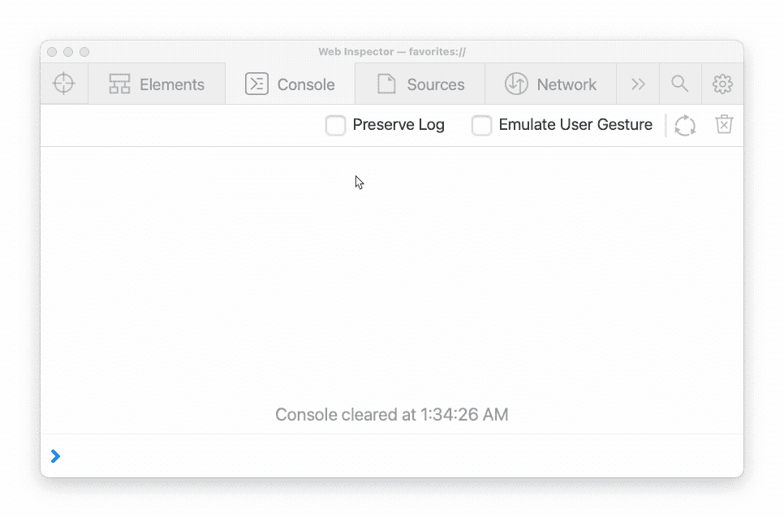**

**Logging an element the normal way vs using the “dir” function**

**希望你喜欢这篇文章。试着在你自己的代码中使用这些`console`函数，让我知道你有多喜欢它们！**

***更多内容看* [***说白了就是***](https://plainenglish.io/) *。报名参加我们的* [***免费每周简讯***](http://newsletter.plainenglish.io/) *。关注我们* [***推特***](https://twitter.com/inPlainEngHQ) *和*[***LinkedIn***](https://www.linkedin.com/company/inplainenglish/)*。查看我们的* [***社区不和谐***](https://discord.gg/GtDtUAvyhW) *加入我们的* [***人才集体***](https://inplainenglish.pallet.com/talent/welcome) *。***