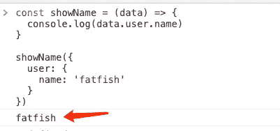
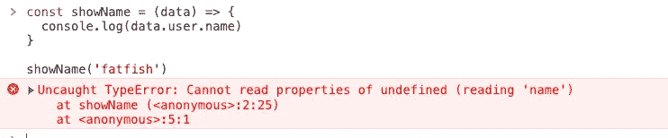
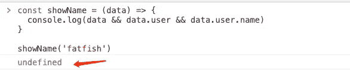
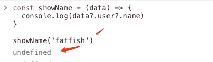

# 大多数开发人员不知道的 4 个很酷的现代 JavaScript 特性

> 原文：<https://javascript.plainenglish.io/4-cool-modern-javascript-features-most-developers-dont-know-about-c2c45104427c?source=collection_archive---------0----------------------->

## 编写简明 JavaScript 代码的技巧


Photo by [Kelly Sikkema](https://unsplash.com/@kellysikkema?utm_source=medium&utm_medium=referral) on [Unsplash](https://unsplash.com?utm_source=medium&utm_medium=referral)

**JavaScript 在不断进化升级，越来越多的新特性让我们的代码变得简洁。**本文将介绍 4 种不常见的 JavaScript 操作符。让我们一起来研究它们。

# 1.#可选链接运算符

这个功能很优秀。它防止我的代码出错，甚至可以大大简化它。

**例如**

我们想打印一个人的名字，我打赌这很容易！没有什么困难。

```
const showName = (data) => {
  console.log(data.user.name)
}

showName({
  user: {
    name: 'fatfish'
  }
})
```



可惜我太粗心，没有按`showName`要求通过法律参数，发生了意外。

```
const showName = (data) => {
  console.log(data.user.name)
}

showName('fatfish')
```



你必须是一个有经验的软件工程师，所以很容易写出如下代码。

```
const showName = (data) => {
  console.log(data && data.user && data.user.name)
}

showName('fatfish')
```



有没有更优雅的方式？如果`data`的层次嵌套太深，就会是一段臭代码。

```
const showName = (data) => {
  console.log(data && data.user && data.user.person ...)
}

showName('fatfish')
```

不要担心，可选的链接操作符可以帮助我们。下面的代码不再抛出错误，这很好。

```
const showName = (data) => {
  console.log(data?.user?.name)
}

showName('fatfish')
```



`What is an Optional Chaining Operator?`

(来自 [mdn](https://developer.mozilla.org/en-US/docs/Web/JavaScript/Reference/Operators/Optional_chaining) )可选链接运算符(？。)访问对象的属性或调用函数。如果对象未定义或为空，则返回 undefined，而不是抛出错误。

```
const adventurer = {
  name: 'Alice',
  cat: {
    name: 'Dinah'
  }
}

const dogName = adventurer?.dog?.name

console.log(dogName)
// expected output: undefined
console.log(adventurer.someNonExistentMethod?.())
// expected output: undefined
```

# 2.#无效合并赋值(？？=)

(来自 [mdn](https://developer.mozilla.org/en-US/docs/Web/JavaScript/Reference/Operators/Nullish_coalescing_assignment) )无效合并赋值(x？？= y)运算符仅在 x 为 null(null 或未定义)时赋值。

```
const obj = {
  name: 'fatfish'
}

obj.name ??= 'medium'
obj.age ??= 100
console.log(obj.name, obj.age)
```


是的，只有`age`属性是最后分配的。

朋友们，你们觉得哪一行代码更接近`??=`的功能？答案 1 还是答案 2？

```
// 1.
x ?? (x = y)
// 2.
x = x ?? y
```

我想你猜对了，答案是 1。

因为答案 2 在任何情况下都会赋值 x，但是答案 1 只有在 x 为真的时候才会赋值。

**它能为我们做什么？**

那么我们能用它做什么呢？是的，它可以做和默认参数完全一样的事情。

```
const showName = (name) => {
  name ??= 'fatfish'
  console.log(name)
}

showName('medium') // medium
showName() // fatfish
```

**几乎等同于下面的代码。**

```
const showName = (name = 'fatfish') => {
  console.log(name)
}

showName('medium') // medium
showName() // fatfish
```

好吧，我得承认写默认参数让我更开心。

# 3.#逻辑 OR 赋值(||=)

(来自 [mdn](https://developer.mozilla.org/en-US/docs/Web/JavaScript/Reference/Operators/Logical_OR_assignment) )逻辑 OR 赋值(x ||= y)运算符仅在 x 为 falsy 时赋值。

```
const obj = {
  name: '',
  age: 0
}

obj.name ||= 'fatfish'
obj.age ||= 100

console.log(obj.name, obj.age) // fatfish 100
```

如你所见，我的朋友们，当 x 的值为假值时，赋值成功。

**它能为我们做什么？**

( [from mdn](https://developer.mozilla.org/en-US/docs/Web/JavaScript/Reference/Operators/Logical_OR_assignment) )如果“歌词”元素为空，则显示默认值:

```
document.getElementById("lyrics").textContent ||= "No lyrics."
```

在这里，短路是特别有益的，因为元素不会被不必要地更新，也不会导致不必要的副作用，比如额外的解析或呈现工作，或者焦点丢失等。

# 4.#逻辑 AND 赋值(&&=)

(来自 [mdn](https://developer.mozilla.org/en-US/docs/Web/JavaScript/Reference/Operators/Logical_AND_assignment) )逻辑 AND 赋值(x & & = y)运算符仅在 x 为真时赋值。

与`Logical OR assignment (||=)`相反，只有 x 为真才会被正确赋值。

```
const obj = {
  name: 'fatfish',
  age: 100
}

obj.name &&= 'medium' // medium
obj.age &&= 1000 // 1000
console.log(obj.name, obj.age) // medium 1000
```

# 最后

**感谢阅读。**我期待期待您的关注和阅读更多高质量的文章。

[](/interviewer-what-happened-to-npm-run-xxx-cdcb37dbaf44) [## 采访者:“npm 跑 xxx”怎么了？

### 一个大多数人都不知道的秘密。

javascript.plainenglish.io](/interviewer-what-happened-to-npm-run-xxx-cdcb37dbaf44) [](/my-boss-you-dont-know-react-at-all-f493970f1807) [## 我老板:你根本不知道反应！😠

### 你必须知道的 React 的 3 种错误用法。

javascript.plainenglish.io](/my-boss-you-dont-know-react-at-all-f493970f1807) [](/8-cool-github-tricks-to-make-you-look-like-a-senior-developer-ab8fe9ae9b14) [## 让你看起来像高级开发人员的 8 个很酷的 GitHub 技巧

### 使用 GitHub 可以做的 8 件很酷的事情

javascript.plainenglish.io](/8-cool-github-tricks-to-make-you-look-like-a-senior-developer-ab8fe9ae9b14) [](/interviewer-can-x-x-return-true-in-javascript-7e1d1fa7b5cd) [## 面试官:可以“x！== x "在 JavaScript 中返回 True？

### 你可能不知道的五个神奇的 JavaScript 知识点！

javascript.plainenglish.io](/interviewer-can-x-x-return-true-in-javascript-7e1d1fa7b5cd) [](/what-does-123-tostring-length-123-print-out-in-javascript-2c804a414325) [## 123['toString']。length + 123)用 JavaScript 打印出来？

### 95%的前端开发者回答错误的问题。

javascript.plainenglish.io](/what-does-123-tostring-length-123-print-out-in-javascript-2c804a414325) 

*更多内容请看*[***plain English . io***](https://plainenglish.io/)*。报名参加我们的* [***免费周报***](http://newsletter.plainenglish.io/) *。关注我们关于*[***Twitter***](https://twitter.com/inPlainEngHQ)[***LinkedIn***](https://www.linkedin.com/company/inplainenglish/)*[***YouTube***](https://www.youtube.com/channel/UCtipWUghju290NWcn8jhyAw)*[***不和***](https://discord.gg/GtDtUAvyhW) *。对增长黑客感兴趣？检查* [***电路***](https://circuit.ooo/) *。***