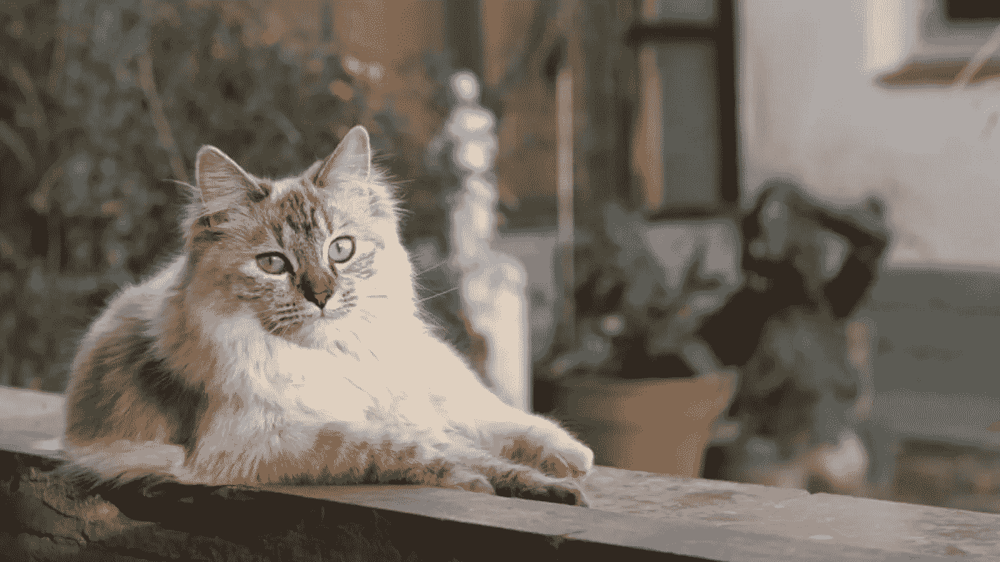
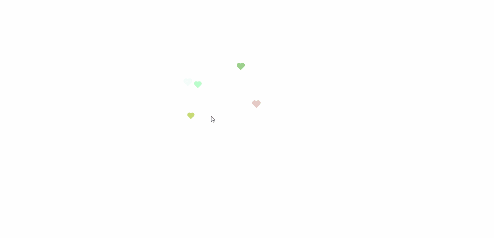
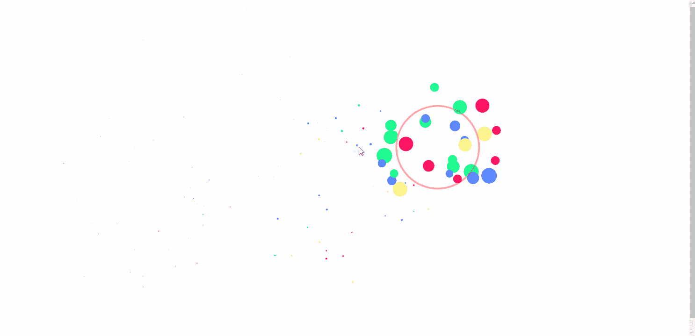
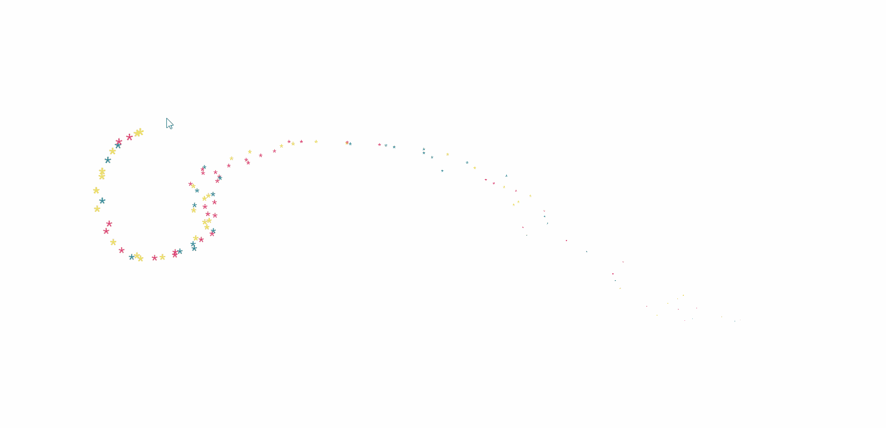
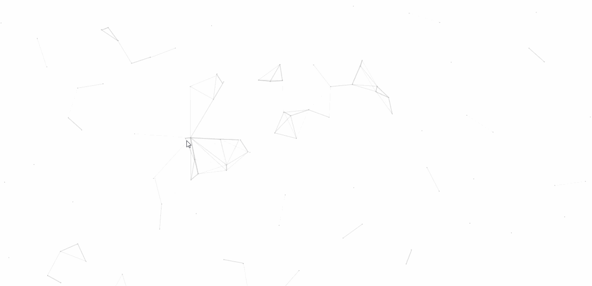

# 4 酷炫的鼠标点击效果和页面

> 原文：<https://javascript.plainenglish.io/4-cool-mouse-click-effects-and-pages-1373c95360c5?source=collection_archive---------7----------------------->



最近我发现了一些令人兴奋的鼠标点击效果。当鼠标点击网页时，你可以看到很酷的结果。这些特效的实现过程基本是根据屏幕宽度和高度计算特效区域，然后监控鼠标位置，然后 CSS 绘制点击效果，监控鼠标移动，删除旧的特效，产生新的特效位置。

现在，让我们直接看看效果和代码

1.  **点击鼠标弹出一个心形**



```
<!DOCTYPE html>
<html lang="en">
<head>
    <meta charset="UTF-8">
    <meta name="viewport" content="width=device-width, initial-scale=1.0">
    <title>Document</title>
</head>

<body>
    <!-- Web page mouse click effect (love) -->
    <script type="text/javascript">
         ! function (e, t, a) {
            function r() {
                for (var e = 0; e < s.length; e++) s[e].alpha <= 0 ? (t.body.removeChild(s[e].el), s.splice(e, 1)) : (s[
                        e].y--, s[e].scale += .004, s[e].alpha -= .013, s[e].el.style.cssText = "left:" + s[e].x +
                    "px;top:" + s[e].y + "px;opacity:" + s[e].alpha + ";transform:scale(" + s[e].scale + "," + s[e]
                    .scale + ") rotate(45deg);background:" + s[e].color + ";z-index:99999");
                requestAnimationFrame(r)
            }

            function n() {
                var t = "function" == typeof e.onclick && e.onclick;
                e.onclick = function (e) {
                    t && t(), o(e)
                }
            }

            function o(e) {
                var a = t.createElement("div");
                a.className = "heart", s.push({
                    el: a,
                    x: e.clientX - 5,
                    y: e.clientY - 5,
                    scale: 1,
                    alpha: 1,
                    color: c()
                }), t.body.appendChild(a)
            }

            function i(e) {
                var a = t.createElement("style");
                a.type = "text/css";
                try {
                    a.appendChild(t.createTextNode(e))
                } catch (t) {
                    a.styleSheet.cssText = e
                }
                t.getElementsByTagName("head")[0].appendChild(a)
            }

            function c() {
                return "rgb(" + ~~(255 * Math.random()) + "," + ~~(255 * Math.random()) + "," + ~~(255 * Math
                    .random()) + ")"
            }
            var s = [];
            e.requestAnimationFrame = e.requestAnimationFrame || e.webkitRequestAnimationFrame || e
                .mozRequestAnimationFrame || e.oRequestAnimationFrame || e.msRequestAnimationFrame || function (e) {
                    setTimeout(e, 1e3 / 60)
                }, i(
                    ".heart{width: 10px;height: 10px;position: fixed;background: #f00;transform: rotate(45deg);-webkit-transform: rotate(45deg);-moz-transform: rotate(45deg);}.heart:after,.heart:before{content: '';width: inherit;height: inherit;background: inherit;border-radius: 50%;-webkit-border-radius: 50%;-moz-border-radius: 50%;position: fixed;}.heart:after{top: -5px;}.heart:before{left: -5px;}"
                ), n(), r()
        }(window, document);
    </script>
</body>

</html>
```

**2。鼠标点击弹出烟花涟漪**



```
<html>
<head>

</head>
<body>
<script>
function clickEffect() {
  let balls = [];
  let longPressed = false;
  let longPress;
  let multiplier = 0;
  let width, height;
  let origin;
  let normal;
  let ctx;
  const colours = ["#F73859", "#14FFEC", "#00E0FF", "#FF99FE", "#FAF15D"];
  const canvas = document.createElement("canvas");
  document.body.appendChild(canvas);
  canvas.setAttribute("style", "width: 100%; height: 100%; top: 0; left: 0; z-index: 99999; position: fixed; pointer-events: none;");
  const pointer = document.createElement("span");
  pointer.classList.add("pointer");
  document.body.appendChild(pointer);

  if (canvas.getContext && window.addEventListener) {
    ctx = canvas.getContext("2d");
    updateSize();
    window.addEventListener('resize', updateSize, false);
    loop();
    window.addEventListener("mousedown", function(e) {
      pushBalls(randBetween(10, 20), e.clientX, e.clientY);
      document.body.classList.add("is-pressed");
      longPress = setTimeout(function(){
        document.body.classList.add("is-longpress");
        longPressed = true;
      }, 500);
    }, false);
    window.addEventListener("mouseup", function(e) {
      clearInterval(longPress);
      if (longPressed == true) {
        document.body.classList.remove("is-longpress");
        pushBalls(randBetween(50 + Math.ceil(multiplier), 100 + Math.ceil(multiplier)), e.clientX, e.clientY);
        longPressed = false;
      }
      document.body.classList.remove("is-pressed");
    }, false);
    window.addEventListener("mousemove", function(e) {
      let x = e.clientX;
      let y = e.clientY;
      pointer.style.top = y + "px";
      pointer.style.left = x + "px";
    }, false);
  } else {
    console.log("canvas or addEventListener is unsupported!");
  }

  function updateSize() {
    canvas.width = window.innerWidth * 2;
    canvas.height = window.innerHeight * 2;
    canvas.style.width = window.innerWidth + 'px';
    canvas.style.height = window.innerHeight + 'px';
    ctx.scale(2, 2);
    width = (canvas.width = window.innerWidth);
    height = (canvas.height = window.innerHeight);
    origin = {
      x: width / 2,
      y: height / 2
    };
    normal = {
      x: width / 2,
      y: height / 2
    };
  }
  class Ball {
    constructor(x = origin.x, y = origin.y) {
      this.x = x;
      this.y = y;
      this.angle = Math.PI * 2 * Math.random();
      if (longPressed == true) {
        this.multiplier = randBetween(14 + multiplier, 15 + multiplier);
      } else {
        this.multiplier = randBetween(6, 12);
      }
      this.vx = (this.multiplier + Math.random() * 0.5) * Math.cos(this.angle);
      this.vy = (this.multiplier + Math.random() * 0.5) * Math.sin(this.angle);
      this.r = randBetween(8, 12) + 3 * Math.random();
      this.color = colours[Math.floor(Math.random() * colours.length)];
    }
    update() {
      this.x += this.vx - normal.x;
      this.y += this.vy - normal.y;
      normal.x = -2 / window.innerWidth * Math.sin(this.angle);
      normal.y = -2 / window.innerHeight * Math.cos(this.angle);
      this.r -= 0.3;
      this.vx *= 0.9;
      this.vy *= 0.9;
    }
  }

  function pushBalls(count = 1, x = origin.x, y = origin.y) {
    for (let i = 0; i < count; i++) {
      balls.push(new Ball(x, y));
    }
  }

  function randBetween(min, max) {
    return Math.floor(Math.random() * max) + min;
  }

  function loop() {
    ctx.fillStyle = "rgba(255, 255, 255, 0)";
    ctx.clearRect(0, 0, canvas.width, canvas.height);
    for (let i = 0; i < balls.length; i++) {
      let b = balls[i];
      if (b.r < 0) continue;
      ctx.fillStyle = b.color;
      ctx.beginPath();
      ctx.arc(b.x, b.y, b.r, 0, Math.PI * 2, false);
      ctx.fill();
      b.update();
    }
    if (longPressed == true) {
      multiplier += 0.2;
    } else if (!longPressed && multiplier >= 0) {
      multiplier -= 0.4;
    }
    removeBall();
    requestAnimationFrame(loop);
  }

  function removeBall() {
    for (let i = 0; i < balls.length; i++) {
      let b = balls[i];
      if (b.x + b.r < 0 || b.x - b.r > width || b.y + b.r < 0 || b.y - b.r > height || b.r < 0) {
        balls.splice(i, 1);
      }
    }
  }
}
clickEffect();//call effect function
</script>
</body>
</html>
```

**3。鼠标星迹跟随**



```
<!DOCTYPE html>
<html lang="en">

<head>

</head>

<body>
    <span class="js-cursor-container"></span>
    <script>
        (function fairyDustCursor() {

            var possibleColors = ["#D61C59", "#E7D84B", "#1B8798"]
            var width = window.innerWidth;
            var height = window.innerHeight;
            var cursor = { x: width / 2, y: width / 2 };
            var particles = [];

            function init() {
                bindEvents();
                loop();
            }

            // Bind events that are needed
            function bindEvents() {
                document.addEventListener('mousemove', onMouseMove);
                window.addEventListener('resize', onWindowResize);
            }

            function onWindowResize(e) {
                width = window.innerWidth;
                height = window.innerHeight;
            }

            function onMouseMove(e) {
                cursor.x = e.clientX;
                cursor.y = e.clientY;

                addParticle(cursor.x, cursor.y, possibleColors[Math.floor(Math.random() * possibleColors.length)]);
            }

            function addParticle(x, y, color) {
                var particle = new Particle();
                particle.init(x, y, color);
                particles.push(particle);
            }

            function updateParticles() {

                // Updated
                for (var i = 0; i < particles.length; i++) {
                    particles[i].update();
                }

                // Remove dead particles
                for (var i = particles.length - 1; i >= 0; i--) {
                    if (particles[i].lifeSpan < 0) {
                        particles[i].die();
                        particles.splice(i, 1);
                    }
                }

            }

            function loop() {
                requestAnimationFrame(loop);
                updateParticles();
            }

            /**
             * Particles
             */

            function Particle() {

                this.character = "*";
                this.lifeSpan = 120; //ms
                this.initialStyles = {
                    "position": "fixed",
                    "display": "inline-block",
                    "top": "0px",
                    "left": "0px",
                    "pointerEvents": "none",
                    "touch-action": "none",
                    "z-index": "10000000",
                    "fontSize": "25px",
                    "will-change": "transform"
                };

                // Init, and set properties
                this.init = function (x, y, color) {

                    this.velocity = {
                        x: (Math.random() < 0.5 ? -1 : 1) * (Math.random() / 2),
                        y: 1
                    };

                    this.position = { x: x + 10, y: y + 10 };
                    this.initialStyles.color = color;

                    this.element = document.createElement('span');
                    this.element.innerHTML = this.character;
                    applyProperties(this.element, this.initialStyles);
                    this.update();

                    document.querySelector('.js-cursor-container').appendChild(this.element);
                };

                this.update = function () {
                    this.position.x += this.velocity.x;
                    this.position.y += this.velocity.y;
                    this.lifeSpan--;

                    this.element.style.transform = "translate3d(" + this.position.x + "px," + this.position.y + "px, 0) scale(" + (this.lifeSpan / 120) + ")";
                }

                this.die = function () {
                    this.element.parentNode.removeChild(this.element);
                }

            }

            /**
             * Utils
             */

            // Applies css `properties` to an element.
            function applyProperties(target, properties) {
                for (var key in properties) {
                    target.style[key] = properties[key];
                }
            }

            if (!('ontouchstart' in window || navigator.msMaxTouchPoints)) init();
        })();    
    </script>
</body>

</html>
```

**4。蜘蛛网效果**



```
<!DOCTYPE html>
<html lang="en">
<head>
    <meta charset="UTF-8">
    <meta http-equiv="X-UA-Compatible" content="IE=edge">
    <meta name="viewport" content="width=device-width, initial-scale=1.0">
    <title>Document</title>
</head>
<body>

</body>
<script>
    !function () {
    function n(n, e, t) {
        return n.getAttribute(e) || t
    }

    function e(n) {
        return document.getElementsByTagName(n)
    }

    function t() {
        var t = e("script"), o = t.length, i = t[o - 1];
        return {l: o, z: n(i, "zIndex", -1), o: n(i, "opacity", .5), c: n(i, "color", "0,0,0"), n: n(i, "count", 99)}
    }

    function o() {
        a = m.width = window.innerWidth || document.documentElement.clientWidth || document.body.clientWidth, c = m.height = window.innerHeight || document.documentElement.clientHeight || document.body.clientHeight
    }

    function i() {
        r.clearRect(0, 0, a, c);
        var n, e, t, o, m, l;
        s.forEach(function (i, x) {
            for (i.x += i.xa, i.y += i.ya, i.xa *= i.x > a || i.x < 0 ? -1 : 1, i.ya *= i.y > c || i.y < 0 ? -1 : 1, r.fillRect(i.x - .5, i.y - .5, 1, 1), e = x + 1; e < u.length; e++) n = u[e], null !== n.x && null !== n.y && (o = i.x - n.x, m = i.y - n.y, l = o * o + m * m, l < n.max && (n === y && l >= n.max / 2 && (i.x -= .03 * o, i.y -= .03 * m), t = (n.max - l) / n.max, r.beginPath(), r.lineWidth = t / 2, r.strokeStyle = "rgba(" + d.c + "," + (t + .2) + ")", r.moveTo(i.x, i.y), r.lineTo(n.x, n.y), r.stroke()))
        }), x(i)
    }

    var a, c, u, m = document.createElement("canvas"), d = t(), l = "c_n" + d.l, r = m.getContext("2d"),
        x = window.requestAnimationFrame || window.webkitRequestAnimationFrame || window.mozRequestAnimationFrame || window.oRequestAnimationFrame || window.msRequestAnimationFrame || function (n) {
            window.setTimeout(n, 1e3 / 45)
        }, w = Math.random, y = {x: null, y: null, max: 2e4};
    m.id = l, m.style.cssText = "position:fixed;top:0;left:0;z-index:" + d.z + ";opacity:" + d.o, e("body")[0].appendChild(m), o(), window.onresize = o, window.onmousemove = function (n) {
        n = n || window.event, y.x = n.clientX, y.y = n.clientY
    }, window.onmouseout = function () {
        y.x = null, y.y = null
    };
    for (var s = [], f = 0; d.n > f; f++) {
        var h = w() * a, g = w() * c, v = 2 * w() - 1, p = 2 * w() - 1;
        s.push({x: h, y: g, xa: v, ya: p, max: 6e3})
    }
    u = s.concat([y]), setTimeout(function () {
        i()
    }, 100)
}();
</script>
</html>
```

这个题目到此为止。感谢您的阅读。

*更多内容看* [***说白了。报名参加我们的***](https://plainenglish.io/) **[***免费周报***](http://newsletter.plainenglish.io/) *。关注我们关于* [***推特***](https://twitter.com/inPlainEngHQ) ，[***LinkedIn***](https://www.linkedin.com/company/inplainenglish/)*，*[***YouTube***](https://www.youtube.com/channel/UCtipWUghju290NWcn8jhyAw)*，以及* [***不和***](https://discord.gg/GtDtUAvyhW) *。对增长黑客感兴趣？检查* [***电路***](https://circuit.ooo/) *。***