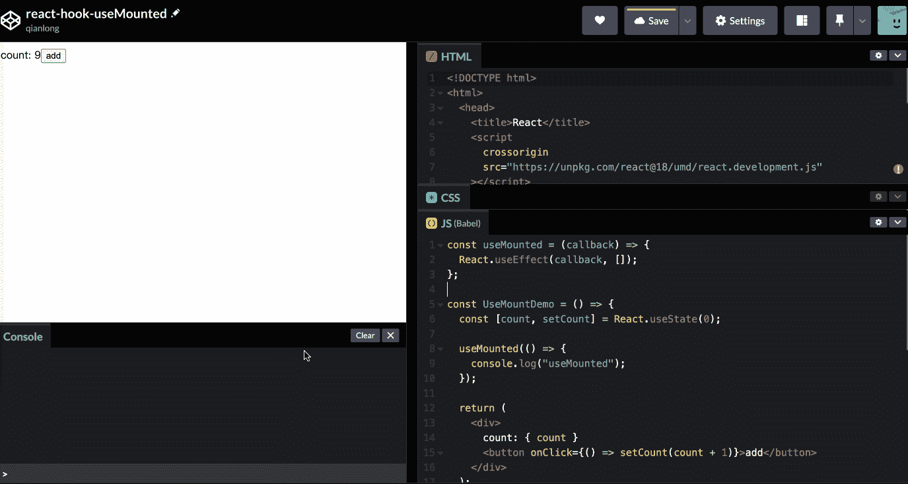
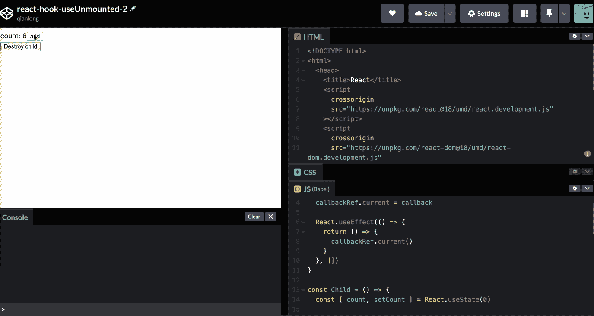
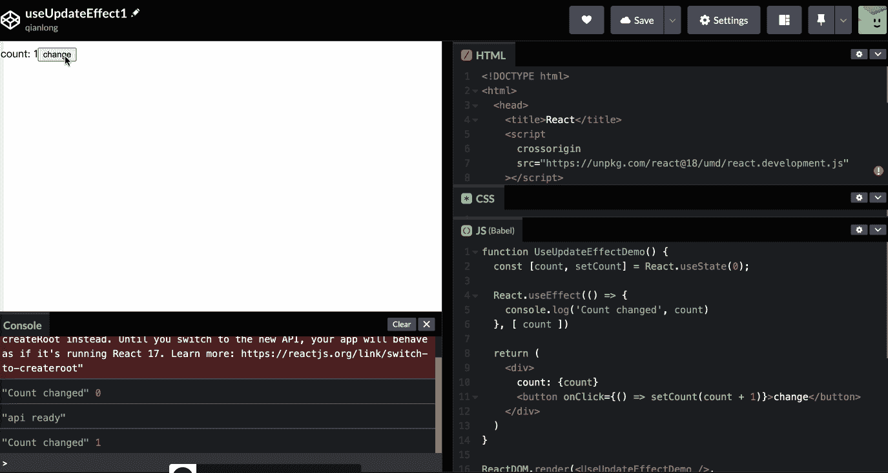
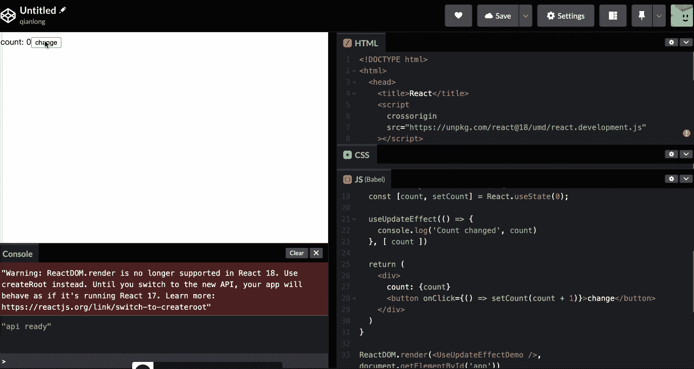
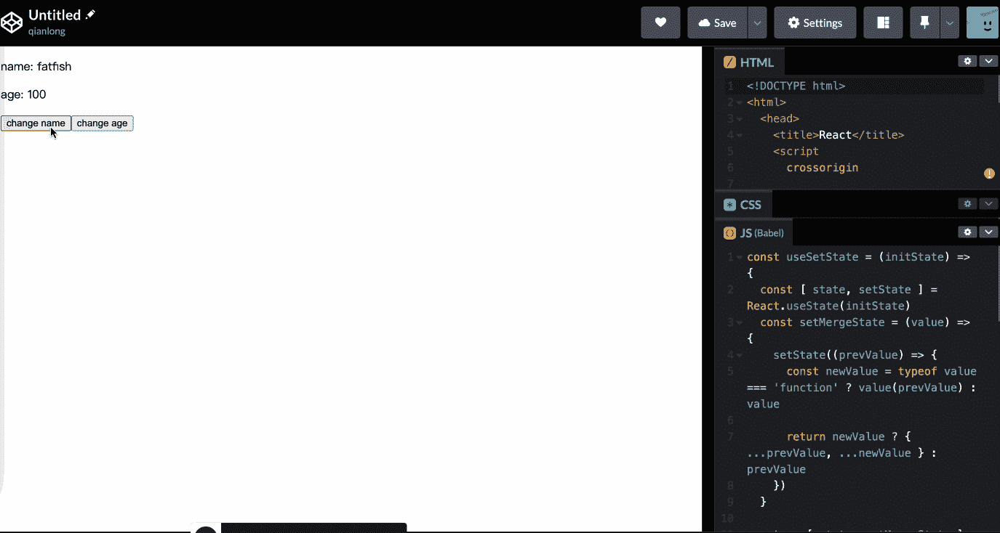

# 每个开发人员都应该知道的 4 个自定义 React 挂钩

> 原文：<https://javascript.plainenglish.io/4-custom-react-hooks-every-developer-should-know-5d85ce681c6a?source=collection_archive---------0----------------------->

## 4 个自定义反应挂钩，提高您的效率

Photo by [Lautaro Andreani](https://unsplash.com/@lautaroandreani?utm_source=medium&utm_medium=referral) on [Unsplash](https://unsplash.com?utm_source=medium&utm_medium=referral)

朋友们，如果我早点学会这 4 个 React 钩子，也许我能写出更漂亮的代码。

它们极大地提高了我的工作效率和代码的可伸缩性和可读性。你一定也想学吧？

# 1.使用数量

以前我经常写这种风格的代码，组件刚渲染的时候，需要发送一个请求或者做一些其他的逻辑，大概是这样的。

这很简单，不是吗？但是它有一个很大的缺点:*语义不够清晰，即使我们传入一个空数组。*

所以我们可以定制一个名为`useMount`的钩子，只在组件第一次呈现的时候执行回调函数。

**源代码**

**示例**

组件重新渲染时，`useMount`不再执行，太好了！

# 2.使用卸载

当组件被卸载时，我们想要触发一些逻辑，比如清除计时器，我们将编写如下代码:

显然，我们不能直接看到它是在组件卸载时执行的。

所以我们需要设计一个钩子，`useUnmount`来指示当组件被卸载时回调函数被执行。

**源代码**

真的这么简单吗？让我们看看如何使用它。

**例子**

当“子”组件被销毁时，确实执行了“useUnmount”回调函数，但是我们发现`count`的值是初始值 0，而不是 10，**是什么原因导致这样错误的结果？**

是由`useEffect`中的关闭机制造成的，因为第一次渲染卸载组件时传入的函数，为了得到实时状态，我们需要用`useRef`来实现。

太好了，我们还可以在组件被破坏时正确获取`count`的值。

# 3.useUpdateEffect

有时，我们希望只在依赖关系改变后才执行逻辑代码。这样写能达到目的吗？

不幸的是，一旦组件被安装，“计数”将打印出“0”。“计数”改变后如何执行回调函数？

太好了，这是一个超级实用的挂钩。

# 4.使用设置状态

当我们编写一个`class`组件时，我们使用`this.setState`来操作组件的数据，而`setState`在操作对象类型数据时往往更方便。

能否实现一个`useSetState`钩子来简化`setPerson`的操作？这很简单，只要围绕`useState`做一个简单的包装就可以了。

**例子**

# 最后

**感谢阅读。**我期待期待您的关注和阅读更多高质量的文章。

 [## 采访者:“npm 跑 xxx”怎么了？

### 一个大多数人都不知道的秘密。

javascript.plainenglish.io](/interviewer-what-happened-to-npm-run-xxx-cdcb37dbaf44)  [## 我老板:你根本不知道反应！😠

### 你必须知道的 React 的 3 种错误用法。

javascript.plainenglish.io](/my-boss-you-dont-know-react-at-all-f493970f1807)  [## 让你看起来像高级开发人员的 8 个很酷的 GitHub 技巧

### 使用 GitHub 可以做的 8 件很酷的事情

javascript.plainenglish.io](/8-cool-github-tricks-to-make-you-look-like-a-senior-developer-ab8fe9ae9b14)  [## 面试官:可以“x！== x "在 JavaScript 中返回 True？

### 你可能不知道的五个神奇的 JavaScript 知识点！

javascript.plainenglish.io](/interviewer-can-x-x-return-true-in-javascript-7e1d1fa7b5cd)  [## 123['toString']。length + 123)用 JavaScript 打印出来？

### 95%的前端开发者回答错误的问题。

javascript.plainenglish.io](/what-does-123-tostring-length-123-print-out-in-javascript-2c804a414325) 

*更多内容看* [***说白了。报名参加我们的***](https://plainenglish.io/) **[***免费周报***](http://newsletter.plainenglish.io/) *。关注我们关于* [***推特***](https://twitter.com/inPlainEngHQ) ，[***LinkedIn***](https://www.linkedin.com/company/inplainenglish/)*，*[***YouTube***](https://www.youtube.com/channel/UCtipWUghju290NWcn8jhyAw)*，* [***不和***](https://discord.gg/GtDtUAvyhW) *。对增长黑客感兴趣？检查* [***电路***](https://circuit.ooo/) *。***