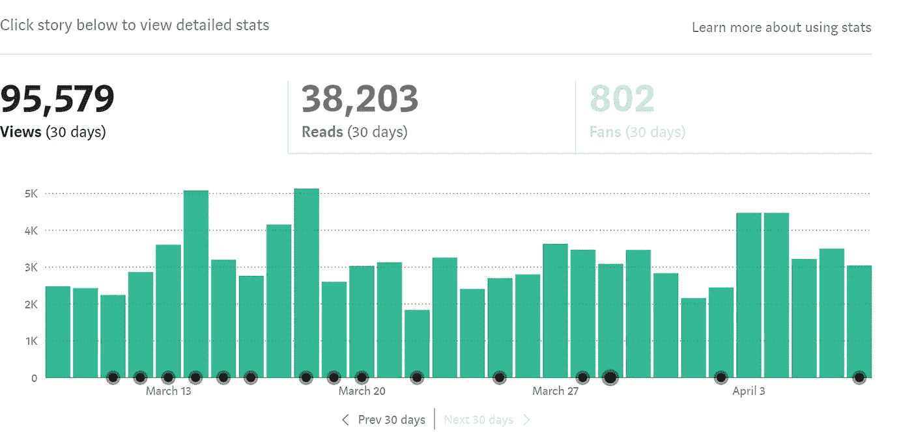

# 4 种简单且有保证的方法可以让你作为程序员赚更多的钱

> 原文：<https://javascript.plainenglish.io/4-easy-and-guaranteed-ways-you-can-make-more-money-as-a-programmer-62448616244a?source=collection_archive---------4----------------------->

## 不会有诸如自由职业或创建课程之类的废话。

Photo by [Joshua Rawson-Harris](https://unsplash.com/@joshrh19?utm_source=medium&utm_medium=referral) on [Unsplash](https://unsplash.com?utm_source=medium&utm_medium=referral)

如果你对标题有任何疑问，让我为你澄清一下。

在我看来，这个世界上的一切都很简单。如何看待某项技能以及我们对它的热情取决于我们自己。

比如我叔叔认为房地产很容易，我的一些朋友认为编程很简单，我爸爸认为找工作很简单。因此，它取决于我们的观点。

你明白了，对吧？

让我们言归正传。我说的简单方法到底是什么意思？嗯，这意味着你可以利用你的专业知识(更具体地说，你的技术技能)轻松赚钱，我甚至会给你看一些证据。你甚至不需要花很多钱来实现它。

这也不意味着任何形式的被动收入或减少工作量。此外，我不想给你任何错误的幻想，你会马上赚很多钱，因为事实并非如此。

那我们开始吧。

**1。成为 Web3 开发者**

我是一名 web 开发人员，我对 Web3、区块链和元宇宙的底层技术非常着迷，这些技术在我们的社会中引起了如此大的轰动。

更令人着迷的是，对于像我这样的 web 开发人员来说，成为 web3 开发人员很简单。

我不需要学习很多技术；我所要做的就是用 web 技术来使用 Solidity、Truffle 和 Ganache。

根据各种调查，大多数人不知道 Defi、Web3 或 CBDC。此外，不要认为区块链行业只在金融领域或数字支付领域有用。事情远不止如此。

投票机制、供应链管理、监管合规、审计、物联网操作系统以及更多应用都可能从中受益。

请允许我向你透露一些秘密。大多数科技巨头已经开始开发与区块链相关的技术。此外，大多数企业已经开始为 web3 开发者支付更多费用。

简而言之，如果你是一名网站开发人员，你可以很快了解区块链技术，并利用它来赚更多的钱。

**2。打造 NFT 市场、行业或应用**

当我看到像[为什么一只动画飞猫的身体卖了将近 60 万美元](https://www.nytimes.com/2021/02/22/business/nft-nba-top-shot-crypto.html)这样的标题时，我变得有点紧张。我认为 NFTs 的概念是一个诡计，它依赖于运气。

也许你对这些也有同样的想法。

然而，我们大多数人都错了。

NFTs 的概念远远超出了我们的想象；如果实施得当，它有可能扰乱许多部门。除了数字艺术品，NFT 还可以有多种应用方式。

例如，确保物品的真实性。假冒食品，如补充剂和药物，是当前全球关注的问题；NFTs 可以通过跟踪和追踪食品来帮助解决这个问题。想象一下，扫描您在线购买的营养补充剂上的二维码，并查看该补充剂从生产到交付的完整路径。

甚至[的音乐人也可能采用](https://www.forbes.com/sites/forbestechcouncil/2021/06/29/beyond-the-hype-examining-practical-use-cases-for-nfts/?sh=68031f693343)智能合同技术将他们的版权转让给 NFTs，确保他们的歌曲每次播放时都能得到报酬。

还有很多更多的例子。

为什么这么简单？因为其他人没有很好地利用 NFT。因此，如果你是一名程序员，你可以为各种目的建立一个 NFT 市场。

**3。写作技术内容**

不管你相不相信，编程是你职业生涯早期最好的职业。不需要钱，不需要学位，不需要关系；所需要的只是你的技能。

因此，大多数新人正在获得编程能力。他们需要相关的内容，如果你是程序员，你可以提供这些内容。

作为一名程序员，你可能会与互联网世界分享你的知识和技能以换取金钱。

请不要掉以轻心。

这是我的一些数据。

对我来说，这超出了我的想象；每天大约有 3000 人阅读我的文章。

我是说，这难道不令人着迷吗？

简而言之，如果你是一名程序员，你可以很容易地开发内容并从中获利。

您可以撰写各种主题，包括编程、web 开发、应用程序开发、网络安全、加密货币等等。

**4。投资股票和密码**

你可能想知道一个程序员如何通过投资股票和加密货币赚钱。

而且，在我看来，你可以因为你的编程生涯，赚到比普通投资者更多的钱。

但是具体怎么做呢？毕竟，你是一个比别人使用更多技术工具的程序员。如果一个人不精通技术，他就不知道 AWS、Azure 和其他类似的技术。

同样，当新软件发布时，我们(作为程序员)是第一个使用它的人。

此外，股市有大量的技术业务，让你可以简单地做研究，优化你的回报。

类似地，如果你可以很容易地调查一家基于加密货币的公司、他们的工作和他们的商业理念。而且，根据你的经验，你可以优化你的利润，因为我们比其他人更了解这个领域。

让我给你举个例子:我上个月在亚马逊上投了一些钱，现在它的回报率是 15%。同样，我投资了一些中小型公司，我的利润接近 28%。

同样，我研究了各种加密货币，决定不投资它们。

它不会让你赚很多钱，但它会给你提供赚更多钱的可能性。

**让我们总结一下**

信不信由你，在我看来，这些是程序员增加利润的一些最简单的方法。我甚至提供了证据来支持我所说的。

其中一些技能相对较新，几乎没有竞争。其他的，比如技术内容写作，不需要任何编程以外的技能。

*就这样——谢谢。*

[*如果你喜欢阅读这样的故事，并想帮助我成为一名作家，请考虑成为一名中等成员*](https://nitinfab.medium.com/membership) *。每月花费 5 美元，你可以无限制地访问媒体内容。如果你通过我的链接注册，我会得到一点佣金。*

 [## 如何用这种简单的方法每月多赚 500 美元

### 没有废话，请不要期待博客，YouTube，自由职业者，或媒体

javascript.plainenglish.io](/how-to-make-an-extra-500-every-month-with-this-easy-side-hustle-bac6fd48cdfe) 

*更多内容请看* [***说白了就是***](https://plainenglish.io/) *。报名参加我们的* [***免费每周简讯***](http://newsletter.plainenglish.io/) *。关注我们* [***推特***](https://twitter.com/inPlainEngHQ) *和*[***LinkedIn***](https://www.linkedin.com/company/inplainenglish/)*。加入我们的* [***社区不和谐***](https://discord.gg/GtDtUAvyhW) *。*