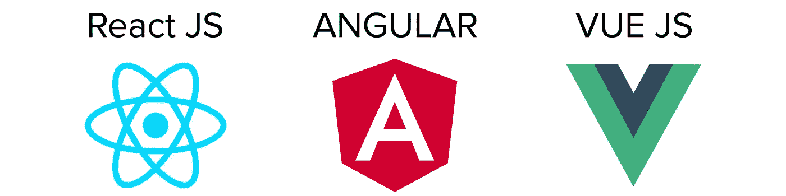
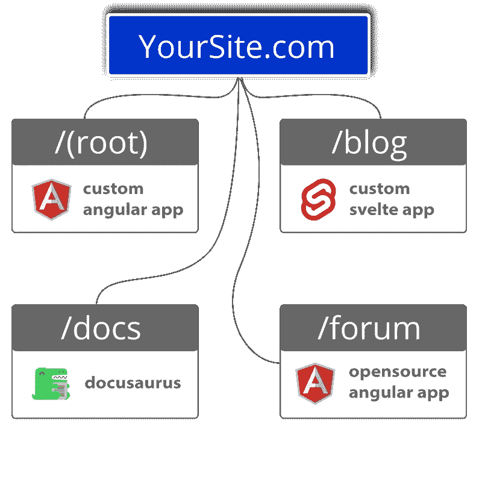

# 2022 年你应该知道的 4 个 JavaScript 框架

> 原文：<https://javascript.plainenglish.io/4-javascript-frameworks-you-should-know-in-2022-f6573ef0716f?source=collection_archive---------11----------------------->

## JavaScript 开发者应该知道的 4 个框架。

一些公司以走在前沿而自豪。

在 Fathym，我们在微前端方面已经领先了很长时间。

近年来，微前端获得了极大的普及。这只会让事情变得更加美好，因为我们已经努力成为该领域的专家，而其他人也开始迎头赶上。

我们从利用微前端的强大优势中受益匪浅，我们一直在努力帮助其他人在该领域发展。让我们沿着这条路走一走，我们帮助向您介绍微前端和您应该知道的四个奇妙的框架。

## 微前端定义

微前端意味着更小、更敏捷、更自主的前端，而不是老派的做事方式，即单一的前端。

微前端顾名思义。它们是网站前端的多个微型部分，集合在一起提供所有需要的功能、定制和能力。

微前端包括:

*   个体的、独立的、较小的前端。
*   多个团队同时从事他们自己的项目。
*   这意味着更小的增量部署。一个团队不会等待另一个团队来推动他们的部署。
*   更小、更有凝聚力的代码库。这也使得它们更容易维护和更改。
*   允许根据需要扩展团队。
*   给予能力重写，改变或更新部分前端递增。这意味着修复漏洞或改变网站的功能不会迫使网站因维护而关闭。

因为微前端是独立的、整体中较小的部分，所以如果您愿意，可以用不同的 JavaScript 框架创建每个微前端。或者框架和静态站点生成器的混合。

因此，我们引入了任何开发者都应该知道的四个框架。

# 你应该知道的 4 个 JavaScript 框架

## 反应

React 是脸书在 2013 年创建的，Instagram、网飞和 Dropbox 等网站都使用它。

React 的学习曲线远没有 Angular 陡峭，部分原因是它不够健壮。

它比 Angular 需要更长一点的准备时间，但 React 可以比竞争对手更快地交付成品。它还为开发人员提供了现成的工具和大量的库。React 最适合用于单页应用程序(SPAs)以及最终产品周转时间很快的情况。它最出名的不仅仅是它的灵活性，还有更丰富的用户界面，快速渲染，总体上比 Angular 节省时间。有一个很大的支持社区，但是他们也缺乏 Angular 那样可靠的文档。

## 有角的

Angular 是一个 JavaScript 框架——vue . js 和 Svelte 也是如此——而 React 是一个 JavaScript 库。Angular 由谷歌在 2010 年创建并发布，然后在 2016 年重新制作并重新发布。该框架目前被谷歌用于他们的谷歌广告中。

总的来说，Angular 被定义为比 React 和 Vue 具有更陡峭的学习曲线，这很可能是因为它非常复杂。然而，这意味着它也更有可能被用于更大规模的开发。它以代码一致性、高性能和一旦你开始学习就易于使用而闻名。与其他公司相比，他们还拥有大量的文档。Angular 被 HBO、Forbes、PayPal 和 Sony 等大公司使用。

## vue . j

Vue 于 2014 年推出，由尤雨溪开发。这是一个极其简单的开源 JavaScript 框架。

虽然有些人喜欢使用 Angular 或 React，但 Vue 被认为是三者中最容易学习的。它也像这两个竞争对手一样以基于组件的架构为特色，拥有简洁的文档，其微小的尺寸有助于网站运行得更快。

Vue 的受欢迎程度也在上升。

Vue 是最容易学习的 JavaScript 框架之一。事实上，虽然有一些编码经验会更容易建立网站，但一些人认为从 Vue.js 开始没有必要了解任何 JavaScript，而另一些人认为了解一些 JavaScript 基础知识肯定会有所帮助。而且由于 Vue 的尺寸较小，用它构建的网站加载速度会很快。

## 苗条的

与这些其他框架(和库)相比，Svelte 是新出现的，由 Rich Harris 在 2016 年推出。

Svelte 是轻量级的，使用简单，非常容易学习。事实上，有人说它是这里列出的所有四个框架中学习曲线最短的。将 Svelte 与列出的其他三个区别开来的是，它将页面(或应用程序)转换成“构建时的理想 JavaScript ”,而不是在运行时。这意味着当最终用户第一次打开网站和应用程序时，它们的下载/启动速度快得令人难以置信。

## 流行

根据 Stack Overflow 2021 年的调查，Svelte 是最受欢迎的框架，71.47%的受访开发者表示他们喜欢它。

React 第四(69.28%)，Vue 第五(64.41%)，Angular 第九(55.82%)。

当谈到最受欢迎的开发人员——没有使用该框架，但想使用它的开发人员——React 是明显的赢家，有 25.12%的人想要它。Vue 第二(16.69%)，Angular 第四(8.47%)，Svelte 第五(6.57%)。

[在这里阅读更多关于 JavaScript 框架流行的信息。](https://www.fathym.com/blog/articles/2022/april/2022-04-13-micro-frontend-popularity)

## 荣誉奖:盖茨比

Gatsby 实际上不是一个 JavaScript 框架，但它是一个建立在 React 之上的静态站点生成器，你可以在我们的微前端使用它来创建一个伟大的主页、博客，甚至是一个无头 WordPress。

## 加入 Fathym

一些人认为小型团队不需要微前端。但是，我们相信他们[帮助大大小小的团队。](https://www.fathym.com/blog/articles/2022/january/2022-01-20-how-our-microfontends-help-businesses-big-and-small)有些人还说它们会产生不必要的大负载，从而降低下载速度。我们[在这里回应了批评。](https://www.fathym.com/blog/articles/2022/march/2022-03-31-addressing-micro-frontend-criticisms-payload)

我们对微前端的现在和未来感到兴奋。我们邀请您今天就尝试一下。

*最初发表于*[*https://www.fathym.com*](https://www.fathym.com/blog/articles/2022/april/2022-04-21-four-javascript-frameworks-you-should-know)*。*

*更多内容请看* [***说白了就是***](https://plainenglish.io/) *。报名参加我们的* [***免费每周简讯***](http://newsletter.plainenglish.io/) *。关注我们* [***推特***](https://twitter.com/inPlainEngHQ) *和*[***LinkedIn***](https://www.linkedin.com/company/inplainenglish/)*。加入我们的* [***社区不和谐***](https://discord.gg/GtDtUAvyhW) *。*