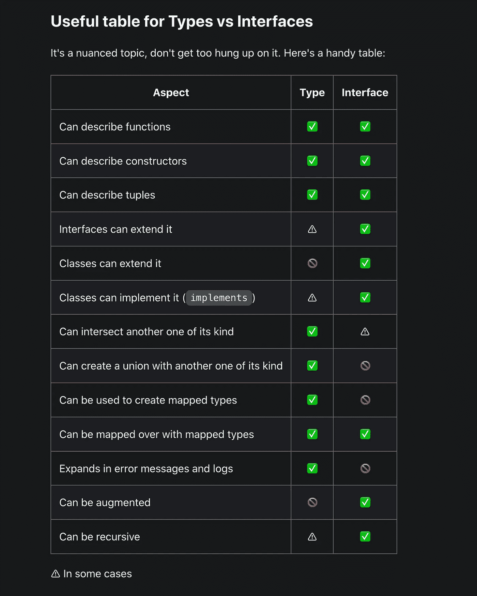

# 用 React 编写打字稿的 4 种黑仔方法

> 原文：<https://javascript.plainenglish.io/4-killer-ways-to-write-typescript-with-react-6a66b32764f1?source=collection_archive---------0----------------------->

## 4 个黑仔打字稿，带反馈提示+ 1 个额外提示


Image by author and Unsplash by [Charles](https://unsplash.com/photos/K4mSJ7kc0As)

**通过在**[**【https://twitter.com/antondevv】**](https://twitter.com/antondevv)**的 Twitter 上关注我，保持反应和打字的前沿。**

享受中等？点击 [**此处**](https://medium.com/@anton.franzen/membership) 获得 [**对介质的完全访问权限**](https://medium.com/@anton.franzen/membership)

使用 React 的 TypeScript 在业界达到了新的高度，但新手很难学习如何使用 React，即使是有经验的开发人员也有问题。

在本文中，我将介绍每个开发人员都应该知道的用 React 编写 TypeScript 的 4 种杀手级方法。

## **1。为传递给组件的属性创建类型别名**

我们为道具创建类型，因为如果我们不这样做的话，用许多开发人员一起工作来构建大型应用程序将是一场噩梦。

如果没有它，您必须猜测您想要访问的 props 的数据类型，或者在文档中查找或询问它们。创建类型别名使得传递属性更容易、开发速度快 10 倍，并减少了意外错误等。

因此，有多种方法可以实现这一点，例如，您可以从一个`.d.ts`文件定义并导出一个全局用户类型，在这种情况下，您可以导入它并将其用作组件的 props 类型。

第二种方法是在 self 中定义组件中的类型，就在编写组件代码的上方，所以这是您如何做的:

```
type Props = {name: string;}
const App = ({name}: Props) => {
return <h1>{props.name}</h1>
}
```

你也可以这样做:

```
type Props = {name: string;}
const *App* =(*props*: *Props*)=>{
*return* <h1>{*props.name*}</h1>;
};
```

## 2.为钩子创建类型

**类型为** `**useState:**`

TypeScript + React 的另一个令人难以置信的事情是，你可以为`useState`创建一个泛型，当你试图用某个值设置状态时，它会告诉你你试图设置的数据类型是否不正确。

例如，如果我们有一个大对象，并为它创建一个类型，然后将类型设置为状态，我们将能够在每次使用状态值时看到状态中有哪些类型，如果我们试图用新值设置状态，它将告诉我们它接受什么类型，并告诉我们在设置状态时是否出错，例如，如果我们使用字符串而不是数字作为 ID，TypeScript 将在编译之前为我们捕捉它。

**所以我们完成它的方法是这样做的:**

```
const App = () => {
const [number, setNumber] = useState<number>(10)}
```

我们在这里做的是将状态设置为一个通用数字；它可以接受任何数字，但不能接受其他数字，如果我们试图将状态设置为其他数字，它会告诉我们问题出在哪里。

您甚至可以为任何想要的状态创建自己的类型或接口，例如为具有大量属性的对象定义类型别名。

**类型为** `**useEffect:**`

对于`useEffect`，我从来没有为它设置过类型，因为它不返回任何东西，我们也不能改变任何东西。

**类型为** `**useMemmo:**`

对于`useMemmo`，我们可以为它设置一个类型，告诉我们它将返回什么值，在这个例子中，它将返回一个字符串。

```
const memmo = useMemo<string>(() => {
}, [state])
```

## 3.HTML 事件和表单的类型

显然，您不必为每个事件指定一个类型。说实话，onClick 会自己推断，因为 TypeScript 大部分时候会替你推断。TypeScript 默认包含 MouseEvent，因此无需手动添加。

但是，如果您的表单有一个`onSubmit`，您将需要指定 React 事件，所以这里有一个带有`onSubmit`的表单的例子。

**onSubmit:**

```
const FormContainer = () => {
  const [name, setName] = useState<string>("")
const submitHandler = **(e: React.FormEvent)** => {
    e.preventDefault()
    console.log("Should submit")}
return (
    <form onSubmit={submitHandler}>
          <input
            type="text"
            value={name}
            onChange={**(e) => setName(e.target.value)**}
            **// inferred as React.ChangeEvent by default
**          />
        <input type="Submit" value="Submit" />
    </form>
  )
}
```

顺便说一句，如果你不太关心事件的类型，你可以使用`React.SyntheticEvent` ，这应该在你不确定事件类型时使用，所以最好的做法是如果你知道类型，就使用它！

## 4.为来自 API 响应的数据创建类型

这是极其有用的！

想象一下，遍历我们从一个 api 获得的房地产列表数组，每个列表有 20 个属性；现在想象用普通的 JavaScript 做这件事，与其他开发人员合作，并将清单传递给各种组件；这将是一件痛苦的事，最终可能会导致意想不到的错误，例如:

在容器中，mount ->获取房地产列表，发出 API 请求->将数据作为道具传递给 Card 组件->道具从 card 组件传递给 HeaderCard 组件。

如果没有这里指定的类型，就很难确定房地产数据的数据类型，而且随着项目的增长，晚上也很难入睡。

您只需在 TypeScript 中为房地产数据指定一个类型，然后在接受它有 props 的组件中向用户类型声明 prop 类型。当你在你的组件中做`data.someProperty`时，你可以马上看到它是什么数据类型。

那么我们如何做到这一点呢？实际上非常简单，我们为数据创建一个类型，如下所示:

```
export type DataResponse = {
name: string;
location: string;
cost: number;
isForSale: boolean;
...
}
```

**在组件中，我们这样做:**

```
// imports
const Listing = ({listing}: DataResponse) => {
return (
<>
<h1>{listing.name}</h1> // would tell us it is a string
...
</>)}
```

顺便说一句，你应该创建一个共享类型文件，在那里你可以创建和导出你在应用程序中使用的类型/接口。

## 额外提示:

**React 应用中应该用** `**type**` **还是** `**interface**` **？**

我认为在 React 应用程序中使用`type`是为了一致性和约束性。但这是一个偏好，使用其中任何一个都可以，但选择 1，你可以在这里阅读更多信息[。](https://react-typescript-cheatsheet.netlify.app/docs/basic/getting-started/basic_type_example#types-or-interfaces)

下面是两者的对比表:



Image by [typescript sheet sheet](https://react-typescript-cheatsheet.netlify.app/docs/basic/getting-started/basic_type_example#types-or-interfaces)

*你好，如果你想体验灵媒，请考虑支持我和所有其他作家，注册成为* [***会员***](https://medium.com/@anton.franzen/membership) *每月 5 美元，以保持独立写作，在这里注册*[***；)***](https://medium.com/@anton.franzen/membership)

除了支持他人，Medium 还可以通过写作和在这里找到家的强大、积极参与的社区来支持你。

## 如果你喜欢这件作品，我希望你也会喜欢:

[](/stop-learning-from-react-tutorials-that-suck-5e2031d9bdc7) [## 停止从糟糕的 React 教程中学习

### 不受欢迎的观点

javascript.plainenglish.io](/stop-learning-from-react-tutorials-that-suck-5e2031d9bdc7) [](/3-micro-lessons-about-npm-47759d85f18c) [## 关于国家预防机制的 3 节微课

### 你会喜欢第三条。

javascript.plainenglish.io](/3-micro-lessons-about-npm-47759d85f18c) [](https://betterprogramming.pub/callbacks-vs-promises-vs-async-await-a-step-by-step-guide-f93d13447604) [## 回调 vs .承诺 vs .异步 Await:逐步指南

### 引擎盖下也有点。

better 编程. pub](https://betterprogramming.pub/callbacks-vs-promises-vs-async-await-a-step-by-step-guide-f93d13447604) 

*更多内容请看*[***plain English . io***](https://plainenglish.io/)*。报名参加我们的* [***免费每周简讯***](http://newsletter.plainenglish.io/) *。关注我们*[***Twitter***](https://twitter.com/inPlainEngHQ)*和*[***LinkedIn***](https://www.linkedin.com/company/inplainenglish/)*。加入我们的* [***社区不和谐***](https://discord.gg/GtDtUAvyhW) *。*