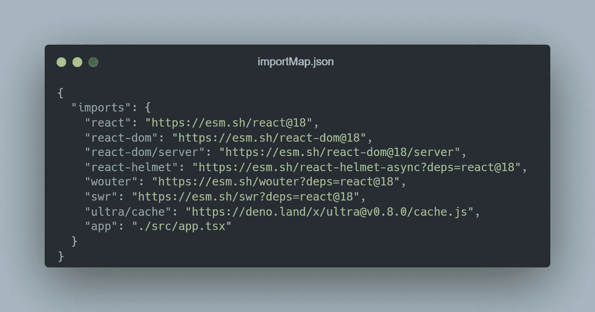
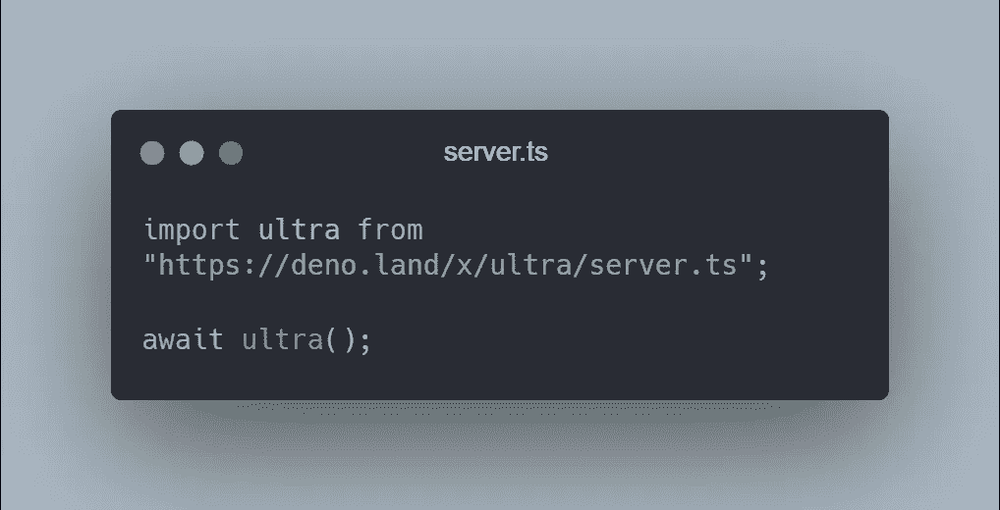
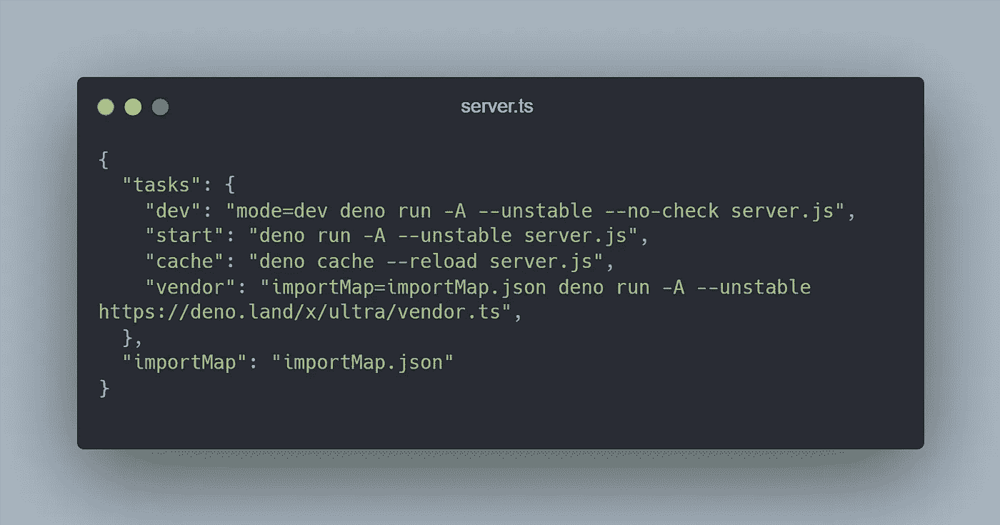

# Ultra 4 分钟指南:一个新的 React Web 框架

> 原文：<https://javascript.plainenglish.io/4-minute-guide-to-ultra-a-new-react-web-framework-7f12a853f58?source=collection_archive---------8----------------------->

## 解开网络捆绑

# 极端主义者

一个现代的 React web 框架在 ***Deno*** 中倾向于浏览器的原生特性&使用 ***ES 模块*** 。此外，它还附带了简洁的数据流&数据，可以在任何地方请求，并且总是可以在服务器上访问。

> 注意:作为一个与 **React** 和 **Deno** 一起工作的新框架，它有一些你在开始之前应该知道的缺点。

*   **CSS 模块:**目前， ***Ultra*** 不支持原生 CSS 模块或 CSS 模块脚本，也没有样式库可以使用，如 ***Tailwind CSS*** 。
*   **命令行界面:**如果你长期使用 *React 框架*，那么***CLIs****是你不可或缺的。在最新版本的 ***Ultra*** 中，它相对于其他框架没有一个合适的 *CLI* 。*

# *特征*

## ***打字稿& JSX 兼容***

*拥有一个支持*类型脚本& JSX* 的前端框架让事情变得更简单，因为它提供了可选的*静态类型*和*类*，这让我们的工作流程变得更容易。*

**

## ***自带权限模块***

*因为它是一个 Deno 项目，所以它拥有 Deno 的所有酷功能，包含了 ***基于权限的*** 安全模块。*

****Ultra 附带以下权限:****

*   *允许开发者为项目使用一个环境变量。*
*   ***允许读取:**通知 Ultra 项目寻找指定的路径。*
*   ***允许写入:**通知 Ultra 项目写入指定路径。*
*   ***Allow-net:** 将 Ultra 添加到开发人员在其项目中使用的***URL***列表中。*

## ***React 18 中的流 HTML***

*当我们用 React 悬念包装我们的组件时，React 不必等待组件开始流 HTML，此时 React 不会呈现我们的组件，而是会发送一个占位符如 ***spinners*** 。*

## *数据提取*

*Ultra 使用 React 的最新版本，这导致平滑的 ***服务器端渲染*** 和通过 ***React 悬念*** 的数据获取能力。*

## *动态 MDX*

*在 Ultra 中，您可以动态地使用 MDX，因为它附带了一个插件，使您能够在服务器上编译 MDX，同时在客户端或前端运行结果。*

## *Ultra 中的惰性路由*

*它使用了 **Wouter** ，这是 React 的一个轻量级的基于钩子的例程解决方案，它还带有一个服务器端集成。*

# *入门指南*

*要使用 Ultra 构建应用程序，请确保您已经在开发机器上安装了 Deno 版本 **1.20.6+** 。要创建一个 *Ultra* 应用程序，只需运行 ***create-ultra-app*** 命令。然而，请注意 create-ultra-app 仍处于早期阶段，因此目前它还不是一个完整的解决方案。*

> ****注意:*** *你会发现在项目的根目录下有一个****import map . JSON****文件，看起来就是这样。**

**

*   *在这里，我们可以看到多个属性，其中**‘app’**指的是应用程序的入口点，其余的是运行 Ultra 所需的*依赖项*。*

## *基本命令*

*   ***"dev":** 该命令启动开发服务器并强制重新导入 ESM 文件，同时使其能够在保存时重新加载。*
*   ***【开始】:**启用生产模式，使用缓存的 ***ESM*** 导入，而不是 ***WebSocket*** 重载器。*
*   ***"cache":** 刷新 **server.js 的 Deno 缓存，**如果您在供应商和 CDN 导入地图之间交换时遇到问题，此命令会派上用场。*
*   ***【厂商】:**一个有用的命令当你必须部署应用的时候，这个命令会把依赖项下载到**。ultra/x"** 目录并创建一个 **vendorMap.json** 导入映射文件。*

## *超项目的结构*

*Ultra 项目由这些最小文件组成:*

*   ***server.ts:** 负责运行 Ultra 的服务器。*

**

*   ***src/app.tsx:** 这个文件包含所有最基本的导入和入门代码。*
*   ***importMap.json:** 包含项目的所有依赖项。*
*   ***deno.json:** 这包含了您在使用 Ultra 时需要的已定义任务。*

**

## *部署*

*Ultra 应用程序可以使用 **Docker** 或 **Deno Deploy、**进行部署，如果您正在考虑使用 Docker，请确保 Docker 文件支持供应商提供的依赖项，并将 **deno:1.20.6+** 作为基础映像。*

*然而， *Deno Deploy* 允许你运行 **JavaScript** 和 **TypeScript** ，因为它带有 *V8 运行时*和最小终端。此外，它支持 Deno Deploy GitHub 动作，让您在 Deno 显示器上提供静态文件。*

* [## CSS 中的 z 索引

### 3 分钟解释 z 指数和堆叠指数

javascript.plainenglish.io](/z-index-in-css-6576cfdaa3ad)  [## 4 对你不知道存在的成分作出反应

### 构建一个脱颖而出的 React 应用程序。

javascript.plainenglish.io](/4-react-components-you-didnt-know-existed-bbdfecd62178)  [## 2022 年，作为一名自学成才的开发者，你应该知道的四大技能

javascript.plainenglish.io](/top-4-skills-you-should-know-as-a-self-taught-developer-in-2022-58a2eb5fc26f) 

*更多内容看* [***说白了。报名参加我们的***](https://plainenglish.io/) **[***免费周报***](http://newsletter.plainenglish.io/) *。关注我们关于* [***推特***](https://twitter.com/inPlainEngHQ) ，[***LinkedIn***](https://www.linkedin.com/company/inplainenglish/)*，*[***YouTube***](https://www.youtube.com/channel/UCtipWUghju290NWcn8jhyAw)*，以及* [***不和***](https://discord.gg/GtDtUAvyhW) *。****