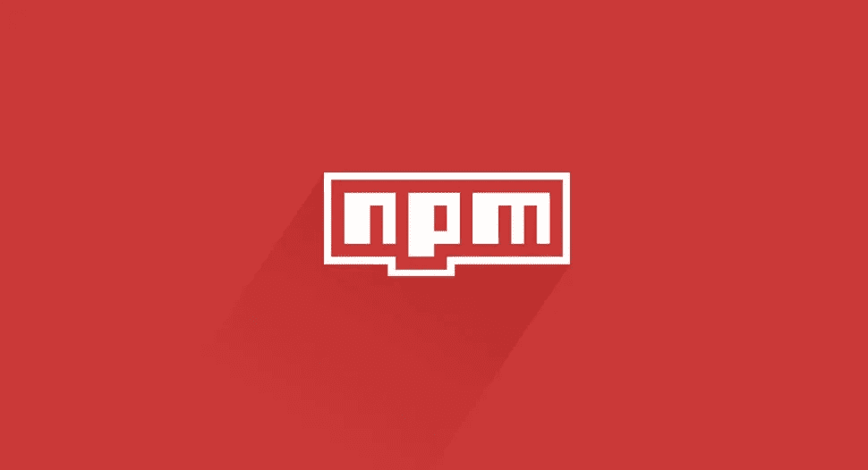

# 您从未使用过的 4 个 Node.js 库

> 原文：<https://javascript.plainenglish.io/4-node-js-libraries-you-never-knew-you-used-fa129c89efcc?source=collection_archive---------12----------------------->

每次你通过你最喜欢的包管理器下载一个库，它会自动卷进一大堆依赖项。其中一些依赖项被如此多的软件包使用，以至于每周都有数百万次下载。

在本文中，您将发现一些正在秘密地为您最受欢迎的库提供支持的库！

# 🛠

Lodash 是一个 JavaScript 实用程序库，它提供了许多方法，让您的 JavaScript 生活变得更加简单。

Lodash 以非常高效的方式执行重复性任务。将一个数组分割成特定数量的块，或者获取多个数组中唯一的所有项目。

这个库已经存在于常规的 JavaScript 中，但是很快被移植到 Node.js 上，因为它非常强大。这个 Node.js 端口非常受欢迎，以至于每周下载量超过了**4000 万次**！

# [Commander.js](https://www.npmjs.com/package/commander) 👾

每个都与 Node.js 中某处的命令行界面交互？它很有可能是由 Commander.js 提供支持的。这是一个工具包，可以让您轻松创建自己的 CLI 脚本，其中包含参数和集成的帮助命令，就在 Node.js 中。

由于简单的语法和强大的支持，它是许多开发人员的首选。给它一个稳定的**8000 万周下载量**，非常令人印象深刻！

# [粉笔](https://www.npmjs.com/package/chalk)🌈

虽然你已经可以使用终端输出一些基本信息，但如果我们可以用不同的颜色、斜体和粗体来升级它，那不是很好吗？这正是我们使用粉笔的目的！

像 Doppler，Retool 和 Strapi 这样的大赞助商，几乎每个在终端上显示文本的包都使用粉笔！凭借所有这些依赖性，Chalk 设法获得了超过 1 . 7 亿的周下载量。

# [请求](https://www.npmjs.com/package/request)🌐

遗憾的是，Request 已经被弃用了很长一段时间，但这并不意味着它不再被使用。许多包仍然依赖于请求来处理它们的获取，并且从来没有费心去改变它。如果有用，就不要碰！

Request 现在已经被许多其他包取代，比如 [Node-Fetch](https://www.npmjs.com/package/node-fetch) 和 [Axios](npmjs.com/package/axios) ，但是由于所有的依赖关系，这个老前辈仍然每周下载超过 2000 万次！

# 检查你是否使用过它们！

您是否好奇您是否曾经在您的项目中使用过这些包？转到您的任何项目，打开您一直试图远离的 node_modules 文件夹！

我可以向你保证，你会在你的模块中找到至少一个这样的包。我在我的作品集网站上做了检查，这是一个非常简单的 Next.js 应用程序。像这样一个简单的网站利用了 Lodash、Commander.js 和 Chalk。想象一下在更大的应用程序中会发现什么！

祝你有创意的一天！💛

*更多内容看* [***说白了。报名参加我们的***](https://plainenglish.io/) **[***免费周报***](http://newsletter.plainenglish.io/) *。关注我们关于*[***Twitter***](https://twitter.com/inPlainEngHQ)*和*[***LinkedIn***](https://www.linkedin.com/company/inplainenglish/)*。查看我们的* [***社区不和谐***](https://discord.gg/GtDtUAvyhW) *，加入我们的* [***人才集体***](https://inplainenglish.pallet.com/talent/welcome) *。***