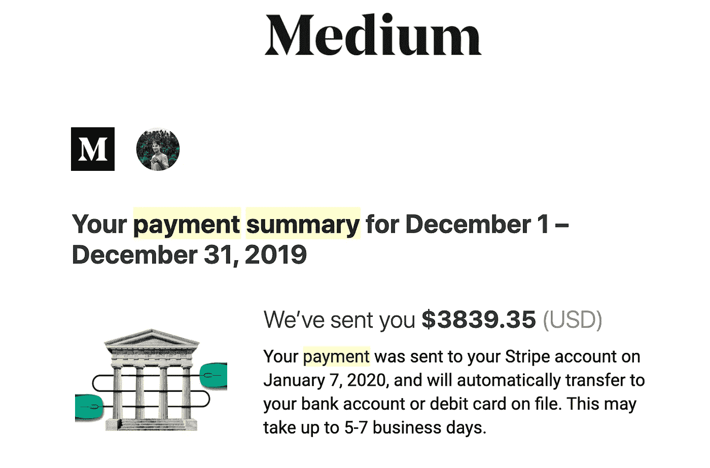

# 程序员的 4 个被动收入流

> 原文：<https://javascript.plainenglish.io/4-passive-income-streams-for-a-programmer-2fe593ac2df9?source=collection_archive---------2----------------------->

## 学习如何作为一名程序员产生被动收入。

source: Unsplash

每个人都想赚额外的钱，但由于时间限制和工作，我们不能给额外的时间来赚额外的钱。

想想看，你在睡觉，一些资源只是为你赚钱。这多酷啊！不是吗？这种收入被称为被动收入。有很多被动挣钱的方法，但是就像你是一个程序员一样，所以我今天向你展示作为一个程序员如何被动挣钱！😃 👇👇

# 1.销售软件和数字资产。💻

**卖软件:**卖软件可以是被动挣钱的最好方式。慢慢来，构建可以解决特定问题的软件。有很多像**应用商店/游戏商店**、**主题森林、代码峡谷**这样的市场，你可以在那里出售你的软件。好的软件可以成为你一生被动收入的来源。

**数字资产:**你可以建立自己的数字资产来获取收入，例如电子书。你可以制作一本关于编程技巧、开发者指南和更多包含你的编程经验的主题的电子书。这本电子书怎么会成为你的被动收入呢？在 gum road**gum road**上发布这本电子书，并获得终生的被动收入。

**提示💁‍♀️:** 卖你的软件找到你的利基。销售你的数字产品，扩大你的受众。你可以在**[**Twitter**](https://twitter.com/AvangerRuhul)上增加你的受众，这很好。**

# **2.开始写✍博客**

**作为一个程序员，你已经是一个好读者了。每天你都在网上阅读文档和解决方案。现在轮到你成为你所知道的作家了。你知道一个好的读者可以成为一个好的作家。**

**对于被动收入来说，Medium 是最好的博客网站之一。你可以从你的文章中赚一辈子的钱。为此，您需要成为合作伙伴计划的成员。好像刚开始挣钱很难。一篇文章可能会产生 200-1000 美元，甚至更多，如果它能吸引大量的读者！。**

****

**source: mediummastery**

**这不仅仅是媒介的问题。你也可以开始你的个人博客网站。有许多博客可以通过编程/技术写作赚钱。**

**其中有[tutorialspoint.com](https://www.tutorialspoint.com/about/tutorials_writing.htm)[vonage.com](https://developer.nexmo.com/spotlight/)[digitalocean.com](https://www.digitalocean.com/community/pages/write-for-digitalocean)等等。**

# ****3。开始你自己的 YouTube 频道👨‍🏫****

**作为一个程序员，你可以开一个 youtube 频道。你可以上传你的内容。你可以一石二鸟。这将增加你的技能，因为当你打算制作关于编程的内容时，你会学到很多东西，另一方面，这是你一生的长期收入来源。**

****

**source: Unsplash**

**1K 订阅者和 4k 小时观看时间视频可以从 youtube 中获得。**

**也可以在 Udemy 等教育平台开始教学，可以挣钱。**

# **4.在线自由职业者**

**自由职业是最受欢迎的额外收入方式之一，也是最灵活的方式之一。**

**作为一名程序员自由职业者，你可以选择你接手的项目和客户。有适合任何你最喜欢的编程语言和你能想到的技能的自由职业者。**

**有很多自由职业者平台，你可以通过 Upwork、Fiverr 等开始赚取兼职收入。**

**所以请记住**如果你想挣钱，就去敲挣钱的门。****

***关注我上*[*LinkedIn*](https://www.linkedin.com/in/ruhulcse/)*，*[***Twitter***](https://twitter.com/AvangerRuhul)**

***更多内容看* [***说白了。报名参加我们的***](http://plainenglish.io/)***[***免费每周简讯***](http://newsletter.plainenglish.io/) *。在我们的* [***社区***](https://discord.gg/GtDtUAvyhW) *获得独家获得写作机会和建议。******