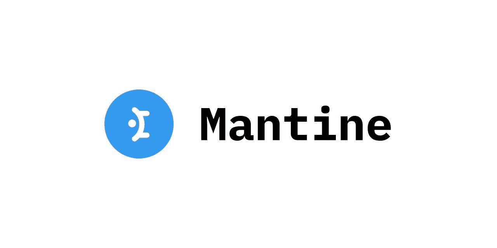

# 4 对你不知道存在的成分作出反应

> 原文：<https://javascript.plainenglish.io/4-react-components-you-didnt-know-existed-bbdfecd62178?source=collection_archive---------1----------------------->

## 构建一个脱颖而出的 React 应用程序。

## [1。Mantine](https://t.co/tV5YgCavK9)

您可以将这个库称为构建复杂的 React 应用程序时需要的组件选集。Mantine 由所有的 React 组件和钩子组成，开发人员大部分时间都必须从头开始构建。使用 Mantine，你可以比以往任何时候都更快地构建可访问的 web 应用程序，因为它带有 ***100+*** 可定制的组件和挂钩。

*   核心组件如*&***时间选择器、复选框、滑块****&****多选输入*** 都很容易使用和访问，没有任何错误。*
*   *使用黑暗主题非常简单，你只需要配置一行代码就可以将黑暗模式应用到你的 **React** 应用程序中。*
*   *在构建 React 应用程序的大部分时间里，开发人员苦于缺乏内置的 React 挂钩，有了 Mantine 你就不用担心这个问题了。它配有现代应用所需的所有必要的挂钩。*
*   *如果你正在构建一个 web 应用程序，那么拥有一个通知系统总是一个很大的优势，有了这个库，你可以使用与你的主题无缝集成的全功能通知。*

## *[2。易反应作物](https://t.co/XYIpNccICJ)*

**

*React 组件使您能够裁剪**图像** & **视频**通过简单的交互&您可以轻松地将裁剪功能添加到 React 应用程序中。*

*   *为了将 *react-easy-crop* 用于基本用途，您必须使用带有**位置样式的裁剪器:绝对**。注意 *Cropper* 将占用其父元素的全部空间，因此您必须将它放在使用***position:relative***的元素中，否则它将填满整个页面。*

## *[3。反应-丰富多彩](https://t.co/W0A2HlpWL1)*

**

*当谈到添加小功能时，开发人员总是更喜欢小而轻量级的库，这些库使用起来既快又简单。react-colorful 是一个用于***React***&***Preact***应用程序的小型拾色器组件，允许您立即添加一个漂亮的拾色器组件。*

*   *很小( ***2.8KB Gzipped*** )，甚至比 ***react-color*** 还轻。*
*   *此外，*tree-shake able*意味着只有您使用的部分会被导入到应用程序的包中。*
*   *支持大多数浏览器，开箱即用。*

## *[4。石板](https://t.co/2kK9uL98xb)*

**

*这个目前处于测试状态，所以建议只用于个人项目。有了 Slate，你可以构建支持文本编辑特性的富文本编辑器，比如 **Google Docs** 和 **Dropbox Paper** 。然而，如果我们将 Slate 与其他库如**draft . js**&**Quill**进行比较，它们足以构建简单的文本编辑器，但我们不能构建复杂的文本编辑器(Medium、Google Docs 等)，因为你很可能会遇到更深层次的问题。*

*   *您可以在构建复杂文本编辑器时定制编辑体验，就像我们在 *Medium* 或 *Dropbox* 中所做的那样。*
*   *Slate 的文档模型就像 ***DOM*** 本身一样，这意味着创建复杂的组件，如**表格**或**嵌套块**对于高级用例来说很容易构建。由于这个原因，事情非常简单，因为我们只有一个层次。*

* [## CSS 视窗单元 3 分钟指南

### 前所未有地使用 CSS

javascript.plainenglish.io](/a-3-minute-guide-to-css-viewport-units-39b3dc019113)  [## 如何写出人们想读的 Dev 文章

### 在我的中型博客上获得 50 万点击率后的写作技巧

javascript.plainenglish.io](/how-to-write-dev-articles-that-people-want-to-read-66f35bd471c5)  [## 6 个最佳反应数据可视化库

### 立即升级您的 React 项目

javascript.plainenglish.io](/6-best-react-data-visualization-libraries-fc155b573168) 

*更多内容请看*[***plain English . io***](https://plainenglish.io/)*。报名参加我们的* [***免费每周简讯***](http://newsletter.plainenglish.io/) *。关注我们* [***推特***](https://twitter.com/inPlainEngHQ) *和*[***LinkedIn***](https://www.linkedin.com/company/inplainenglish/)*。加入我们的* [***社区不和谐***](https://discord.gg/GtDtUAvyhW) *。**