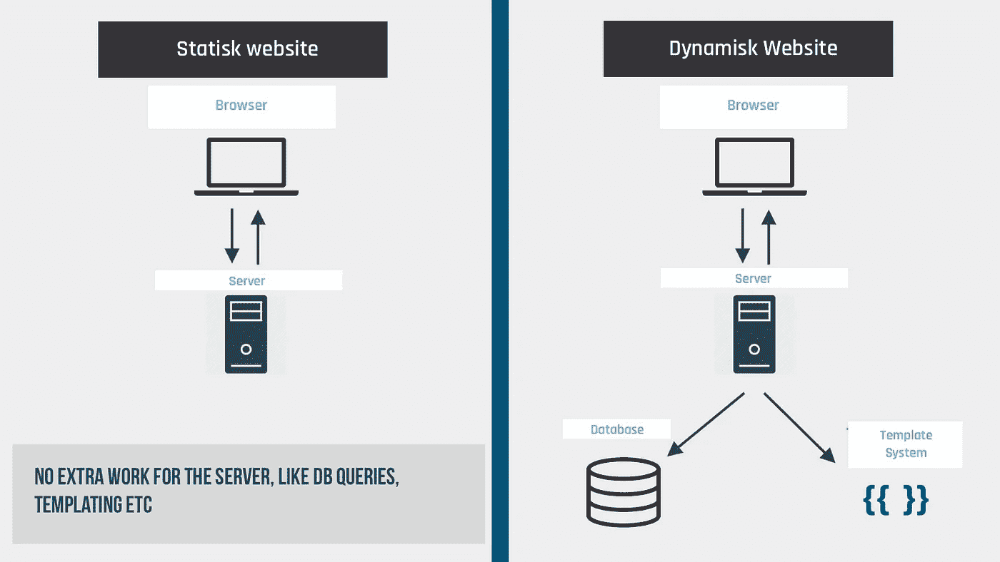

# 你应该为你的下一个项目考虑一个静态网站的 4 个理由

> 原文：<https://javascript.plainenglish.io/4-reasons-why-you-should-consider-a-static-website-for-your-next-project-bbf73ae90065?source=collection_archive---------15----------------------->

在过去的几年里，静态网站已经成为 web 开发中的新热点，这是有充分理由的。

每天都看到越来越多的人选择把自己的传统网站转换成静态网站。首先，我们说静态网站是讲什么的，它静态的时候实际上能容纳动态内容吗？

静态并不意味着它是完全静态的，没有任何动态内容。简而言之，这意味着您的网站由预先构建的文件组成，如服务器提供的 HTML、CSS 和 JavaScript 文件。您可能以前听说过 JAMstack 这个术语。

**JAMstack** 是 JavaScript，APIs &标记的简称。JAMstack 应用程序的特点是更容易扩展，而且几乎没有开发成本。此外，它们的速度快如闪电，但在本文后面会有更多介绍。

JAMstack 的另一个优势是，许多传统上由后端处理的功能已经外包给了客户端(浏览器)，从 web 开发人员的角度来看，这简化了工作流程。

***动态网站*** 是服务器处理传入请求的地方，之后服务器生成要在客户机(浏览器)中呈现的内容。

***动态—由服务器动态生成并动态交付的文件*** ，这也意味着服务器必须做大量的工作。

***静态—由服务器预先生成并交付的文件*** ，无需动态生成，这意味着服务器不必做那么多工作。

我希望它有意义，否则最后在评论区给我一个评论。

对于静态网站，您不需要自己管理的服务器，也不需要编写代码来管理 IIS 或 Apache 服务器。IIS 执行 ASP.NET(c#)代码，Apache 执行 PHP 代码。您所需要的只是一个服务器来传递静态文件，这是所有服务器都可以做到的。我个人用 Netlify。它很容易使用，只能从这里强烈推荐。

明确一点，静态网站也可以有动态内容。我自己的网站( [nickychristensen.dk](https://nickychristensen.dk) )就是证明。所有内容仍然来自 CMS(内容丰富)。每当我从 CMS 向我的网站发布新内容时，就会启动一个进程，生成包含新内容的静态文件。
现在可能是你传统上所知道的动态，但最终还是一样。

这只是静态网站的好处之一。我稍后将回到这一点。

# 表演

作为开发人员，我们总是试图提高我们创建的应用程序的速度。一个快速的网站提供了更好的用户体验。好的用户体验不仅是我们开发者喜欢的，也是最终用户喜欢的。

静态网站比动态网站更有优势，简而言之，TTFB(到达第一个字节的时间)提高了，这意味着从浏览器第一次请求到接收第一个字节所需的时间更少。

需要先生成动态内容，这需要时间！这就是为什么静态网站比动态网站更有优势。静态网站不必处理对数据库等的查询。这一切都发生在编译/构建过程中！

如前所述，有了一个静态网站，你就没有了自己管理服务器的麻烦。你所需要的只是一个可以传送这些文件的服务器/主机(通常你会选择云解决方案)。优点还在于静态文件很容易被服务器复制。

假设你正在使用 Netlify 这样的服务来托管你的网站，你位于美国，但是有很多来自欧洲的访问者。然后像 Netlify 这样的服务将从欧洲的数据中心提供内容，如果你的访问者在美国，你的网站将从美国的数据中心提供服务！

最终，这意味着为您的最终用户提供更快的响应时间和更快的网站。

# 托管超级简单

正如我提到的，托管你的网站与速度有很大关系。静态网站的优势在于你不依赖服务器来支持特定的语言。

世界上任何一台服务器都可以提供这种服务！它只是静态文件，可以非常快速地交付给客户。总结一下。您不必设置服务器、维护、修补和更新服务器。这通常是您在 DevOps 上节省大量成本的地方。最好的云提供商都有为运营静态网站量身定制的套餐。下面你可以看到我自己使用的一些供应商:

*   [**Netlify**](https://www.netlify.com/)
*   [**谷歌云平台**](https://cloud.google.com/)
*   [**Heroku**](https://www.heroku.com/)

# 安全性

自己维护服务器的许多缺点之一是它们必须不断更新！那就是处理安全漏洞之类的事情，防止黑客攻击。如果您必须处理这个问题，也意味着您必须留出人力和预算用于维护。

有了静态网站，你就不用担心这个了。这由您选择的提供商处理。他们才是维护。这是一个巨大的优势，也是降低成本的好方法。

# 开发者体验

静态网站也拥有更好的开发者体验的优势。工作流程变得更快、更顺畅，总体而言，这是一种享受。在许多情况下，处理静态网站时，典型的工作流如下所示:

选择托管提供商(Netlify/Heruku 等) >创建新项目。

*   将项目与您的 GIT repo 连接起来
*   做出您的更改并将其推送到您的 GIT repo
*   通过连续部署，服务器将确保在发生变化时获取最新的代码，并构建所有的静态文件。
*   网站更新了！

一个完全简单顺利的过程。如果我不得不这么说的话，我真的很高兴。

开发人员通常会使用一个框架来简化这个过程。仅举几个例子，可以使用 Nuxt/Next/Gatsby，从而使整个过程更加流畅。

# 结束语

任何新技术/框架都不完全是阳光和彩虹。也有不利之处。静态网站也有缺点。因此，在开始一个新项目之前，考虑这一点并评估你选择的任何方向的利弊总是一个好主意。

静态网站的一些缺点是:

> 每次发布新内容时，您的网站都需要重建。依赖于与数据库通信的表单和其他类型的动态功能(不是所有类型)可能有点棘手。如果您想要 CMS 或其他后端功能，您依赖于第三方系统，如 Contentful，Sanity，Firestore 或类似的服务。

尽管有这些怪癖，我个人并不害怕静态化。
它非常适合大多数项目，如信息网站、企业网站、博客。也就是说，它在很大程度上取决于需求、功能，就像其他一切一样。您对项目和功能需求了解得越多，就越能做出正确的决策。

我也很想在静态网站上听听你的想法？你听说过它吗？你用过它吗？你喜欢用它工作吗？

喜欢这篇文章吗？请点击鼓掌按钮，也一定要看看我的其他几篇文章

 [## 两分钟解释的类型脚本接口

### 在这篇小文章中，您将学习什么是接口，以及如何在您自己的项目中创建和使用接口。

javascript.plainenglish.io](/typescript-interfaces-explained-in-2-minutes-af1637b88bd4)  [## 用 2 分钟的时间用例子解释了类型脚本泛型

### 深入探究类型脚本泛型

javascript.plainenglish.io](/typescript-generics-explained-in-2-minutes-c95e49783347)  [## VueJS —技巧和最佳实践

### 在构建 Vue 应用时，你应该做什么，应该避免什么，通常只是一些简单的好建议

medium.com](https://medium.com/js-dojo/vuejs-tips-best-practices-39d9962bb255)  [## 使用 Nuxt & Contentful 建立网站——一步一步的指南

### 了解如何使用 Vue/NuxtJS 构建一个简单的网站 Contentful——还包括一个 Vuex 示例。

medium.com](https://medium.com/js-dojo/build-a-website-using-nuxt-contentful-a-step-by-step-guide-b75217ccdfa)  [## 通过有用的示例进一步了解 array.reduce()

### 提高您的 javascript 技能，并通过一些有用的示例学习如何使用 Array.prototype.reduce()

medium.com](https://medium.com/front-end-weekly/a-closer-look-on-array-reduce-with-useful-examples-34f222664e66) 

***如果你想找个时间和我聊聊，请关注我的***[***Twitter***](https://twitter.com/nickycdk)***|***[***LinkedIn***](https://www.linkedin.com/in/dknickychristensen/)***或者直接访问我的*** [***网站***](https://nickychristensen.dk/) ***(不过是丹麦文)***

*更多内容请看*[***plain English . io***](http://plainenglish.io/)*。报名参加我们的* [***免费每周简讯***](http://newsletter.plainenglish.io/) *。在我们的* [***社区不和谐***](https://discord.gg/GtDtUAvyhW) *中获得独家写作机会和建议。*