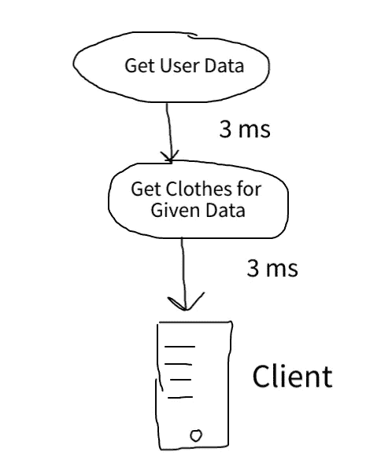
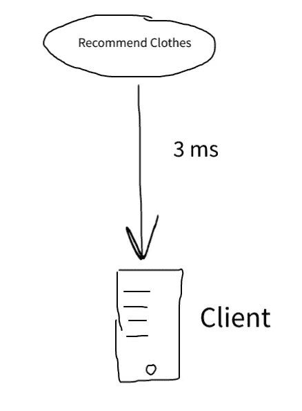
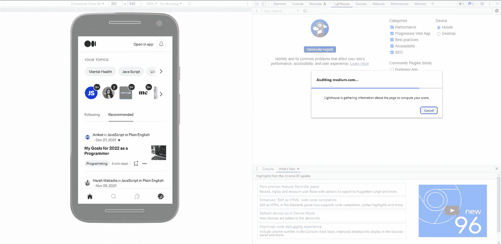
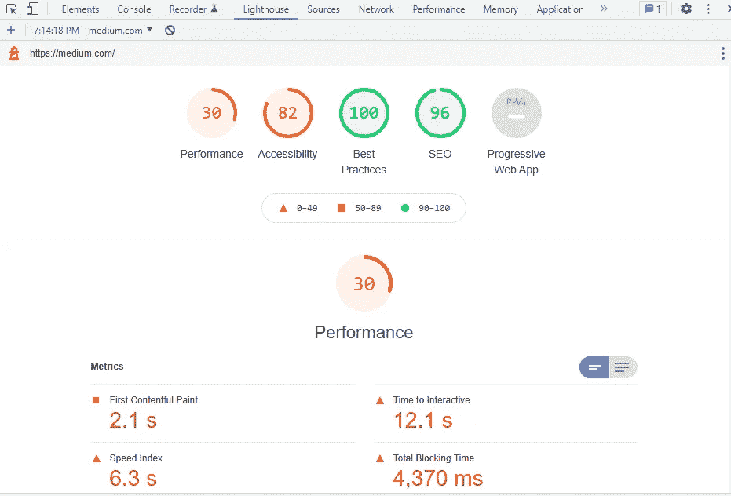
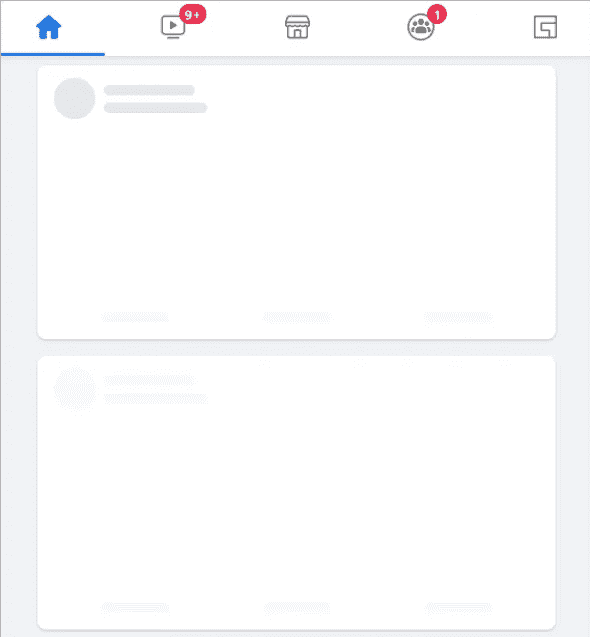

# 4 个简单的步骤，大幅提高您的 Web 应用程序的性能

> 原文：<https://javascript.plainenglish.io/4-simple-steps-to-drastically-improve-your-web-apps-performance-4def42e465b2?source=collection_archive---------12----------------------->

[Interface and Internet by Pixabay](https://pixabay.com/images/id-3614766/)

最初开发应用程序时，很容易忽略性能。然而，它是影响应用程序可用性的最重要的因素之一。我遵循 4 个简单的步骤来提高我的应用程序在我的专业和个人项目中的性能。使用这 4 个步骤，我保证您将看到应用程序性能的重大变化。

# 1.限制网络 API 调用

如果没有正确实现，网络调用是任何 web 应用程序的主要瓶颈。当我们谈论性能时，大多数用户会更看重应用程序加载某些东西所花费的时间。您的 web 应用程序会为某种事务向服务器发出许多 API 调用。然而，每个 API 调用都是有代价的——时间。

那么，你如何确保你没有花费不必要的时间。需要遵循我使用的清单:

**1.1 减少 API 调用**

将事务的大部分工作转移到服务器可以节省大量时间，并减少事务所需的 API 调用次数。

让我们考虑一个例子来更好地理解这一点:
比方说，你有一个服装应用程序，它根据性别、年龄和体型推荐某些衣服。您的数据库中有两个表，一个用于用户，另一个用于所有衣服。现在让我们看一个普通的 API 流程来做这件事

The Total Time is 6 ms

如您所见，我们在这里进行了两次 API 调用:一次用于获取用户数据，以获取用户的性别、尺寸和年龄，另一次用于获取针对该人群的服装。假设网络调用需要 3 毫秒，那么其中一个事务需要 6 毫秒。(实际上，这两种 API 的 API 调用时间会非常不同。这是因为这两个调用之间的有效负载会非常不同。然而，就我们的目的而言，这个假设就足够了。)

我们可以通过创建一个新的 API 来减少一半，这个 API 接受一个用户身份验证令牌，获取用户数据，并基于该数据直接从服装表中获取适当的数据。让我们称这个 API 为“推荐的衣服”。

The Total Time is 3 ms

正如你所看到的，通过引入新的 API 和*将工作转移到服务器上，*我们将交易所需的总时间减少了 50%。

你可能会想，我们为什么要担心 3 毫秒的差异，用户不会知道这种差异。然而，在一个复杂的应用程序中，可能会有许多 API 调用一起发生，使用这种技术，您可以产生重大影响，使您的应用程序比其他应用程序更有优势。

**1.2 减少有效负载**

有效负载是指通过单个 HTTP 调用传输的数据量，它会严重影响应用程序的性能。

假设您需要在个人资料页面上显示用户的数据。现在，个人资料页面可能只显示用户的姓名、年龄和照片。但是，您的 API 可能会返回数据库中 Users 表中的整行。这有很大的不同。您可能已经知道，大多数远程 API，如 Firebase、AWS 和 Loopback(现在被 IBM 称为 StrongLoop)都有过滤器。过滤器可以用来只提取需要的东西。

考虑另一个例子，你有一个社交媒体应用程序，用户在搜索栏中搜索名为“Bob”的人。可能有一千个用户用这个名字。保守地假设，一个用户的数据是一个字节。整个搜索结果有 1000 个字节！那么你要展示整个结果吗？答案是否定的，因为有更好的方法。你的应用一次只能显示这么多用户。比如说，屏幕只显示 10 个用户。因此，一种方法是最初只获取前 15-20 个用户，当用户滚动页面/屏幕时再获取另外 20 个用户。现在，我们将有效载荷从 1000 字节减少到 20 字节。同样，过滤器可以用来做到这一点。我们刚刚将您的应用程序的功能从一辆马车变成了一辆跑车！万岁！

# 2.优化媒体元素

在 web 应用程序中，媒体，无论是图像、视频还是音频，都需要大量的数据，这是很常见的。然而，这是最容易发现和纠正的。它也将极大地提高您的 web 应用程序的性能，而几乎不费吹灰之力。这三者有一个共同点，我称之为 CCR，代表(压缩、缓存和调整大小)。让我们看看如何优化每个媒体元素。

**2.1 优化图像**

从重新查看应用程序中使用的图像开始。对于给定大小的文件，可以以最佳质量压缩图像。我使用[图像压缩器](https://imagecompressor.com/)来压缩开源图像。另一个好工具是 [TinyPNG](https://tinypng.com/) 。对于图像，可能需要调整图像的大小。根据您的 web 应用将要运行的平台，可以创建具有不同图像大小的构件。例如，可以使用“srcset”来设置图像。最后，我们可以缓存图像，我们将在本文后面详细讨论缓存。

**2.2 优化视频**

对于视频，压缩视频并将其导出为 HTML5 支持的多种视频格式是非常重要的。我用一个叫[手刹](https://handbrake.fr/)的 app 来实现这个。如果您的视频已静音，请移除其中的音频。这样做可以节省大量不必要的空间，从而提高性能。接下来，你可以使用名为[免费转换器](https://www.freeconvert.com/video-compressor)(允许高达 1GB)或[在线单一转换器](https://www.media.io/video-compressor.html)(允许高达 500 MB)的在线工具来压缩你的视频。网上还有很多其他工具。接下来，在你的模板中设置视频的大小，最后使用缓存。

**2.3 优化音频**

优化音频非常类似于优化视频文件。音频需要导出为 HTML5 支持的格式。最终对于音频，它归结为压缩。你需要尝试不同的压缩技术，看看哪一种在质量和大小方面最适合你的应用。为此，您可以再次使用[在线 Uniconverter](https://www.media.io/audio-compressor.html) 。最后，您可以使用预加载来预加载您的音频。当“预加载”属性设置为“自动”时，一旦页面完全加载，就会下载音频。当 preload 属性设置为“metadata”时，页面加载时只加载元数据。默认情况下，加载页面时不会加载音频文件。

# 3.使用 Chrome 调试器进行审计

完成前两步后，您已经实现了显著的性能提升。除此之外，你还可以在谷歌 Chrome 中使用一个名为 lighthouse 的开源工具对你的网络应用进行全面的性能审计。Lighthouse 获取一个 web 页面的 URL，运行审计，并生成一个报告，显示您的页面在性能方面的表现以及您可以如何改进它。

例如，让我们看看 Medium.com 网页在审计方面做得有多好。所以我们在 chrome 中打开开发者工具，转到 Lighthouse 选项卡，点击“生成报告”。Lighthouse 将收集关于页面的信息，并计算性能分数，如下图所示。(如果你有任何扩展在运行，你应该在隐名模式下运行 Lighthouse。)

Lighthouse Generating Report For Medium.com

现在让我们来看看性能报告:

Performance Report Generated by Lighthouse for Medium.com

正如你所看到的，除了性能，Lighthouse 还生成了其他指标，如可访问性、最佳实践、SEO 等。如果你想在这里提高性能，你可以向下滚动，检查每个因素，包括应用程序的性能得分。在我们的例子中，我们需要改进“总阻塞时间”，即 TBT。根据 [Web.dev](https://web.dev/lighthouse-total-blocking-time/) ，你可以做以下事情来提高你的 TBT 分数:

1.减少/消除不必要的 JavaScript 加载、解析或执行。

2.删除低效的 JavaScript 语句。

您不必记住所有内容，有大量的资源可以提供关于如何改进每个性能指标的指导。lighthouse 使用的度量标准的完整列表和关于每个度量标准的信息可以在 [web.dev](https://web.dev/lighthouse-performance/) 中找到。

# 4.更好的设计

最后，你可以通过选择一个更好的设计来提高你的性能。你有没有遇到过某些网站，页面上的内容多到几乎让你想砸屏？也许不是，但你知道我说的是什么网站:到处都是弹出窗口，未经同意播放的视频，到处都是弹出的广告。失去用户，让他们对你的产品恨之入骨，这是一个完美的设计。

你可以使用我的 3 个简单规则来设计性能:

**4.1 最小化每次浏览的内容**

一条黄金法则是，每次向用户展示的内容要最小化，并且做到最少。例如，在你的社交媒体应用程序中，你一次只需要在屏幕上显示一篇文章。这意味着您只需要在屏幕上获取有限的内容，通过简单地设计更好的应用程序来帮助提高您的性能。下图是一个 [CRED](https://cred.club/) 应用程序的设计，它应用了这个规则，是现存设计最好的应用程序之一。穆斯坎·刘冰的这篇文章详细解释了 CRED 的设计。

CRED App

**4.2 使用骨骼**

这种趋势现在用于许多应用程序，在页面完全加载之前，你可以看到页面内容的骨架。当我们谈论性能时，让用户*觉得*你的应用很快是至关重要的。这意味着让你的用户等待，让他们感受到，这是一个坏主意。

想象一下，你在一条线上，这条线向前移动需要 5 分钟。但是线一下子移动了 10 米。现在把这个和线每分钟移动 2 米的情况比较一下。在这两种情况下，在 5 分钟内，你移动了 10 米。然而，感觉上第一个场景比下一个场景等待的时间更长。Skeleton 正好解决了这个问题。它给用户一种感觉，内容随时都会出现。

Skeleton

这比使用加载圈要好得多，因为它将用户的注意力吸引到正在加载的内容上，而不是灌输不确定性。

**4.3 预加载和缓存**

对这个建议有所保留。必要时可以在页面上预加载一些东西。要执行这一步，你需要知道用户会如何使用你的应用。这是因为我们是在工作量最小的时候工作，而用户可能会做某件事。

考虑一个场景，用户可以对帖子发表评论。假设用户至少需要 3 秒钟来评论某件事，你可以用这段时间在主页上加载更多的内容。用户可以评论并向下滚动，发现内容被无缝加载。

必要时缓存数据。这适用于媒体元素、数据结构等等。这是非常有用的，也是非常常见的技术。你可以在这里阅读所有关于缓存 API [的内容。](https://developer.mozilla.org/en-US/docs/Web/API/Cache)

总之，提高应用程序的性能是一门艺术。视觉和技术设计之间的平衡有助于提高应用程序的性能。我希望通过这四个步骤，你可以大大提高你的网络应用程序的性能。如果对你有帮助或者你有任何问题，请在下面随意评论，我会非常乐意回答你的问题。干杯！

我希望你喜欢这篇文章。

**我的名字是 Vishnu Sasidharan，我写技术文章、代码和讲故事。我的目标是把复杂的概念简化成简单的东西，并用通俗易懂的语言解释它。我也分享激励过我的真实生活故事。**

**如果你喜欢这篇文章，你可能也会喜欢:**

 [## 如何检测浏览器标签的关闭

### 有时候，你需要在用户关闭标签页之前做一些事情。它可能是清除 cookies 或发送 API…

javascript.plainenglish.io](/how-to-detect-the-closing-of-a-browser-tab-94eee00a4e39)  [## 这就是为什么您应该切换到 TypeScript

### 到底什么是 TypeScript？

javascript.plainenglish.io](/this-is-why-you-should-switch-over-to-typescript-44fa6449b899)  [## 为什么应该停止使用循环

### 如果你和我一样，你在 JavaScript 中使用 for 和 while 循环的时间最长。我是说如果它得到了…

javascript.plainenglish.io](/why-you-should-stop-using-loops-88a6a789106e) 

*更多内容请看*[***plain English . io***](http://plainenglish.io/)*。报名参加我们的* [***免费周报***](http://newsletter.plainenglish.io/) *。在我们的* [***社区***](https://discord.gg/GtDtUAvyhW) *获得独家获得写作机会和建议。*