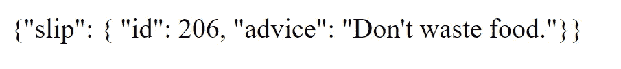
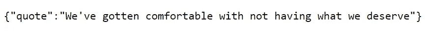
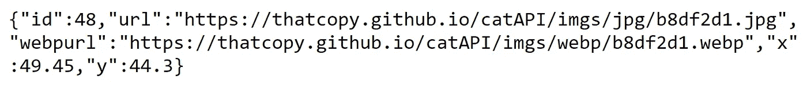

# 开始使用 Fetch API 的 4 个简单步骤

> 原文：<https://javascript.plainenglish.io/4-simple-steps-to-get-started-with-the-fetch-api-2f3aafaca17d?source=collection_archive---------7----------------------->


今天我们学习如何使用 Fetch API 获取资源。使用这个 API，我们自己的应用程序可以与第三方应用程序通信，以检索有意义的资源和功能，我们可以使用这些资源和功能来增强我们自己的产品。我们只需要一个 URL 或 API 就可以开始了，它会给我们发回一些数据。

例如:

*   使用 Stripe API 或 PayPal API，我们可以处理交易
*   使用 Unsplash API，我们可以检索图像
*   使用许多不同的独立 API，我们可以检索各种有意义的信息

让我们开始吧。

# 找到一个 API

我们的第一步是找到一个 API。我们需要一个 URL，或者路径，在被查询时返回数据。这里有几个例子:

**【1】**[**建议 API**](https://api.adviceslip.com/advice)

这个 API 生成了建议。



这就是数据流的样子。如您所见，这是一个 Javascript 对象。该对象具有属性`slip`。而`slip`也是一个对象。`slip`具有属性:`id`和`advice`。

我们需要`advice`属性的内容。我们可以简单地用点符号或括号符号来访问它。如果你不知道怎么做，看看 W3Schools 的这个简单的教程。

要访问它，它应该看起来像:`data.slip.advice`或`data["slip"]["advice"]`

如果您单击链接来访问 API，请刷新它。注意 API 是如何在每次刷新时提供新数据的。

**【2】**[**kanye . rest API**](https://api.kanye.rest/)

这个 API 提供报价。



这是一个更简单的例子。同样，这是一个对象。我们必须使用点符号或括号符号来访问报价。它看起来像`data.quote`。

**【3】**[**猫咪照片 API**](https://thatcopy.pw/catapi/rest/)



这是另一个例子。它看起来会像`data.url`

此外，要明白返回的信息不会总是这样。有时它会返回一个对象数组。有时它会返回对象中的对象。有时它只会返回文本。如果您想正确地检索您想要的信息，理解 Javascript 数据结构是很重要的。

# 获取资源

当您拥有 API 的 URL 时，您可以执行以下操作:

```
fetch("[https://api.kanye.rest/](https://api.kanye.rest/)")
```

或者

```
const URL = "[https://api.kanye.rest/](https://api.kanye.rest/)"
fetch(URL)
```

同样的想法，只是外表不同而已。

使用这段代码，您可以发出 HTTP 请求并与 web 服务器通信。您正在从外部来源检索信息。当这种情况发生时，Javascript 不知道这个获取过程需要多长时间，所以它异步执行这个任务。

这意味着 Javascript 可以继续下面的代码行，而不是暂停并等待获取过程完成。没有阻滞/停顿。一旦这个获取过程结束，我们得到了结果，Javascript 就会返回并完成任务。这是 Javascript 承诺背后的整个想法。

回到代码，fetch 的响应是一个 Javascript 承诺。

```
console.log(fetch(URL));
```

上面的代码将返回一个承诺。如果你理解承诺，你就知道承诺需要解决。Resolved 基本上是说“一旦承诺实现了或者任务完成了，我们下一步做什么？”一旦获取完成，我们下一步做什么？

# 解决

我们将使用`.then()`来告诉 Javascript 下一步做什么。

```
fetch("[https://api.adviceslip.com/advice](https://api.adviceslip.com/advice)")
    .then(data =>{
        return data.json();
    })
```

或者，如果它不使用箭头功能，您可能会感觉更舒服。或者，它可以看起来像这样:

```
fetch("[https://api.adviceslip.com/advice](https://api.adviceslip.com/advice)")
    .then(function(data){
        return data.json();
    })
```

可以看到，`.then()`包含了一个函数。这个函数有一个参数`data`。(*注:* `*data*` *被任意命名。你想叫它什么都可以。* ) `data`是从`fetch()`返回的值。

`data`是 HTTP 响应。因此，当我们编写`data.json()`时，我们将 HTTP 响应解析为 JSON。

其他选项包括:

*   `data.text()`
*   `data.blob()`
*   `data.formData()`
*   还有更多。查看 MDN Web 文档中关于[响应接口](https://developer.mozilla.org/en-US/docs/Web/API/Response)的方法部分

在这个例子中，我们使用 json。如果你不明白为什么，就这样做:

```
fetch("[https://api.adviceslip.com/advice](https://api.adviceslip.com/advice)")
    .then(data =>{
        console.log("data: " + data);
        console.log("json: " + data.json());
        return data.json();
    })
```

比较一下。

# 再次解决

如果您尝试上面的示例代码，您会看到`return data.json`返回一个承诺。我们之前说了什么？

> 如果你理解承诺，你就知道承诺是需要解决的。

所以，我们必须解决它。如果 HTTP 响应被成功解析为 JSON，接下来我们做什么？我们终于可以访问 JSON 文件的内容了！

```
fetch("[https://api.adviceslip.com/advice](https://api.adviceslip.com/advice)")
    .then(data =>{
        console.log("data: " + data);
        console.log("json: " + data.json());
        return data.json();
    })
    .then(data => {
       quote.innerHTML = '"' +  data.slip.advice + '."';

    })
```

同样，我们的`.then()`包含一个名为`data`的函数，这个函数的参数是任意命名的。为了获得我们想要的财产，我们做`data.slip.advice`。这一过程在前面已有概述。

在这个例子中，我们操作 DOM，这样我们就可以在 web 页面上显示建议。而且每次网页刷新的时候，都会显示一条新的建议语录。

如果你想知道它是如何工作的，底部有 CodePen 示例。报价生成器有两个站点。猫网站是一个猫照片生成器。我们不是操纵 innerHTML，而是改变一个`img`元素的`src`属性值。看看下面。

# 额外的

在我们结束之前，我想向您展示最后一样东西:Fetch API 的另一种格式。

如果你已经理解了我们所谈论的一切背后的逻辑，这应该是简单明了的。

```
async function getData(){ const fetchResponse = await fetch(apiURL); const data = await fetchResponse.json(); console.log(data.slip.advice);}
```

这是其他开发人员使用 Fetch 的另一种方式。

注意两件事:`async`和`await`。`async`基本上是用来声明`await`将在函数中的某个地方使用。在这种特定的情况下，它告诉 Javascript 应该在继续下一行代码之前等待 fetch()完成。

为什么？好吧，看看下一行代码。下一行代码完全依赖于当前行代码。下一行代码执行`fetchResponse.json()`，将`fetchResponse` 解析成 JSON 格式。`fetchResponse`只有当前行代码结束才能存在。对吗？

如你所见，在第 3 行中再次使用了`await`。这是因为 4 号线完全依赖于 3 号线的修整。对于第 3 行，`data`是 JSON 格式，这使得数据可用。我们在第 4 行使用点符号访问数据。这和另一种格式的想法是一样的。

有关如何使用 Fetch API 的更多信息，请查看 [Google 开发者博客](https://developers.google.com/web/updates/2015/03/introduction-to-fetch)和 [MDN Web 文档](https://developer.mozilla.org/en-US/docs/Web/API/Fetch_API)。

如果您想查看一些示例代码以了解 Fetch API 的运行情况，请运行下面的 CodePens。最后，如果你想自己尝试，你可以在 GitHub 上找到一个[公共 API](https://github.com/public-apis/public-apis)的汇编。

## Kanye West 引用 API

## 建议 API

## 卡特彼勒照片 API

*更多内容看* [*说白了。报名参加我们的*](http://plainenglish.io/) [*免费每周简讯*](http://newsletter.plainenglish.io/) *。在我们的* [*社区*](https://discord.gg/GtDtUAvyhW) *获得独家写作机会和建议。*